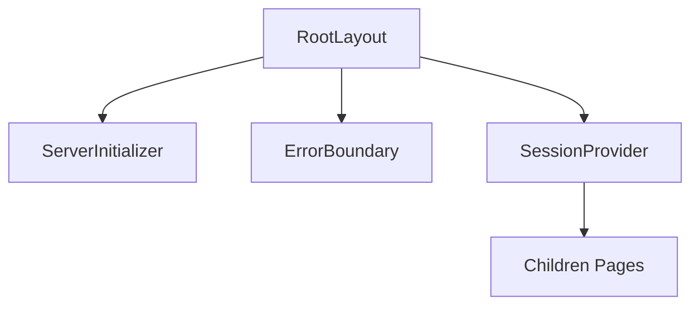
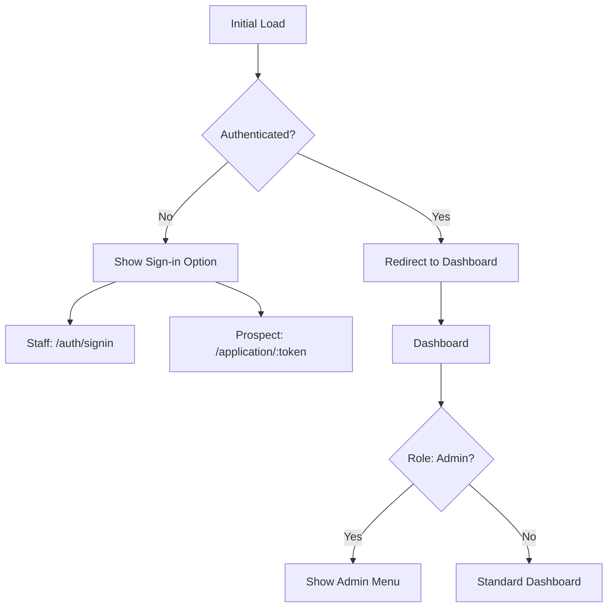
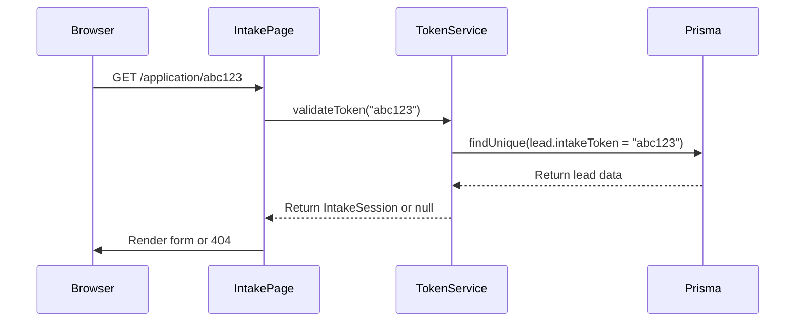
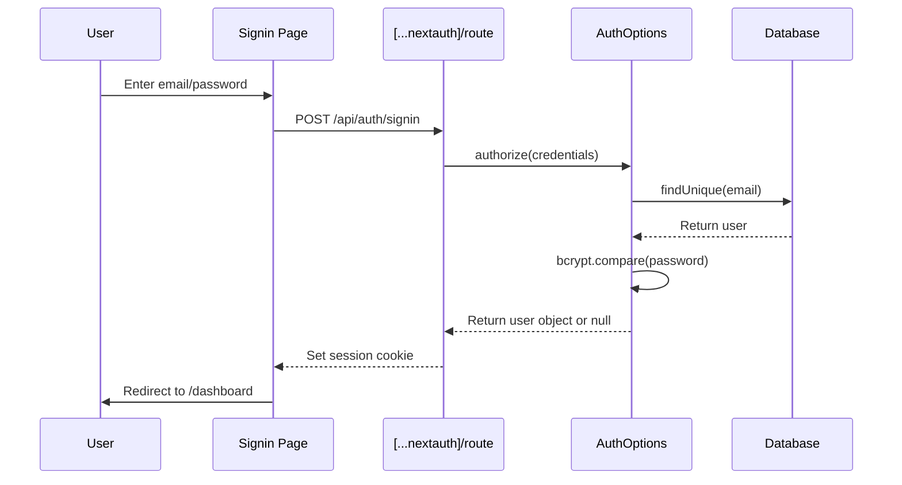

# Page Structure and Routing

<cite>
**Referenced Files in This Document**   
- [layout.tsx](file://src/app/layout.tsx)
- [page.tsx](file://src/app/page.tsx)
- [application/[token]/page.tsx](file://src/app/application/[token]/page.tsx)
- [dashboard/page.tsx](file://src/app/dashboard/page.tsx)
- [api/intake/[token]/route.ts](file://src/app/api/intake/[token]/route.ts)
- [api/intake/[token]/step1/route.ts](file://src/app/api/intake/[token]/step1/route.ts)
- [components/intake/IntakeWorkflow.tsx](file://src/components/intake/IntakeWorkflow.tsx)
- [services/TokenService.ts](file://src/services/TokenService.ts)
- [components/auth/RoleGuard.tsx](file://src/components/auth/RoleGuard.tsx)
- [lib/auth.ts](file://src/lib/auth.ts)
- [middleware.ts](file://src/middleware.ts)
- [components/PageLoading.tsx](file://src/components/PageLoading.tsx)
</cite>

## Table of Contents
1. [Root Layout and Shared UI Structure](#root-layout-and-shared-ui-structure)
2. [Routing and Navigation Flow](#routing-and-navigation-flow)
3. [Hybrid Rendering Strategy](#hybrid-rendering-strategy)
4. [Dynamic Routes and Token-Based Access](#dynamic-routes-and-token-based-access)
5. [Integration Between Pages and API Routes](#integration-between-pages-and-api-routes)
6. [Authentication and Authorization](#authentication-and-authorization)
7. [Error Handling and Loading States](#error-handling-and-loading-states)
8. [SEO and URL Design Considerations](#seo-and-url-design-considerations)

## Root Layout and Shared UI Structure

The fund-track application uses a centralized root layout defined in `layout.tsx` that wraps all pages with shared UI components and providers. This layout establishes the base HTML structure, applies global styles, and initializes essential context providers.



**Diagram sources**
- [layout.tsx](file://src/app/layout.tsx#L1-L34)

**Section sources**
- [layout.tsx](file://src/app/layout.tsx#L1-L34)

The layout imports the Plus Jakarta Sans font and applies it globally via CSS variables. It wraps children with three critical providers:
- **SessionProvider**: Manages authentication state from NextAuth
- **ErrorBoundary**: Catches and handles runtime errors
- **ServerInitializer**: Initializes server-side dependencies

This structure ensures consistent theming, error resilience, and proper session management across all routes.

## Routing and Navigation Flow

The application implements a role-based routing system with distinct entry points for staff and prospects. The routing flow begins at the root page (`page.tsx`), which serves as a gateway that redirects authenticated users to the appropriate interface.



**Diagram sources**
- [page.tsx](file://src/app/page.tsx#L1-L52)
- [dashboard/page.tsx](file://src/app/dashboard/page.tsx#L1-L150)

**Section sources**
- [page.tsx](file://src/app/page.tsx#L1-L52)
- [dashboard/page.tsx](file://src/app/dashboard/page.tsx#L1-L150)

The root page uses client-side navigation via `useRouter` to redirect authenticated users to `/dashboard`. Unauthenticated users see a landing page with a sign-in option for staff, while prospects access the system through tokenized application URLs.

## Hybrid Rendering Strategy

The application employs a hybrid rendering approach that combines server components for data fetching with client components for interactivity. This strategy optimizes performance while maintaining dynamic user experiences.

### Server Components
Pages like `/application/[token]/page.tsx` use server components to validate tokens and fetch intake session data before rendering:

```typescript
export default async function IntakePage({ params }: IntakePageProps) {
  const { token } = params;
  const intakeSession = await TokenService.validateToken(token);
  // ... render with pre-fetched data
}
```

### Client Components
Interactive elements use client components with React hooks:

```typescript
"use client";
export default function DashboardPage() {
  const { data: session, status } = useSession();
  const router = useRouter();
  // ... interactive logic
}
```

This hybrid approach ensures:
- Fast initial loads with server-rendered content
- SEO-friendly pages with pre-rendered data
- Rich interactivity through client-side state management
- Secure token validation on the server

**Section sources**
- [application/[token]/page.tsx](file://src/app/application/[token]/page.tsx#L1-L221)
- [dashboard/page.tsx](file://src/app/dashboard/page.tsx#L1-L150)

## Dynamic Routes and Token-Based Access

The application implements dynamic routing for the intake workflow using the `[token]` parameter pattern. This enables secure, shareable links for prospects to complete their funding applications.

### Route Structure
- `/application/[token]`: Main intake page with token validation
- `/dashboard/leads/[id]`: Lead detail view for staff

### Token Validation Flow


**Diagram sources**
- [application/[token]/page.tsx](file://src/app/application/[token]/page.tsx#L1-L221)
- [services/TokenService.ts](file://src/services/TokenService.ts#L1-L312)
- [api/intake/[token]/route.ts](file://src/app/api/intake/[token]/route.ts#L1-L37)

The `TokenService.validateToken()` method queries the database to verify the token's existence and returns session data. Invalid tokens result in a 404 response using Next.js's `notFound()` function.

**Section sources**
- [application/[token]/page.tsx](file://src/app/application/[token]/page.tsx#L1-L221)
- [services/TokenService.ts](file://src/services/TokenService.ts#L1-L312)

## Integration Between Pages and API Routes

Page components integrate with API routes for data loading and form submission, creating a seamless workflow between client and server.

### Intake Form Submission Flow
```mermaid
flowchart TD
A[Step1Form] --> B[Submit Data]
B --> C[/api/intake/:token/step1]
C --> D[Validate Token]
D --> E[Parse & Validate Body]
E --> F[Update Lead in Database]
F --> G[Return Success Response]
G --> H[Update UI State]
H --> I[Proceed to Step 2]
D --> |Invalid Token| J[404 Response]
E --> |Missing Fields| K[400 Response]
F --> |Database Error| L[500 Response]
```

**Diagram sources**
- [api/intake/[token]/step1/route.ts](file://src/app/api/intake/[token]/step1/route.ts#L1-L303)
- [components/intake/Step1Form.tsx](file://src/components/intake/Step1Form.tsx)

The API route `/api/intake/[token]/step1` performs comprehensive validation:
- Token authentication
- Required field checking
- Email and phone format validation
- Business logic validation (ownership percentage, years in business)
- Database update with cleaned data

Client components submit data via standard POST requests and handle responses to update the UI state accordingly.

**Section sources**
- [api/intake/[token]/step1/route.ts](file://src/app/api/intake/[token]/step1/route.ts#L1-L303)
- [components/intake/IntakeWorkflow.tsx](file://src/components/intake/IntakeWorkflow.tsx#L1-L95)

## Authentication and Authorization

The application implements a robust authentication system using NextAuth with credential-based login and role-based authorization.

### Authentication Flow


**Diagram sources**
- [api/auth/[...nextauth]/route.ts](file://src/app/api/auth/[...nextauth]/route.ts#L1-L5)
- [lib/auth.ts](file://src/lib/auth.ts#L1-L70)

### Authorization with RoleGuard
The `RoleGuard` component enforces role-based access control:

```typescript
export function RoleGuard({
  children,
  allowedRoles,
  fallback,
}: RoleGuardProps) {
  const { data: session, status } = useSession();
  // ... check role membership
}
```

Middleware enforces route-level protection:
```typescript
export const config = {
  matcher: [
    "/dashboard/:path*",
    "/api/:path*",
    "/application/:path*",
    "/admin/:path*"
  ]
}
```

Admin routes are protected both at the component level and middleware level, redirecting unauthorized users to the dashboard.

**Section sources**
- [lib/auth.ts](file://src/lib/auth.ts#L1-L70)
- [components/auth/RoleGuard.tsx](file://src/components/auth/RoleGuard.tsx#L1-L75)
- [middleware.ts](file://src/middleware.ts#L1-L189)

## Error Handling and Loading States

The application implements comprehensive error handling and loading state management to ensure a smooth user experience.

### Loading States
The `PageLoading` component provides a consistent loading indicator:

```typescript
export default function PageLoading({ message = "" }: PageLoadingProps) {
  return (
    <div className="min-h-screen flex items-center justify-center">
      <div className="flex items-center space-x-3">
        <div className="h-6 w-6 animate-spin rounded-full border-2 border-gray-300 border-t-transparent" />
        <div className="text-lg text-gray-900">{message}</div>
      </div>
    </div>
  );
}
```

Pages use loading states during authentication checks:

```typescript
if (status === "loading") return <PageLoading />;
```

### Error Handling
The application implements multiple layers of error handling:
- **Token validation**: Returns 404 for invalid tokens
- **Form validation**: Returns 400 with specific error details
- **Server errors**: Returns 500 with development-mode details
- **UI errors**: ErrorBoundary component with retry functionality

API routes include comprehensive error logging and appropriate HTTP status codes, while client components handle responses gracefully.

**Section sources**
- [components/PageLoading.tsx](file://src/components/PageLoading.tsx#L1-L17)
- [dashboard/page.tsx](file://src/app/dashboard/page.tsx#L1-L150)
- [api/intake/[token]/step1/route.ts](file://src/app/api/intake/[token]/step1/route.ts#L1-L303)
- [components/ErrorBoundary.tsx](file://src/components/ErrorBoundary.tsx#L1-L257)

## SEO and URL Design Considerations

The application's URL design follows RESTful principles with clear, descriptive routes:

- `/dashboard`: Main staff interface
- `/application/[token]`: Prospect intake workflow
- `/admin`: Administrative functions
- `/api/*`: REST API endpoints

The root layout includes metadata for SEO:
```typescript
export const metadata: Metadata = {
  title: "Fund Track App",
  description: "Internal lead management system for Fund Track",
};
```

The middleware configuration supports SEO by:
- Allowing search engine access to public routes
- Setting appropriate security headers
- Implementing proper redirects
- Supporting canonical URLs

Public-facing intake pages are accessible without authentication, enabling direct linking from email and SMS campaigns while maintaining security through token-based access control.

**Section sources**
- [layout.tsx](file://src/app/layout.tsx#L1-L34)
- [middleware.ts](file://src/middleware.ts#L1-L189)
- [application/[token]/page.tsx](file://src/app/application/[token]/page.tsx#L1-L221)