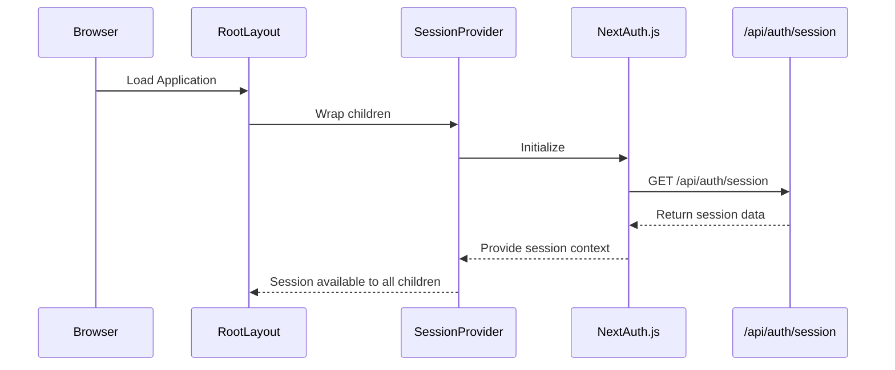
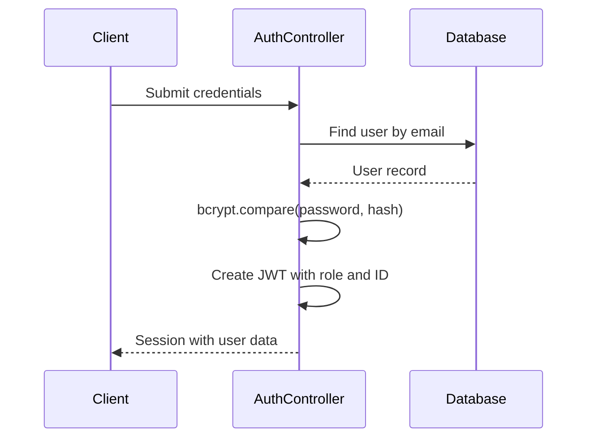
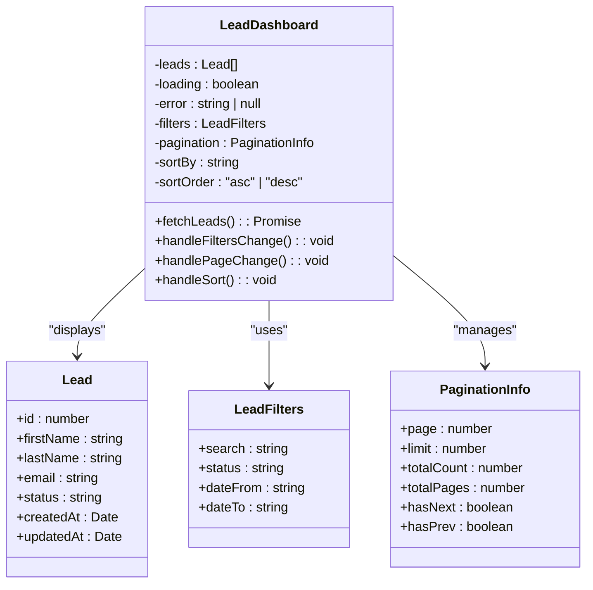
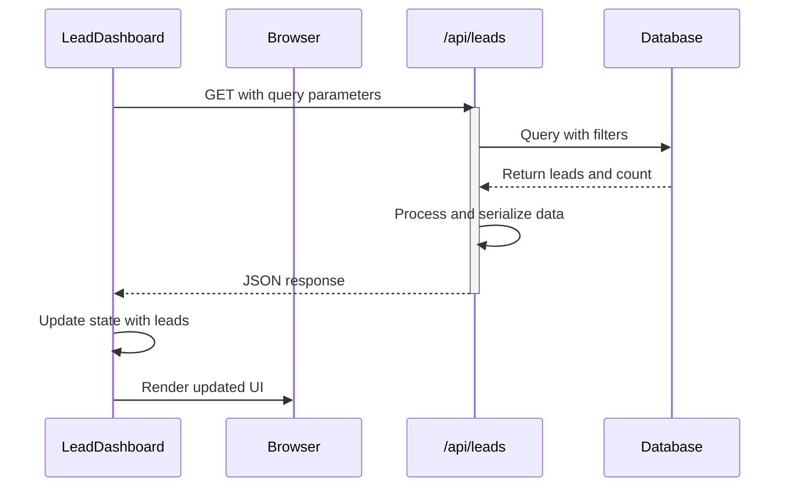
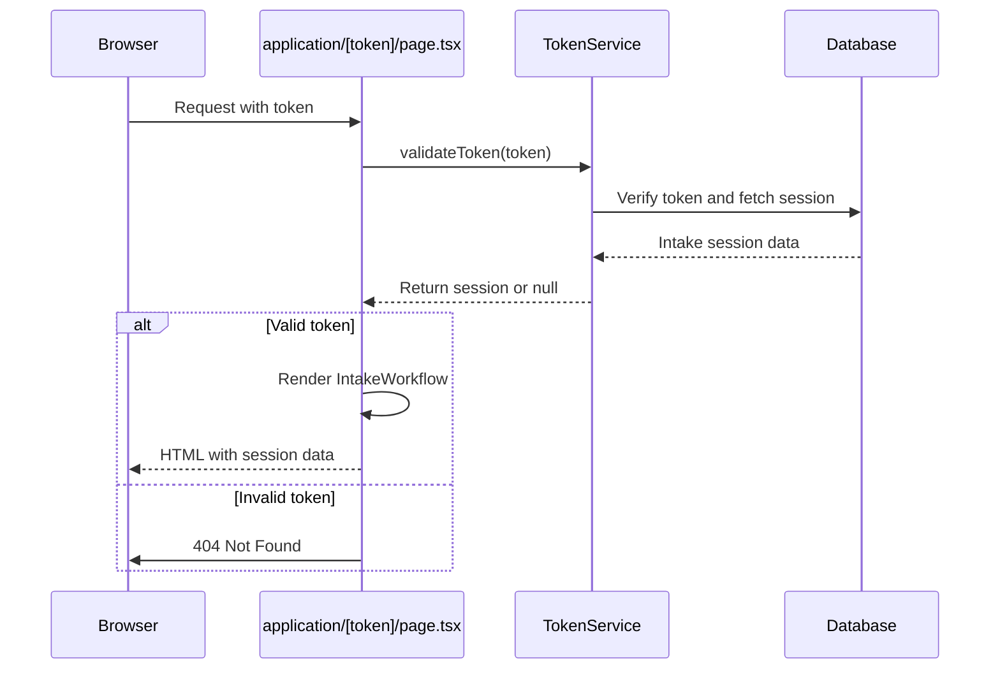
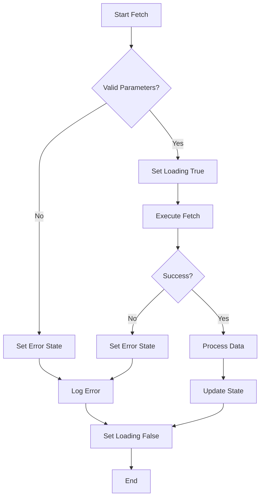

# State Management and Data Flow

<cite>
**Referenced Files in This Document**   
- [SessionProvider.tsx](file://src/components/auth/SessionProvider.tsx)
- [auth.ts](file://src/lib/auth.ts)
- [layout.tsx](file://src/app/layout.tsx)
- [LeadDashboard.tsx](file://src/components/dashboard/LeadDashboard.tsx)
- [IntakeWorkflow.tsx](file://src/components/intake/IntakeWorkflow.tsx)
- [route.ts](file://src/app/api/leads/route.ts)
- [route.ts](file://src/app/api/intake/[token]/route.ts)
- [route.ts](file://src/app/api/intake/[token]/save/route.ts)
- [page.tsx](file://src/app/application/[token]/page.tsx)
</cite>

## Table of Contents
1. [Introduction](#introduction)
2. [Global Authentication State Management](#global-authentication-state-management)
3. [Component State Management in Complex Workflows](#component-state-management-in-complex-workflows)
4. [Data Fetching Patterns](#data-fetching-patterns)
5. [Error and Loading State Propagation](#error-and-loading-state-propagation)
6. [State Synchronization Across Tabs and Background Updates](#state-synchronization-across-tabs-and-background-updates)
7. [Best Practices for State Management](#best-practices-for-state-management)

## Introduction
This document provides a comprehensive analysis of the state management and data flow architecture in the fund-track frontend application. It covers the implementation of global authentication state using React Context and NextAuth.js, component-level state management in complex workflows, data fetching patterns between client components and API routes, and strategies for handling loading and error states. The analysis is based on direct examination of the codebase and aims to provide both technical depth and accessibility for developers with varying levels of expertise.

## Global Authentication State Management

The application implements global authentication state management using React Context through the `SessionProvider` component, which wraps the NextAuth.js `SessionProvider`. This approach enables authentication state to be accessed from any component in the application without prop drilling.

The `SessionProvider` is implemented as a thin wrapper around the NextAuth.js SessionProvider, imported from `next-auth/react`. It is placed at the root layout level, ensuring that all child components have access to the authentication session.



**Diagram sources**
- [SessionProvider.tsx](file://src/components/auth/SessionProvider.tsx#L1-L15)
- [layout.tsx](file://src/app/layout.tsx#L1-L35)

Server-side authentication is configured in `auth.ts` using NextAuth.js with credentials-based login. The authentication flow involves:
1. Credential validation against the database using bcrypt for password comparison
2. JWT-based session strategy
3. Custom callbacks to include user role and ID in the JWT token and session



**Diagram sources**
- [auth.ts](file://src/lib/auth.ts#L1-L71)

**Section sources**
- [SessionProvider.tsx](file://src/components/auth/SessionProvider.tsx#L1-L15)
- [auth.ts](file://src/lib/auth.ts#L1-L71)
- [layout.tsx](file://src/app/layout.tsx#L1-L35)

## Component State Management in Complex Workflows

### LeadDashboard State Management
The `LeadDashboard` component demonstrates sophisticated state management using React hooks to handle complex data filtering, sorting, and pagination workflows.

The component maintains several state variables:
- **leads**: Array of lead data
- **loading**: Boolean indicating fetch status
- **error**: Error message string
- **filters**: Search and filter parameters
- **pagination**: Pagination metadata
- **sortBy/sortOrder**: Sorting criteria



**Diagram sources**
- [LeadDashboard.tsx](file://src/components/dashboard/LeadDashboard.tsx#L1-L216)

### IntakeWorkflow State Management
The `IntakeWorkflow` component manages a multi-step form workflow using local component state to track the current step and progress.

The workflow state is initialized based on the intake session data, which determines the starting step:
- Step 3 if intake is completed
- Step 2 if step 1 is completed
- Step 1 as default

```mermaid
stateDiagram-v2
[*] --> Step1
Step1 --> Step2 : "handleStep1Complete"
Step2 --> Step3 : "handleStep2Complete"
Step3 --> [*]
state Step1 {
[*] --> PersonalInformation
PersonalInformation --> Step1 : "display"
}
state Step2 {
[*] --> DocumentUpload
DocumentUpload --> Step2 : "display"
}
state Step3 {
[*] --> Completion
Completion --> Step3 : "display"
}
```

**Diagram sources**
- [IntakeWorkflow.tsx](file://src/components/intake/IntakeWorkflow.tsx#L1-L96)

**Section sources**
- [LeadDashboard.tsx](file://src/components/dashboard/LeadDashboard.tsx#L1-L216)
- [IntakeWorkflow.tsx](file://src/components/intake/IntakeWorkflow.tsx#L1-L96)

## Data Fetching Patterns

### Client-Side Data Fetching
The `LeadDashboard` component implements client-side data fetching using the Fetch API to retrieve lead data from the `/api/leads` endpoint. The fetching logic is encapsulated in a `useCallback` hook to prevent unnecessary re-creations and includes comprehensive error handling.

Key aspects of the data fetching pattern:
- URLSearchParams for query parameter construction
- Error boundaries with user-friendly retry mechanism
- Response validation and error handling
- Date object conversion for date fields
- BigInt serialization for JSON compatibility



**Diagram sources**
- [LeadDashboard.tsx](file://src/components/dashboard/LeadDashboard.tsx#L1-L216)
- [route.ts](file://src/app/api/leads/route.ts#L1-L167)

### Server-Side Data Fetching and Authentication Flow
The intake workflow demonstrates server-side data fetching with authentication via token validation. The `application/[token]/page.tsx` page fetches intake session data during server-side rendering by validating the token through `TokenService`.



**Diagram sources**
- [page.tsx](file://src/app/application/[token]/page.tsx#L1-L45)
- [route.ts](file://src/app/api/intake/[token]/route.ts#L1-L38)

### API Route Implementation
The `/api/leads` route implements a robust data fetching pattern with:
- Authentication via `getServerSession`
- Comprehensive query parameter parsing and validation
- Flexible filtering across multiple fields
- Proper error handling with custom error classes
- Performance logging

The route handles various filter types:
- Text search across multiple fields
- Status filtering with mapping
- Date range filtering
- Sorting with validation

**Section sources**
- [route.ts](file://src/app/api/leads/route.ts#L1-L167)
- [route.ts](file://src/app/api/intake/[token]/route.ts#L1-L38)
- [route.ts](file://src/app/api/intake/[token]/save/route.ts#L1-L130)

## Error and Loading State Propagation

The application implements a comprehensive system for propagating error and loading states through the component tree, ensuring a consistent user experience.

### Loading State Management
Loading states are managed through boolean flags in component state:
- `loading: boolean` state variable
- Set to `true` before async operations
- Set to `false` in `finally` block after completion
- Used to conditionally render loading indicators or disable interactions

In `LeadDashboard`, the loading state controls:
- Display of loading skeleton in `LeadList`
- Disabling of filter inputs
- Visibility of pagination controls

### Error State Management
Error states are handled through:
- `error: string | null` state variable
- Try-catch blocks around async operations
- User-friendly error messages
- Retry mechanisms

The error handling pattern includes:
1. Setting error state on failure
2. Logging errors to console
3. Displaying error messages in UI
4. Providing retry options
5. Clearing errors on subsequent attempts



**Diagram sources**
- [LeadDashboard.tsx](file://src/components/dashboard/LeadDashboard.tsx#L1-L216)

**Section sources**
- [LeadDashboard.tsx](file://src/components/dashboard/LeadDashboard.tsx#L1-L216)

## State Synchronization Across Tabs and Background Updates

The current implementation has considerations for state synchronization, though explicit cross-tab synchronization mechanisms are not evident in the analyzed code.

### Challenges Identified
1. **Tab Isolation**: Each browser tab maintains independent React state
2. **Background Updates**: Server-side changes may not be reflected in client state
3. **Stale Data**: Long-lived sessions may display outdated information

### Current Mitigation Strategies
- **Polling**: The `fetchLeads` function is called on component mount and when dependencies change
- **Manual Refresh**: Error states include "Try again" buttons that trigger refetching
- **Filter Changes**: Changing filters automatically resets to page 1 and triggers refetch

### Recommended Improvements
1. **WebSocket Integration**: Implement real-time updates for critical data changes
2. **BroadcastChannel API**: Synchronize state changes across tabs
3. **Periodic Polling**: Implement background polling for high-priority data
4. **Visibility API**: Refresh data when tab becomes active after being in background

The application could benefit from implementing a more robust state synchronization strategy, particularly for the lead dashboard where multiple users might be viewing and updating the same data.

## Best Practices for State Management

### Avoiding Prop Drilling
The application follows best practices to avoid prop drilling:

1. **React Context**: Used for global authentication state via `SessionProvider`
2. **Component Composition**: Complex components are broken down into smaller, focused components
3. **Custom Hooks**: Business logic is encapsulated in services like `TokenService`

### Managing Derived State
Derived state is properly managed by:
- Using `useCallback` for memoized functions that depend on state
- Computing values in render rather than storing in state when appropriate
- Resetting pagination when filters change

```javascript
const handleFiltersChange = (newFilters: LeadFilters) => {
    setFilters(newFilters);
    setPagination(prev => ({ ...prev, page: 1 })); // Reset to first page
}
```

### Performance Optimization
The implementation includes several performance optimizations:
- `useCallback` for the `fetchLeads` function to prevent unnecessary re-renders
- Dependency arrays in `useEffect` to control execution timing
- Efficient state updates using functional updates when previous state is needed

### Error Boundaries
The application uses error boundaries at the root level to catch and handle errors that might otherwise crash the entire application.

### Code Organization
The codebase follows a logical organization:
- **Components**: UI-focused components grouped by feature
- **Lib**: Utility functions and configuration
- **Services**: Business logic and data access
- **API Routes**: Server-side endpoints

This structure promotes maintainability and makes it easier to locate relevant code for specific functionality.

**Section sources**
- [LeadDashboard.tsx](file://src/components/dashboard/LeadDashboard.tsx#L1-L216)
- [IntakeWorkflow.tsx](file://src/components/intake/IntakeWorkflow.tsx#L1-L96)
- [SessionProvider.tsx](file://src/components/auth/SessionProvider.tsx#L1-L15)
- [auth.ts](file://src/lib/auth.ts#L1-L71)