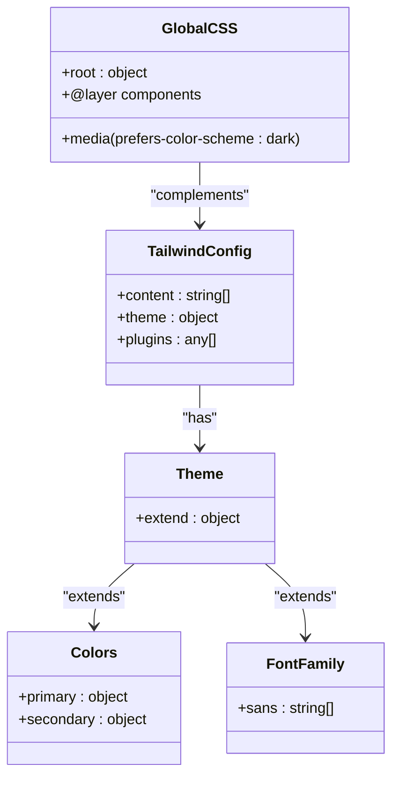

# Styling and Responsive Design

<cite>
**Referenced Files in This Document**   
- [tailwind.config.ts](file://tailwind.config.ts)
- [globals.css](file://src/app/globals.css)
- [LeadList.tsx](file://src/components/dashboard/LeadList.tsx)
- [InputField.tsx](file://src/components/intake/InputField.tsx)
- [SelectField.tsx](file://src/components/intake/SelectField.tsx)
- [SettingsCard.tsx](file://src/components/admin/SettingsCard.tsx)
- [SettingInput.tsx](file://src/components/admin/SettingInput.tsx)
</cite>

## Table of Contents
1. [Styling Strategy and Tailwind Configuration](#styling-strategy-and-tailwind-configuration)
2. [Responsive Design Implementation](#responsive-design-implementation)
3. [Form Controls and Input Components](#form-controls-and-input-components)
4. [Status Indicators and Data Visualization](#status-indicators-and-data-visualization)
5. [Admin Settings Cards and Configuration UI](#admin-settings-cards-and-configuration-ui)
6. [Accessibility Features](#accessibility-features)
7. [Performance Considerations](#performance-considerations)

## Styling Strategy and Tailwind Configuration

The fund-track application implements a utility-first styling approach using Tailwind CSS, providing a consistent and maintainable design system across all components. The configuration is centralized in `tailwind.config.ts`, which defines custom theme extensions for colors and typography.

The application uses a custom color palette with primary and secondary color schemes that extend Tailwind's default color system. The primary color palette ranges from 50 (lightest) to 900 (darkest) with specific hex values designed to provide good contrast and visual hierarchy. The secondary color palette follows a similar pattern, providing a comprehensive range of grays for text, backgrounds, and borders.

Typography is standardized through the `fontFamily` configuration, which sets "Plus Jakarta Sans" as the default sans-serif font with appropriate fallbacks. This ensures consistent typography across different platforms and devices.

The global CSS file (`globals.css`) establishes base styles and CSS variables for theming, including support for both light and dark color schemes through media queries. However, the application currently disables automatic dark mode detection by forcing light mode styling regardless of user preferences.

Custom component classes are defined in the `@layer components` section of the global CSS, allowing for reusable styled components while maintaining the utility-first philosophy. These include button variants, cards, and form inputs that encapsulate common styling patterns.



**Diagram sources**
- [tailwind.config.ts](file://tailwind.config.ts)
- [globals.css](file://src/app/globals.css)

**Section sources**
- [tailwind.config.ts](file://tailwind.config.ts)
- [globals.css](file://src/app/globals.css)

## Responsive Design Implementation

The application implements a comprehensive responsive design strategy that adapts layouts for different screen sizes, particularly evident in the dashboard table component. The responsive approach uses Tailwind's breakpoint system with three distinct views: desktop (large screens), tablet (small to medium screens), and mobile (small screens).

For the LeadList component, the application employs conditional rendering based on screen size using Tailwind's responsive utility classes (`hidden`, `sm:block`, `lg:hidden`). This allows for completely different markup and layout structures optimized for each device type:

- **Desktop view** (lg and above): A traditional table layout with multiple columns that supports horizontal scrolling when content exceeds viewport width
- **Tablet view** (sm to lg): A compact card-based layout that organizes information into a two-column grid within each lead card
- **Mobile view** (below sm): A simplified card layout optimized for touch interaction with stacked information and minimal visual complexity

The implementation uses the `overflow-x-auto` class on the table container to enable horizontal scrolling on smaller screens when the full table cannot be displayed. For loading states, the application uses Tailwind's `animate-pulse` class to create skeleton screens that provide visual feedback during data loading.

```mermaid
flowchart TD
Start([Responsive Design Flow]) --> BreakpointCheck{"Screen Size"}
BreakpointCheck --> |lg and above| DesktopView["Desktop Table Layout<br>• Full column display<br>• Horizontal scrolling<br>• Sortable headers"]
BreakpointCheck --> |sm to lg| TabletView["Tablet Card Layout<br>• Two-column grid<br>• Compact information grouping<br>• Hover states"]
BreakpointCheck --> |below sm| MobileView["Mobile Card Layout<br>• Stacked information<br>• Touch-optimized spacing<br>• Simplified UI"]
DesktopView --> Styling["Apply: hidden lg:block"]
TabletView --> Styling["Apply: hidden sm:block lg:hidden"]
MobileView --> Styling["Apply: sm:hidden"]
Styling --> Implementation["Render appropriate layout"]
Implementation --> End([Complete])
classDef style fill:#f8f9fa,stroke:#dee2e6,stroke-width:1px;
class DesktopView,TabletView,MobileView,Styling style
```

**Diagram sources**
- [LeadList.tsx](file://src/components/dashboard/LeadList.tsx)

**Section sources**
- [LeadList.tsx](file://src/components/dashboard/LeadList.tsx)

## Form Controls and Input Components

The application implements a consistent and accessible form control system through reusable components that encapsulate styling and behavior. The form system includes two primary input components: `InputField` for text inputs and `SelectField` for dropdown selections, both designed with accessibility and user experience in mind.

The `InputField` component provides a standardized text input with integrated label, error messaging, and required field indicators. It uses Tailwind's utility classes to style the input with proper spacing, borders, and focus states. The component handles accessibility by ensuring the label is properly associated with the input via the `htmlFor` attribute and includes visual indicators for required fields with red asterisks.

Similarly, the `SelectField` component implements dropdown inputs with the same styling conventions and accessibility features as the text inputs. Both components use conditional styling to display error states with red borders and accompanying error messages below the input.

All form controls implement proper focus management with visible focus rings using Tailwind's `focus:ring-2` and `focus:ring-blue-500` classes, ensuring that keyboard navigation is clearly visible. The components also handle disabled states appropriately with reduced opacity and cursor changes.

```mermaid
classDiagram
class InputField {
+id : string
+label : string
+type : string
+value : string
+onChange : function
+error : string
+required : boolean
}
class SelectField {
+id : string
+label : string
+value : string
+onChange : function
+options : Option[]
+error : string
+required : boolean
}
class Option {
+value : string | number
+label : string
}
class FormStyling {
+w-full
+px-3 py-2
+border rounded-md
+shadow-sm
+focus : outline-none
+focus : ring-2
+focus : ring-blue-500
+text-xs
+border-red-500 (error state)
}
InputField --> FormStyling : "uses"
SelectField --> FormStyling : "uses"
SelectField --> Option : "contains"
classDef style fill : #f8f9fa,stroke : #dee2e6,stroke-width : 1px;
class FormStyling style
```

**Diagram sources**
- [InputField.tsx](file://src/components/intake/InputField.tsx)
- [SelectField.tsx](file://src/components/intake/SelectField.tsx)

**Section sources**
- [InputField.tsx](file://src/components/intake/InputField.tsx)
- [SelectField.tsx](file://src/components/intake/SelectField.tsx)

## Status Indicators and Data Visualization

The application implements a comprehensive system for status indicators that provide visual feedback about the state of leads and other entities. These indicators use a consistent color-coding system that aligns with common UX patterns for status visualization.

The status system is implemented through two key objects in the `LeadList` component: `STATUS_COLORS` and `STATUS_LABELS`. These objects map each possible lead status to a corresponding color class and human-readable label. The color classes use Tailwind's standard color palette with appropriate contrast between background and text colors:

- **New**: Blue (`bg-blue-100 text-blue-800`)
- **Pending**: Yellow (`bg-yellow-100 text-yellow-800`)
- **In Progress**: Indigo (`bg-indigo-100 text-indigo-800`)
- **Completed**: Green (`bg-green-100 text-green-800`)
- **Rejected**: Red (`bg-red-100 text-red-800`)

These status indicators are rendered as pill-shaped badges using the `inline-flex`, `px-2`, `py-1`, `rounded-full`, and `font-semibold` classes. The indicators appear in multiple contexts throughout the application, including the lead list table, tablet view cards, and mobile view cards, ensuring consistency across different layouts.

Additionally, the application implements a completion progress bar in the `LeadDetailView` component that uses conditional styling to change color based on the completeness percentage (red for low, yellow for medium, green for high completion).

```mermaid
graph TD
A[Status Indicator System] --> B[STATUS_COLORS]
A --> C[STATUS_LABELS]
B --> D[New: bg-blue-100 text-blue-800]
B --> E[Pending: bg-yellow-100 text-yellow-800]
B --> F[In Progress: bg-indigo-100 text-indigo-800]
B --> G[Completed: bg-green-100 text-green-800]
B --> H[Rejected: bg-red-100 text-red-800]
C --> I[New: "New"]
C --> J[Pending: "Pending"]
C --> K[In Progress: "In Progress"]
C --> L[Completed: "Completed"]
C --> M[Rejected: "Rejected"]
A --> N[Visual Rendering]
N --> O[Inline Flex Container]
N --> P[Pill Shape: rounded-full]
N --> Q[Padding: px-2 py-1]
N --> R[Font: font-semibold]
N --> S[Text Truncation]
A --> T[Usage Contexts]
T --> U[Desktop Table]
T --> V[Tablet Cards]
T --> W[Mobile Cards]
T --> X[Detail View]
classDef style fill:#f8f9fa,stroke:#dee2e6,stroke-width:1px;
class B,C,N,T style
```

**Diagram sources**
- [LeadList.tsx](file://src/components/dashboard/LeadList.tsx)

**Section sources**
- [LeadList.tsx](file://src/components/dashboard/LeadList.tsx)

## Admin Settings Cards and Configuration UI

The admin settings interface uses a card-based layout implemented through the `SettingsCard` component, which provides a consistent and organized way to present configuration options. Each settings card represents a category of system settings and follows a standardized structure with a header section and a list of individual settings.

The `SettingsCard` component renders a shadowed card with rounded corners using the `bg-white shadow rounded-lg` classes. It includes a header section with the category name and description, followed by a list of individual settings. Each setting is displayed with its key (formatted for readability), type indicator, description, and an input control appropriate for the setting type.

The `SettingInput` component handles the rendering of individual setting inputs based on the setting type, providing different UI controls for different data types:
- **Boolean**: Toggle switch with visual on/off state
- **String**: Text input with save button for changes
- **Number**: Number input with save button
- **JSON**: Textarea with formatting assistance

The interface includes visual feedback for loading states with skeleton screens during data fetching and loading indicators when individual settings are being updated. Error states are displayed below the input with red text when setting updates fail.

```mermaid
classDiagram
class SettingsCard {
+category : SystemSettingCategory
+settings : SystemSetting[]
+onUpdate : function
+onReset : function
}
class SettingInput {
+setting : SystemSetting
+onUpdate : function
+isUpdating : boolean
+error : string
}
class SystemSetting {
+key : string
+value : string
+type : SystemSettingType
+description : string
+defaultValue : string
+updatedAt : Date
}
class SystemSettingType {
+STRING
+NUMBER
+BOOLEAN
+JSON
}
SettingsCard --> SettingInput : "renders"
SettingsCard --> SystemSetting : "contains"
SettingInput --> SystemSetting : "uses"
SettingInput --> SystemSettingType : "handles"
classDef style fill : #f8f9fa,stroke : #dee2e6,stroke-width : 1px;
class SettingsCard,SettingInput style
```

**Diagram sources**
- [SettingsCard.tsx](file://src/components/admin/SettingsCard.tsx)
- [SettingInput.tsx](file://src/components/admin/SettingInput.tsx)

**Section sources**
- [SettingsCard.tsx](file://src/components/admin/SettingsCard.tsx)
- [SettingInput.tsx](file://src/components/admin/SettingInput.tsx)

## Accessibility Features

The application implements several accessibility features to ensure usability for all users, including those relying on keyboard navigation and screen readers. These features are integrated into the core components and follow web accessibility best practices.

Focus states are consistently implemented across interactive elements using Tailwind's focus utilities. Buttons, links, and form controls display a visible focus ring with the `focus:ring-2 focus:ring-blue-500` classes, providing clear visual indication of keyboard navigation. The focus ring has sufficient contrast against the background to meet accessibility standards.

Screen reader support is implemented through appropriate ARIA attributes and semantic HTML. Form labels are properly associated with their inputs using the `htmlFor` attribute, ensuring screen readers can correctly identify form fields. The application uses semantic elements like `button`, `label`, and `nav` where appropriate to provide proper context to assistive technologies.

The status indicators include proper color contrast ratios that meet WCAG guidelines, with text colors providing sufficient contrast against their background colors. For example, the blue status badge uses `bg-blue-100` (light blue background) with `text-blue-800` (dark blue text), ensuring readability for users with color vision deficiencies.

Interactive elements include appropriate hover and focus states that are visually distinct, aiding users with motor impairments who may have difficulty with precise mouse movements. The toggle switch in the settings interface includes both visual and text indicators for its state ("Enabled"/"Disabled"), providing multiple ways to perceive the current setting.

```mermaid
flowchart TD
A[Accessibility Features] --> B[Focus States]
A --> C[Screen Reader Support]
A --> D[Color Contrast]
A --> E[Interactive Feedback]
B --> B1["focus:ring-2 focus:ring-blue-500"]
B --> B2["Visible focus indicators"]
B --> B3["Keyboard navigable"]
C --> C1["Proper label association"]
C --> C2["Semantic HTML elements"]
C --> C3["ARIA attributes"]
C --> C4["Descriptive text"]
D --> D1["WCAG compliant contrast ratios"]
D --> D2["Text/background contrast"]
D --> D3["Colorblind friendly palettes"]
E --> E1["Hover states"]
E --> E2["Loading indicators"]
E --> E3["Error messaging"]
E --> E4["State indicators"]
classDef style fill:#f8f9fa,stroke:#dee2e6,stroke-width:1px;
class B,C,D,E style
```

**Diagram sources**
- [InputField.tsx](file://src/components/intake/InputField.tsx)
- [SelectField.tsx](file://src/components/intake/SelectField.tsx)
- [SettingInput.tsx](file://src/components/admin/SettingInput.tsx)

**Section sources**
- [InputField.tsx](file://src/components/intake/InputField.tsx)
- [SelectField.tsx](file://src/components/intake/SelectField.tsx)
- [SettingInput.tsx](file://src/components/admin/SettingInput.tsx)

## Performance Considerations

The application's styling approach incorporates several performance optimizations to minimize CSS bundle size and ensure efficient rendering. The Tailwind configuration uses the content configuration to enable PurgeCSS, which removes unused utility classes from the production build, significantly reducing the final CSS file size.

The utility-first approach inherently promotes class name optimization by reusing atomic CSS classes across components rather than creating unique class names for each element. This reduces duplication and improves cache efficiency. The application avoids style bloat by not creating unnecessary custom CSS classes, instead relying on Tailwind's comprehensive utility system.

The responsive design implementation is optimized by using Tailwind's built-in responsive prefixes rather than custom media queries, ensuring that the CSS is generated efficiently during the build process. The conditional rendering of different layouts for various screen sizes prevents unnecessary DOM elements from being rendered on the page.

The use of CSS variables in the `:root` declaration allows for efficient theme management without requiring additional CSS rules or JavaScript calculations. The application's approach to dark mode (currently disabled) demonstrates consideration for performance by using CSS variables rather than duplicating styles for different themes.

```mermaid
flowchart TD
A[Performance Considerations] --> B[CSS Purging]
A --> C[Class Name Optimization]
A --> D[Style Bloat Prevention]
A --> E[Efficient Responsive Design]
A --> F[CSS Variables Usage]
B --> B1["Tailwind content configuration"]
B --> B2["Removes unused utilities"]
B --> B3["Reduces CSS bundle size"]
C --> C1["Utility-first approach"]
C --> C2["Reuses atomic classes"]
C --> C3["Improves cache efficiency"]
D --> D1["Avoids custom CSS classes"]
D --> D2["Uses Tailwind utilities"]
D --> D3["Minimizes duplication"]
E --> E1["Tailwind responsive prefixes"]
E --> E2["Conditional rendering"]
E --> E3["Optimized DOM structure"]
F --> F1["CSS variables in :root"]
F --> F2["Efficient theme management"]
F --> F3["Reduced JavaScript usage"]
classDef style fill:#f8f9fa,stroke:#dee2e6,stroke-width:1px;
class B,C,D,E,F style
```

**Diagram sources**
- [tailwind.config.ts](file://tailwind.config.ts)
- [globals.css](file://src/app/globals.css)

**Section sources**
- [tailwind.config.ts](file://tailwind.config.ts)
- [globals.css](file://src/app/globals.css)