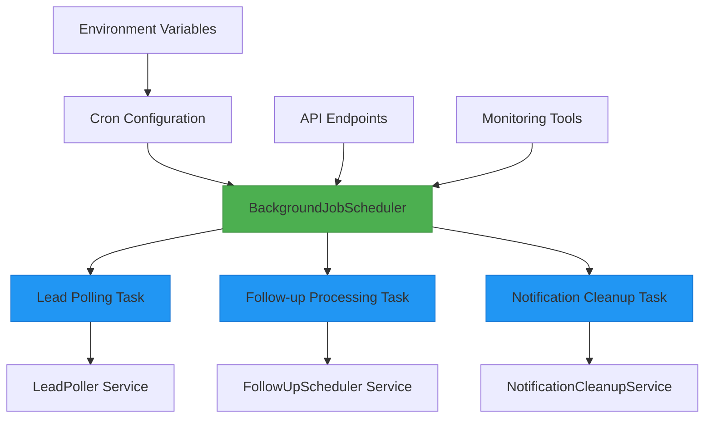
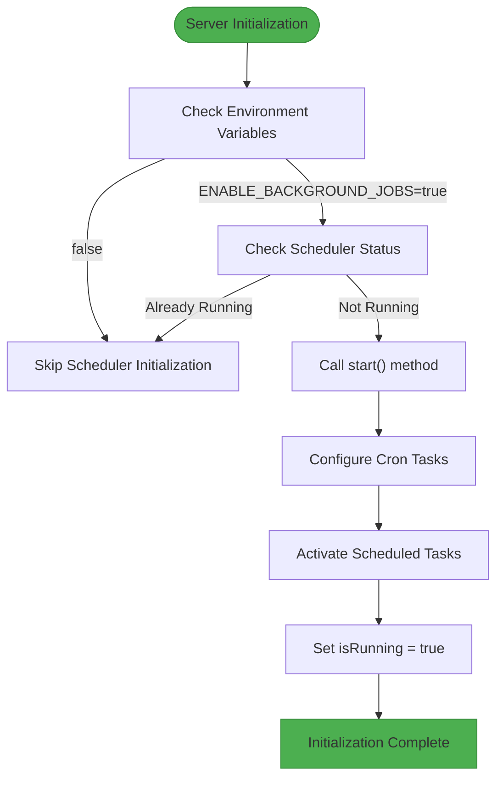
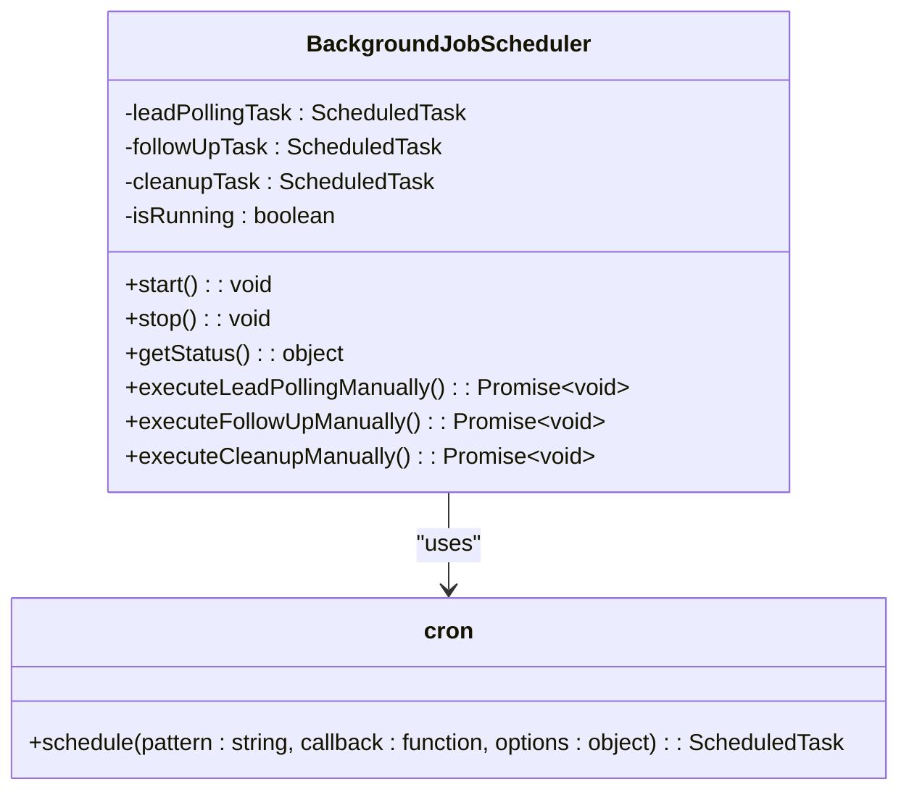
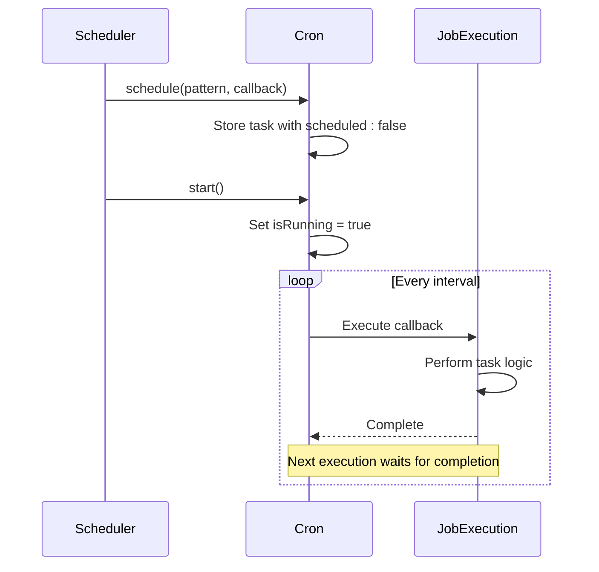
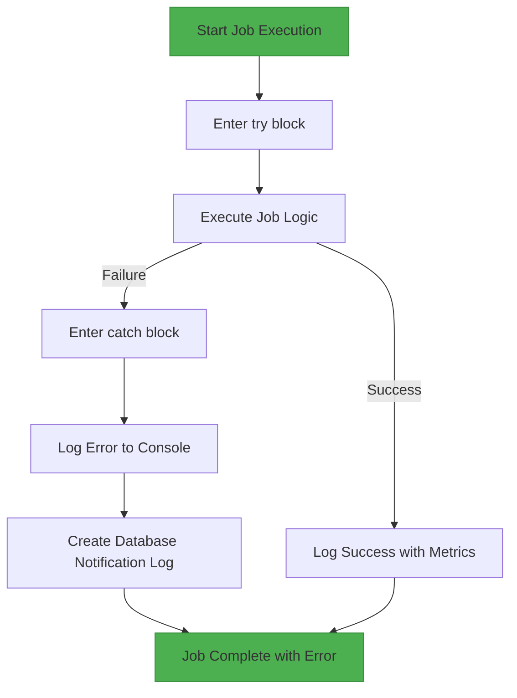
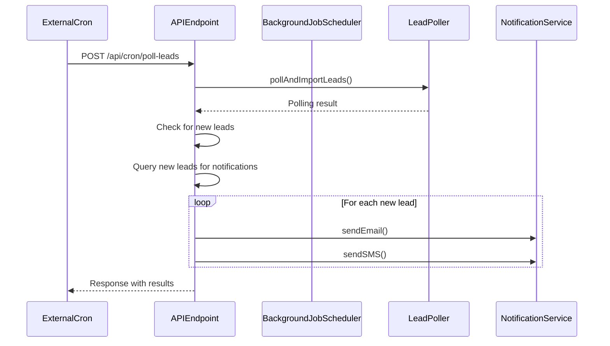
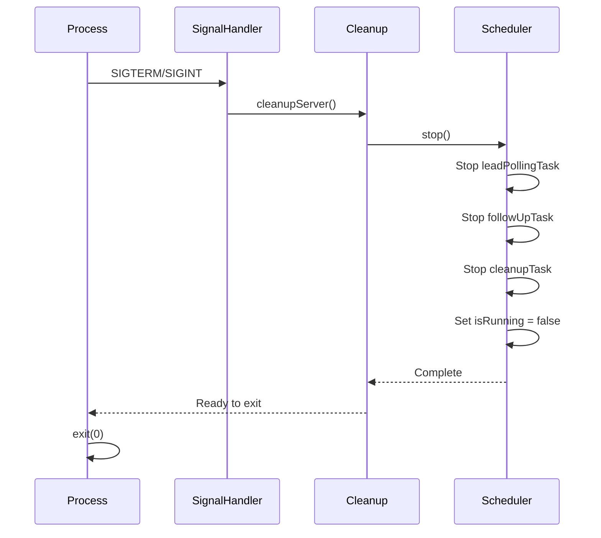

# Background Job Scheduler

<cite>
**Referenced Files in This Document**   
- [BackgroundJobScheduler.ts](file://src/services/BackgroundJobScheduler.ts)
- [poll-leads/route.ts](file://src/app/api/cron/poll-leads/route.ts)
- [send-followups/route.ts](file://src/app/api/cron/send-followups/route.ts)
- [scheduler-status/route.ts](file://src/app/api/dev/scheduler-status/route.ts)
- [server-init.ts](file://src/lib/server-init.ts)
- [start-scheduler.mjs](file://scripts/start-scheduler.mjs)
- [ensure-scheduler-running.sh](file://scripts/ensure-scheduler-running.sh)
- [force-start-scheduler.mjs](file://scripts/force-start-scheduler.mjs)
</cite>

## Table of Contents
1. [Introduction](#introduction)
2. [Architecture Overview](#architecture-overview)
3. [Initialization Process](#initialization-process)
4. [Job Registration and Scheduling](#job-registration-and-scheduling)
5. [Concurrency and Overlap Prevention](#concurrency-and-overlap-prevention)
6. [Job Failure Handling and Retry Logic](#job-failure-handling-and-retry-logic)
7. [Integration with Cron-Triggered Endpoints](#integration-with-cron-triggered-endpoints)
8. [Health Monitoring and Status Reporting](#health-monitoring-and-status-reporting)
9. [Graceful Shutdown Behavior](#graceful-shutdown-behavior)
10. [Adding New Scheduled Jobs](#adding-new-scheduled-jobs)
11. [Troubleshooting Common Issues](#troubleshooting-common-issues)

## Introduction
The BackgroundJobScheduler service is a central component responsible for coordinating scheduled background tasks in the merchant funding application. It manages periodic operations such as lead polling from external sources and sending follow-up notifications to applicants. The scheduler operates as a singleton instance, ensuring only one instance runs per process, and integrates with both API endpoints and direct script execution for maximum flexibility in different deployment scenarios.

The service uses cron-style scheduling patterns to execute jobs at specified intervals, with built-in mechanisms for preventing overlapping executions, handling failures, and providing comprehensive monitoring capabilities. It works in conjunction with other services like LeadPoller and FollowUpScheduler to deliver a robust background processing system that supports both automated and manual execution modes.

**Section sources**
- [BackgroundJobScheduler.ts](file://src/services/BackgroundJobScheduler.ts#L8-L461)

## Architecture Overview
The BackgroundJobScheduler follows a singleton pattern and coordinates three primary scheduled tasks: lead polling, follow-up processing, and notification cleanup. These jobs are triggered according to configurable cron patterns and execute their respective business logic through dedicated service classes.



**Diagram sources**
- [BackgroundJobScheduler.ts](file://src/services/BackgroundJobScheduler.ts#L8-L461)

**Section sources**
- [BackgroundJobScheduler.ts](file://src/services/BackgroundJobScheduler.ts#L8-L461)

## Initialization Process
The BackgroundJobScheduler initializes during server startup through the server-init module, which checks environment conditions before starting the scheduler. The initialization process evaluates the NODE_ENV and ENABLE_BACKGROUND_JOBS environment variables to determine whether background jobs should be enabled.

When initialization occurs, the system first checks if the scheduler is already running to prevent duplicate instances. If not running, it calls the start() method which configures and activates all scheduled tasks. The scheduler can also be initialized manually through API endpoints or direct script execution, providing multiple pathways for activation in different environments.



**Diagram sources**
- [server-init.ts](file://src/lib/server-init.ts#L43-L78)
- [BackgroundJobScheduler.ts](file://src/services/BackgroundJobScheduler.ts#L8-L458)

**Section sources**
- [server-init.ts](file://src/lib/server-init.ts#L43-L78)
- [BackgroundJobScheduler.ts](file://src/services/BackgroundJobScheduler.ts#L8-L458)

## Job Registration and Scheduling
The BackgroundJobScheduler registers and manages three primary jobs using cron expressions. Each job is configured with a specific pattern that determines its execution frequency:

- **Lead Polling**: Scheduled with pattern `*/15 * * * *` (every 15 minutes) by default, configurable via LEAD_POLLING_CRON_PATTERN environment variable
- **Follow-up Processing**: Scheduled with pattern `*/5 * * * *` (every 5 minutes) by default, configurable via FOLLOWUP_CRON_PATTERN environment variable  
- **Notification Cleanup**: Scheduled with pattern `0 2 * * *` (daily at 2:00 AM) by default, configurable via CLEANUP_CRON_PATTERN environment variable

The registration process creates ScheduledTask instances for each job, storing references in private properties (leadPollingTask, followUpTask, cleanupTask). The tasks are initially created with `scheduled: false` and only start execution after all tasks are properly configured and the `start()` method completes successfully.



**Diagram sources**
- [BackgroundJobScheduler.ts](file://src/services/BackgroundJobScheduler.ts#L8-L461)

**Section sources**
- [BackgroundJobScheduler.ts](file://src/services/BackgroundJobScheduler.ts#L8-L461)

## Concurrency and Overlap Prevention
The BackgroundJobScheduler implements multiple mechanisms to prevent overlapping executions and ensure thread safety. The primary protection is the `isRunning` flag that prevents multiple calls to the `start()` method from creating duplicate schedulers within the same process.

Each scheduled task runs independently, but the underlying services (LeadPoller, FollowUpScheduler) contain their own concurrency controls. For example, the lead polling job queries for leads imported within the last 20 minutes, creating a time-based window that prevents reprocessing the same batch of leads even if the job were to overlap.

The scheduler also uses the cron library's built-in execution model, which ensures that a new job instance does not start until the previous execution completes. This prevents cascading job executions that could occur if a job takes longer than its scheduled interval.



**Diagram sources**
- [BackgroundJobScheduler.ts](file://src/services/BackgroundJobScheduler.ts#L8-L461)

**Section sources**
- [BackgroundJobScheduler.ts](file://src/services/BackgroundJobScheduler.ts#L8-L461)

## Job Failure Handling and Retry Logic
The BackgroundJobScheduler implements comprehensive error handling for all scheduled jobs. Each job execution is wrapped in try-catch blocks that log errors to both console and database. When a job fails, the error is captured and logged with detailed context including processing time and error message.

For critical failures like lead polling, the system creates a notification log entry in the database to alert administrators. This creates an audit trail and ensures that failures are monitored even if external logging systems are unavailable.

The scheduler itself does not implement automatic retry logic for failed jobs, relying instead on the regular cron schedule to attempt the operation again at the next interval. This approach prevents infinite retry loops while ensuring eventual consistency. However, manual retry is supported through API endpoints and scripts that allow operators to re-execute failed jobs immediately.



**Diagram sources**
- [BackgroundJobScheduler.ts](file://src/services/BackgroundJobScheduler.ts#L100-L200)

**Section sources**
- [BackgroundJobScheduler.ts](file://src/services/BackgroundJobScheduler.ts#L100-L200)

## Integration with Cron-Triggered Endpoints
The BackgroundJobScheduler integrates with API endpoints that can be triggered by external cron systems. Two primary endpoints enable this integration:

- **POST /api/cron/poll-leads**: Triggers lead polling and notification sending
- **POST /api/cron/send-followups**: Processes the follow-up queue

These endpoints mirror the functionality of the scheduled jobs but can be triggered externally. The poll-leads endpoint first executes lead polling through the LeadPoller service, then processes notifications for any newly imported leads. The send-followups endpoint delegates to the FollowUpScheduler service to process pending follow-ups.

The integration allows for hybrid scheduling approaches where some environments use internal cron scheduling while others rely on external orchestration systems, providing deployment flexibility.



**Diagram sources**
- [poll-leads/route.ts](file://src/app/api/cron/poll-leads/route.ts#L1-L193)
- [send-followups/route.ts](file://src/app/api/cron/send-followups/route.ts#L1-L104)

**Section sources**
- [poll-leads/route.ts](file://src/app/api/cron/poll-leads/route.ts#L1-L193)
- [send-followups/route.ts](file://src/app/api/cron/send-followups/route.ts#L1-L104)

## Health Monitoring and Status Reporting
The BackgroundJobScheduler provides comprehensive health monitoring through multiple channels. The primary monitoring endpoint is GET /api/dev/scheduler-status, which returns detailed information about the scheduler's current state including:

- Whether the scheduler is running
- Current cron patterns for each job
- Timestamps for next scheduled executions
- Environment configuration

Multiple scripts support monitoring and verification:
- **check-scheduler.mjs**: Queries the status endpoint and displays formatted results
- **ensure-scheduler-running.sh**: Checks status and attempts to restart if stopped
- **force-start-scheduler.mjs**: Directly imports and starts the scheduler

These tools enable both human operators and automated systems to verify scheduler health and take corrective action when needed.

```mermaid
flowchart TD
A[Monitoring Request] --> B{Source}
B --> |API| C[/api/dev/scheduler-status]
B --> |Script| D[check-scheduler.mjs]
B --> |Script| E[ensure-scheduler-running.sh]
B --> |Script| F[force-start-scheduler.mjs]
C --> G[Return JSON status]
D --> H[Fetch and format status]
E --> I[Check status and restart if needed]
F --> J[Direct import and start]
style C fill:#2196F3,stroke:#1976D2
style D fill:#FF9800,stroke:#F57C00
style E fill:#FF9800,stroke:#F57C00
style F fill:#FF9800,stroke:#F57C00
```

**Diagram sources**
- [scheduler-status/route.ts](file://src/app/api/dev/scheduler-status/route.ts#L1-L82)
- [check-scheduler.mjs](file://scripts/check-scheduler.mjs#L1-L21)
- [ensure-scheduler-running.sh](file://scripts/ensure-scheduler-running.sh#L1-L34)

**Section sources**
- [scheduler-status/route.ts](file://src/app/api/dev/scheduler-status/route.ts#L1-L82)
- [check-scheduler.mjs](file://scripts/check-scheduler.mjs#L1-L21)
- [ensure-scheduler-running.sh](file://scripts/ensure-scheduler-running.sh#L1-L34)

## Graceful Shutdown Behavior
The BackgroundJobScheduler implements graceful shutdown through process signal handlers and a dedicated cleanup function. When the application receives SIGTERM or SIGINT signals, the cleanupServer function is called, which stops the scheduler and releases resources.

The stop() method properly terminates all scheduled tasks by calling stop() and destroy() on each ScheduledTask instance, then sets isRunning to false. This ensures that no new jobs are started during shutdown and that the scheduler is left in a clean state.

The shutdown process is integrated with Next.js server lifecycle events, ensuring proper cleanup during development server restarts and production deployments.



**Diagram sources**
- [server-init.ts](file://src/lib/server-init.ts#L80-L128)
- [BackgroundJobScheduler.ts](file://src/services/BackgroundJobScheduler.ts#L45-L91)

**Section sources**
- [server-init.ts](file://src/lib/server-init.ts#L80-L128)
- [BackgroundJobScheduler.ts](file://src/services/BackgroundJobScheduler.ts#L45-L91)

## Adding New Scheduled Jobs
To add a new scheduled job to the BackgroundJobScheduler, follow these steps:

1. Add a new private property to store the task reference:
```typescript
private newTask: cron.ScheduledTask | null = null;
```

2. In the start() method, configure the new task using cron.schedule():
```typescript
const newTaskPattern = process.env.NEW_TASK_CRON_PATTERN || "0 * * * *";
this.newTask = cron.schedule(
  newTaskPattern,
  async () => {
    await this.executeNewJob();
  },
  {
    scheduled: false,
    timezone: process.env.TZ || "America/New_York",
  } as any
);
```

3. Implement the job execution method:
```typescript
private async executeNewJob(): Promise<void> {
  const jobStartTime = Date.now();
  logger.backgroundJob("Starting new job", "new-job");
  
  try {
    // Your job logic here
    logger.backgroundJob("New job completed", "new-job", {
      processingTime: `${Date.now() - jobStartTime}ms`
    });
  } catch (error) {
    logger.error("New job failed", {
      error: error instanceof Error ? error.message : "Unknown error"
    });
  }
}
```

4. Add the task to the stop() method cleanup:
```typescript
if (this.newTask) {
  this.newTask.stop();
  this.newTask.destroy();
  this.newTask = null;
}
```

5. Update the getStatus() method to include information about the new job:
```typescript
let nextNewTask: Date | undefined;
try {
  if (this.newTask && typeof (this.newTask as any).nextDate === "function") {
    const nextDate = (this.newTask as any).nextDate();
    nextNewTask = nextDate ? nextDate.toDate() : undefined;
  }
} catch (error) {
  // Ignore errors
}

return {
  // existing properties
  nextNewTask
};
```

6. Add environment variable documentation to configuration files
7. Consider adding manual execution methods for testing:
```typescript
async executeNewJobManually(): Promise<void> {
  logger.backgroundJob("Executing new job manually", "new-job");
  await this.executeNewJob();
}
```

**Section sources**
- [BackgroundJobScheduler.ts](file://src/services/BackgroundJobScheduler.ts#L8-L461)

## Troubleshooting Common Issues
### Scheduler Not Starting
**Symptoms**: Scheduler status shows isRunning: false, no job logs appearing
**Causes and Solutions**:
- **ENABLE_BACKGROUND_JOBS not set**: Set ENABLE_BACKGROUND_JOBS=true in environment
- **Already running**: Check status before starting; use force-start-scheduler.mjs
- **Missing dependencies**: Ensure cron library is properly installed

### Overlapping Job Executions
**Symptoms**: Duplicate processing of leads or notifications
**Solutions**:
- Verify time window calculations in job logic
- Check that isRunning flag is properly set
- Ensure only one instance runs per environment

### Job Failures
**Symptoms**: Error logs showing job execution failures
**Diagnostic Steps**:
1. Check scheduler status endpoint
2. Review error logs in console and database
3. Verify service dependencies (database, external APIs)
4. Test manually using executeJobManually methods

### Environment-Specific Issues
**Development vs Production Differences**:
- Use ensure-scheduler-running.sh in production environments
- Verify timezone settings (TZ environment variable)
- Check that cron patterns are appropriate for the environment

### Monitoring and Verification
Use these commands to verify scheduler health:
```bash
# Check status
npx ts-node scripts/check-scheduler.mjs

# Force start
node scripts/force-start-scheduler.mjs

# Verify running
curl http://localhost:3000/api/dev/scheduler-status
```

**Section sources**
- [BackgroundJobScheduler.ts](file://src/services/BackgroundJobScheduler.ts#L8-L461)
- [check-scheduler.mjs](file://scripts/check-scheduler.mjs#L1-L21)
- [force-start-scheduler.mjs](file://scripts/force-start-scheduler.mjs#L1-L81)
- [ensure-scheduler-running.sh](file://scripts/ensure-scheduler-running.sh#L1-L34)