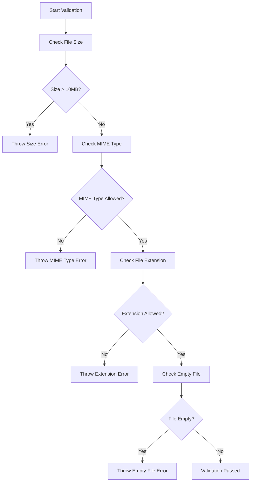
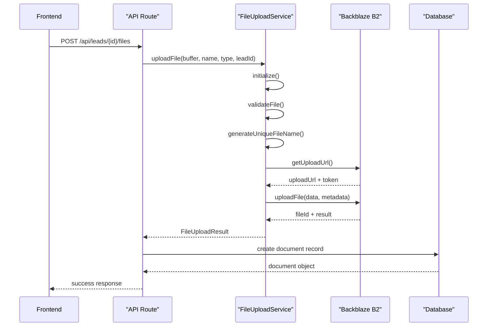
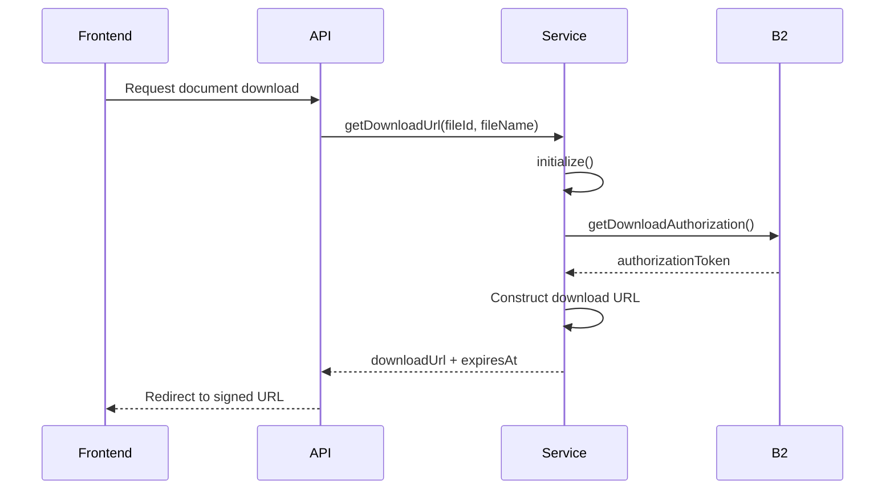
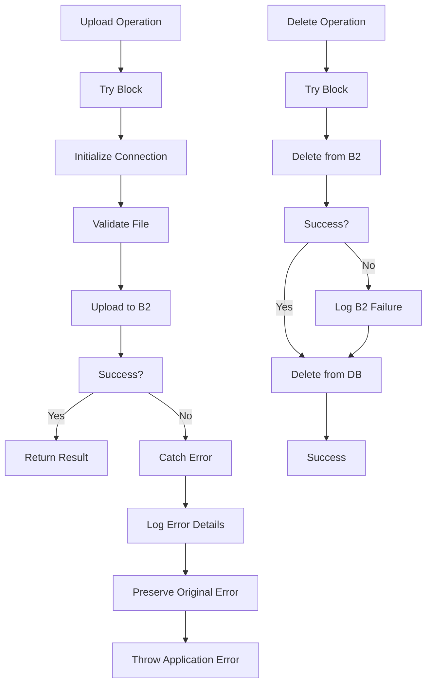
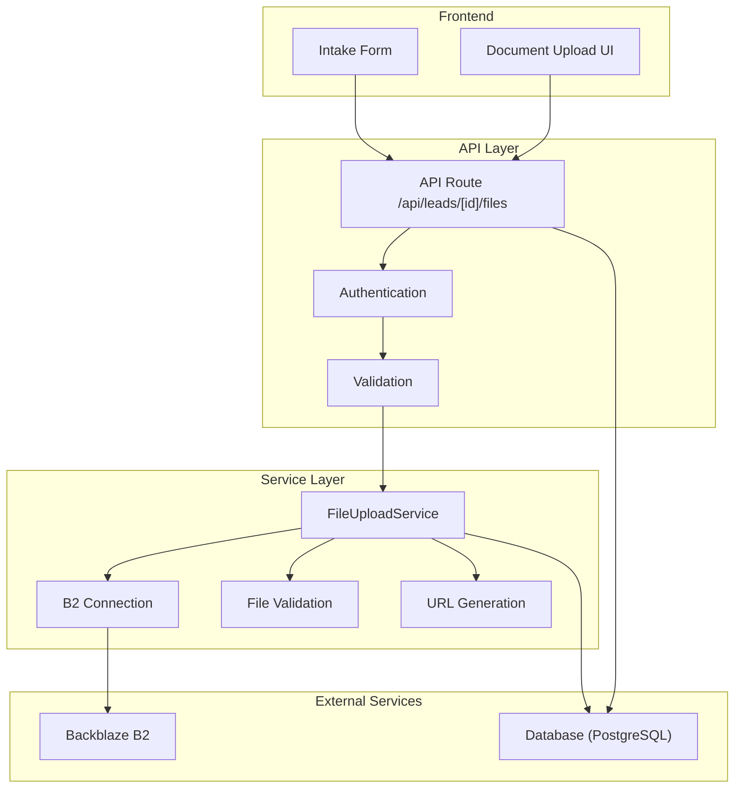

# File Upload Service

<cite>
**Referenced Files in This Document**   
- [FileUploadService.ts](file://src/services/FileUploadService.ts)
- [route.ts](file://src/app/api/leads/[id]/files/route.ts)
- [schema.prisma](file://prisma/schema.prisma)
- [backblaze-b2.d.ts](file://src/types/backblaze-b2.d.ts)
</cite>

## Table of Contents
1. [Introduction](#introduction)
2. [Core Responsibilities](#core-responsibilities)
3. [File Validation Process](#file-validation-process)
4. [Secure Upload Workflow](#secure-upload-workflow)
5. [Metadata Extraction and Storage](#metadata-extraction-and-storage)
6. [Signed URL Generation](#signed-url-generation)
7. [Large File and Multipart Upload Handling](#large-file-and-multipart-upload-handling)
8. [Error Recovery and Resilience](#error-recovery-and-resilience)
9. [Integration with Intake API and Frontend](#integration-with-intake-api-and-frontend)
10. [Security Considerations](#security-considerations)
11. [Architecture Overview](#architecture-overview)
12. [Detailed Component Analysis](#detailed-component-analysis)
13. [Troubleshooting Guide](#troubleshooting-guide)

## Introduction
The FileUploadService is a critical component responsible for securely handling document uploads during the lead intake process in the fund-track application. It serves as the intermediary between the application's frontend and the Backblaze B2 cloud storage service, ensuring that files are validated, uploaded, and managed with integrity and security. This service plays a pivotal role in maintaining data consistency by coordinating file operations with database transactions and enforcing strict security policies. The service is designed to handle various file types used in the intake process, including PDFs, images, and DOCX documents, while preventing malicious uploads through comprehensive validation and access control mechanisms.

**Section sources**
- [FileUploadService.ts](file://src/services/FileUploadService.ts#L0-L307)

## Core Responsibilities
The FileUploadService is responsible for managing the complete lifecycle of document uploads within the application. Its primary responsibilities include validating file integrity and type before upload, securely transferring files to Backblaze B2 cloud storage, generating unique file identifiers to prevent naming conflicts, creating time-limited signed URLs for secure file access, and maintaining synchronization between cloud storage and the application's database. The service also handles file deletion operations, ensuring that both cloud storage and database records are properly cleaned up. It provides methods for listing files associated with specific leads and retrieving file metadata from the storage system. The service operates as a singleton instance, ensuring consistent configuration and connection management across the application. It integrates tightly with the authentication system to enforce access control and with the logging system for audit trail generation.

**Section sources**
- [FileUploadService.ts](file://src/services/FileUploadService.ts#L0-L307)

## File Validation Process
The FileUploadService implements a comprehensive file validation process before any upload operation proceeds. The validation checks include file size limits, MIME type verification, file extension validation, and basic content integrity checks. By default, the service restricts file sizes to 10MB (10,485,760 bytes) and allows only specific MIME types: application/pdf, image/jpeg, image/png, and application/vnd.openxmlformats-officedocument.wordprocessingml.document. Corresponding file extensions (.pdf, .jpg, .jpeg, .png, .docx) are also enforced. The validation process first checks if the file buffer has zero length, rejecting empty files immediately. It then compares the provided MIME type against the allowed list and verifies the file extension by extracting it from the filename and checking against the allowed extensions array. Validation options can be customized through the `options` parameter, which allows overriding the default restrictions for specific use cases. All validation failures result in descriptive error messages that help clients understand the rejection reason.



**Diagram sources**
- [FileUploadService.ts](file://src/services/FileUploadService.ts#L59-L103)

**Section sources**
- [FileUploadService.ts](file://src/services/FileUploadService.ts#L59-L103)

## Secure Upload Workflow
The secure upload workflow begins with the initialization of the Backblaze B2 connection, which occurs automatically when needed. The service first authorizes with the B2 API using credentials from environment variables. Once authorized, it requests an upload URL and authorization token from B2 for the target bucket. The service then constructs a unique filename using the lead ID, current timestamp, and an MD5 hash to prevent naming conflicts and ensure file uniqueness. The file is uploaded to B2 with metadata including the original filename, lead ID, and upload timestamp. After successful upload, the service creates a database record in the Document model to maintain a reference to the stored file. The entire process is wrapped in error handling that logs failures and propagates meaningful error messages. The workflow ensures atomicity between cloud storage and database operations, preventing orphaned files or records.



**Diagram sources**
- [FileUploadService.ts](file://src/services/FileUploadService.ts#L107-L195)
- [route.ts](file://src/app/api/leads/[id]/files/route.ts#L46-L87)

**Section sources**
- [FileUploadService.ts](file://src/services/FileUploadService.ts#L107-L195)
- [route.ts](file://src/app/api/leads/[id]/files/route.ts#L46-L87)

## Metadata Extraction and Storage
The FileUploadService extracts and stores comprehensive metadata during the upload process to maintain data integrity and enable efficient file management. When uploading a file, the service includes custom metadata in the B2 upload request, containing the original filename, lead ID, and ISO-formatted upload timestamp. This metadata is stored alongside the file in Backblaze B2 and can be retrieved later for audit or display purposes. Simultaneously, the API route creates a corresponding record in the Document database model, storing additional metadata such as file size, MIME type, B2 file ID, bucket name, and the ID of the user who uploaded the file. The database record also maintains the relationship between the document and its associated lead through the leadId foreign key. This dual metadata approach ensures that both the cloud storage system and the application database have complete information about each uploaded file, enabling features like file listing, access control, and audit logging.

**Section sources**
- [FileUploadService.ts](file://src/services/FileUploadService.ts#L147-L195)
- [route.ts](file://src/app/api/leads/[id]/files/route.ts#L70-L87)
- [schema.prisma](file://prisma/schema.prisma#L180-L194)

## Signed URL Generation
The FileUploadService generates secure, time-limited signed URLs for accessing uploaded documents through the `getDownloadUrl` method. This method creates download authorizations with the Backblaze B2 service, specifying the bucket ID, filename prefix, and validity duration (default 24 hours). The service constructs the download URL by combining the B2 download endpoint, bucket name, filename, and the authorization token received from B2. The generated URL includes an expiration timestamp to ensure temporary access. This approach prevents direct access to files while allowing authorized users to download documents through the application's controlled interface. The signed URL mechanism leverages B2's built-in security features, eliminating the need for the application to proxy file downloads and reducing server load. The expiration time is configurable through the `expirationHours` parameter, allowing different access durations for various use cases.



**Diagram sources**
- [FileUploadService.ts](file://src/services/FileUploadService.ts#L190-L237)

**Section sources**
- [FileUploadService.ts](file://src/services/FileUploadService.ts#L190-L237)

## Large File and Multipart Upload Handling
While the current implementation does not explicitly support multipart uploads for large files, the service is designed with scalability in mind. The Backblaze B2 JavaScript SDK used by the service supports multipart uploads natively, but the current implementation uses the simple upload method for files under 10MB. The 10MB size limit effectively prevents the need for multipart uploads in most use cases. For files approaching or exceeding this limit, the service would need to be enhanced to implement chunked uploads using B2's large file upload API. This would involve creating a large file, uploading parts sequentially or in parallel, and then finishing the upload. The current architecture allows for such enhancements by encapsulating the upload logic within the service, making it possible to modify the upload strategy without affecting other components. The validation layer would also need adjustment to handle streaming validation for large files.

**Section sources**
- [FileUploadService.ts](file://src/services/FileUploadService.ts#L59-L103)

## Error Recovery and Resilience
The FileUploadService implements comprehensive error handling and recovery mechanisms to ensure reliability during file operations. All critical operations are wrapped in try-catch blocks that log detailed error information including file metadata and operation context. The service distinguishes between different error types and preserves original error messages when possible. During file deletion operations, the service implements a resilient pattern where database record deletion proceeds even if the B2 file deletion fails, preventing orphaned database records while logging the storage cleanup failure for later resolution. The initialization process includes idempotency checks to prevent redundant authorization requests. Network-related errors from the B2 API are propagated to the caller, allowing higher-level components to implement retry logic if needed. The service maintains connection state through the `isInitialized` flag, preventing unnecessary re-authorization on subsequent operations.



**Diagram sources**
- [FileUploadService.ts](file://src/services/FileUploadService.ts#L147-L195)
- [FileUploadService.ts](file://src/services/FileUploadService.ts#L239-L305)

**Section sources**
- [FileUploadService.ts](file://src/services/FileUploadService.ts#L147-L195)
- [FileUploadService.ts](file://src/services/FileUploadService.ts#L239-L305)

## Integration with Intake API and Frontend
The FileUploadService integrates with the intake process through the `/api/leads/[id]/files` API route, which serves as the interface between the frontend and the file upload functionality. The API route handles authentication, lead validation, and form data parsing before delegating to the FileUploadService. It performs duplicate validation checks on file type and size, converting the frontend File object to a Buffer for the service. After successful upload, the route creates a database record in the Document model and returns the document metadata to the frontend. The frontend components in the intake workflow use this API to allow users to upload documents during the application process. The integration follows a layered architecture where the API route handles HTTP-specific concerns, the FileUploadService manages cloud storage operations, and the database maintains persistent references. This separation of concerns ensures maintainability and testability of each component.

**Section sources**
- [route.ts](file://src/app/api/leads/[id]/files/route.ts#L0-L252)
- [FileUploadService.ts](file://src/services/FileUploadService.ts#L0-L307)

## Security Considerations
The FileUploadService implements multiple security layers to protect against common threats. File type restrictions prevent execution of malicious scripts by allowing only document and image formats. The dual validation (extension and MIME type) mitigates extension spoofing attacks. The 10MB size limit prevents denial-of-service attacks through large file uploads. The unique filename generation with hashing prevents directory traversal and file overwriting attacks. Access to file operations is controlled through the API route's authentication middleware, ensuring only authorized users can upload or delete files. The use of signed URLs with limited expiration times prevents unauthorized access to stored documents. The Content-Security-Policy header configured in next.config.mjs restricts connections to the B2 domain, preventing unauthorized data exfiltration. Database records maintain audit trails with uploadedBy references, enabling accountability. The service follows the principle of least privilege by using dedicated B2 credentials with limited permissions.

**Section sources**
- [FileUploadService.ts](file://src/services/FileUploadService.ts#L59-L103)
- [route.ts](file://src/app/api/leads/[id]/files/route.ts#L46-L87)
- [next.config.mjs](file://next.config.mjs#L18-L71)
- [schema.prisma](file://prisma/schema.prisma#L180-L194)

## Architecture Overview
The file upload architecture follows a layered pattern with clear separation of concerns between components. The frontend initiates uploads through API routes, which handle authentication and request parsing. The FileUploadService acts as a domain service managing interactions with Backblaze B2, while the database maintains metadata and relationships. This architecture ensures that cloud storage operations are encapsulated and reusable across different parts of the application. The service pattern promotes testability and allows for easy replacement of the storage backend if needed. The integration with Prisma provides type safety and efficient database operations. The singleton pattern ensures consistent configuration and connection pooling across the application.



**Diagram sources**
- [FileUploadService.ts](file://src/services/FileUploadService.ts#L0-L307)
- [route.ts](file://src/app/api/leads/[id]/files/route.ts#L0-L252)
- [schema.prisma](file://prisma/schema.prisma#L180-L194)

## Detailed Component Analysis

### FileUploadService Class Analysis
The FileUploadService class implements a comprehensive file management system with multiple methods for different operations. The class maintains state including the B2 client instance, bucket configuration, and initialization status. It uses environment variables for configuration, promoting security by keeping credentials out of code. The service methods are designed to be atomic and idempotent where possible, ensuring reliable operation in distributed environments.

```mermaid
classDiagram
class FileUploadService {
-b2 : B2
-bucketId : string
-bucketName : string
-isInitialized : boolean
-DEFAULT_VALIDATION : FileValidationOptions
+initialize() : Promise~void~
+validateFile(file : Buffer, fileName : string, mimeType : string, options : Partial~FileValidationOptions~) : void
+uploadFile(file : Buffer, originalFileName : string, mimeType : string, leadId : number, options : Partial~FileValidationOptions~) : Promise~FileUploadResult~
+getDownloadUrl(fileId : string, fileName : string, expirationHours : number) : Promise~FileDownloadResult~
+deleteFile(fileId : string, fileName : string) : Promise~void~
+getFileInfo(fileId : string) : Promise~any~
+listFilesForLead(leadId : number) : Promise~any[]~
}
class B2 {
+downloadUrl : string
+constructor(config : B2Config)
+authorize() : Promise~any~
+getUploadUrl(params : {bucketId : string}) : Promise~UploadUrlResponse~
+uploadFile(params : UploadFileParams) : Promise~UploadFileResponse~
+getDownloadAuthorization(params : {bucketId : string, fileNamePrefix : string, validDurationInSeconds : number}) : Promise~DownloadAuthResponse~
+deleteFileVersion(params : {fileId : string, fileName : string}) : Promise~any~
+getFileInfo(params : {fileId : string}) : Promise~FileInfoResponse~
+listFileNames(params : {bucketId : string, prefix : string, maxFileCount : number}) : Promise~ListFilesResponse~
}
FileUploadService --> B2 : "uses"
```

**Diagram sources**
- [FileUploadService.ts](file://src/services/FileUploadService.ts#L0-L307)
- [backblaze-b2.d.ts](file://src/types/backblaze-b2.d.ts#L0-L67)

**Section sources**
- [FileUploadService.ts](file://src/services/FileUploadService.ts#L0-L307)

## Troubleshooting Guide
Common issues with the FileUploadService typically fall into configuration, authentication, or network categories. Configuration errors occur when environment variables (B2_APPLICATION_KEY_ID, B2_APPLICATION_KEY, B2_BUCKET_NAME, B2_BUCKET_ID) are missing or incorrect. Authentication failures manifest as authorization errors during initialization and require verifying B2 credentials. Network issues may cause timeouts during upload operations, especially for larger files near the 10MB limit. Validation errors should be checked against the allowed MIME types and extensions. When debugging, examine the structured logs in the application logs for detailed error messages and context. For upload failures, verify that the B2 bucket exists and has appropriate permissions. The health check endpoint can be used to verify B2 connectivity. Database issues may occur if the Document model schema changes without migration. Always ensure that file buffers are properly constructed from frontend File objects using arrayBuffer() and Buffer.from().

**Section sources**
- [FileUploadService.ts](file://src/services/FileUploadService.ts#L59-L305)
- [route.ts](file://src/app/api/leads/[id]/files/route.ts#L0-L252)
- [schema.prisma](file://prisma/schema.prisma#L180-L194)