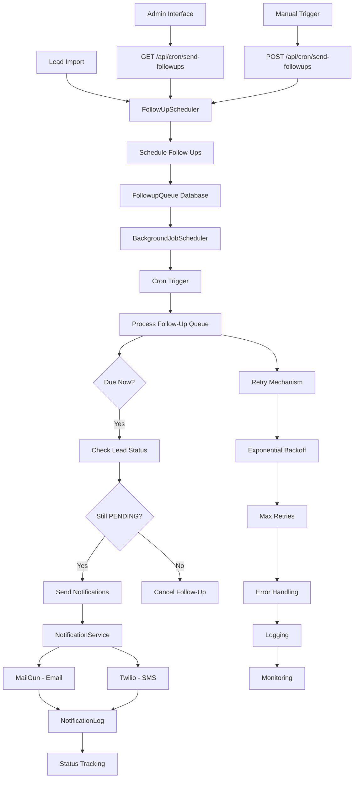
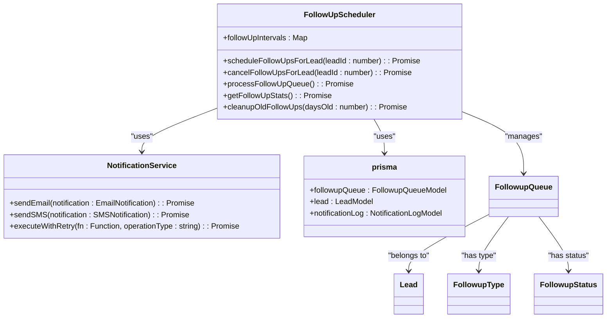
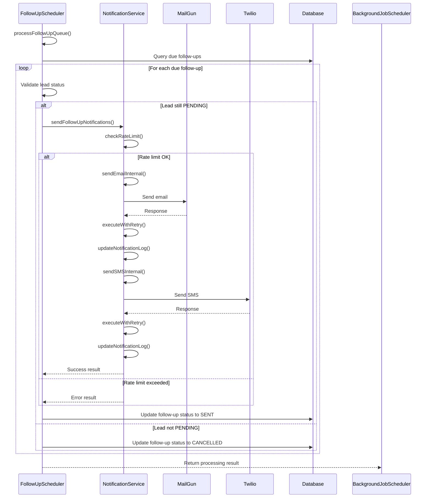

# Follow-Up Scheduler Service

<cite>
**Referenced Files in This Document**   
- [FollowUpScheduler.ts](file://src/services/FollowUpScheduler.ts)
- [NotificationService.ts](file://src/services/NotificationService.ts)
- [send-followups/route.ts](file://src/app/api/cron/send-followups/route.ts)
- [BackgroundJobScheduler.ts](file://src/services/BackgroundJobScheduler.ts)
- [schema.prisma](file://prisma/schema.prisma)
</cite>

## Table of Contents
1. [Introduction](#introduction)
2. [Core Components](#core-components)
3. [Architecture Overview](#architecture-overview)
4. [Detailed Component Analysis](#detailed-component-analysis)
5. [Scheduling Algorithm and Queue Management](#scheduling-algorithm-and-queue-management)
6. [Notification Processing and Delivery](#notification-processing-and-delivery)
7. [Status Tracking and Retry Mechanisms](#status-tracking-and-retry-mechanisms)
8. [Cron Job Invocation and Coordination](#cron-job-invocation-and-coordination)
9. [Edge Case Handling](#edge-case-handling)
10. [Performance and Maintenance](#performance-and-maintenance)

## Introduction
The Follow-Up Scheduler Service is responsible for managing time-based follow-up communications at predefined intervals (3h, 9h, 24h, 72h) for leads in the merchant funding application system. This service ensures timely engagement with potential customers who have initiated but not completed their funding applications. The system operates through a scheduled job that processes a queue of pending follow-ups, sending email and SMS notifications via third-party services (MailGun and Twilio). The service integrates with the NotificationService for message delivery, maintains detailed status tracking, implements retry mechanisms for failed notifications, and coordinates with the BackgroundJobScheduler for periodic execution. This document provides a comprehensive analysis of the service's architecture, functionality, and operational characteristics.

## Core Components
The Follow-Up Scheduler Service consists of several interconnected components that work together to manage the follow-up communication lifecycle. The core component is the FollowUpScheduler class, which handles scheduling, processing, and cancellation of follow-ups. This service interacts with the NotificationService to send email and SMS messages, uses Prisma ORM for database operations, and relies on the BackgroundJobScheduler for periodic execution. The system maintains state through database models including FollowupQueue, NotificationLog, and Lead, with corresponding enums defining follow-up types, statuses, and lead statuses. The service is designed as a singleton instance to ensure consistent state management across the application.

**Section sources**
- [FollowUpScheduler.ts](file://src/services/FollowUpScheduler.ts#L1-L491)
- [NotificationService.ts](file://src/services/NotificationService.ts#L1-L472)
- [schema.prisma](file://prisma/schema.prisma#L1-L258)

## Architecture Overview



**Diagram sources**
- [FollowUpScheduler.ts](file://src/services/FollowUpScheduler.ts#L1-L491)
- [NotificationService.ts](file://src/services/NotificationService.ts#L1-L472)
- [send-followups/route.ts](file://src/app/api/cron/send-followups/route.ts#L1-L104)
- [BackgroundJobScheduler.ts](file://src/services/BackgroundJobScheduler.ts#L1-L463)

## Detailed Component Analysis

### FollowUpScheduler Class Analysis



**Diagram sources**
- [FollowUpScheduler.ts](file://src/services/FollowUpScheduler.ts#L1-L491)
- [NotificationService.ts](file://src/services/NotificationService.ts#L1-L472)
- [schema.prisma](file://prisma/schema.prisma#L1-L258)

**Section sources**
- [FollowUpScheduler.ts](file://src/services/FollowUpScheduler.ts#L1-L491)

### NotificationService Integration



**Diagram sources**
- [FollowUpScheduler.ts](file://src/services/FollowUpScheduler.ts#L1-L491)
- [NotificationService.ts](file://src/services/NotificationService.ts#L1-L472)
- [BackgroundJobScheduler.ts](file://src/services/BackgroundJobScheduler.ts#L1-L463)

**Section sources**
- [FollowUpScheduler.ts](file://src/services/FollowUpScheduler.ts#L1-L491)
- [NotificationService.ts](file://src/services/NotificationService.ts#L1-L472)

## Scheduling Algorithm and Queue Management

The Follow-Up Scheduler implements a time-based scheduling algorithm that creates follow-up tasks at predefined intervals (3h, 9h, 24h, 72h) when a new lead is imported. The scheduling process begins when a lead is imported with a status of PENDING, at which point four follow-up entries are created in the followup_queue database table, each with a specific followup_type and a scheduledAt timestamp calculated by adding the corresponding interval to the current time.

The queue management system uses a PENDING status to track follow-ups that are waiting to be processed. When the cron job executes, it queries the database for all follow-ups where the scheduledAt timestamp is less than or equal to the current time and the status is PENDING. These due follow-ups are processed in ascending order of their scheduledAt time to ensure chronological processing.

The system prevents duplicate scheduling by checking for existing PENDING follow-ups before creating new ones for a lead. This ensures that each lead has exactly one set of follow-ups scheduled at the four predefined intervals. The follow-up intervals are defined as constants within the FollowUpScheduler class:

```typescript
private readonly followUpIntervals = {
  [FollowupType.THREE_HOUR]: 3 * 60 * 60 * 1000, // 3 hours
  [FollowupType.NINE_HOUR]: 9 * 60 * 60 * 1000, // 9 hours
  [FollowupType.TWENTY_FOUR_H]: 24 * 60 * 60 * 1000, // 24 hours
  [FollowupType.SEVENTY_TWO_H]: 72 * 60 * 60 * 1000, // 72 hours
};
```

When a lead's status changes from PENDING to any other status, all pending follow-ups for that lead are automatically cancelled by updating their status to CANCELLED in the database. This prevents unnecessary follow-up communications to leads who have already progressed in the application process.

**Section sources**
- [FollowUpScheduler.ts](file://src/services/FollowUpScheduler.ts#L1-L491)
- [schema.prisma](file://prisma/schema.prisma#L1-L258)

## Notification Processing and Delivery

The Follow-Up Scheduler processes notifications through a systematic workflow that ensures reliable delivery while maintaining proper status tracking. When processing the follow-up queue, the system first retrieves all due follow-ups (those with scheduledAt ≤ current time) that are still in PENDING status. For each follow-up, the system verifies that the associated lead is still in PENDING status before proceeding with notification delivery.

The notification delivery process involves sending both email and SMS messages when the lead's contact information is available. The system constructs personalized messages based on the follow-up type, using different subject lines and messaging tones to create a sense of urgency that increases with each subsequent follow-up:

- **3-hour follow-up**: "Quick Reminder: Complete Your Merchant Funding Application"
- **9-hour follow-up**: "Don't Miss Out: Your Merchant Funding Application"
- **24-hour follow-up**: "Final Reminder: Complete Your Application Today"
- **72-hour follow-up**: "Last Chance: Your Merchant Funding Application Expires Soon"

The messages include a personalized greeting, context about when the application was started, a clear call-to-action button with the intake URL, and a professional closing. The system generates both plain text and HTML versions of the email, with the HTML version featuring a prominent call-to-action button styled for high visibility.

For SMS messages, the system sends a concise text with the lead's name, a brief reminder, and the intake URL. The NotificationService handles the actual delivery through MailGun for email and Twilio for SMS, with each service call wrapped in appropriate error handling and logging.

**Section sources**
- [FollowUpScheduler.ts](file://src/services/FollowUpScheduler.ts#L1-L491)
- [NotificationService.ts](file://src/services/NotificationService.ts#L1-L472)

## Status Tracking and Retry Mechanisms

The Follow-Up Scheduler implements comprehensive status tracking and retry mechanisms to ensure reliable notification delivery. Each follow-up in the queue has a status field that can be PENDING, SENT, or CANCELLED, allowing the system to track the lifecycle of each follow-up attempt. Similarly, each notification (email or SMS) has its own status tracking in the notification_log table with statuses of PENDING, SENT, or FAILED.

When a notification fails to send, the system implements an exponential backoff retry mechanism through the NotificationService's executeWithRetry method. This method attempts to resend the notification up to a configurable number of times (default: 3), with delays between attempts that double each time (1s, 2s, 4s, etc.) up to a maximum delay of 30 seconds. The retry configuration can be adjusted through system settings, allowing administrators to tune the retry behavior based on service requirements and rate limits.

The system also implements rate limiting to prevent spamming recipients. The checkRateLimit method enforces two key limits:
1. Maximum of 2 notifications per hour per recipient
2. Maximum of 10 notifications per day per lead

These limits help maintain good sender reputation and comply with email and SMS provider policies. All notification attempts are logged in the notification_log table, which records the recipient, content, status, external ID from the provider (MailGun message ID or Twilio SID), and any error messages. This comprehensive logging enables detailed monitoring, troubleshooting, and auditing of all follow-up communications.

**Section sources**
- [NotificationService.ts](file://src/services/NotificationService.ts#L1-L472)
- [FollowUpScheduler.ts](file://src/services/FollowUpScheduler.ts#L1-L491)

## Cron Job Invocation and Coordination

The Follow-Up Scheduler is invoked through the `/api/cron/send-followups` endpoint, which serves as the entry point for processing the follow-up queue. This endpoint supports both POST and GET HTTP methods:

- **POST**: Triggers the processing of due follow-ups by calling the `processFollowUpQueue()` method
- **GET**: Retrieves follow-up queue statistics by calling the `getFollowUpStats()` method

The BackgroundJobScheduler coordinates the periodic execution of follow-up processing through a cron job configured to run every 5 minutes by default (configurable via the FOLLOWUP_CRON_PATTERN environment variable). The scheduler uses the node-cron library to manage the job scheduling, with the timezone set to America/New_York by default (configurable via the TZ environment variable).

```mermaid
flowchart TD
A[BackgroundJobScheduler] --> B{Start Method Called?}
B --> |Yes| C[Create Cron Job]
C --> D[Schedule Pattern: */5 * * * *]
D --> E[Timezone: America/New_York]
E --> F[Execute Follow-Up Job]
F --> G[Call processFollowUpQueue()]
G --> H[Process Due Follow-Ups]
H --> I[Send Notifications]
I --> J[Update Statuses]
J --> K[Log Results]
K --> L[Return Results]
M[Manual Trigger] --> N[Call executeFollowUpManually()]
N --> F
O[GET Request] --> P[Return Queue Statistics]
```

The system provides both automated and manual execution capabilities. The automated execution runs on the configured cron schedule, while administrators can manually trigger follow-up processing through the executeFollowUpManually method for testing or emergency situations. The scheduler maintains its state and can be started or stopped as needed, with appropriate logging for monitoring purposes.

**Section sources**
- [send-followups/route.ts](file://src/app/api/cron/send-followups/route.ts#L1-L104)
- [BackgroundJobScheduler.ts](file://src/services/BackgroundJobScheduler.ts#L1-L463)

## Edge Case Handling

The Follow-Up Scheduler implements robust handling of various edge cases to ensure reliable operation in production environments:

### Timezone Handling
The system uses UTC timestamps in the database for all scheduledAt and createdAt fields, but the cron job execution is configured with a specific timezone (America/New_York by default). This ensures that follow-ups are processed according to business hours in the target timezone while maintaining consistent timestamp storage. The system relies on the node-cron library's timezone support to align job execution with the configured timezone.

### Clock Drift and Missed Execution Windows
To handle potential clock drift or system downtime that might cause missed execution windows, the system queries for all follow-ups with scheduledAt ≤ current time rather than only those scheduled for the current interval. This ensures that any follow-ups that became due during a period of system unavailability are processed as soon as the system recovers. The ascending order of processing by scheduledAt time ensures that older follow-ups are processed first.

### Lead Status Changes
The system checks the lead's status immediately before sending each follow-up, not just when scheduling. This prevents sending follow-ups to leads whose status has changed to IN_PROGRESS, COMPLETED, or REJECTED since the follow-up was scheduled. When such a status change is detected, the follow-up is cancelled rather than sent.

### Missing Contact Information
The system gracefully handles cases where a lead lacks email or phone information by only attempting to send notifications to available channels. If neither email nor phone is available, the follow-up is marked as failed with an appropriate error message.

### System Failures
The entire follow-up processing is wrapped in try-catch blocks at multiple levels to prevent a single error from stopping the processing of other follow-ups. Errors are logged individually, and the system continues processing the remaining follow-ups in the queue. The final result includes counts of processed, sent, and cancelled follow-ups, along with a list of any errors encountered.

**Section sources**
- [FollowUpScheduler.ts](file://src/services/FollowUpScheduler.ts#L1-L491)
- [BackgroundJobScheduler.ts](file://src/services/BackgroundJobScheduler.ts#L1-L463)

## Performance and Maintenance

The Follow-Up Scheduler includes several performance optimizations and maintenance features to ensure efficient operation and data management:

### Performance Considerations
- The system uses database indexing on key fields (status, scheduledAt) to optimize query performance for finding due follow-ups
- Follow-up processing is batched, allowing multiple notifications to be processed in a single job execution
- The system minimizes database round-trips by including related lead data in the initial query through Prisma's include feature
- Rate limiting checks are optimized with appropriate database queries and time-based filters

### Maintenance Features
The system includes a cleanup mechanism to prevent unbounded growth of historical data:

```mermaid
flowchart TD
A[Cleanup Job] --> B{Daily at 2 AM}
B --> C[Call cleanupOldFollowUps()]
C --> D[Delete SENT/CANCELLED follow-ups older than 30 days]
D --> E[Log cleanup results]
F[Call cleanupOldNotifications()] --> G[Delete old notification logs]
G --> H[Log cleanup results]
```

The cleanupOldFollowUps method removes completed and cancelled follow-up records older than a configurable number of days (default: 30), helping to maintain database performance and manage storage costs. This cleanup job is executed daily at 2:00 AM by the BackgroundJobScheduler.

The system also provides monitoring endpoints and logging capabilities:
- The GET /api/cron/send-followups endpoint provides real-time statistics on pending follow-ups
- Comprehensive logging with different log levels (info, error, backgroundJob) for monitoring and troubleshooting
- Performance timing for key operations to identify potential bottlenecks
- Error aggregation in the processing results to identify systemic issues

These maintenance features ensure that the Follow-Up Scheduler can operate reliably at scale while maintaining good performance and manageable resource usage.

**Section sources**
- [FollowUpScheduler.ts](file://src/services/FollowUpScheduler.ts#L1-L491)
- [BackgroundJobScheduler.ts](file://src/services/BackgroundJobScheduler.ts#L1-L463)
- [NotificationService.ts](file://src/services/NotificationService.ts#L1-L472)