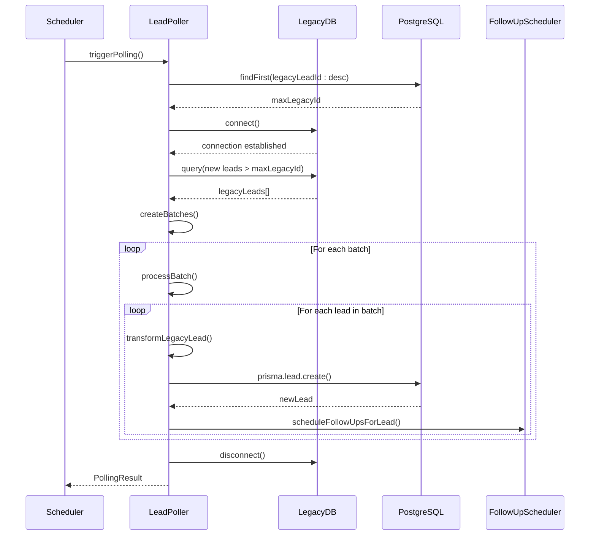
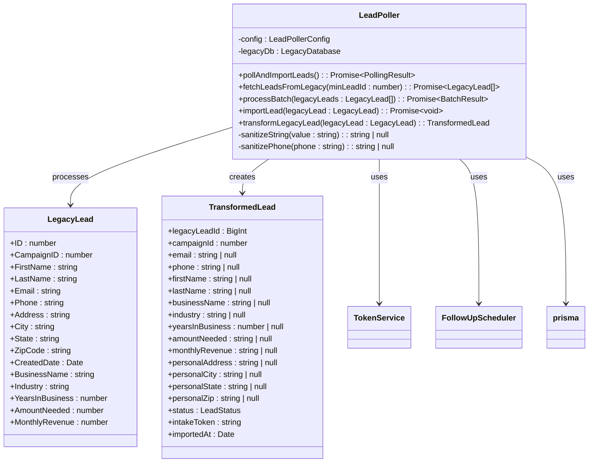
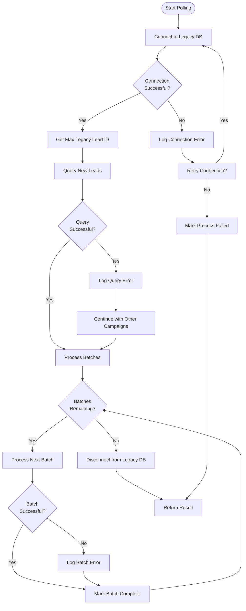
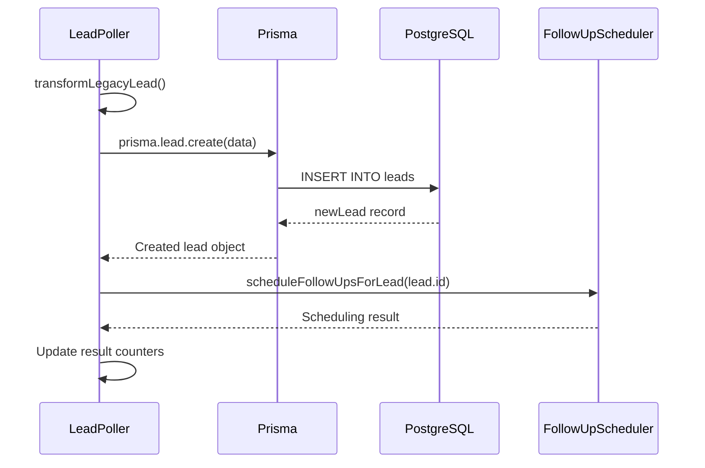

# Lead Poller Service

<cite>
**Referenced Files in This Document**   
- [LeadPoller.ts](file://src/services/LeadPoller.ts)
- [schema.prisma](file://prisma/schema.prisma)
- [TokenService.ts](file://src/services/TokenService.ts)
- [LeadStatusService.ts](file://src/services/LeadStatusService.ts)
- [NotificationService.ts](file://src/services/NotificationService.ts)
- [FollowUpScheduler.ts](file://src/services/FollowUpScheduler.ts)
- [route.ts](file://src/app/api/cron/poll-leads/route.ts)
</cite>

## Table of Contents
1. [Introduction](#introduction)
2. [Core Functionality](#core-functionality)
3. [Polling Mechanism](#polling-mechanism)
4. [Data Transformation and Business Rules](#data-transformation-and-business-rules)
5. [Error Handling and Database Connectivity](#error-handling-and-database-connectivity)
6. [Performance Optimization and Large Dataset Handling](#performance-optimization-and-large-dataset-handling)
7. [Transaction Management and Data Persistence](#transaction-management-and-data-persistence)
8. [Integration with BackgroundJobScheduler](#integration-with-backgroundjobscheduler)
9. [API Endpoint and Invocation](#api-endpoint-and-invocation)
10. [Troubleshooting Guide](#troubleshooting-guide)

## Introduction
The LeadPoller service is a critical component responsible for synchronizing lead data from a legacy MS SQL Server database to the current PostgreSQL database. It operates as a batch processing system that periodically polls for new leads, transforms the data according to business rules, and persists it in the modern database system. This service ensures data continuity during the system migration and enables the new application to access leads generated by legacy systems. The service is designed with robust error handling, performance optimization for large datasets, and integration with various system components including notification services and follow-up scheduling.

## Core Functionality
The LeadPoller service serves as the primary data integration point between the legacy MS SQL Server system and the current PostgreSQL-based application. Its main responsibility is to identify new leads in the legacy system, transform them to match the current data model, and import them into the PostgreSQL database using Prisma ORM. The service processes leads in batches to optimize performance and resource utilization, with configurable batch sizes. Each imported lead is assigned a unique intake token that enables the lead to complete the application process through a secure workflow. The service also triggers follow-up sequences for new leads and maintains comprehensive logging for audit and troubleshooting purposes.

**Section sources**
- [LeadPoller.ts](file://src/services/LeadPoller.ts#L21-L497)

## Polling Mechanism
The LeadPoller implements a polling mechanism that connects to the legacy MS SQL Server database to retrieve new leads based on their ID. The service tracks the highest legacy lead ID already imported and queries for all leads with higher IDs, ensuring no duplicates are processed. It supports multiple campaign IDs, querying separate tables for each campaign (named Leads_[CampaignID]) and combining the results. The polling process follows these steps:
1. Connect to the legacy database
2. Determine the highest previously imported legacy lead ID
3. Query each campaign table for leads with IDs greater than the maximum imported ID
4. Combine and sort results by lead ID
5. Process leads in configurable batches
6. Disconnect from the legacy database

The service uses a configurable polling interval and can be triggered manually or automatically through the BackgroundJobScheduler. This incremental approach ensures efficient processing by only retrieving new leads rather than the entire dataset on each poll.

**Diagram sources**
- [LeadPoller.ts](file://src/services/LeadPoller.ts#L21-L497)

**Section sources**
- [LeadPoller.ts](file://src/services/LeadPoller.ts#L21-L497)

## Data Transformation and Business Rules
During the import process, the LeadPoller applies several business rules and data transformations to map legacy data to the current application schema. The transformation process includes:

**Data Mapping:**
- Legacy LeadID maps to legacyLeadId (BigInt)
- Contact information (name, email, phone) is transferred directly
- Personal address from the legacy system becomes the personal address in the new system
- Business information (business name, industry, years in business, amount needed, monthly revenue) is transferred
- Business address fields are initialized as null to be completed during the intake process

**Business Rules:**
- All imported leads are assigned a status of PENDING
- A unique intake token is generated for each new lead using TokenService.generateToken()
- The intakeToken field is populated with the generated token
- The importedAt timestamp is set to the current date/time
- Mobile field is initialized as null (not available in legacy data)
- Various business and personal fields not present in legacy data are initialized as null

**Data Sanitization:**
- String fields are trimmed and converted to null if empty
- Phone numbers are sanitized by removing non-digit characters and validated for length (10-15 digits)
- Email addresses are preserved but not validated during import

The transformation ensures data integrity while acknowledging the limitations of the legacy data, with many fields designed to be completed by the lead during the subsequent intake process.

**Diagram sources**
- [LeadPoller.ts](file://src/services/LeadPoller.ts#L21-L497)
- [schema.prisma](file://prisma/schema.prisma#L0-L257)
- [TokenService.ts](file://src/services/TokenService.ts#L56-L312)

**Section sources**
- [LeadPoller.ts](file://src/services/LeadPoller.ts#L21-L497)
- [schema.prisma](file://prisma/schema.prisma#L0-L257)

## Error Handling and Database Connectivity
The LeadPoller service implements comprehensive error handling to ensure reliability during database connectivity issues and data processing errors. The error handling strategy includes:

**Connection Management:**
- Explicit connection and disconnection to the legacy database using try-finally blocks
- Connection attempts wrapped in error handling to prevent crashes
- Graceful degradation when individual campaign tables are unavailable

**Retry Mechanism:**
- Configurable retry attempts (default: 3) for transient failures
- Exponential backoff delay between retries (configurable)
- Isolation of batch processing errors to prevent entire poll failure

**Error Classification:**
- Database connectivity errors: Handled by retry mechanism and connection management
- Query execution errors: Logged and skipped for individual campaigns while continuing with others
- Data transformation errors: Should not occur due to defensive programming but would terminate lead import
- Prisma persistence errors: Cause individual lead import failure but allow processing to continue

**Error Recovery:**
- The service continues processing even if individual leads or batches fail
- Comprehensive logging of all errors with context for troubleshooting
- Final result object includes error count and messages for monitoring
- Finally block ensures database disconnection even if errors occur

The service is designed to be resilient, ensuring that partial failures do not prevent the import of valid leads, while providing sufficient information for diagnosing and resolving issues.

**Diagram sources**
- [LeadPoller.ts](file://src/services/LeadPoller.ts#L21-L497)

**Section sources**
- [LeadPoller.ts](file://src/services/LeadPoller.ts#L21-L497)

## Performance Optimization and Large Dataset Handling
The LeadPoller service incorporates several performance optimizations to efficiently handle large datasets:

**Batch Processing:**
- Configurable batch size (default: 100 leads per batch)
- Processing in batches reduces memory footprint
- Allows progress tracking and intermediate logging
- Limits the impact of failures to individual batches

**Incremental Polling:**
- Only retrieves leads with IDs greater than the last imported lead
- Eliminates the need to process the entire dataset on each poll
- Significantly reduces query time and network transfer

**Connection Management:**
- Single connection to legacy database for the entire polling operation
- Connection established once and reused for all queries
- Explicit disconnection to prevent connection leaks

**Efficient Querying:**
- Separate queries for each campaign table to handle schema variations
- ORDER BY clause ensures consistent processing order
- SELECT only required fields to minimize data transfer

**Resource Management:**
- Memory efficient processing by not holding all leads in memory simultaneously
- Timed operations with performance logging for monitoring
- Configurable parameters to balance performance and resource usage

These optimizations ensure that the service can handle large volumes of leads efficiently without overwhelming system resources or causing performance degradation.

**Section sources**
- [LeadPoller.ts](file://src/services/LeadPoller.ts#L21-L497)

## Transaction Management and Data Persistence
The LeadPoller service manages data persistence through Prisma ORM to the PostgreSQL database with careful transaction management considerations:

**Persistence Strategy:**
- Individual lead creation using prisma.lead.create() rather than bulk operations
- No explicit transaction wrapping for multiple leads, allowing partial success
- Each lead import is atomic, but the entire batch is not transactional

**Data Integrity:**
- Unique constraint on legacyLeadId prevents duplicate imports
- Foreign key relationships maintained through Prisma
- Created and updated timestamps automatically managed

**Related Operations:**
- After successful lead creation, follow-up scheduling is initiated
- Follow-up scheduling occurs after persistence to ensure the lead exists
- Follow-up scheduling errors do not roll back lead creation

**Audit and Logging:**
- Comprehensive console logging of all operations
- Timing information for performance monitoring
- Error details captured for troubleshooting
- Final result object provides summary statistics

The service prioritizes data availability over transactional consistency across multiple leads, ensuring that valid leads are imported even if others in the same batch fail.

**Diagram sources**
- [LeadPoller.ts](file://src/services/LeadPoller.ts#L21-L497)
- [FollowUpScheduler.ts](file://src/services/FollowUpScheduler.ts)

**Section sources**
- [LeadPoller.ts](file://src/services/LeadPoller.ts#L21-L497)

## Integration with BackgroundJobScheduler
The LeadPoller service is integrated with the BackgroundJobScheduler for automated execution. The scheduler triggers the polling process at configured intervals, ensuring regular synchronization between the legacy and current systems. This integration allows for:

- Scheduled automatic polling at defined intervals
- Manual triggering through administrative interfaces
- Monitoring of job execution status
- Error handling and retry mechanisms at the job level
- Centralized management of background processes

The LeadPoller is designed as a callable service that can be invoked by the scheduler, returning detailed results that can be logged and monitored. This decoupled architecture allows the polling logic to be reused in different contexts while maintaining a clean separation of concerns.

**Section sources**
- [LeadPoller.ts](file://src/services/LeadPoller.ts#L21-L497)

## API Endpoint and Invocation
The LeadPoller service is invoked through the `/api/cron/poll-leads` endpoint, which serves as the entry point for both automated and manual execution. The endpoint:

- Authenticates requests to prevent unauthorized access
- Instantiates the LeadPoller with appropriate configuration
- Calls the pollAndImportLeads method
- Returns a detailed result object with processing statistics
- Handles errors gracefully and returns appropriate HTTP status codes

This API endpoint enables flexible invocation patterns, including:
- Automated calls from the BackgroundJobScheduler
- Manual triggering through administrative interfaces
- Testing and debugging through direct HTTP requests
- Integration with external monitoring systems

The endpoint acts as a bridge between the HTTP interface and the underlying service logic, providing a standardized way to initiate the polling process.

**Section sources**
- [route.ts](file://src/app/api/cron/poll-leads/route.ts)

## Troubleshooting Guide
This section provides guidance for diagnosing and resolving common issues with the LeadPoller service.

### Common Import Failures
**Symptom:** "Failed to fetch leads from [table name]"
**Possible Causes:**
- Legacy database connection issues
- Invalid campaign ID configuration
- Table does not exist in legacy database
- Insufficient database permissions

**Resolution Steps:**
1. Verify legacy database connection string and credentials
2. Check that the specified campaign tables exist in the legacy database
3. Validate database user has SELECT permissions on the required tables
4. Confirm network connectivity between application and legacy database server

**Symptom:** "Failed to import lead [ID]"
**Possible Causes:**
- Data validation errors in Prisma
- Unique constraint violation (duplicate legacyLeadId)
- Invalid data types or null values in required fields
- Database connection issues with PostgreSQL

**Resolution Steps:**
1. Check the specific error message in the logs
2. Verify the lead data does not violate any constraints
3. Ensure PostgreSQL database is accessible and has sufficient resources
4. Examine the legacy data for anomalies that might cause transformation issues

### Connectivity Problems
**Symptom:** "Connection timeout" or "Failed to connect to legacy database"
**Possible Causes:**
- Network connectivity issues
- Firewall blocking the database port
- Legacy database server down or unreachable
- Incorrect connection parameters

**Resolution Steps:**
1. Test network connectivity to the legacy database server using ping or telnet
2. Verify the connection string, host, port, username, and password
3. Check firewall settings on both client and server
4. Confirm the SQL Server instance is running and accepting connections
5. Test the connection using a database client tool

### Performance Issues
**Symptom:** Polling process takes excessively long or times out
**Possible Causes:**
- Large number of new leads to process
- Slow network connection to legacy database
- Underpowered database server
- Suboptimal query performance

**Resolution Steps:**
1. Reduce batch size to decrease memory usage
2. Optimize the query by adding appropriate indexes on the legacy database
3. Schedule polling during off-peak hours
4. Monitor database performance metrics
5. Consider increasing timeout thresholds if appropriate

### Data Quality Issues
**Symptom:** Leads imported with missing or incorrect data
**Possible Causes:**
- Data mapping errors in transformLegacyLead
- Null or invalid values in legacy data
- String truncation or encoding issues
- Phone number or email format problems

**Resolution Steps:**
1. Review the data transformation logic in transformLegacyLead
2. Examine sample data from the legacy database to understand data patterns
3. Enhance data sanitization methods if needed
4. Add additional logging to capture the original and transformed data for comparison
5. Validate that all required fields are properly handled

### Monitoring and Logging
The service provides comprehensive logging that can be used for troubleshooting:
- Console logs with timestamps and operation details
- Processing statistics including counts and timing
- Error messages with context
- Connection and disconnection events

When troubleshooting, review the complete log output from a polling operation, paying particular attention to:
- Connection status messages
- Query execution details
- Batch processing statistics
- Specific error messages with lead IDs
- Final summary statistics

**Section sources**
- [LeadPoller.ts](file://src/services/LeadPoller.ts#L21-L497)
- [schema.prisma](file://prisma/schema.prisma#L0-L257)