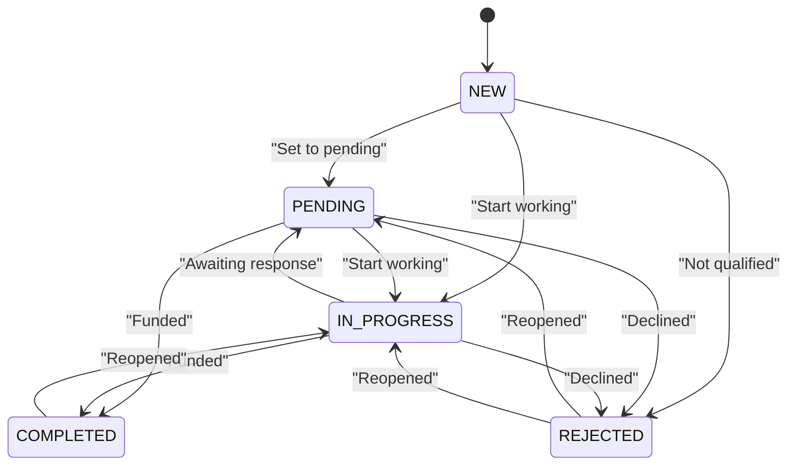
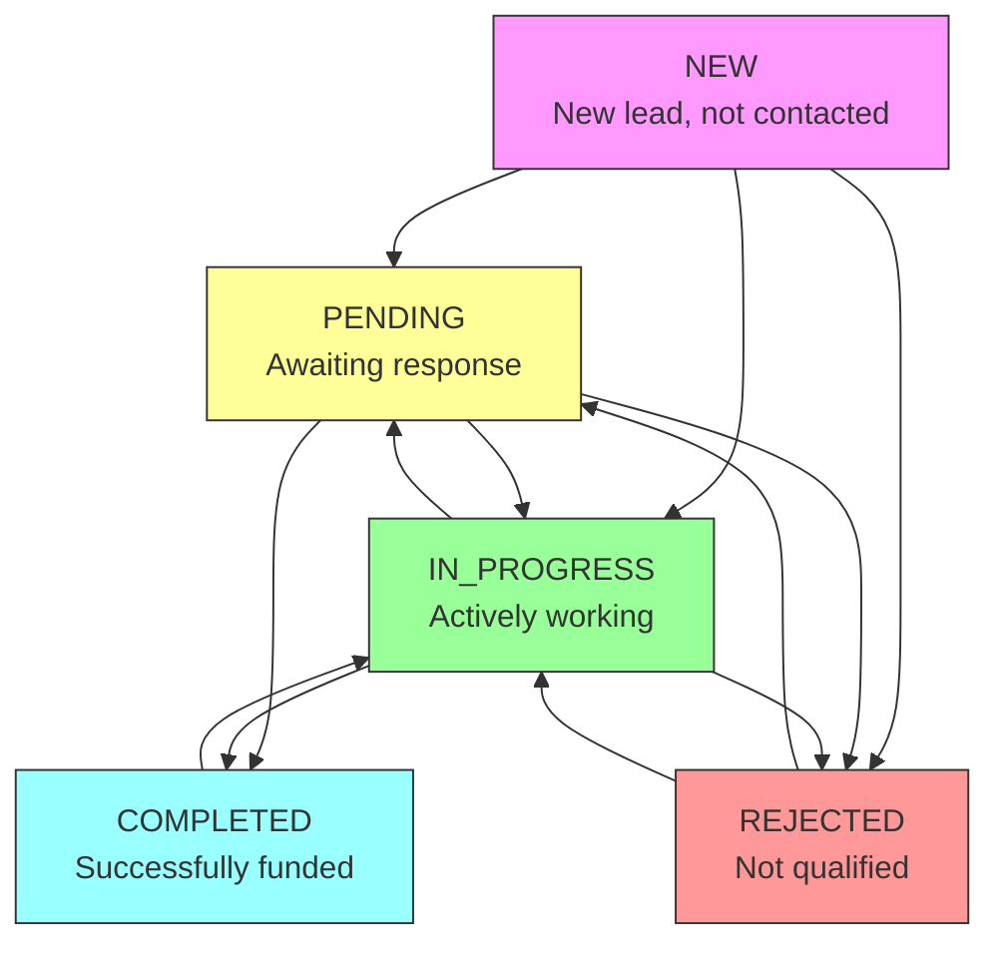
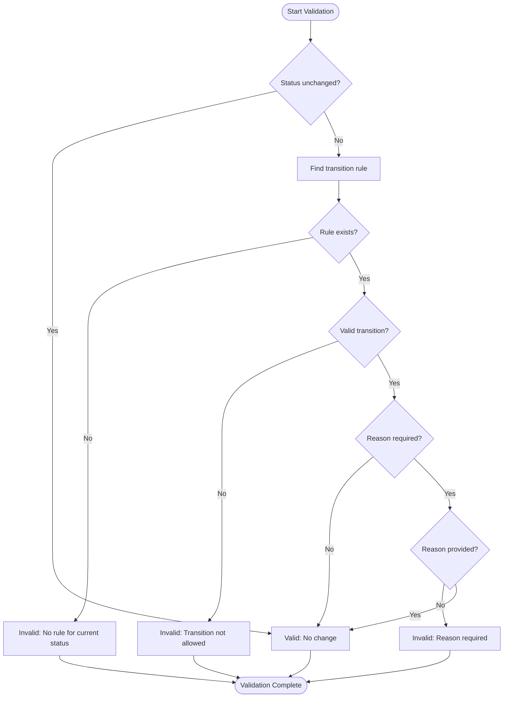
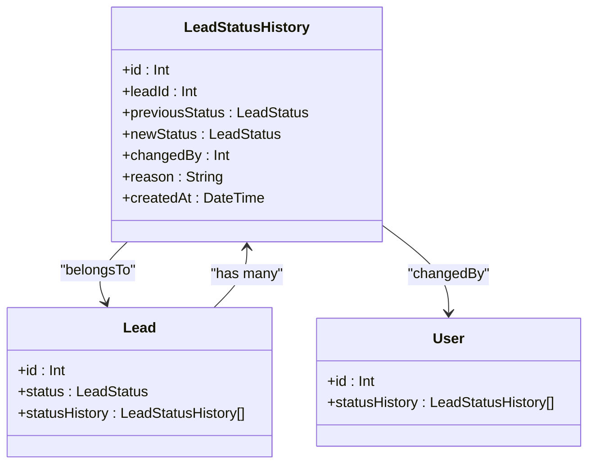
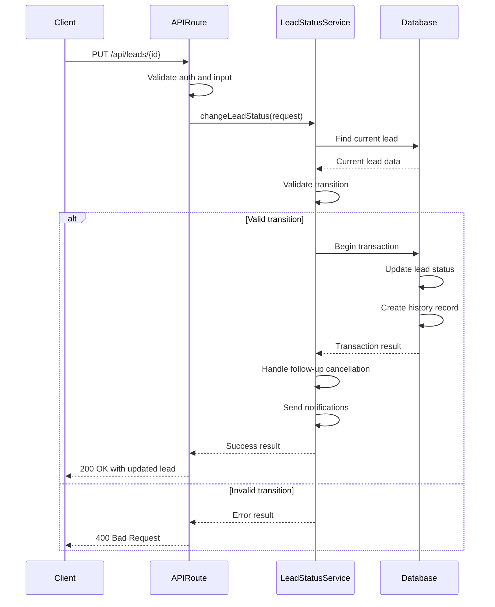
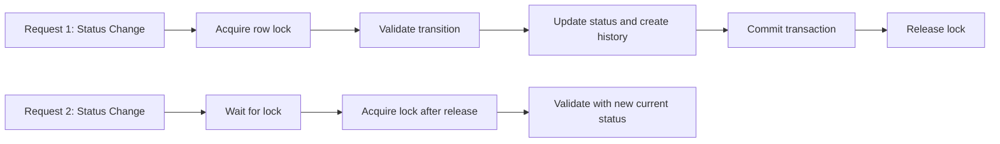
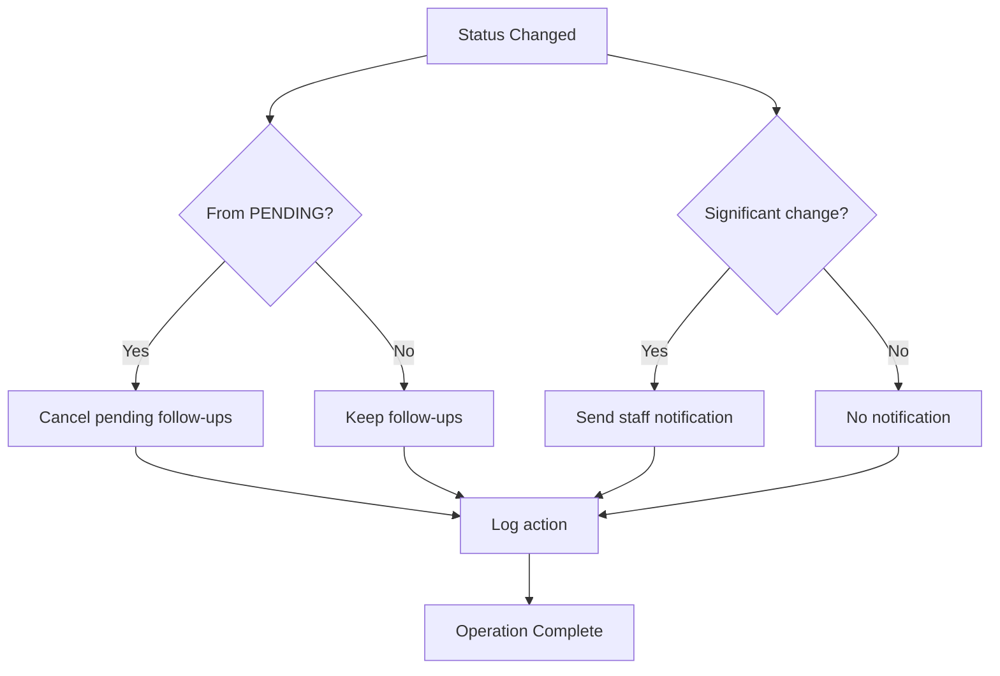
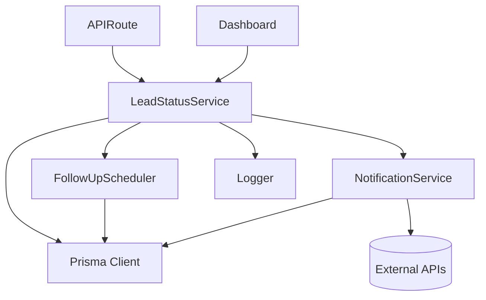
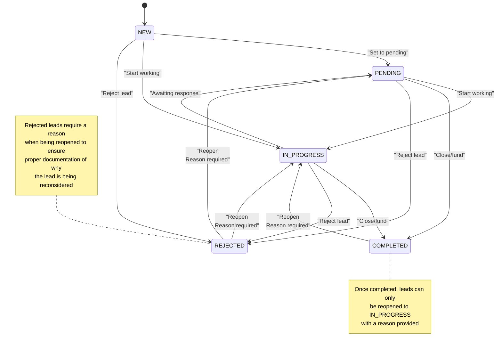
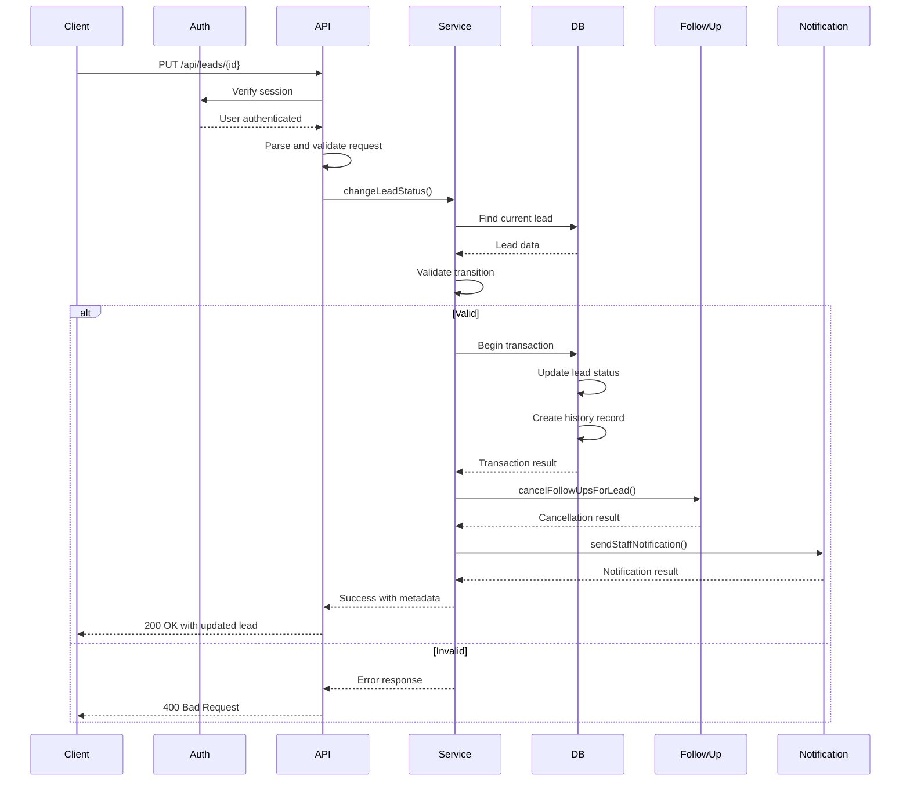

# Lead Status Service

<cite>
**Referenced Files in This Document**   
- [LeadStatusService.ts](file://src/services/LeadStatusService.ts)
- [schema.prisma](file://prisma/schema.prisma)
- [route.ts](file://src/app/api/leads/[id]/route.ts)
- [route.ts](file://src/app/api/leads/[id]/status/route.ts)
- [migration.sql](file://prisma/migrations/20250730060039_add_lead_status_history/migration.sql)
- [FollowUpScheduler.ts](file://src/services/FollowUpScheduler.ts)
- [NotificationService.ts](file://src/services/NotificationService.ts)
</cite>

## Table of Contents
1. [Introduction](#introduction)
2. [Core Functionality](#core-functionality)
3. [Status Transition Rules](#status-transition-rules)
4. [Validation Logic](#validation-logic)
5. [Audit Trail and History](#audit-trail-and-history)
6. [Integration with API Routes](#integration-with-api-routes)
7. [Race Condition Prevention](#race-condition-prevention)
8. [Automated Actions and Notifications](#automated-actions-and-notifications)
9. [Service Dependencies](#service-dependencies)
10. [State Transition Diagram](#state-transition-diagram)
11. [API Workflow](#api-workflow)

## Introduction
The Lead Status Service is a critical component in the lead management system that governs the lifecycle of leads through various status transitions. This service ensures that all status changes follow business rules, maintains a complete audit trail, and triggers appropriate automated actions. It serves as the central authority for lead state management, providing validation, logging, and integration with other system components.

**Section sources**
- [LeadStatusService.ts](file://src/services/LeadStatusService.ts#L1-L50)

## Core Functionality
The LeadStatusService class provides comprehensive management of lead status transitions, enforcing business rules and maintaining data integrity throughout the lead lifecycle. The service handles status changes through the `changeLeadStatus` method, which orchestrates validation, database updates, audit logging, and post-transition actions.

The service defines five possible lead statuses:
- **NEW**: New lead, not yet contacted
- **PENDING**: Awaiting prospect response or action
- **IN_PROGRESS**: Actively working with prospect
- **COMPLETED**: Successfully closed/funded
- **REJECTED**: Lead declined or not qualified

These statuses represent the complete lifecycle of a lead from initial capture to final disposition.

**Diagram sources**
- [LeadStatusService.ts](file://src/services/LeadStatusService.ts#L30-L110)
- [schema.prisma](file://prisma/schema.prisma#L200-L205)

**Section sources**
- [LeadStatusService.ts](file://src/services/LeadStatusService.ts#L1-L50)

## Status Transition Rules
The service enforces strict rules for valid status transitions, defined in the `statusTransitions` array. These rules ensure that leads progress through the system in a logical and business-appropriate manner.

The defined transition rules are:

**Transition Rules**
- From **NEW**: Can transition to PENDING, IN_PROGRESS, or REJECTED
- From **PENDING**: Can transition to IN_PROGRESS, COMPLETED, or REJECTED
- From **IN_PROGRESS**: Can transition to COMPLETED, REJECTED, or PENDING
- From **COMPLETED**: Can only transition back to IN_PROGRESS (with reason required)
- From **REJECTED**: Can transition to PENDING or IN_PROGRESS (with reason required)

The rules prevent invalid transitions such as moving directly from NEW to COMPLETED or from COMPLETED to REJECTED.

**Diagram sources**
- [LeadStatusService.ts](file://src/services/LeadStatusService.ts#L30-L110)

**Section sources**
- [LeadStatusService.ts](file://src/services/LeadStatusService.ts#L30-L110)

## Validation Logic
The service implements comprehensive validation through the `validateStatusTransition` method, which checks three key aspects of any status change:

1. **Transition Validity**: Verifies that the requested transition is allowed according to the defined rules
2. **Reason Requirements**: Ensures that a reason is provided when reopening completed or rejected leads
3. **Current State**: Validates against the lead's current status

The validation process follows these steps:
1. If the status is not changing, validation passes
2. Find the transition rule for the current status
3. Check if the new status is in the allowed list
4. Verify that a reason is provided when required
5. Return validation result with appropriate error message if validation fails

**Diagram sources**
- [LeadStatusService.ts](file://src/services/LeadStatusService.ts#L60-L110)

**Section sources**
- [LeadStatusService.ts](file://src/services/LeadStatusService.ts#L60-L110)

## Audit Trail and History
The service maintains a complete audit trail of all status changes through the LeadStatusHistory model. Each status transition creates a historical record that captures:

**Audit Record Fields**
- **leadId**: Reference to the affected lead
- **previousStatus**: The status before the change
- **newStatus**: The status after the change
- **changedBy**: User ID who made the change
- **reason**: Optional reason for the change (required for certain transitions)
- **createdAt**: Timestamp of the change

The audit trail is implemented using Prisma transactions to ensure data consistency. The status update and history record creation occur within a single database transaction, preventing partial updates that could compromise data integrity.

**Diagram sources**
- [schema.prisma](file://prisma/schema.prisma#L159-L174)
- [LeadStatusService.ts](file://src/services/LeadStatusService.ts#L127-L178)

**Section sources**
- [schema.prisma](file://prisma/schema.prisma#L159-L174)
- [LeadStatusService.ts](file://src/services/LeadStatusService.ts#L127-L178)

## Integration with API Routes
The LeadStatusService is integrated with the application's API routes, specifically through the leads/[id] endpoint. The PUT route handles status changes by delegating to the service's `changeLeadStatus` method.

When a status update is requested:
1. The API route validates authentication and input parameters
2. It calls `leadStatusService.changeLeadStatus()` with the request details
3. If successful, it returns the updated lead data along with metadata about follow-up cancellations and notifications
4. If validation fails, it returns appropriate error responses

The service is also accessible through a dedicated status endpoint (leads/[id]/status) that provides current status, history, and available transitions without requiring a status change.

**Diagram sources**
- [route.ts](file://src/app/api/leads/[id]/route.ts#L121-L172)
- [LeadStatusService.ts](file://src/services/LeadStatusService.ts#L112-L125)

**Section sources**
- [route.ts](file://src/app/api/leads/[id]/route.ts#L121-L172)

## Race Condition Prevention
The service prevents race conditions during concurrent updates through several mechanisms:

1. **Database Transactions**: All status changes occur within Prisma transactions, ensuring atomicity
2. **Row Locking**: Prisma's underlying database operations use row-level locking to prevent concurrent modifications
3. **Validation Before Update**: The current lead state is retrieved and validated before any update is attempted

The transactional approach ensures that either all operations (status update and history creation) succeed together, or they all fail, maintaining data consistency even under high concurrency.

**Section sources**
- [LeadStatusService.ts](file://src/services/LeadStatusService.ts#L127-L178)

## Automated Actions and Notifications
The service triggers automated actions based on status changes:

**Follow-up Cancellation**: When a lead transitions from PENDING to any other status, all pending follow-ups are automatically cancelled. This prevents unnecessary communications to leads that are no longer in the follow-up queue.

**Staff Notifications**: The service sends email notifications to admin users for significant status changes, including:
- New leads moved to IN_PROGRESS
- Pending leads moved to IN_PROGRESS or COMPLETED
- Completed or rejected leads reopened
- Any status change requiring a reason

The notification system includes error handling to ensure that notification failures do not prevent successful status changes.

**Section sources**
- [LeadStatusService.ts](file://src/services/LeadStatusService.ts#L178-L250)
- [FollowUpScheduler.ts](file://src/services/FollowUpScheduler.ts#L150-L180)

## Service Dependencies
The LeadStatusService depends on several other services and components:

**Dependencies**
- **Prisma Client**: For database operations and transactions
- **FollowUpScheduler**: To cancel follow-ups when status changes
- **NotificationService**: To send staff notifications about status changes
- **Logger**: For operation logging and error tracking

The service follows the singleton pattern, with a single exported instance (`leadStatusService`) that can be imported and used throughout the application.

**Section sources**
- [LeadStatusService.ts](file://src/services/LeadStatusService.ts#L1-L25)

## State Transition Diagram
The complete state transition model for leads shows all valid paths through the system:

**Diagram sources**
- [LeadStatusService.ts](file://src/services/LeadStatusService.ts#L30-L110)

## API Workflow
The complete workflow for handling a lead status change through the API:

**Diagram sources**
- [route.ts](file://src/app/api/leads/[id]/route.ts#L121-L172)
- [LeadStatusService.ts](file://src/services/LeadStatusService.ts#L112-L250)