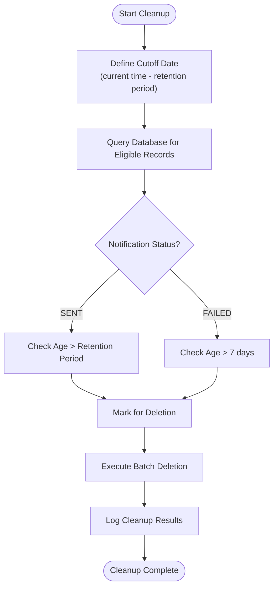
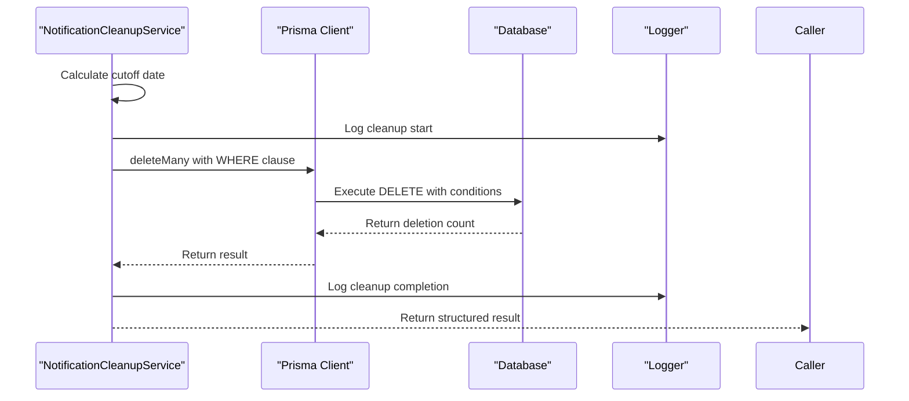
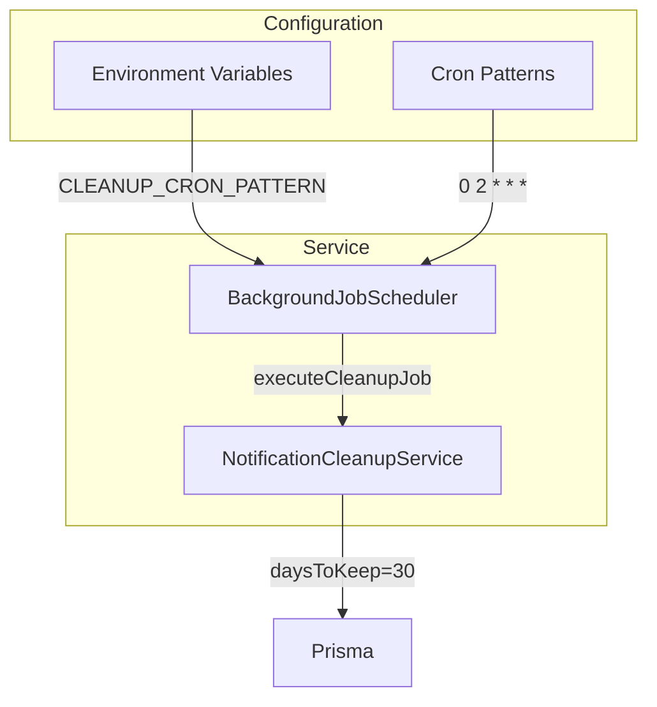
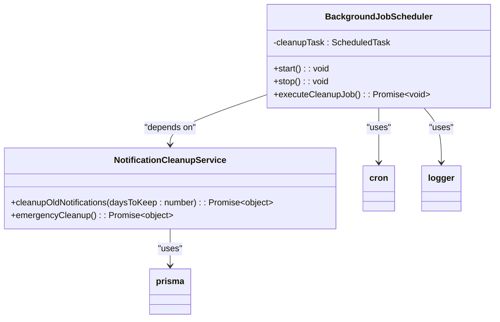
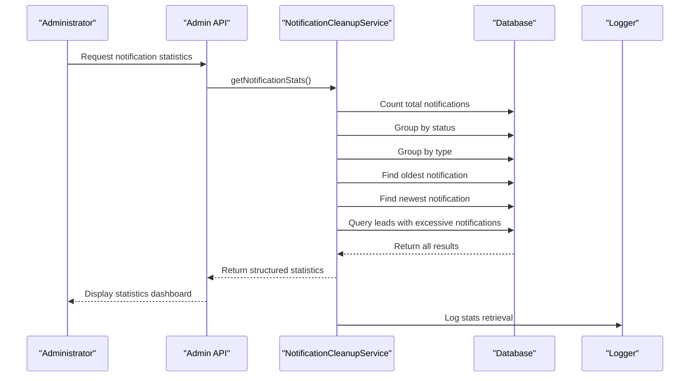
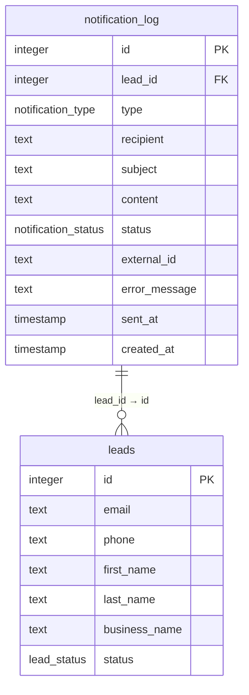
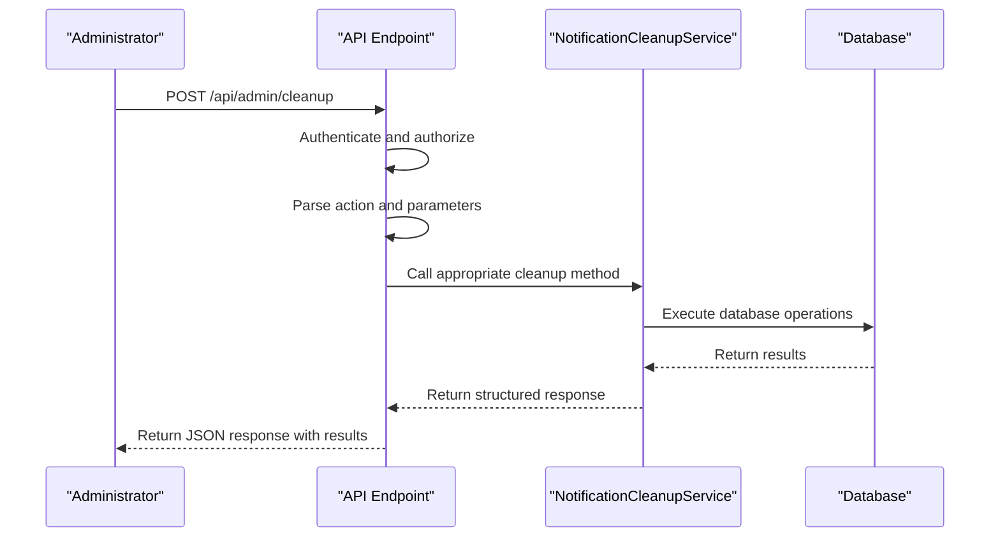

# Notification Cleanup Service

<cite>
**Referenced Files in This Document**   
- [NotificationCleanupService.ts](file://src/services/NotificationCleanupService.ts)
- [BackgroundJobScheduler.ts](file://src/services/BackgroundJobScheduler.ts)
- [SystemSettingsService.ts](file://src/services/SystemSettingsService.ts)
- [run_notification_log_analysis.sh](file://scripts/analysis/run_notification_log_analysis.sh)
- [migration.sql](file://prisma/migrations/20240101000000_init/migration.sql)
- [add_notification_log_indexes/migration.sql](file://prisma/migrations/20250812120000_add_notification_log_indexes/migration.sql)
- [route.ts](file://src/app/api/admin/cleanup/route.ts)
</cite>

## Table of Contents
1. [Introduction](#introduction)
2. [Core Functionality](#core-functionality)
3. [Cleanup Criteria and Retention Policies](#cleanup-criteria-and-retention-policies)
4. [Batch Processing and Transaction Management](#batch-processing-and-transaction-management)
5. [Configuration and Execution Frequency](#configuration-and-execution-frequency)
6. [Integration with Background Job System](#integration-with-background-job-system)
7. [Emergency and Lead-Specific Cleanup](#emergency-and-lead-specific-cleanup)
8. [Monitoring and Audit Logging](#monitoring-and-audit-logging)
9. [Database Schema and Performance](#database-schema-and-performance)
10. [API Endpoints and Administrative Interface](#api-endpoints-and-administrative-interface)

## Introduction
The Notification Cleanup Service is a critical component of the system responsible for maintaining database performance and storage efficiency by periodically removing outdated notification records. This service prevents database bloat by enforcing retention policies on notification logs, ensuring optimal system performance while preserving important diagnostic information. The service operates through scheduled background jobs and provides multiple cleanup strategies for different scenarios, including routine maintenance, emergency cleanup, and lead-specific cleanup operations.

## Core Functionality

The NotificationCleanupService class provides comprehensive functionality for managing notification log lifecycle. It implements several methods to handle different cleanup scenarios while maintaining data consistency and providing detailed logging for audit purposes.

```mermaid
classDiagram
class NotificationCleanupService {
+cleanupOldNotifications(daysToKeep : number) : Promise~{deletedCount : number, success : boolean, error? : string}~
+cleanupExcessiveNotificationsForLead(leadId : number, maxNotificationsToKeep : number) : Promise~{deletedCount : number, success : boolean, error? : string}~
+getNotificationStats() : Promise~{totalNotifications : number, notificationsByStatus : Record~string, number~, notificationsByType : Record~string, number~, oldestNotification? : Date, newestNotification? : Date, leadsWithExcessiveNotifications : {leadId : number, email : string | null, notificationCount : number}[]}~
+emergencyCleanup() : Promise~{deletedCount : number, success : boolean, error? : string}~
}
class prisma {
+notificationLog.deleteMany(where : object) : Promise~{count : number}~
+notificationLog.count() : Promise~number~
+notificationLog.groupBy(by : string[], _count : true) : Promise~{status : string, _count : number}[] | {type : string, _count : number}[]~
+notificationLog.findFirst(orderBy : object, select : object) : Promise~{createdAt : Date} | null~
+$queryRaw~T~(query : string) : Promise~T~
}
class logger {
+info(message : string, context? : object) : void
+error(message : string, context? : object) : void
+backgroundJob(message : string, jobType : string, details? : object) : void
}
NotificationCleanupService --> prisma : "uses"
NotificationCleanupService --> logger : "uses"
```

**Diagram sources**
- [NotificationCleanupService.ts](file://src/services/NotificationCleanupService.ts)

**Section sources**
- [NotificationCleanupService.ts](file://src/services/NotificationCleanupService.ts)

## Cleanup Criteria and Retention Policies

The service implements sophisticated retention policies to ensure that valuable diagnostic information is preserved while removing obsolete records. The primary cleanup method, `cleanupOldNotifications`, removes notification records based on age and status, with different retention periods for different notification types.

The cleanup criteria are as follows:
- **Sent notifications**: Retained for the configured period (default: 30 days)
- **Failed notifications**: Retained for a shorter period (7 days) to aid in debugging while preventing accumulation of error records

This differential retention strategy balances the need for debugging information with storage efficiency. The service uses Prisma's query builder to construct a compound WHERE clause that implements these policies in a single database operation.



**Diagram sources**
- [NotificationCleanupService.ts](file://src/services/NotificationCleanupService.ts#L10-L38)

**Section sources**
- [NotificationCleanupService.ts](file://src/services/NotificationCleanupService.ts#L10-L38)

## Batch Processing and Transaction Management

The NotificationCleanupService employs efficient batch processing to handle large volumes of notification records without impacting system performance. All cleanup operations are performed as atomic database transactions, ensuring data consistency even in the event of failures.

The service leverages Prisma's `deleteMany` operation, which performs batch deletion in a single database transaction. This approach minimizes database round-trips and ensures that either all eligible records are removed or none are, maintaining data integrity.

Error handling is implemented at the method level, with comprehensive try-catch blocks that capture and log any exceptions that occur during the cleanup process. The service returns structured response objects that include success status, deletion count, and error information when applicable.



**Diagram sources**
- [NotificationCleanupService.ts](file://src/services/NotificationCleanupService.ts)

**Section sources**
- [NotificationCleanupService.ts](file://src/services/NotificationCleanupService.ts)

## Configuration and Execution Frequency

While the NotificationCleanupService itself does not directly manage configuration, it integrates with the system's configuration framework through the BackgroundJobScheduler. The retention period is configurable through method parameters, with a default value of 30 days for routine cleanup operations.

The execution frequency is managed by the background job scheduling system, which runs the cleanup operation daily at 2:00 AM. This schedule is configurable through environment variables, allowing administrators to adjust the timing based on system load patterns and operational requirements.



**Diagram sources**
- [BackgroundJobScheduler.ts](file://src/services/BackgroundJobScheduler.ts#L150-L180)
- [NotificationCleanupService.ts](file://src/services/NotificationCleanupService.ts#L10-L15)

**Section sources**
- [BackgroundJobScheduler.ts](file://src/services/BackgroundJobScheduler.ts#L150-L180)
- [NotificationCleanupService.ts](file://src/services/NotificationCleanupService.ts#L10-L15)

## Integration with Background Job System

The NotificationCleanupService is tightly integrated with the system's background job scheduling infrastructure. The BackgroundJobScheduler class is responsible for invoking the cleanup service according to a predefined schedule, ensuring that maintenance operations occur regularly without manual intervention.

The integration follows a singleton pattern, with both services exposing singleton instances that can be imported and used throughout the application. The scheduler calls the cleanup service's methods as part of its scheduled tasks, providing a clean separation of concerns between job scheduling and cleanup logic.



**Diagram sources**
- [BackgroundJobScheduler.ts](file://src/services/BackgroundJobScheduler.ts)
- [NotificationCleanupService.ts](file://src/services/NotificationCleanupService.ts)

**Section sources**
- [BackgroundJobScheduler.ts](file://src/services/BackgroundJobScheduler.ts)
- [NotificationCleanupService.ts](file://src/services/NotificationCleanupService.ts)

## Emergency and Lead-Specific Cleanup

In addition to routine maintenance, the service provides specialized methods for emergency and lead-specific cleanup scenarios. These methods address specific operational needs and provide administrators with tools to manage exceptional situations.

The `emergencyCleanup` method is designed for crisis situations where the database has become severely bloated. It removes all notification records older than 7 days, providing a rapid reduction in database size.

The `cleanupExcessiveNotificationsForLead` method addresses the scenario where a specific lead has accumulated an unusually large number of notifications, potentially due to system errors or unusual user behavior. This method preserves the most recent notifications (default: 10) while removing older ones, maintaining a record of recent activity while freeing up storage.

```mermaid
flowchart TD
subgraph Emergency
StartEmergency["emergencyCleanup()"]
SetShortCutoff["Set cutoff to 7 days ago"]
DeleteAllOld["Delete all records older than cutoff"]
LogEmergency["Log emergency cleanup results"]
end
subgraph LeadSpecific
StartLead["cleanupExcessiveNotificationsForLead()"]
FindRecent["Find most recent N notifications"]
IdentifyIds["Identify IDs to keep"]
DeleteOthers["Delete all other notifications for lead"]
LogLead["Log lead-specific cleanup results"]
end
StartEmergency --> SetShortCutoff --> DeleteAllOld --> LogEmergency
StartLead --> FindRecent --> IdentifyIds --> DeleteOthers --> LogLead
```



**Diagram sources**
- [NotificationCleanupService.ts](file://src/services/NotificationCleanupService.ts#L140-L230)

**Section sources**
- [NotificationCleanupService.ts](file://src/services/NotificationCleanupService.ts#L140-L230)

## Monitoring and Audit Logging

The service includes comprehensive monitoring and audit logging capabilities to ensure transparency and facilitate troubleshooting. All cleanup operations are logged with detailed information, including the number of records deleted and the criteria used.

The `getNotificationStats` method provides a comprehensive overview of the notification system's state, including:
- Total notification count
- Distribution by status and type
- Temporal range of notifications
- Identification of leads with excessive notifications

This monitoring functionality enables administrators to assess system health, identify potential issues, and verify the effectiveness of cleanup operations.



**Diagram sources**
- [NotificationCleanupService.ts](file://src/services/NotificationCleanupService.ts#L90-L139)

**Section sources**
- [NotificationCleanupService.ts](file://src/services/NotificationCleanupService.ts#L90-L139)

## Database Schema and Performance

The notification cleanup service operates on the `notification_log` table, which is optimized for both write performance and cleanup operations. The database schema includes appropriate indexes to support the cleanup queries and ensure efficient record deletion.

The table structure includes fields for tracking notification metadata, status, and relationships to leads. The cleanup operations leverage the `created_at` timestamp field, which is indexed to support efficient range queries.



**Diagram sources**
- [migration.sql](file://prisma/migrations/20240101000000_init/migration.sql)
- [add_notification_log_indexes/migration.sql](file://prisma/migrations/20250812120000_add_notification_log_indexes/migration.sql)

**Section sources**
- [migration.sql](file://prisma/migrations/20240101000000_init/migration.sql)
- [add_notification_log_indexes/migration.sql](file://prisma/migrations/20250812120000_add_notification_log_indexes/migration.sql)

## API Endpoints and Administrative Interface

The cleanup service is accessible through administrative API endpoints, allowing both automated and manual invocation. The `/api/admin/cleanup` route provides a secure interface for triggering various cleanup operations, with proper authentication and authorization controls.

The API supports multiple cleanup actions:
- `cleanup-notifications`: Routine cleanup with configurable retention period
- `emergency-cleanup`: Immediate cleanup of all records older than 7 days
- `cleanup-lead-notifications`: Lead-specific cleanup with configurable retention

These endpoints are protected by role-based access control, ensuring that only administrators can initiate cleanup operations.



**Diagram sources**
- [route.ts](file://src/app/api/admin/cleanup/route.ts)

**Section sources**
- [route.ts](file://src/app/api/admin/cleanup/route.ts)