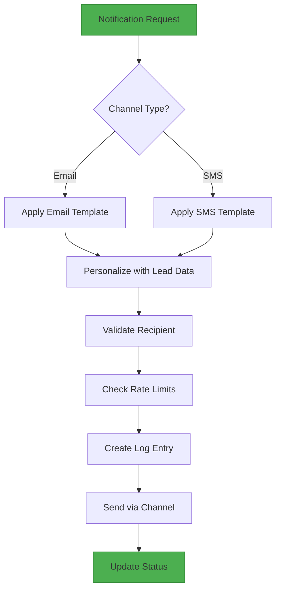
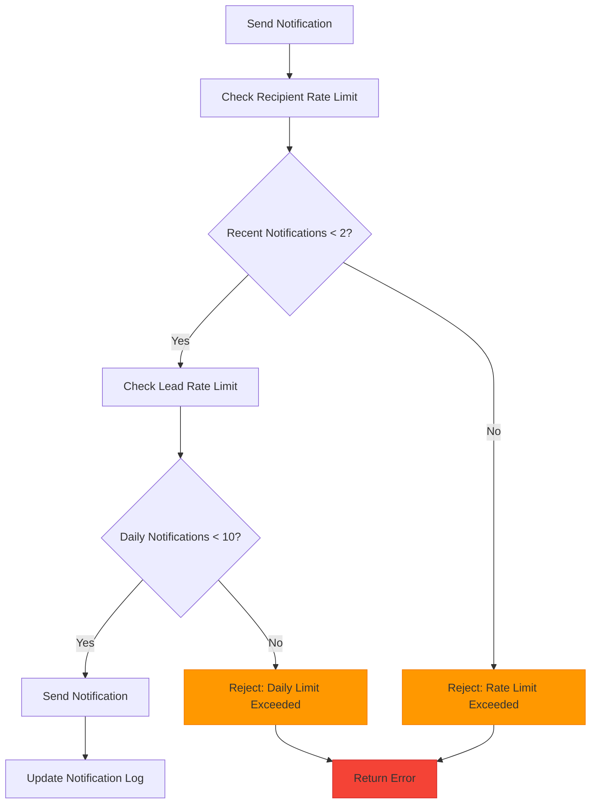
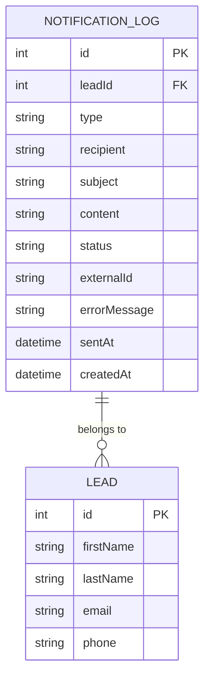
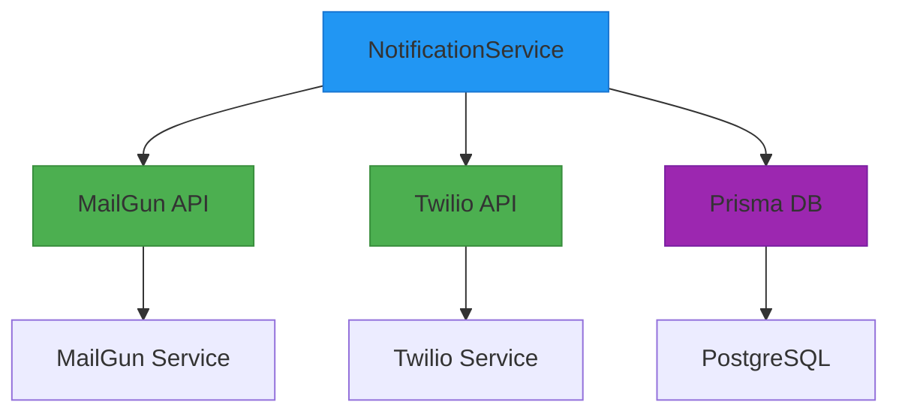
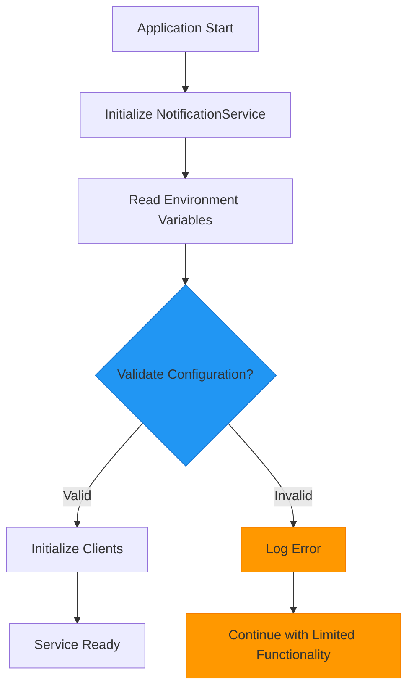
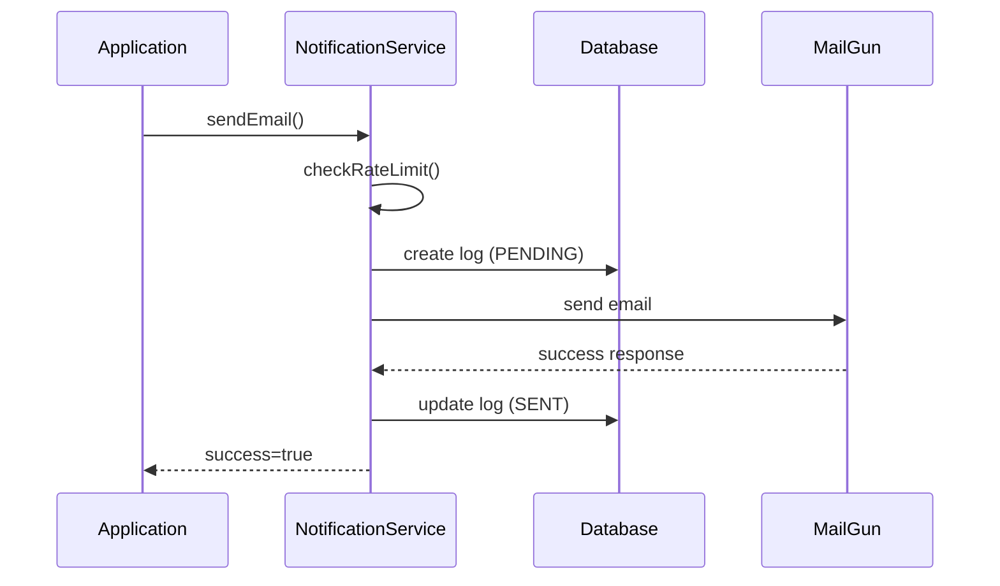
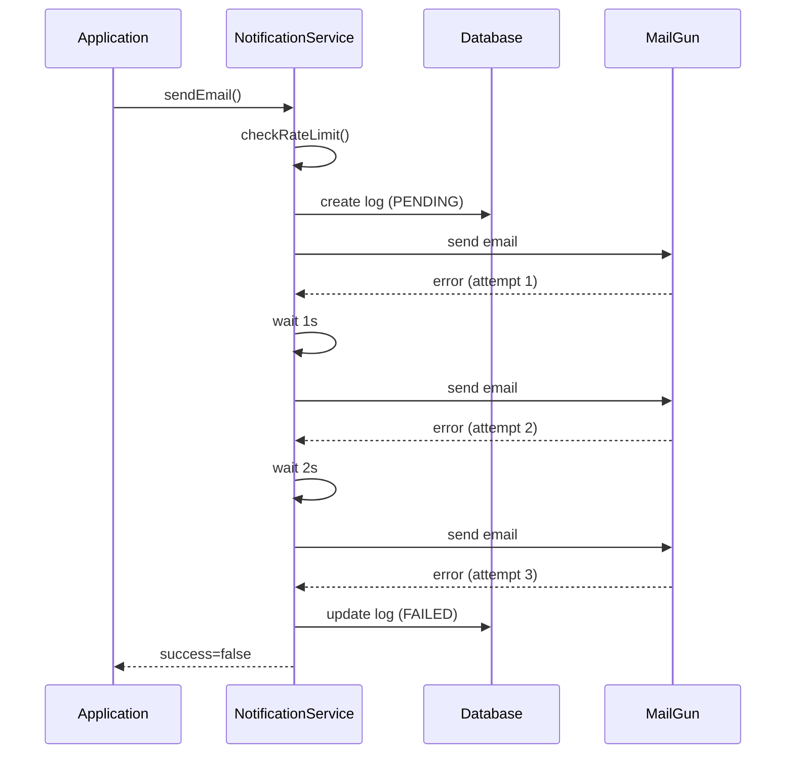
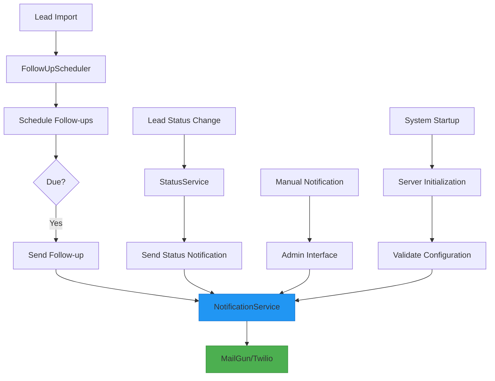

# Notification Service

<cite>
**Referenced Files in This Document**   
- [NotificationService.ts](file://src/services/NotificationService.ts)
- [schema.prisma](file://prisma/schema.prisma)
- [SystemSettingsService.ts](file://src/services/SystemSettingsService.ts)
- [FollowUpScheduler.ts](file://src/services/FollowUpScheduler.ts)
- [notifications.ts](file://src/lib/notifications.ts)
- [send-followups/route.ts](file://src/app/api/cron/send-followups/route.ts)
- [admin/notifications/page.tsx](file://src/app/admin/notifications/page.tsx)
</cite>

## Table of Contents
1. [Introduction](#introduction)
2. [Core Architecture](#core-architecture)
3. [Message Templating and Delivery Routing](#message-templating-and-delivery-routing)
4. [Retry Mechanism and Error Handling](#retry-mechanism-and-error-handling)
5. [Rate Limiting Implementation](#rate-limiting-implementation)
6. [Notification Logging and Status Tracking](#notification-logging-and-status-tracking)
7. [External API Integration](#external-api-integration)
8. [Security and Credential Management](#security-and-credential-management)
9. [Delivery Scenarios and Troubleshooting](#delivery-scenarios-and-troubleshooting)
10. [System Integration and Workflow](#system-integration-and-workflow)

## Introduction
The Notification Service is a central component responsible for managing all outbound communications in the merchant funding application system. It handles both initial application notifications and scheduled follow-ups through multiple channels, primarily email via MailGun and SMS via Twilio. The service provides a unified interface for sending notifications while implementing robust features such as message templating, delivery routing, retry mechanisms, rate limiting, and comprehensive logging. This documentation provides a detailed analysis of the service's architecture, functionality, and integration points within the overall system.

## Core Architecture
The Notification Service is implemented as a singleton class that encapsulates the logic for sending notifications through different channels. It follows a layered architecture with clear separation of concerns between configuration management, client initialization, message processing, and error handling.

```mermaid
classDiagram
class NotificationService {
-twilioClient : Twilio | null
-mailgunClient : any | null
-config : NotificationConfig
+sendEmail(notification : EmailNotification) : Promise~NotificationResult~
+sendSMS(notification : SMSNotification) : Promise~NotificationResult~
-sendEmailInternal(notification : EmailNotification) : Promise~NotificationResult~
-sendSMSInternal(notification : SMSNotification) : Promise~NotificationResult~
-executeWithRetry(fn : Function, operationType : string) : Promise~T~
-checkRateLimit(recipient : string, type : 'EMAIL' | 'SMS', leadId? : number) : Promise~{ allowed : boolean; reason? : string }~
-initializeClients() : void
}
class NotificationConfig {
+twilio : TwilioConfig
+mailgun : MailgunConfig
+retryConfig : RetryConfig
}
class TwilioConfig {
+accountSid : string
+authToken : string
+phoneNumber : string
}
class MailgunConfig {
+apiKey : string
+domain : string
+fromEmail : string
}
class RetryConfig {
+maxRetries : number
+baseDelay : number
+maxDelay : number
}
class EmailNotification {
+to : string
+subject : string
+text : string
+html? : string
+leadId? : number
}
class SMSNotification {
+to : string
+message : string
+leadId? : number
}
class NotificationResult {
+success : boolean
+externalId? : string
+error? : string
}
NotificationService --> NotificationConfig : "has"
NotificationService --> EmailNotification : "sends"
NotificationService --> SMSNotification : "sends"
NotificationService --> NotificationResult : "returns"
```

**Diagram sources**
- [NotificationService.ts](file://src/services/NotificationService.ts#L47-L468)

**Section sources**
- [NotificationService.ts](file://src/services/NotificationService.ts#L1-L472)

## Message Templating and Delivery Routing
The Notification Service implements a flexible message templating system that supports both email and SMS channels. The service provides a unified interface for sending notifications while handling the specific requirements of each channel.

The message templating system is implemented through helper functions in the `notifications.ts` library, which provide pre-configured templates for common notification scenarios such as initial intake notifications and follow-up reminders. These templates include both plain text and HTML versions for emails, with responsive design elements and clear call-to-action buttons.



The delivery routing logic determines which channels to use based on the availability of contact information. For example, if a lead has both email and phone number, the system will attempt to send notifications through both channels. The routing is handled by higher-level services like `FollowUpScheduler` which coordinate the delivery across multiple channels.

**Section sources**
- [NotificationService.ts](file://src/services/NotificationService.ts#L100-L150)
- [notifications.ts](file://src/lib/notifications.ts#L17-L220)

## Retry Mechanism and Error Handling
The Notification Service implements a sophisticated retry mechanism with exponential backoff to handle transient failures when communicating with external services. This ensures reliable delivery even during temporary service outages or network issues.

```mermaid
sequenceDiagram
participant Client
participant Service as NotificationService
participant Mailgun
participant Twilio
participant DB as Prisma
Client->>Service : sendEmail()
Service->>Service : checkRateLimit()
Service->>DB : create notificationLog
Service->>Service : executeWithRetry()
loop Retry Attempts
Service->>Mailgun : sendEmailInternal()
alt Success
Mailgun-->>Service : Response
Service->>DB : update status=SNT
Service-->>Client : success=true
break
else Failure
Mailgun-->>Service : Error
Service->>Service : calculateDelay()
Service->>Service : sleep(delay)
end
end
alt All retries failed
Service->>DB : update status=FAILED
Service-->>Client : success=false
end
```

**Diagram sources**
- [NotificationService.ts](file://src/services/NotificationService.ts#L300-L350)

The retry mechanism is implemented in the `executeWithRetry` method, which uses exponential backoff with a configurable base delay and maximum delay. The retry configuration can be dynamically adjusted based on system settings, allowing administrators to tune the retry behavior without code changes.

Error classification distinguishes between transient and permanent failures. Transient failures (such as network timeouts or rate limit errors) trigger the retry mechanism, while permanent failures (such as invalid recipient addresses) result in immediate failure without retries. The service logs detailed error information for troubleshooting and monitoring purposes.

**Section sources**
- [NotificationService.ts](file://src/services/NotificationService.ts#L300-L350)

## Rate Limiting Implementation
The Notification Service implements a comprehensive rate limiting system to prevent spam and ensure responsible use of communication channels. The rate limiting operates at two levels: per recipient and per lead.



The rate limiting rules are:
- Maximum of 2 notifications per hour per recipient
- Maximum of 10 notifications per day per lead

These limits are enforced by querying the `notification_log` table to count recent successful deliveries. The service checks for notifications sent in the last hour for the recipient and notifications sent in the last 24 hours for the lead. If either limit is exceeded, the notification is rejected with an appropriate error message.

The rate limiting implementation includes error handling to ensure that failures in the rate limit check do not prevent notification delivery. If the database query fails, the service logs the error but allows the notification to proceed, following a fail-safe approach.

**Section sources**
- [NotificationService.ts](file://src/services/NotificationService.ts#L350-L400)

## Notification Logging and Status Tracking
The Notification Service maintains comprehensive logs of all notification attempts through the `NotificationLog` model. This provides full auditability and enables monitoring of delivery success rates.



**Diagram sources**
- [schema.prisma](file://prisma/schema.prisma#L150-L170)

The `NotificationLog` model tracks key information including:
- **leadId**: Reference to the associated lead
- **type**: Notification type (EMAIL or SMS)
- **recipient**: Destination address/phone number
- **subject**: Email subject line
- **content**: Message content
- **status**: Current status (PENDING, SENT, FAILED)
- **externalId**: Message ID from external service
- **errorMessage**: Error details if delivery failed
- **sentAt**: Timestamp when successfully sent
- **createdAt**: Timestamp when log entry created

The service updates the log entry status based on the delivery outcome: PENDING when created, SENT when successfully delivered, and FAILED when delivery attempts are exhausted. This status tracking enables monitoring dashboards and troubleshooting of delivery issues.

**Section sources**
- [schema.prisma](file://prisma/schema.prisma#L150-L170)
- [NotificationService.ts](file://src/services/NotificationService.ts#L120-L130)

## External API Integration
The Notification Service integrates with external APIs for email and SMS delivery, specifically MailGun for email and Twilio for SMS. The integration is designed to be resilient and handle various failure scenarios.



**Diagram sources**
- [NotificationService.ts](file://src/services/NotificationService.ts#L1-L50)

The service initializes clients for both external services lazily, only when needed. Credentials are securely stored in environment variables and never hard-coded. The service validates the configuration on startup to ensure all required credentials are present.

When handling API rate limits or service outages, the service implements several strategies:
- Exponential backoff retry with configurable delays
- Graceful degradation when one service is unavailable
- Comprehensive error logging for monitoring
- Fail-safe operation when rate limit checks fail

The integration with MailGun uses the official Mailgun.js library with form-data encoding, while the Twilio integration uses the official Twilio Node.js library. Both integrations follow the respective API documentation and best practices.

**Section sources**
- [NotificationService.ts](file://src/services/NotificationService.ts#L1-L50)

## Security and Credential Management
The Notification Service implements secure credential management practices to protect sensitive API keys and account information.

Credentials for external services are stored in environment variables rather than in the codebase:
- MailGun: MAILGUN_API_KEY, MAILGUN_DOMAIN, MAILGUN_FROM_EMAIL
- Twilio: TWILIO_ACCOUNT_SID, TWILIO_AUTH_TOKEN, TWILIO_PHONE_NUMBER

The service validates the presence of required environment variables on startup through the `validateConfiguration` method. If SMS notifications are enabled in system settings, the service checks for the required Twilio credentials. Similarly, it validates MailGun credentials regardless of email notification settings.



The service follows the principle of least privilege by only initializing clients when needed and validating credentials before use. It also provides a configuration validation endpoint that can be used to verify the service is properly configured.

**Section sources**
- [NotificationService.ts](file://src/services/NotificationService.ts#L400-L450)

## Delivery Scenarios and Troubleshooting
The Notification Service handles various delivery scenarios, including successful deliveries, transient failures, and permanent failures. Understanding these scenarios is essential for troubleshooting and monitoring.

### Successful Delivery Scenario


### Failed Delivery Scenario


**Diagram sources**
- [NotificationService.ts](file://src/services/NotificationService.ts#L100-L150)

Common troubleshooting issues and solutions:

**Issue: Notifications not being sent**
- **Check**: Verify environment variables are set correctly
- **Check**: Ensure notification settings are enabled in the admin panel
- **Check**: Verify the Notification Service is initialized properly

**Issue: High failure rates**
- **Check**: Monitor rate limit errors in the notification logs
- **Check**: Verify external service status (MailGun, Twilio)
- **Check**: Review retry configuration and adjust if necessary

**Issue: Delayed deliveries**
- **Check**: Review retry delays and consider reducing base delay
- **Check**: Monitor system load and performance
- **Check**: Verify network connectivity to external services

The service provides several diagnostic methods:
- `getRecentNotifications()`: Retrieve recent notification logs for debugging
- `getNotificationStats()`: Get delivery statistics for a specific lead
- `validateConfiguration()`: Verify service configuration is correct

**Section sources**
- [NotificationService.ts](file://src/services/NotificationService.ts#L450-L470)

## System Integration and Workflow
The Notification Service is integrated throughout the application, serving as the central hub for all outbound communications. It is used by various components and workflows to send notifications at different stages of the lead lifecycle.



**Diagram sources**
- [FollowUpScheduler.ts](file://src/services/FollowUpScheduler.ts#L200-L400)
- [send-followups/route.ts](file://src/app/api/cron/send-followups/route.ts#L10-L50)

Key integration points include:
- **Follow-up scheduling**: The `FollowUpScheduler` uses the Notification Service to send automated follow-up messages at predefined intervals (3h, 9h, 24h, 72h) after a lead is imported.
- **Initial intake**: When a new lead is created, the system sends an initial notification with a secure link to complete their application.
- **Admin interface**: Administrators can view notification logs and test the notification system through the admin panel.
- **System initialization**: The service validates its configuration during server startup to ensure it's ready to send notifications.
- **Cron jobs**: Scheduled tasks trigger the processing of follow-up queues, which in turn use the Notification Service to send messages.

The service is designed to be stateless and can be scaled horizontally if needed. It relies on the database for state persistence, ensuring that notification logs and status are consistent across instances.

**Section sources**
- [FollowUpScheduler.ts](file://src/services/FollowUpScheduler.ts#L200-L400)
- [send-followups/route.ts](file://src/app/api/cron/send-followups/route.ts#L10-L50)
- [admin/notifications/page.tsx](file://src/app/admin/notifications/page.tsx#L1-L50)