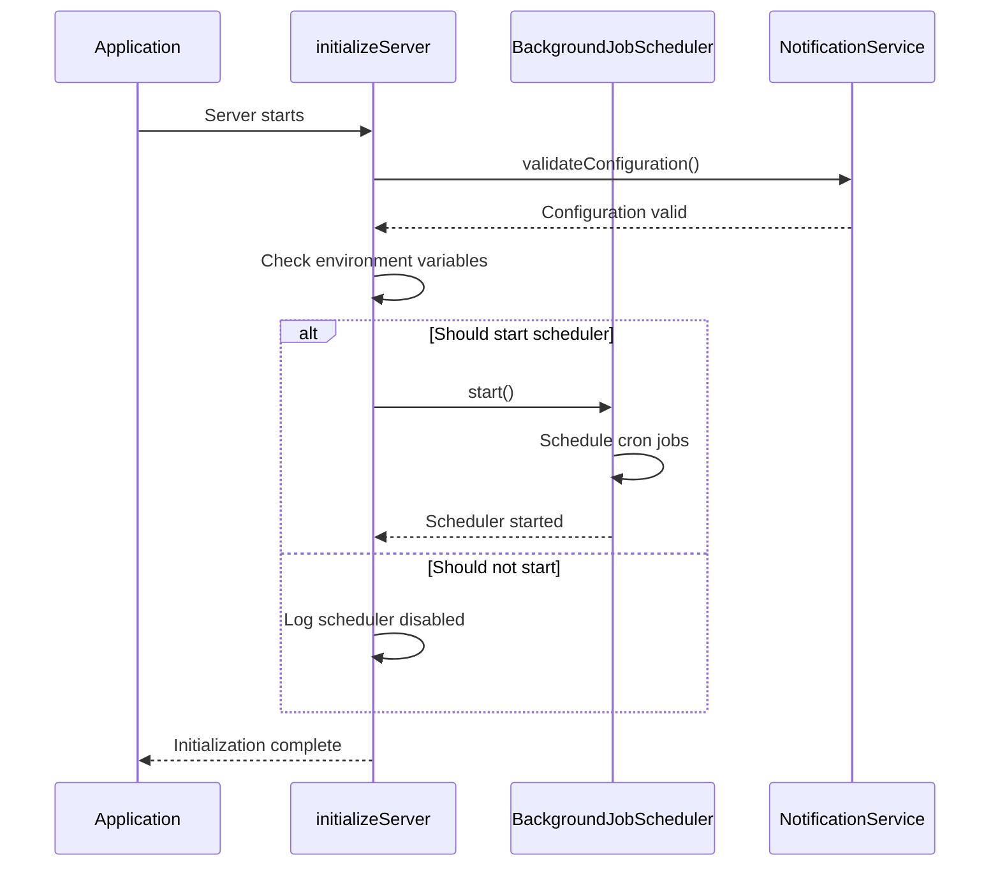
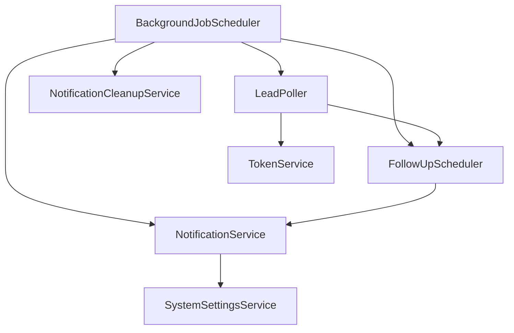
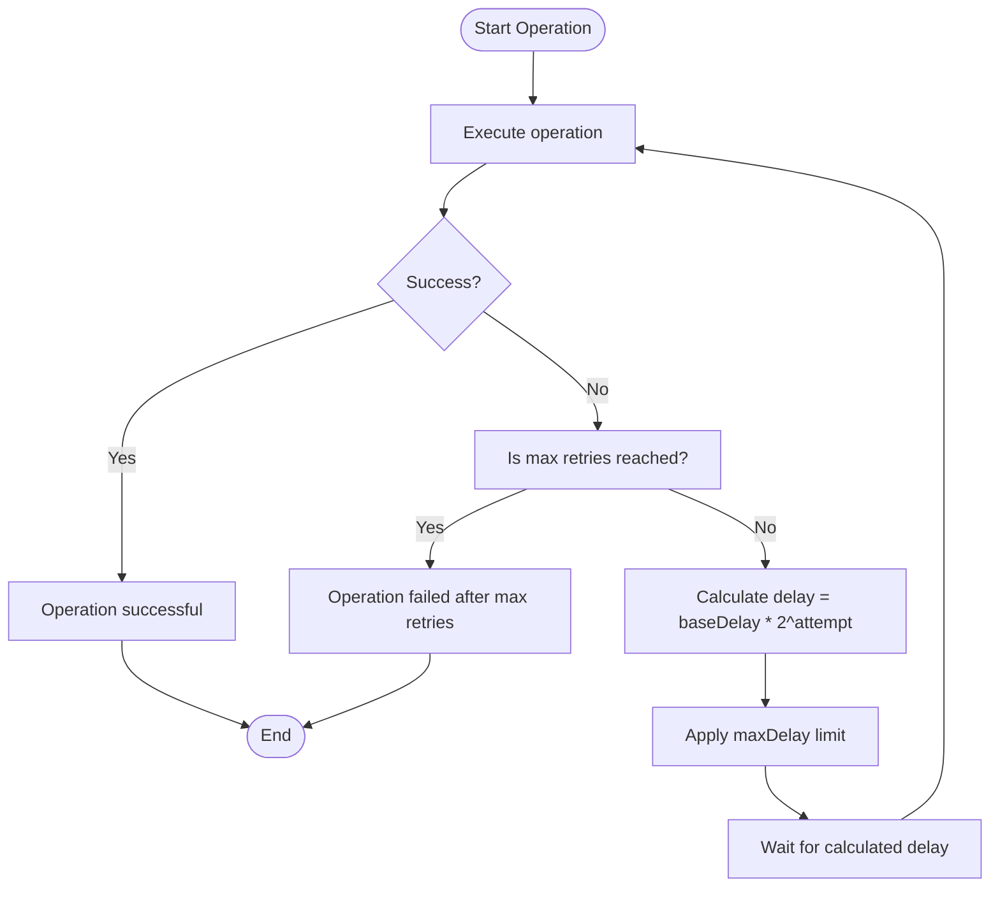
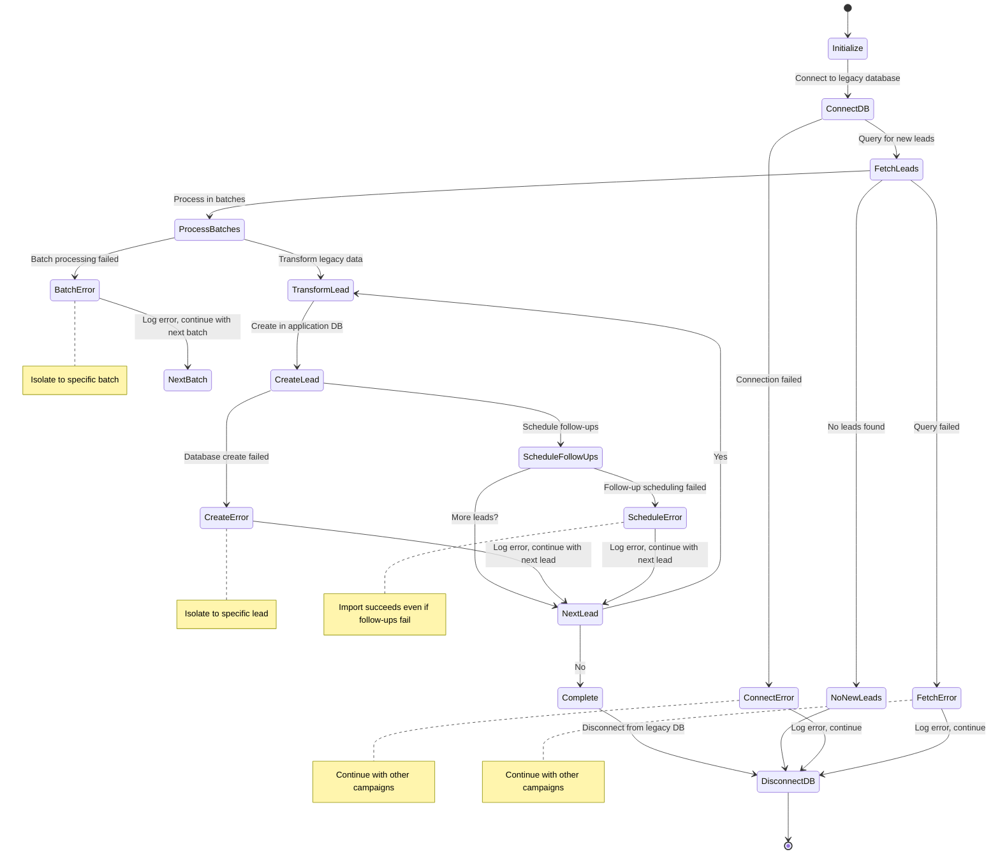
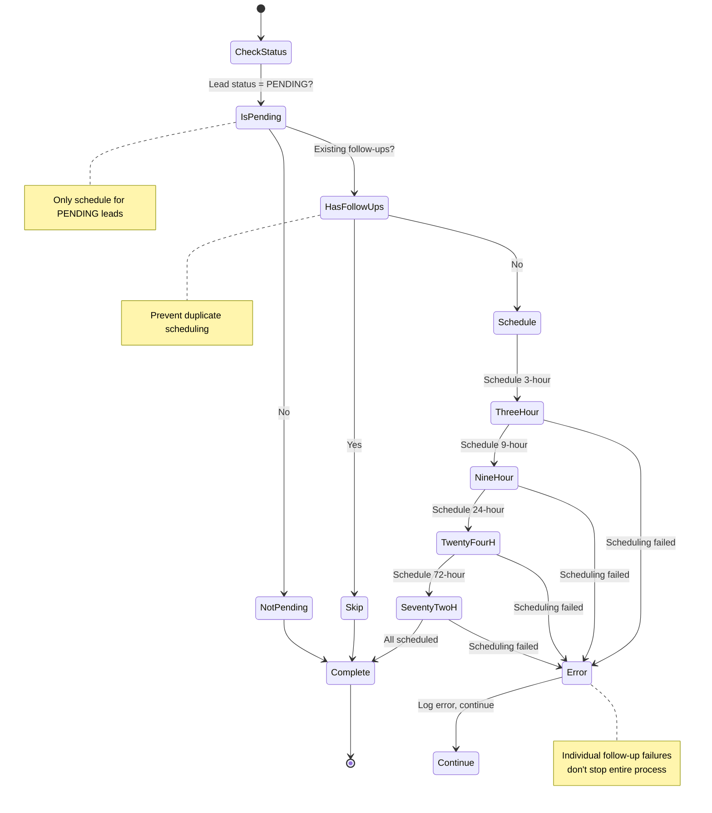
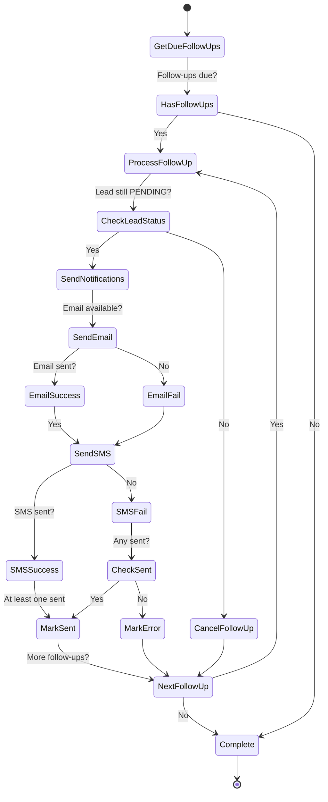
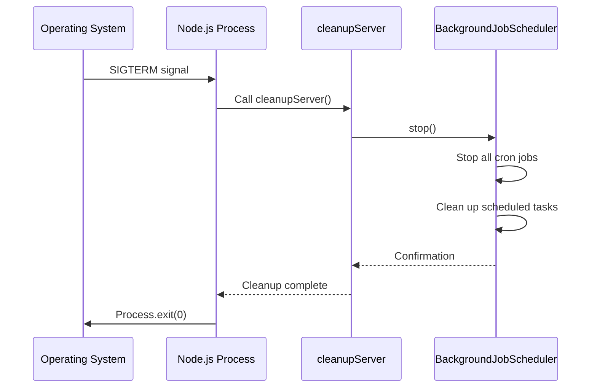

# Service Layer Architecture

<cite>
**Referenced Files in This Document**   
- [BackgroundJobScheduler.ts](file://src/services/BackgroundJobScheduler.ts)
- [LeadPoller.ts](file://src/services/LeadPoller.ts)
- [FollowUpScheduler.ts](file://src/services/FollowUpScheduler.ts)
- [NotificationService.ts](file://src/services/NotificationService.ts)
- [server-init.ts](file://src/lib/server-init.ts)
- [poll-leads/route.ts](file://src/app/api/cron/poll-leads/route.ts)
- [send-followups/route.ts](file://src/app/api/cron/send-followups/route.ts)
</cite>

## Table of Contents
1. [Introduction](#introduction)
2. [Service-Oriented Design Pattern](#service-oriented-design-pattern)
3. [Singleton Pattern and Service Initialization](#singleton-pattern-and-service-initialization)
4. [Inter-Service Communication and Dependency Management](#inter-service-communication-and-dependency-management)
5. [Error Handling and Retry Mechanisms](#error-handling-and-retry-mechanisms)
6. [Job Scheduling Architecture](#job-scheduling-architecture)
7. [Concurrency Control and Transaction Management](#concurrency-control-and-transaction-management)
8. [State Diagrams for Long-Running Processes](#state-diagrams-for-long-running-processes)
9. [Service Lifecycle Management](#service-lifecycle-management)
10. [Conclusion](#conclusion)

## Introduction
The fund-track application implements a service-oriented architecture in its backend layer to manage lead acquisition, follow-up scheduling, and notification delivery. This document provides a comprehensive analysis of the service layer components, focusing on the BackgroundJobScheduler, LeadPoller, FollowUpScheduler, and NotificationService. The architecture emphasizes separation of concerns, fault tolerance, and maintainability through well-defined service boundaries and communication patterns. The system leverages cron-triggered API endpoints to execute scheduled jobs that coordinate these services, ensuring timely processing of leads and follow-up communications.

## Service-Oriented Design Pattern

The fund-track application implements a service-oriented design pattern across its core components: BackgroundJobScheduler, LeadPoller, FollowUpScheduler, and NotificationService. Each service encapsulates specific business capabilities with well-defined responsibilities and interfaces.

The **BackgroundJobScheduler** acts as the orchestration layer, coordinating the execution of various background tasks through cron scheduling. It manages three primary jobs: lead polling, follow-up processing, and notification cleanup. This service doesn't contain business logic itself but delegates to specialized services.

The **LeadPoller** service is responsible for extracting lead data from a legacy database system and importing it into the application's primary database. It handles data transformation, batch processing, and integration with the follow-up system by scheduling initial follow-ups for newly imported leads.

The **FollowUpScheduler** manages the lifecycle of follow-up communications for leads in the PENDING status. It maintains a queue of scheduled follow-ups and processes them according to a predefined timeline (3-hour, 9-hour, 24-hour, and 72-hour intervals). This service also handles cancellation of follow-ups when lead status changes.

The **NotificationService** provides a unified interface for sending email and SMS notifications through third-party providers (Mailgun and Twilio). It encapsulates the complexity of external API integrations, rate limiting, and retry logic.

These services communicate through direct imports and function calls rather than message queues or HTTP APIs, reflecting a monolithic deployment pattern where all components run in the same process.

**Section sources**
- [BackgroundJobScheduler.ts](file://src/services/BackgroundJobScheduler.ts#L0-L462)
- [LeadPoller.ts](file://src/services/LeadPoller.ts#L0-L521)
- [FollowUpScheduler.ts](file://src/services/FollowUpScheduler.ts#L0-L490)
- [NotificationService.ts](file://src/services/NotificationService.ts#L0-L471)

## Singleton Pattern and Service Initialization

The service layer implements the singleton pattern through direct instantiation and export of service instances, ensuring a single instance of each service exists throughout the application lifecycle.

Each service class is instantiated exactly once and exported as a named constant:

```typescript
export const backgroundJobScheduler = new BackgroundJobScheduler();
export const followUpScheduler = new FollowUpScheduler();
export const notificationService = new NotificationService();
```

This pattern ensures that all components interact with the same service instance, maintaining consistent state across the application. The singleton instances are created when the modules are first imported, leveraging Node.js module caching to prevent multiple instantiations.

Service initialization occurs during application startup through the `initializeServer()` function in `server-init.ts`. This function performs several critical initialization steps:

1. Validates the NotificationService configuration by checking required environment variables
2. Determines whether to start the BackgroundJobScheduler based on environment conditions (production environment or ENABLE_BACKGROUND_JOBS=true)
3. Starts the scheduler if conditions are met and it's not already running

The initialization process includes comprehensive logging to track the startup sequence and potential configuration issues. The system prevents multiple initializations through an `isInitialized` flag, ensuring idempotency.

During initialization, the BackgroundJobScheduler sets up cron jobs for lead polling (every 15 minutes), follow-up processing (every 5 minutes), and notification cleanup (daily at 2 AM). These cron patterns can be overridden through environment variables, providing flexibility for different deployment environments.



**Diagram sources**
- [BackgroundJobScheduler.ts](file://src/services/BackgroundJobScheduler.ts#L0-L462)
- [server-init.ts](file://src/lib/server-init.ts#L0-L178)

**Section sources**
- [BackgroundJobScheduler.ts](file://src/services/BackgroundJobScheduler.ts#L0-L462)
- [server-init.ts](file://src/lib/server-init.ts#L0-L178)

## Inter-Service Communication and Dependency Management

The service layer employs a direct dependency injection pattern through module imports, creating a clear hierarchy of service dependencies. The BackgroundJobScheduler serves as the central orchestrator, importing and coordinating the other services.

The dependency graph reveals the following relationships:



The **BackgroundJobScheduler** has direct dependencies on all major services:
- Creates LeadPoller instances to poll for new leads
- Calls FollowUpScheduler to process pending follow-ups
- Uses NotificationService to send notifications for new leads
- Invokes NotificationCleanupService for maintenance tasks

The **LeadPoller** service depends on FollowUpScheduler to schedule follow-up communications when new leads are imported. It also uses TokenService to generate intake tokens for new leads.

The **FollowUpScheduler** relies on NotificationService to deliver follow-up notifications via email and SMS. This creates a chain of dependencies where the scheduler orchestrates follow-up processing, but delegates actual notification delivery.

The **NotificationService** depends on SystemSettingsService to retrieve notification configuration settings, including rate limits and retry parameters. This allows runtime configuration of notification behavior without requiring code changes.

Services communicate through synchronous method calls rather than asynchronous messaging. For example, when the BackgroundJobScheduler executes a lead polling job, it directly calls `leadPoller.pollAndImportLeads()` and waits for completion before proceeding. This synchronous approach simplifies error handling and ensures predictable execution order but may impact performance under heavy load.

All services share access to the Prisma ORM instance for database operations, creating a shared dependency on the data access layer. This centralized database access pattern simplifies transaction management but could create contention under high concurrency.

**Diagram sources**
- [BackgroundJobScheduler.ts](file://src/services/BackgroundJobScheduler.ts#L0-L462)
- [LeadPoller.ts](file://src/services/LeadPoller.ts#L0-L521)
- [FollowUpScheduler.ts](file://src/services/FollowUpScheduler.ts#L0-L490)
- [NotificationService.ts](file://src/services/NotificationService.ts#L0-L471)

**Section sources**
- [BackgroundJobScheduler.ts](file://src/services/BackgroundJobScheduler.ts#L0-L462)
- [LeadPoller.ts](file://src/services/LeadPoller.ts#L0-L521)
- [FollowUpScheduler.ts](file://src/services/FollowUpScheduler.ts#L0-L490)
- [NotificationService.ts](file://src/services/NotificationService.ts#L0-L471)

## Error Handling and Retry Mechanisms

The service layer implements comprehensive error handling and retry mechanisms, particularly for external integrations with third-party services like Mailgun and Twilio.

The **NotificationService** features a sophisticated retry mechanism with exponential backoff for external API calls. The `executeWithRetry` method wraps external service calls and automatically retries failed operations:



The retry configuration is dynamic, allowing the base delay and maximum retries to be adjusted based on system settings retrieved from the database. This enables administrators to tune retry behavior without code changes.

For database operations, the system leverages Prisma's built-in error handling and implements application-level error logging. When critical jobs fail, the system creates notification logs in the database to ensure failures are recorded even if external notification services are unavailable.

The **LeadPoller** service implements error isolation at the batch level. When processing leads in batches, errors in one batch do not prevent subsequent batches from being processed. This ensures maximum data ingestion even when some records are problematic.

The **BackgroundJobScheduler** includes comprehensive error handling for its scheduled jobs. When a job fails, it logs detailed error information and creates a database record in the notificationLog table to alert administrators. This dual logging approach (application logs and database records) ensures visibility into system health.

All services use structured logging with context information, including timestamps, operation types, and relevant identifiers (lead IDs, recipient information). This facilitates debugging and monitoring of system behavior.

The system also implements rate limiting to prevent notification spam. The NotificationService checks recent notification history before sending messages, limiting recipients to 2 notifications per hour and 10 per day per lead.

**Diagram sources**
- [NotificationService.ts](file://src/services/NotificationService.ts#L243-L295)
- [BackgroundJobScheduler.ts](file://src/services/BackgroundJobScheduler.ts#L137-L171)

**Section sources**
- [NotificationService.ts](file://src/services/NotificationService.ts#L0-L471)
- [BackgroundJobScheduler.ts](file://src/services/BackgroundJobScheduler.ts#L0-L462)
- [LeadPoller.ts](file://src/services/LeadPoller.ts#L0-L521)

## Job Scheduling Architecture

The job scheduling architecture combines cron-based scheduling with API-triggered execution, providing both automated and manual control over background processes.

The **BackgroundJobScheduler** uses the node-cron library to schedule recurring jobs with configurable cron patterns:

```mermaid
graph TB
subgraph "Cron Scheduler"
Scheduler[BackgroundJobScheduler]
LeadPolling["*/15 * * * *" Lead Polling]
FollowUp["*/5 * * * *" Follow-Up Processing]
Cleanup["0 2 * * *" Notification Cleanup]
end
subgraph "API Endpoints"
PollAPI[/api/cron/poll-leads]
FollowUpAPI[/api/cron/send-followups]
end
subgraph "Services"
LeadPoller[LeadPoller]
FollowUpScheduler[FollowUpScheduler]
NotificationService[NotificationService]
end
Scheduler --> LeadPolling
Scheduler --> FollowUp
Scheduler --> Cleanup
LeadPolling --> LeadPoller
FollowUp --> FollowUpScheduler
PollAPI --> LeadPoller
FollowUpAPI --> FollowUpScheduler
LeadPoller --> NotificationService
FollowUpScheduler --> NotificationService
```

The scheduler manages three primary jobs:
1. **Lead Polling**: Executes every 15 minutes (configurable via LEAD_POLLING_CRON_PATTERN) to import new leads from the legacy database
2. **Follow-Up Processing**: Runs every 5 minutes (configurable via FOLLOWUP_CRON_PATTERN) to send due follow-up notifications
3. **Notification Cleanup**: Executes daily at 2 AM (configurable via CLEANUP_CRON_PATTERN) to remove old notification records

In addition to automated scheduling, the system provides API endpoints that allow manual triggering of these processes:
- `POST /api/cron/poll-leads`: Manually triggers lead polling
- `POST /api/cron/send-followups`: Manually processes the follow-up queue

These API endpoints are used both for cron-triggered execution (by external cron services) and administrative manual execution. The system also includes corresponding GET endpoints for health checks and status monitoring.

The BackgroundJobScheduler exposes methods for manual execution of jobs, which are used by the API endpoints:
- `executeLeadPollingManually()`: Triggers lead polling outside the normal schedule
- `executeFollowUpManually()`: Processes follow-ups immediately
- `executeCleanupManually()`: Runs cleanup operations

This dual approach to job execution provides operational flexibility, allowing administrators to trigger processes manually when needed while maintaining regular automated execution.

**Diagram sources**
- [BackgroundJobScheduler.ts](file://src/services/BackgroundJobScheduler.ts#L0-L462)
- [poll-leads/route.ts](file://src/app/api/cron/poll-leads/route.ts#L0-L192)
- [send-followups/route.ts](file://src/app/api/cron/send-followups/route.ts#L0-L103)

**Section sources**
- [BackgroundJobScheduler.ts](file://src/services/BackgroundJobScheduler.ts#L0-L462)
- [poll-leads/route.ts](file://src/app/api/cron/poll-leads/route.ts#L0-L192)
- [send-followups/route.ts](file://src/app/api/cron/send-followups/route.ts#L0-L103)

## Concurrency Control and Transaction Management

The service layer implements several strategies for concurrency control and transaction management to ensure data consistency and prevent race conditions.

The **BackgroundJobScheduler** prevents concurrent execution of the same job through its internal state management. The `isRunning` flag and corresponding checks in the `start()` method ensure that the scheduler cannot be started multiple times:

```typescript
if (this.isRunning) {
  logger.warn("Background job scheduler is already running");
  return;
}
```

This prevents multiple instances of the scheduler from running simultaneously, which could lead to duplicate processing of leads and follow-ups.

For database operations, the system relies on Prisma's transaction capabilities and database-level constraints. The **LeadPoller** service processes leads in batches but does not use explicit database transactions for batch operations. Instead, it relies on the fact that each lead is imported only once (based on legacyLeadId) due to the incremental polling mechanism that tracks the maximum legacy ID already imported.

The **FollowUpScheduler** implements concurrency control through database-level checks when processing follow-ups. When a follow-up is processed, the system first verifies that the lead is still in PENDING status before sending notifications. This prevents sending follow-ups to leads that have already been processed or rejected.

The system also prevents duplicate follow-up scheduling through a check for existing pending follow-ups:

```typescript
const existingFollowUps = await prisma.followupQueue.findMany({
  where: {
    leadId,
    status: FollowupStatus.PENDING,
  },
});
```

If existing follow-ups are found, the system skips scheduling new ones, preventing duplicate entries in the follow-up queue.

For notification delivery, the system uses a state machine approach with the NotificationLog model tracking the status of each notification (PENDING, SENT, FAILED). This prevents duplicate notifications by checking the notification history before sending new messages.

The **NotificationService** implements rate limiting to prevent excessive notifications to the same recipient, with checks for recent notifications to the same email or phone number within defined time windows.

While the system doesn't use explicit database transactions for multi-step operations, it relies on the atomicity of individual Prisma operations and careful ordering of operations to maintain data consistency.

**Section sources**
- [BackgroundJobScheduler.ts](file://src/services/BackgroundJobScheduler.ts#L0-L462)
- [LeadPoller.ts](file://src/services/LeadPoller.ts#L0-L521)
- [FollowUpScheduler.ts](file://src/services/FollowUpScheduler.ts#L0-L490)
- [NotificationService.ts](file://src/services/NotificationService.ts#L0-L471)

## State Diagrams for Long-Running Processes

### Lead Polling Process State Diagram

The lead polling process follows a sequential workflow with error handling and recovery capabilities:



**Diagram sources**
- [LeadPoller.ts](file://src/services/LeadPoller.ts#L0-L521)

### Follow-Up Scheduling State Diagram

The follow-up scheduling process manages the lifecycle of follow-up communications for leads:



**Diagram sources**
- [FollowUpScheduler.ts](file://src/services/FollowUpScheduler.ts#L0-L490)

### Follow-Up Processing State Diagram

The follow-up processing job handles the delivery of scheduled follow-up communications:



**Diagram sources**
- [FollowUpScheduler.ts](file://src/services/FollowUpScheduler.ts#L0-L490)

## Service Lifecycle Management

The service layer implements comprehensive lifecycle management for graceful startup, operation, and shutdown.

### Service Initialization

Service initialization occurs through the `initializeServer()` function in `server-init.ts`, which follows a structured startup sequence:

1. **Prevention of duplicate initialization** through the `isInitialized` flag
2. **Notification service validation** to verify configuration and environment variables
3. **Environment-based decision making** for starting the background job scheduler
4. **Idempotent scheduler startup** that checks current status before attempting to start

The initialization process is designed to be resilient, logging configuration issues but continuing startup even if non-critical components have problems. This ensures the application remains available even with partial functionality.

### Graceful Shutdown

The system implements graceful shutdown procedures to ensure proper cleanup during process termination:



The system listens for SIGTERM and SIGINT signals, which are standard termination signals in Unix-like systems. Upon receiving these signals, it invokes the `cleanupServer()` function, which:

1. Stops the BackgroundJobScheduler, halting all scheduled tasks
2. Destroys cron job references to prevent memory leaks
3. Logs the cleanup process for audit purposes

This ensures that no new jobs are started during shutdown and that the application exits cleanly.

### Health Monitoring

The system provides multiple endpoints for health monitoring and operational visibility:

- **GET /api/health/live**: Basic liveness check
- **GET /api/health/ready**: Readiness check including database connectivity
- **GET /api/cron/poll-leads**: Lead polling endpoint availability
- **GET /api/cron/send-followups**: Follow-up processing statistics
- **GET /api/admin/background-jobs/status**: Comprehensive scheduler status

The BackgroundJobScheduler exposes a `getStatus()` method that provides detailed information about the scheduler's state, including:
- Current running status
- Cron patterns for each job
- Next scheduled execution times

This information is available through the admin API endpoint, allowing operators to monitor job scheduling and troubleshoot timing issues.

The system also maintains operational logs with structured data that can be used for monitoring and alerting, including processing times, record counts, and error details for each job execution.

**Diagram sources**
- [server-init.ts](file://src/lib/server-init.ts#L80-L178)

**Section sources**
- [server-init.ts](file://src/lib/server-init.ts#L0-L178)
- [BackgroundJobScheduler.ts](file://src/services/BackgroundJobScheduler.ts#L0-L462)

## Conclusion
The service layer of the fund-track application demonstrates a well-structured service-oriented architecture with clear separation of concerns. The implementation of the singleton pattern ensures consistent state management across the application, while the BackgroundJobScheduler effectively orchestrates background processes through cron scheduling and API endpoints.

Key strengths of the architecture include comprehensive error handling with database-backed logging, sophisticated retry mechanisms for external integrations, and graceful shutdown procedures. The system balances automation with manual control, allowing both scheduled execution and administrative intervention.

The inter-service communication pattern, while creating tight coupling through direct imports, simplifies development and debugging in a monolithic deployment. The state management for long-running processes like lead polling and follow-up scheduling demonstrates careful consideration of edge cases and failure recovery.

For future improvements, the system could benefit from more explicit transaction management for multi-step operations, enhanced concurrency controls for high-load scenarios, and potentially decoupling services through message queues for greater resilience. However, the current architecture effectively meets the application's requirements for reliable lead processing and follow-up communication.