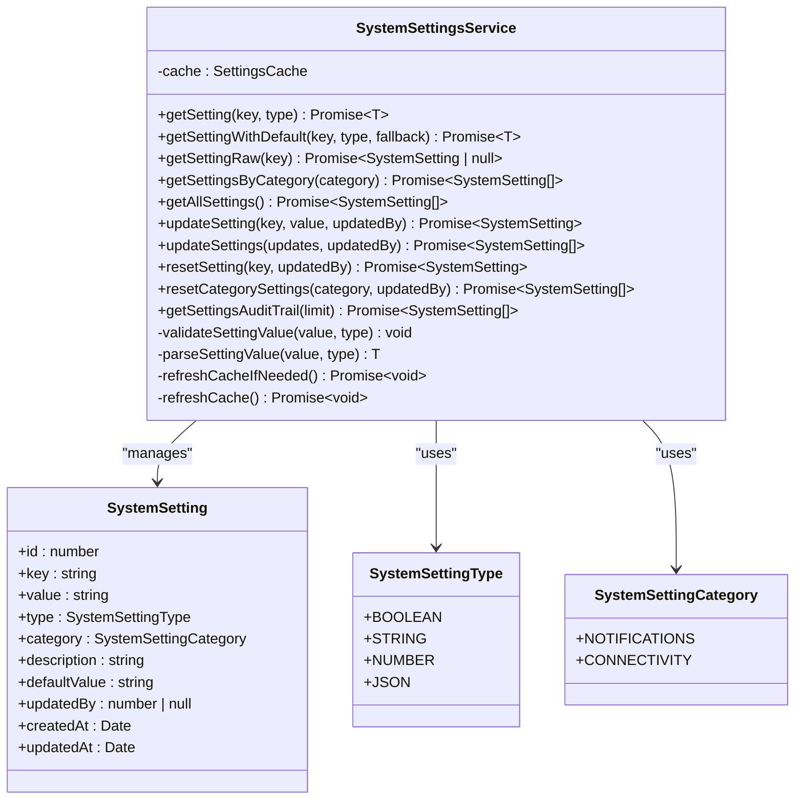
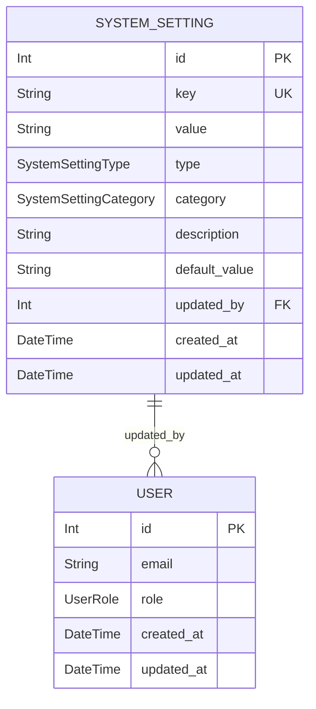
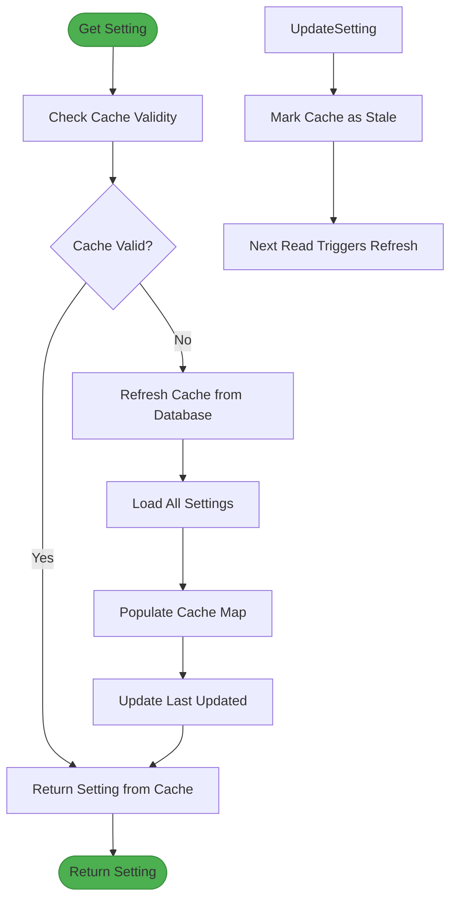
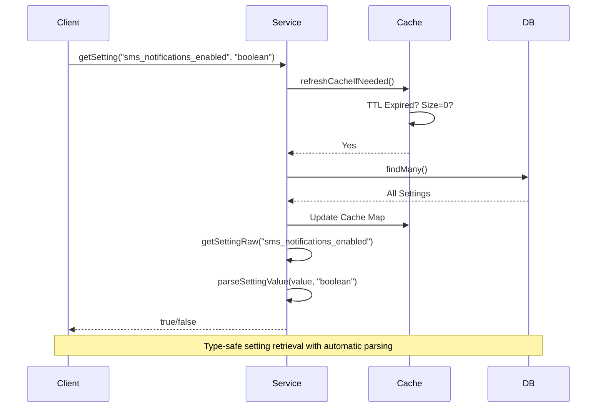
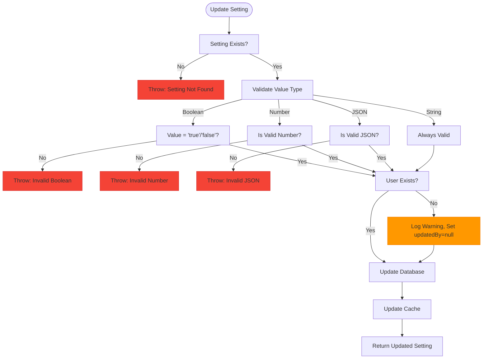
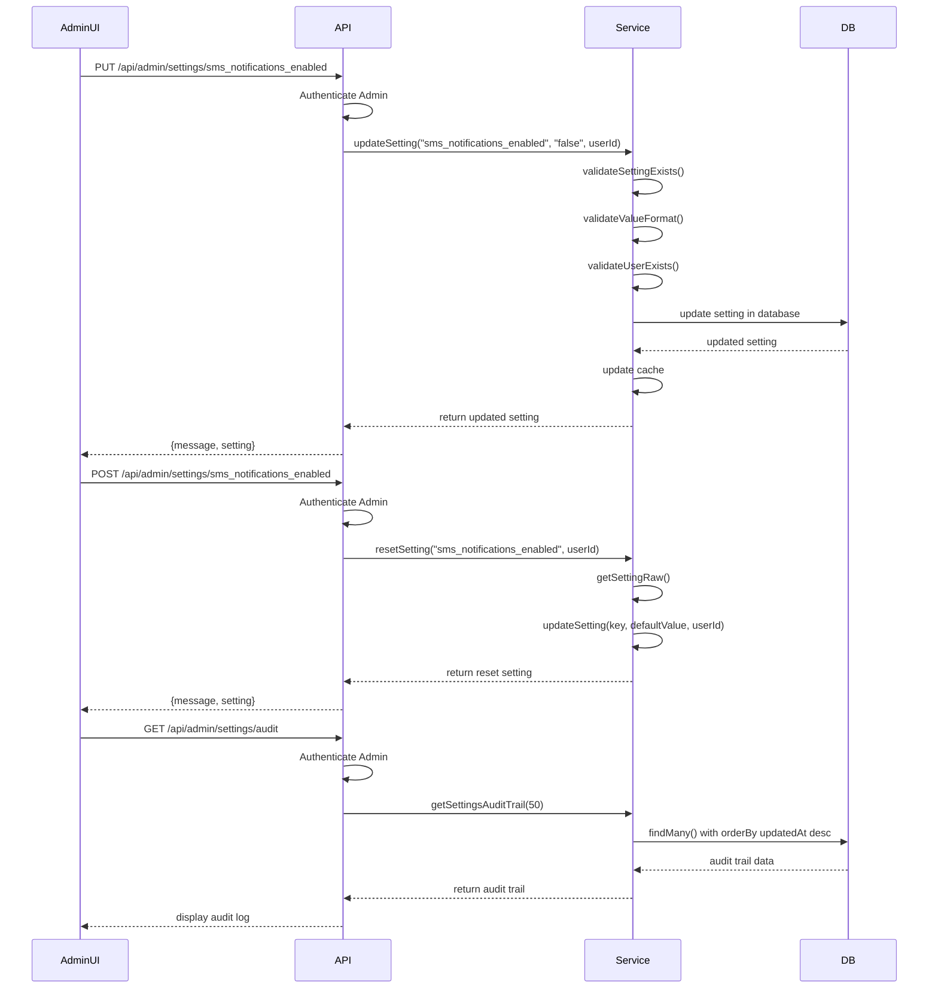
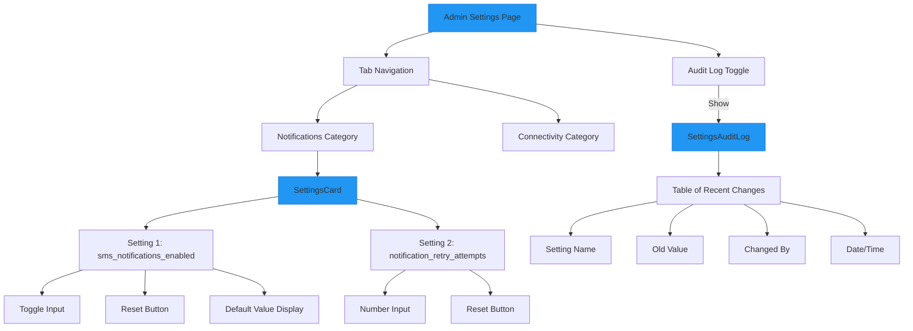

# System Settings Service

<cite>
**Referenced Files in This Document**   
- [SystemSettingsService.ts](file://src/services/SystemSettingsService.ts)
- [system-settings.ts](file://prisma/seeds/system-settings.ts)
- [schema.prisma](file://prisma/schema.prisma)
- [page.tsx](file://src/app/admin/settings/page.tsx)
- [SettingsCard.tsx](file://src/components/admin/SettingsCard.tsx)
- [SettingInput.tsx](file://src/components/admin/SettingInput.tsx)
- [SettingsAuditLog.tsx](file://src/components/admin/SettingsAuditLog.tsx)
- [route.ts](file://src/app/api/admin/settings/route.ts)
- [route.ts](file://src/app/api/admin/settings/[key]/route.ts)
- [route.ts](file://src/app/api/admin/settings/audit/route.ts)
</cite>

## Table of Contents
1. [Introduction](#introduction)
2. [Core Architecture](#core-architecture)
3. [Data Model and Schema](#data-model-and-schema)
4. [Caching Mechanism](#caching-mechanism)
5. [Type-Safe Access and Value Handling](#type-safe-access-and-value-handling)
6. [Validation and Business Rules](#validation-and-business-rules)
7. [Runtime Updates and Audit Logging](#runtime-updates-and-audit-logging)
8. [API Integration](#api-integration)
9. [Admin Interface](#admin-interface)
10. [Initialization and Dependencies](#initialization-and-dependencies)

## Introduction
The SystemSettingsService provides a centralized, type-safe mechanism for managing application-wide configuration settings. It enables dynamic configuration of system behavior without requiring code changes or restarts. The service supports multiple setting types (boolean, string, number, JSON), enforces validation rules, maintains audit trails, and provides efficient cached access to settings. This document details the architecture, functionality, and integration points of the SystemSettingsService.

## Core Architecture
The SystemSettingsService implements a singleton pattern to provide global access to system settings. It abstracts direct database access with a service layer that handles caching, type conversion, validation, and audit logging. The service interacts with the SystemSetting model via Prisma ORM and exposes methods for retrieving, updating, and managing settings.



**Diagram sources**
- [SystemSettingsService.ts](file://src/services/SystemSettingsService.ts#L1-L352)
- [schema.prisma](file://prisma/schema.prisma#L175-L188)

**Section sources**
- [SystemSettingsService.ts](file://src/services/SystemSettingsService.ts#L1-L352)

## Data Model and Schema
The SystemSetting model defines the structure for storing configurable application settings. Each setting has a unique key, value, type, category, description, default value, and audit fields. The schema supports four data types (boolean, string, number, JSON) and organizes settings into categories for easier management.



**Diagram sources**
- [schema.prisma](file://prisma/schema.prisma#L175-L188)
- [schema.prisma](file://prisma/schema.prisma#L58-L73)

**Section sources**
- [schema.prisma](file://prisma/schema.prisma#L175-L188)
- [system-settings.ts](file://prisma/seeds/system-settings.ts#L1-L74)

## Caching Mechanism
The SystemSettingsService implements an in-memory cache with a 5-minute TTL (Time To Live) to optimize performance and reduce database load. The cache stores all settings in a Map keyed by setting key, with automatic refresh when the TTL expires or when the cache is empty.



**Diagram sources**
- [SystemSettingsService.ts](file://src/services/SystemSettingsService.ts#L291-L349)

**Section sources**
- [SystemSettingsService.ts](file://src/services/SystemSettingsService.ts#L291-L349)

## Type-Safe Access and Value Handling
The service provides type-safe access to settings through generic methods that ensure correct type conversion. Settings are stored as strings in the database but are automatically converted to their proper types (boolean, number, JSON) when retrieved. The service also provides convenience methods with default value fallbacks.



**Diagram sources**
- [SystemSettingsService.ts](file://src/services/SystemSettingsService.ts#L49-L105)
- [SystemSettingsService.ts](file://src/services/SystemSettingsService.ts#L241-L289)

**Section sources**
- [SystemSettingsService.ts](file://src/services/SystemSettingsService.ts#L49-L105)
- [SystemSettingsService.ts](file://src/services/SystemSettingsService.ts#L241-L289)

## Validation and Business Rules
The SystemSettingsService enforces strict validation rules to ensure data integrity. When updating settings, the service validates that the new value matches the expected type format (boolean values must be "true"/"false", numbers must be valid, JSON must be parseable). The service also validates that referenced users exist when tracking who made changes.



**Diagram sources**
- [SystemSettingsService.ts](file://src/services/SystemSettingsService.ts#L107-L202)

**Section sources**
- [SystemSettingsService.ts](file://src/services/SystemSettingsService.ts#L107-L202)

## Runtime Updates and Audit Logging
The service supports runtime updates to settings through individual and bulk update methods. All changes are automatically audited, with the audit trail accessible through the getSettingsAuditTrail method. The service also provides reset functionality to restore settings to their default values.



**Diagram sources**
- [SystemSettingsService.ts](file://src/services/SystemSettingsService.ts#L107-L202)
- [route.ts](file://src/app/api/admin/settings/[key]/route.ts#L50-L129)
- [route.ts](file://src/app/api/admin/settings/audit/route.ts#L1-L33)

**Section sources**
- [SystemSettingsService.ts](file://src/services/SystemSettingsService.ts#L107-L202)
- [route.ts](file://src/app/api/admin/settings/[key]/route.ts#L50-L129)
- [route.ts](file://src/app/api/admin/settings/audit/route.ts#L1-L33)

## API Integration
The SystemSettingsService is exposed through a RESTful API with endpoints for retrieving, updating, and auditing settings. The API enforces admin authentication and provides both individual setting operations and bulk operations for efficiency.

```mermaid
graph TB
subgraph "Frontend"
UI[Admin Settings Page]
SettingsCard[SettingsCard Component]
SettingsAuditLog[SettingsAuditLog Component]
end
subgraph "API Layer"
SettingsRoute[/api/admin/settings]
SettingRoute[/api/admin/settings/{key}]
AuditRoute[/api/admin/settings/audit]
end
subgraph "Service Layer"
Service[SystemSettingsService]
end
subgraph "Data Layer"
DB[(Database)]
Prisma[Prisma ORM]
end
UI --> SettingsCard
UI --> SettingsAuditLog
SettingsCard --> SettingRoute
SettingsCard --> SettingsRoute
SettingsAuditLog --> AuditRoute
SettingRoute --> Service
SettingsRoute --> Service
AuditRoute --> Service
Service --> Prisma
Prisma --> DB
style UI fill:#2196F3,stroke:#1976D2
style Service fill:#4CAF50,stroke:#388E3C
style DB fill:#F44336,stroke:#D32F2F
```

**Diagram sources**
- [route.ts](file://src/app/api/admin/settings/route.ts#L1-L107)
- [route.ts](file://src/app/api/admin/settings/[key]/route.ts#L1-L130)
- [route.ts](file://src/app/api/admin/settings/audit/route.ts#L1-L33)
- [page.tsx](file://src/app/admin/settings/page.tsx#L1-L265)

**Section sources**
- [route.ts](file://src/app/api/admin/settings/route.ts#L1-L107)
- [route.ts](file://src/app/api/admin/settings/[key]/route.ts#L1-L130)
- [route.ts](file://src/app/api/admin/settings/audit/route.ts#L1-L33)

## Admin Interface
The admin interface provides a user-friendly way to manage system settings through the SettingsCard component. The interface displays settings by category, allows inline editing, provides reset functionality, and includes an audit log viewer. Different input types are rendered based on the setting type (toggle for booleans, text input for strings, etc.).



**Diagram sources**
- [page.tsx](file://src/app/admin/settings/page.tsx#L1-L265)
- [SettingsCard.tsx](file://src/components/admin/SettingsCard.tsx#L1-L140)
- [SettingInput.tsx](file://src/components/admin/SettingInput.tsx#L1-L165)
- [SettingsAuditLog.tsx](file://src/components/admin/SettingsAuditLog.tsx#L1-L136)

**Section sources**
- [page.tsx](file://src/app/admin/settings/page.tsx#L1-L265)
- [SettingsCard.tsx](file://src/components/admin/SettingsCard.tsx#L1-L140)
- [SettingInput.tsx](file://src/components/admin/SettingInput.tsx#L1-L165)

## Initialization and Dependencies
The SystemSettingsService is initialized as a singleton instance, making it globally available throughout the application. It depends on Prisma for database access and is integrated with the authentication system to track who makes changes. The service is seeded with default values during database initialization.

**Section sources**
- [SystemSettingsService.ts](file://src/services/SystemSettingsService.ts#L349-L352)
- [system-settings.ts](file://prisma/seeds/system-settings.ts#L1-L74)
- [SystemSettingsService.ts](file://src/services/SystemSettingsService.ts#L1-L352)