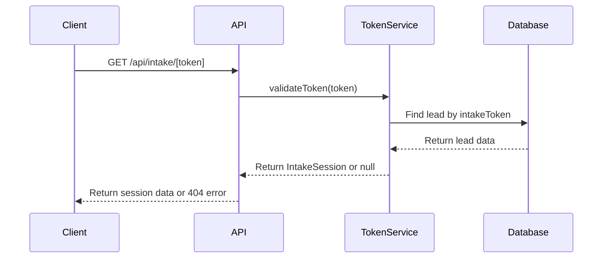
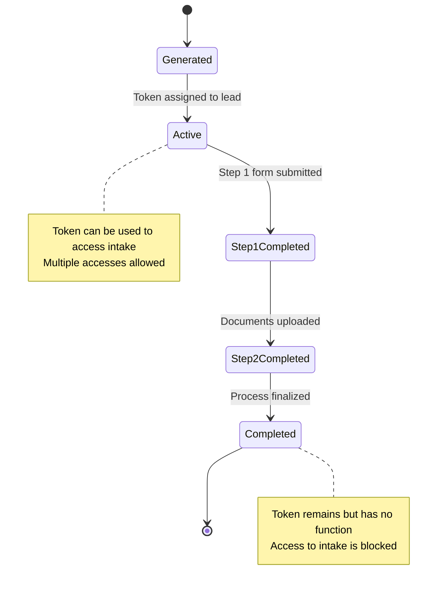
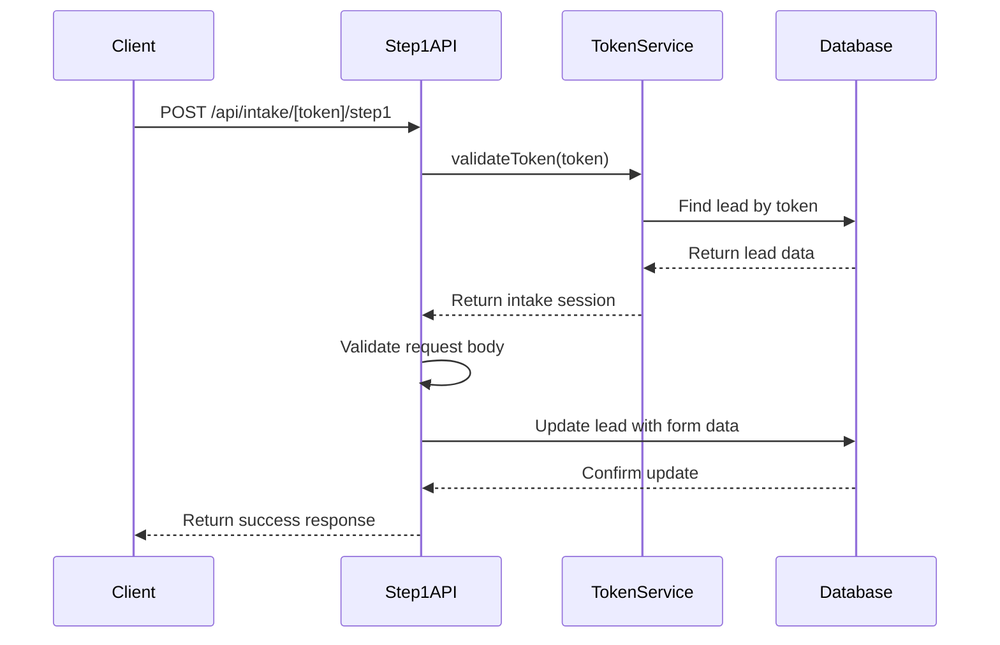
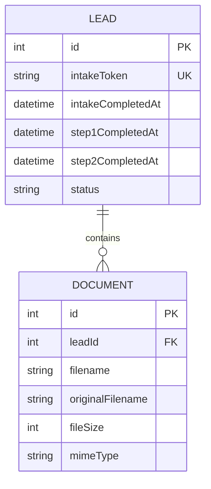

# Token Service

<cite>
**Referenced Files in This Document**   
- [TokenService.ts](file://src/services/TokenService.ts)
- [schema.prisma](file://prisma/schema.prisma)
- [route.ts](file://src/app/api/intake/[token]/route.ts)
- [step1/route.ts](file://src/app/api/intake/[token]/step1/route.ts)
- [step2/route.ts](file://src/app/api/intake/[token]/step2/route.ts)
- [save/route.ts](file://src/app/api/intake/[token]/save/route.ts)
- [LeadPoller.ts](file://src/services/LeadPoller.ts)
</cite>

## Table of Contents
1. [Introduction](#introduction)
2. [Token Generation and Validation](#token-generation-and-validation)
3. [Security Mechanisms](#security-mechanisms)
4. [Token Lifecycle Management](#token-lifecycle-management)
5. [API Integration](#api-integration)
6. [Database Schema](#database-schema)
7. [Error Handling](#error-handling)
8. [Best Practices](#best-practices)

## Introduction
The TokenService is a critical component responsible for managing secure access to the intake process for prospects. It generates cryptographically secure tokens that serve as temporary credentials, allowing prospective leads to complete their application without requiring traditional authentication. The service ensures that only authorized individuals can access and complete the intake workflow, protecting sensitive business and personal information.

The token system operates on a single-use principle, where each token grants access to a specific lead's intake process and becomes invalid once the process is completed. This prevents unauthorized access and replay attacks while maintaining a seamless user experience for legitimate prospects.

**Section sources**
- [TokenService.ts](file://src/services/TokenService.ts#L1-L313)

## Token Generation and Validation

### Token Generation Algorithm
The TokenService uses Node.js's built-in `crypto` module to generate cryptographically secure random tokens. The `generateToken()` method creates a 32-byte random buffer and converts it to a hexadecimal string, resulting in a 64-character token.

```typescript
static generateToken(): string {
  return crypto.randomBytes(32).toString('hex');
}
```

This approach ensures:
- **High entropy**: 256 bits of randomness (32 bytes)
- **Unpredictability**: Uses cryptographically secure random number generator
- **Uniqueness**: Extremely low probability of collision due to 2^256 possible combinations
- **URL safety**: Hexadecimal format contains only alphanumeric characters

The generated token is assigned to a lead record in the database through the `generateTokenForLead()` method, which updates the lead's status to "PENDING" to indicate that the intake process has been initiated.

### Token Validation Process
Token validation is performed through the `validateToken()` method, which queries the database to find a lead with the matching intake token. The validation process includes:

1. Database lookup for a lead with the specified token
2. Verification that the token exists and is associated with a valid lead
3. Retrieval of the complete intake session data, including lead information and completion status
4. Return of an `IntakeSession` object containing all necessary information for the intake workflow

The validation process is designed to be efficient, using a database index on the `intakeToken` field to ensure fast lookups.



**Diagram sources**
- [TokenService.ts](file://src/services/TokenService.ts#L45-L111)
- [route.ts](file://src/app/api/intake/[token]/route.ts#L1-L38)

**Section sources**
- [TokenService.ts](file://src/services/TokenService.ts#L45-L111)

## Security Mechanisms

### Cryptographic Security
The TokenService employs industry-standard cryptographic practices to ensure token security:

- **Secure random generation**: Uses `crypto.randomBytes()` which is cryptographically secure and suitable for generating tokens
- **Sufficient token length**: 64-character hexadecimal tokens provide 256 bits of entropy, making brute force attacks computationally infeasible
- **Unique constraint**: The database enforces uniqueness on the `intakeToken` field, preventing duplicate tokens

### Replay Attack Prevention
The system prevents replay attacks through several mechanisms:

1. **Single-use design**: While the token can be used multiple times during the intake process, it becomes effectively useless once the process is completed
2. **State tracking**: The system tracks the completion status of each step, preventing users from replaying completed steps
3. **Expiration through completion**: Once the intake process is completed, the token remains in the system but has no functional purpose

### Single-Use Constraints
The TokenService enforces single-use constraints through state management in the database:

- **Step tracking**: The system tracks completion of step 1 and step 2 separately using `step1CompletedAt` and `step2CompletedAt` timestamp fields
- **Completion enforcement**: The `markStep2Completed()` method ensures that step 1 must be completed before step 2 can be processed
- **Finalization**: Once step 2 is completed, the `intakeCompletedAt` field is set, marking the entire process as complete

The service prevents multiple completions by checking the current state before allowing progression:

```typescript
// In step2/route.ts
if (intakeSession.step2Completed) {
  return NextResponse.json(
    { error: "Step 2 has already been completed" },
    { status: 400 }
  );
}
```

**Section sources**
- [TokenService.ts](file://src/services/TokenService.ts#L45-L313)
- [step1/route.ts](file://src/app/api/intake/[token]/step1/route.ts#L1-L304)
- [step2/route.ts](file://src/app/api/intake/[token]/step2/route.ts#L1-L152)

## Token Lifecycle Management

### Token State in Database
The token state is maintained in the database through several fields in the Lead model:

- `intakeToken`: Stores the generated token (unique, nullable)
- `intakeCompletedAt`: Timestamp when the entire intake process was completed
- `step1CompletedAt`: Timestamp when step 1 was completed
- `step2CompletedAt`: Timestamp when step 2 was completed

These fields allow the system to track the progress of the intake process and enforce business rules based on the current state.

### Lifecycle Transitions
The token lifecycle follows a specific progression:

1. **Generation**: Token is created and assigned to a lead
2. **Active**: Token is valid and can be used to access the intake process
3. **Step 1 Completion**: First part of the intake process is completed
4. **Step 2 Completion**: Second part (document upload) is completed
5. **Finalization**: Intake process is marked as complete



**Diagram sources**
- [TokenService.ts](file://src/services/TokenService.ts#L113-L313)
- [schema.prisma](file://prisma/schema.prisma#L1-L258)

**Section sources**
- [TokenService.ts](file://src/services/TokenService.ts#L113-L313)

## API Integration

### Integration with /api/intake/[token] Routes
The TokenService is integrated with several API routes that handle different aspects of the intake process:

#### Main Intake Route (GET)
The main route handler validates the token and returns the intake session data:

```typescript
export async function GET(
  request: NextRequest,
  { params }: { params: Promise<{ token: string }> }
) {
  const { token } = await params;
  const intakeSession = await TokenService.validateToken(token);
  // Returns session data or 404 for invalid tokens
}
```

#### Step 1 Route (POST)
Handles submission of the first step of the intake form, validating required fields and updating the lead record:



**Diagram sources**
- [step1/route.ts](file://src/app/api/intake/[token]/step1/route.ts#L1-L304)

#### Step 2 Route (POST)
Handles document upload and finalizes the intake process:

```typescript
// In step2/route.ts
const success = await TokenService.markStep2Completed(intakeSession.leadId);
```

#### Save Route (POST)
Allows saving progress without completing a step:

```typescript
// In save/route.ts
await prisma.lead.update({
  where: { id: intakeSession.leadId },
  data: {
    // Update lead data without marking steps as completed
  },
});
```

### Role in Access Control
The TokenService plays a crucial role in access control by:

- **Authentication**: Verifying that the requester has a valid token
- **Authorization**: Ensuring the requester can only access their assigned lead record
- **Progress enforcement**: Preventing users from skipping steps in the intake process
- **Completion protection**: Blocking access to completed intake processes

The service acts as a gatekeeper, ensuring that only authorized users can access and modify lead data during the intake process.

**Section sources**
- [route.ts](file://src/app/api/intake/[token]/route.ts#L1-L38)
- [step1/route.ts](file://src/app/api/intake/[token]/step1/route.ts#L1-L304)
- [step2/route.ts](file://src/app/api/intake/[token]/step2/route.ts#L1-L152)
- [save/route.ts](file://src/app/api/intake/[token]/save/route.ts#L1-L130)

## Database Schema

### Lead Model Structure
The database schema defines the structure for storing token-related information in the Lead model:

```prisma
model Lead {
  // ... other fields
  
  // System fields
  status            LeadStatus @default(NEW)
  intakeToken       String?    @unique @map("intake_token")
  intakeCompletedAt DateTime?  @map("intake_completed_at")
  step1CompletedAt  DateTime?  @map("step1_completed_at")
  step2CompletedAt  DateTime?  @map("intake_completed_at")
  createdAt         DateTime   @default(now()) @map("created_at")
  updatedAt         DateTime   @updatedAt @map("updated_at")
  importedAt        DateTime   @default(now()) @map("imported_at")

  @@map("leads")
}
```

Key aspects of the schema:

- **intakeToken**: Nullable string field with unique constraint to prevent duplicate tokens
- **Timestamp fields**: Track completion of each step and the overall process
- **Status field**: Integrates with the token system to reflect the lead's current state

### Enum Definitions
The schema includes status enums that work with the token system:

```prisma
enum LeadStatus {
  NEW         @map("new")
  PENDING     @map("pending")
  IN_PROGRESS @map("in_progress")
  COMPLETED   @map("completed")
  REJECTED    @map("rejected")
}
```

When a token is generated, the lead status is set to "PENDING". When the intake is completed, the status changes to "IN_PROGRESS" to alert staff that the application is ready for review.



**Diagram sources**
- [schema.prisma](file://prisma/schema.prisma#L1-L258)

**Section sources**
- [schema.prisma](file://prisma/schema.prisma#L1-L258)

## Error Handling

### Invalid or Expired Tokens
The TokenService handles invalid or expired tokens gracefully:

- **Database lookup failure**: Returns `null` when no lead is found with the specified token
- **Error suppression**: Catches database errors and returns `null` rather than exposing internal details
- **Appropriate HTTP status**: API routes return 404 status for invalid tokens

```typescript
static async validateToken(token: string): Promise<IntakeSession | null> {
  try {
    const lead = await prisma.lead.findUnique({
      where: { intakeToken: token },
    });

    if (!lead || !lead.intakeToken) {
      return null;
    }
    
    // ... return session data
  } catch (error) {
    console.error('Error validating token:', error);
    return null;
  }
}
```

### Step Completion Errors
The service handles errors during step completion by:

- **Atomic operations**: Each step completion is a single database update
- **Graceful degradation**: If follow-up cancellation or status change fails, the step completion still succeeds
- **Comprehensive logging**: Errors are logged for debugging without affecting user experience

```typescript
// In markStep2Completed
try {
  await followUpScheduler.cancelFollowUpsForLead(leadId);
} catch (error) {
  console.error(`Failed to cancel follow-ups...`);
  // Don't fail the step completion
}
```

### API Error Responses
API routes provide clear error responses:

- **400 Bad Request**: Missing token, missing required fields, or invalid data
- **404 Not Found**: Invalid or expired token
- **500 Internal Server Error**: Unexpected server errors

The responses include descriptive error messages to help clients understand the issue while avoiding exposure of sensitive information.

**Section sources**
- [TokenService.ts](file://src/services/TokenService.ts#L45-L313)
- [step1/route.ts](file://src/app/api/intake/[token]/step1/route.ts#L1-L304)
- [step2/route.ts](file://src/app/api/intake/[token]/step2/route.ts#L1-L152)

## Best Practices

### Token Lifecycle Management
Follow these best practices for token lifecycle management:

1. **Generate tokens only when needed**: Create tokens when a lead is ready for intake, not during initial creation
2. **Monitor token usage**: Track how long tokens remain active before use
3. **Regular cleanup**: Consider implementing token expiration for unused tokens
4. **Audit access**: Log token validation attempts for security monitoring

### Security Best Practices
Implement these security measures:

1. **Rate limiting**: Add rate limiting to token validation endpoints to prevent brute force attacks
2. **Token expiration**: Consider adding an expiration time for tokens that haven't been used
3. **Revocation mechanism**: Implement a way to invalidate tokens before completion if needed
4. **Monitoring**: Alert on unusual token validation patterns

### Integration Guidelines
When integrating with the TokenService:

1. **Always validate tokens**: Never assume a token is valid without calling `validateToken()`
2. **Check completion status**: Verify the current state before allowing step progression
3. **Handle errors gracefully**: Implement proper error handling for token validation failures
4. **Respect state transitions**: Follow the defined workflow (step 1 before step 2)

### Performance Considerations
For optimal performance:

1. **Database indexing**: Ensure proper indexes on `intakeToken` and status fields
2. **Caching**: Consider caching frequently accessed token validations (with caution)
3. **Connection pooling**: Use database connection pooling for efficient queries
4. **Error logging**: Log errors without impacting response times

The TokenService provides a robust foundation for secure prospect access to the intake process, balancing security, usability, and maintainability.

**Section sources**
- [TokenService.ts](file://src/services/TokenService.ts#L1-L313)
- [step1/route.ts](file://src/app/api/intake/[token]/step1/route.ts#L1-L304)
- [step2/route.ts](file://src/app/api/intake/[token]/step2/route.ts#L1-L152)