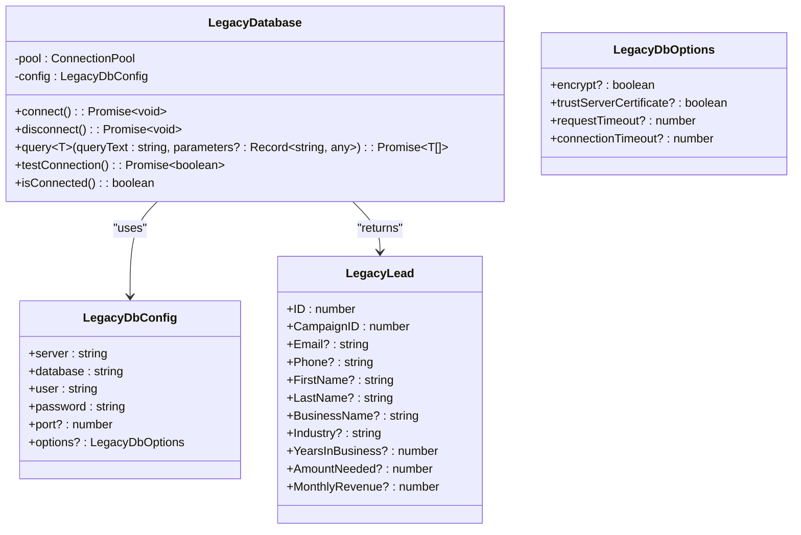
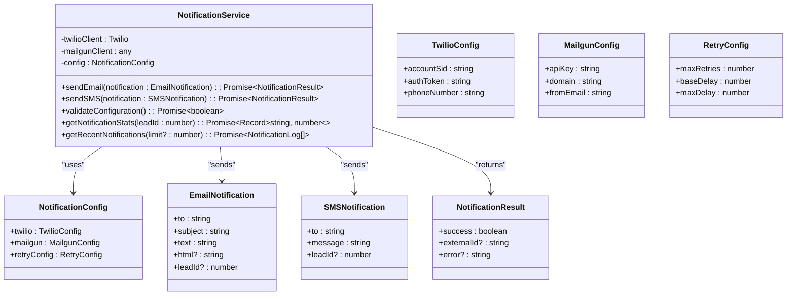
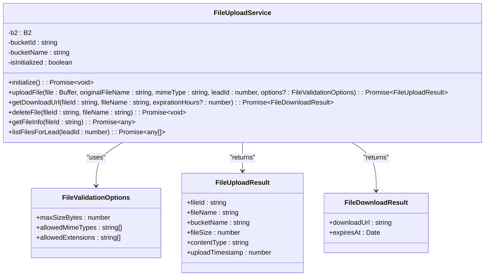
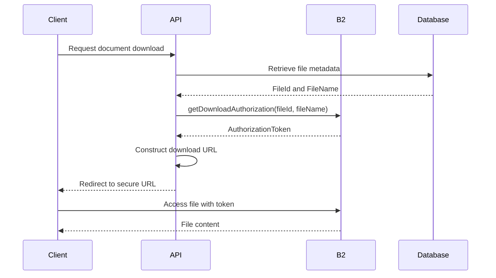
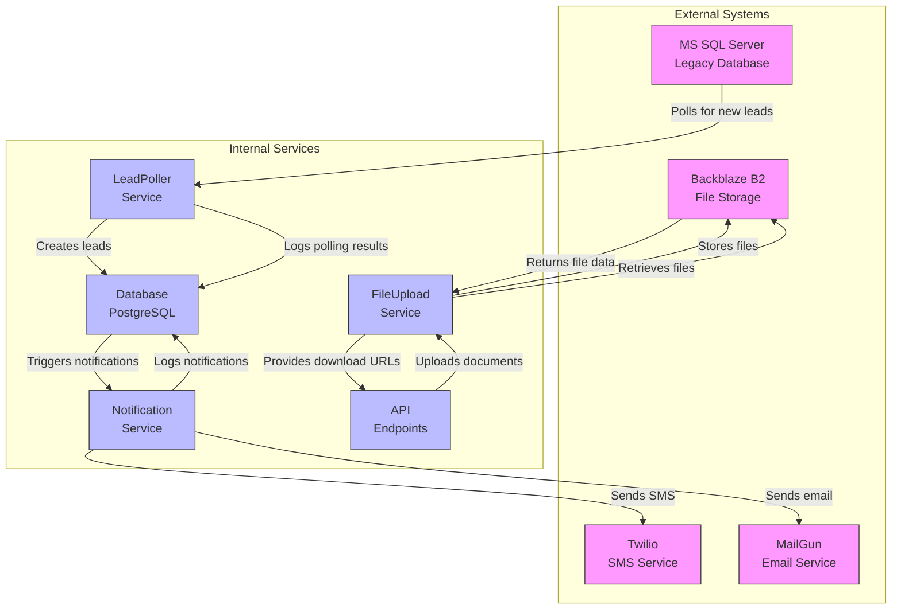

# External Integrations

<cite>
**Referenced Files in This Document**   
- [legacy-db.ts](file://src/lib/legacy-db.ts#L1-L158)
- [notifications.ts](file://src/lib/notifications.ts#L1-L222)
- [NotificationService.ts](file://src/services/NotificationService.ts#L1-L472)
- [FileUploadService.ts](file://src/services/FileUploadService.ts#L1-L307)
- [prisma.ts](file://src/lib/prisma.ts#L1-L61)
- [schema.prisma](file://prisma/schema.prisma#L1-L258)
- [SystemSettingsService.ts](file://src/services/SystemSettingsService.ts#L1-L352)
- [logger.ts](file://src/lib/logger.ts)
</cite>

## Table of Contents
1. [MS SQL Server Legacy Database Integration](#ms-sql-server-legacy-database-integration)
2. [Twilio SMS and MailGun Email Integration](#twilio-sms-and-mailgun-email-integration)
3. [Backblaze B2 File Storage Integration](#backblaze-b2-file-storage-integration)
4. [Integration Data Flow Diagrams](#integration-data-flow-diagrams)
5. [Configuration and Authentication](#configuration-and-authentication)
6. [Error Handling and Reliability](#error-handling-and-reliability)

## MS SQL Server Legacy Database Integration

The fund-track system integrates with a legacy MS SQL Server database using the `mssql` package to retrieve lead data. This integration is implemented as a singleton class `LegacyDatabase` that manages connection pooling, query execution, and error handling.

The integration uses environment variables to configure the database connection, including server, database name, credentials, and connection options. Connection pooling is handled automatically by the `mssql` package through the `ConnectionPool` class, which maintains a pool of active connections to improve performance and reduce connection overhead.

**Diagram sources**
- [legacy-db.ts](file://src/lib/legacy-db.ts#L1-L158)

**Section sources**
- [legacy-db.ts](file://src/lib/legacy-db.ts#L1-L158)

### Connection Management

The `LegacyDatabase` class implements lazy connection initialization and connection pooling. When a query is executed, the system checks if a connection pool already exists. If not, it creates a new pool with the configured settings. The connection configuration includes default timeouts (30 seconds for requests, 15 seconds for connections) and security settings (certificate trust enabled by default).

Connection parameters are derived from environment variables with sensible defaults:
- **LEGACY_DB_SERVER**: Database server address
- **LEGACY_DB_DATABASE**: Database name (defaults to "LeadData2")
- **LEGACY_DB_USER**: Authentication username
- **LEGACY_DB_PASSWORD**: Authentication password
- **LEGACY_DB_PORT**: Port number (defaults to 1433)
- **LEGACY_DB_ENCRYPT**: Whether to use encryption (boolean)
- **LEGACY_DB_TRUST_CERT**: Whether to trust server certificate (boolean)

### Data Transformation

The integration transforms raw database records into TypeScript interfaces. The `LegacyLead` interface defines the expected structure of lead data from the legacy system, including contact information, business details, and financial metrics. The system uses flexible typing with index signatures to accommodate additional fields that may exist in the legacy database but are not explicitly defined in the interface.

Query results are automatically transformed from the mssql recordset format to plain JavaScript objects through the `recordset` property access. This transformation enables seamless integration with the rest of the application's data processing pipeline.

## Twilio SMS and MailGun Email Integration

The notification system integrates with Twilio for SMS messaging and MailGun for email delivery through a unified `NotificationService` class. This service provides a consistent interface for sending notifications while handling the specific requirements of each external service.

**Diagram sources**
- [NotificationService.ts](file://src/services/NotificationService.ts#L1-L472)

**Section sources**
- [NotificationService.ts](file://src/services/NotificationService.ts#L1-L472)
- [notifications.ts](file://src/lib/notifications.ts#L1-L222)

### Configuration Parameters

The notification service is configured through environment variables and system settings stored in the database. Environment variables provide the essential credentials and identifiers:

- **TWILIO_ACCOUNT_SID**: Twilio account identifier
- **TWILIO_AUTH_TOKEN**: Twilio authentication token
- **TWILIO_PHONE_NUMBER**: Sender phone number for SMS
- **MAILGUN_API_KEY**: MailGun API key
- **MAILGUN_DOMAIN**: MailGun sending domain
- **MAILGUN_FROM_EMAIL**: Sender email address

Additional configuration parameters are managed through the system settings service, allowing runtime configuration without code changes:
- **sms_notifications_enabled**: Boolean flag to enable/disable SMS
- **email_notifications_enabled**: Boolean flag to enable/disable email
- **notification_retry_attempts**: Number of retry attempts
- **notification_retry_delay**: Base delay between retries in milliseconds

### Message Templates

The system uses predefined message templates for different notification scenarios. These templates are implemented as helper functions in the `notifications.ts` file:

- **Intake Notification**: Sends initial application link to leads
- **Follow-up Notification**: Sends reminder messages at different intervals (3h, 9h, 24h, 72h)
- **Status Change Notification**: Notifies staff of lead status changes

Each template includes both plain text and HTML versions for email messages, with responsive design elements. SMS messages are optimized for mobile viewing with concise content and direct links.

### Rate Limiting

The system implements rate limiting to prevent spamming recipients. Two levels of rate limiting are enforced:

1. **Per-recipient hourly limit**: Maximum of 2 notifications per hour to the same email address or phone number
2. **Per-lead daily limit**: Maximum of 10 notifications per day for the same lead

The rate limiting logic queries the `notification_log` table to count recent successful notifications before sending new ones. If limits are exceeded, the notification is rejected with an appropriate error message.

### Retry Mechanisms

Failed notifications are automatically retried using exponential backoff. The retry configuration includes:
- Maximum number of retry attempts (configurable)
- Base delay between attempts (configurable)
- Maximum delay cap (30 seconds)

The `executeWithRetry` method implements the retry logic, doubling the delay after each failed attempt (e.g., 1s, 2s, 4s, 8s). Each retry attempt is logged, and the final result is recorded in the notification log.

## Backblaze B2 File Storage Integration

The document management system integrates with Backblaze B2 cloud storage through the `FileUploadService` class. This service handles file uploads, downloads, and management for lead documents.

**Diagram sources**
- [FileUploadService.ts](file://src/services/FileUploadService.ts#L1-L307)

**Section sources**
- [FileUploadService.ts](file://src/services/FileUploadService.ts#L1-L307)

### Upload Workflows

The file upload process follows these steps:
1. Initialize the B2 connection if not already connected
2. Validate the file against size, type, and content requirements
3. Generate a unique file name to prevent conflicts
4. Obtain an upload URL from B2
5. Upload the file with metadata
6. Return upload result with file information

Files are organized in a hierarchical structure within the B2 bucket: `leads/{leadId}/{timestamp}-{hash}-{originalName}`. This structure groups files by lead and prevents naming conflicts.

### URL Generation

The system generates secure, time-limited download URLs using B2's download authorization mechanism. By default, URLs expire after 24 hours, but this can be customized. The download URL includes an authorization token that grants temporary access to the specific file.

**Diagram sources**
- [FileUploadService.ts](file://src/services/FileUploadService.ts#L1-L307)

### Security Considerations

The file storage implementation includes several security measures:
- **File validation**: Checks file size (max 10MB), MIME type, and extension against allowed lists
- **Secure naming**: Uses timestamp and hash to prevent predictable file names
- **Metadata encryption**: Stores original file name and lead ID in B2 file info
- **Temporary access**: Download URLs expire after a configurable period
- **Authentication**: Uses B2 application keys for API access

The allowed file types are restricted to common document formats: PDF, JPEG, PNG, and DOCX. Empty files are rejected during validation.

## Integration Data Flow Diagrams

The following diagram illustrates the data flow between internal services and external systems:

**Diagram sources**
- [legacy-db.ts](file://src/lib/legacy-db.ts#L1-L158)
- [NotificationService.ts](file://src/services/NotificationService.ts#L1-L472)
- [FileUploadService.ts](file://src/services/FileUploadService.ts#L1-L307)

## Configuration and Authentication

Each external integration uses environment variables for authentication credentials and configuration parameters. These values are loaded at runtime and validated before service initialization.

### Authentication Methods

- **MS SQL Server**: SQL Server authentication with username and password
- **Twilio**: Account SID and Auth Token for API authentication
- **MailGun**: API key for HTTP authentication
- **Backblaze B2**: Application Key ID and Application Key for API access

All credentials are stored in environment variables and never committed to version control. The system validates the presence of required environment variables during startup.

### Configuration Requirements

The following environment variables must be configured for the integrations to function:

**Database Integration**
- LEGACY_DB_SERVER
- LEGACY_DB_DATABASE
- LEGACY_DB_USER
- LEGACY_DB_PASSWORD
- LEGACY_DB_PORT (optional)
- LEGACY_DB_ENCRYPT (optional)
- LEGACY_DB_TRUST_CERT (optional)

**Notification Integration**
- TWILIO_ACCOUNT_SID
- TWILIO_AUTH_TOKEN
- TWILIO_PHONE_NUMBER
- MAILGUN_API_KEY
- MAILGUN_DOMAIN
- MAILGUN_FROM_EMAIL
- INTAKE_BASE_URL

**File Storage Integration**
- B2_APPLICATION_KEY_ID
- B2_APPLICATION_KEY
- B2_BUCKET_NAME
- B2_BUCKET_ID

Runtime configuration parameters are managed through the system settings service, which stores settings in the PostgreSQL database. This allows administrators to modify behavior without redeploying the application.

## Error Handling and Reliability

The system implements comprehensive error handling and reliability mechanisms for external service failures.

### Error Handling Strategies

Each integration includes specific error handling:

**MS SQL Server Integration**
- Connection errors are caught and rethrown with descriptive messages
- Query execution errors are logged with full error details
- The system maintains connection state and prevents operations on disconnected pools
- Connection attempts are logged for monitoring

**Notification Integration**
- Failed notifications are logged in the `notification_log` table with error details
- Retry logic handles transient failures with exponential backoff
- Rate limiting failures are handled gracefully without blocking other operations
- Configuration validation occurs before sending notifications

**File Storage Integration**
- File validation errors prevent uploads of invalid files
- Upload and download errors are logged with context (file name, lead ID)
- Missing or invalid B2 credentials result in initialization failure
- File operations include comprehensive error logging

### Fallback Mechanisms

The system implements several fallback mechanisms for external service failures:

- **Connection pooling**: Maintains connection state and reconnects automatically when needed
- **Retry mechanisms**: Automatically retries failed operations with exponential backoff
- **Graceful degradation**: When a service is disabled (e.g., SMS disabled), the system continues to function with other services
- **Comprehensive logging**: All integration activities are logged for troubleshooting and auditing
- **Health checks**: The system can validate external service connectivity before attempting operations

The notification service includes a fallback strategy where if one channel fails, the other may still succeed. For example, if email is disabled but SMS is enabled, the system will still send SMS notifications.

### Reliability Concerns

The system addresses reliability concerns through:

- **Singleton instances**: Each service uses a singleton pattern to maintain state and connection pools
- **Connection management**: Services manage their own connections and handle reconnection logic
- **Error isolation**: Failures in one integration do not affect others
- **Monitoring**: Comprehensive logging enables monitoring of integration health
- **Configuration validation**: Services validate their configuration before operation

The system is designed to handle transient network issues, service outages, and configuration errors while maintaining data integrity and providing clear error reporting.

**Section sources**
- [legacy-db.ts](file://src/lib/legacy-db.ts#L1-L158)
- [NotificationService.ts](file://src/services/NotificationService.ts#L1-L472)
- [FileUploadService.ts](file://src/services/FileUploadService.ts#L1-L307)
- [SystemSettingsService.ts](file://src/services/SystemSettingsService.ts#L1-L352)
- [logger.ts](file://src/lib/logger.ts)