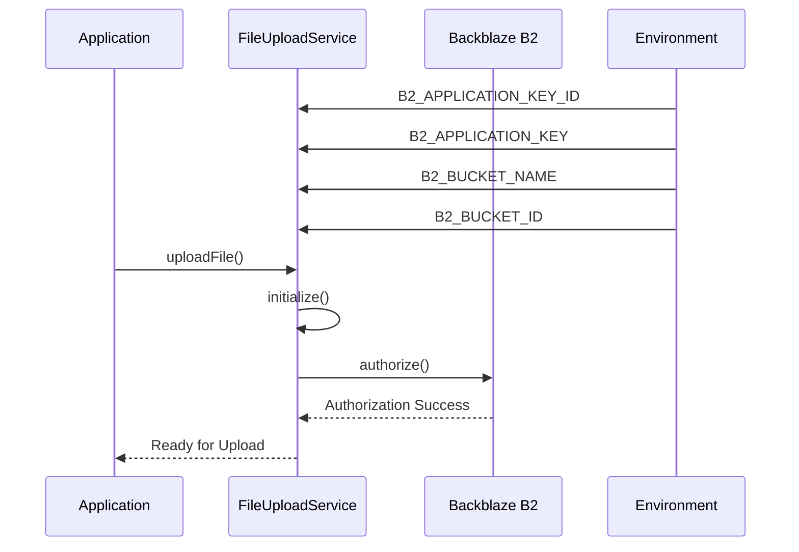
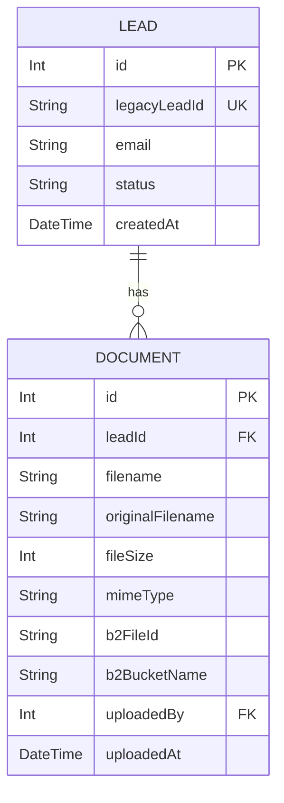
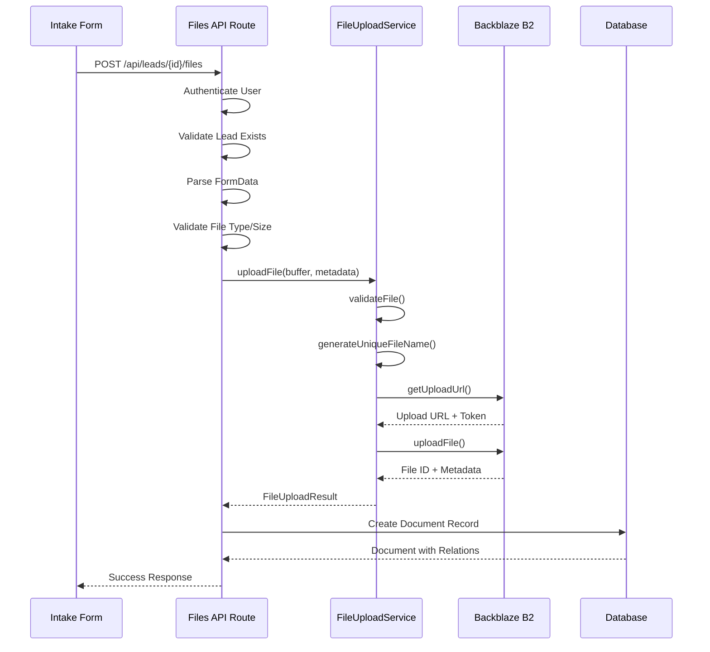
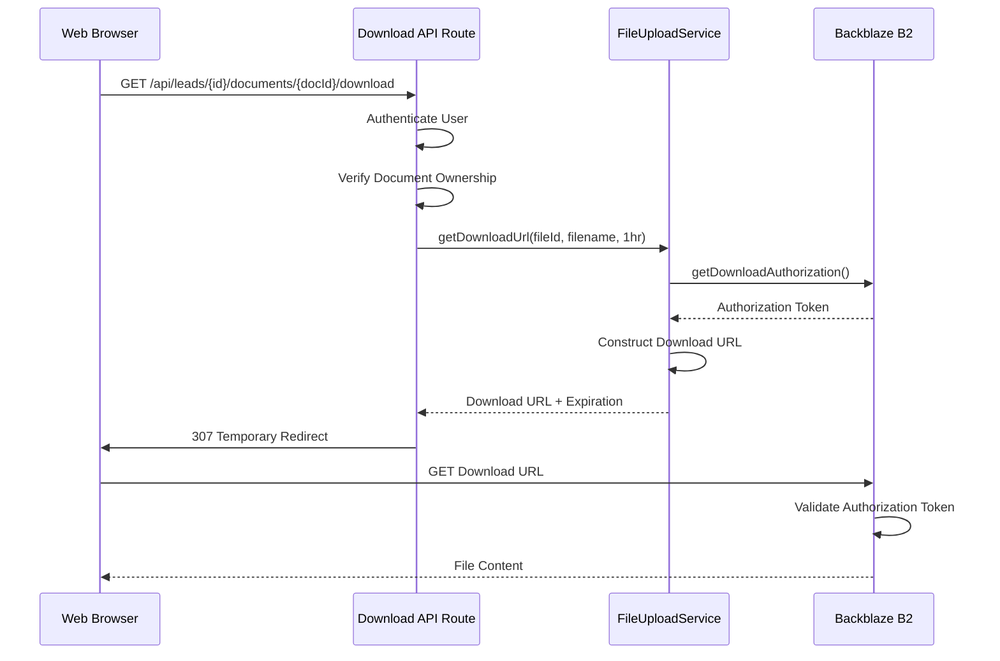
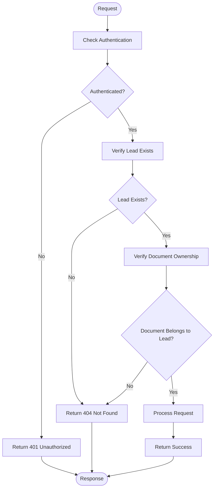
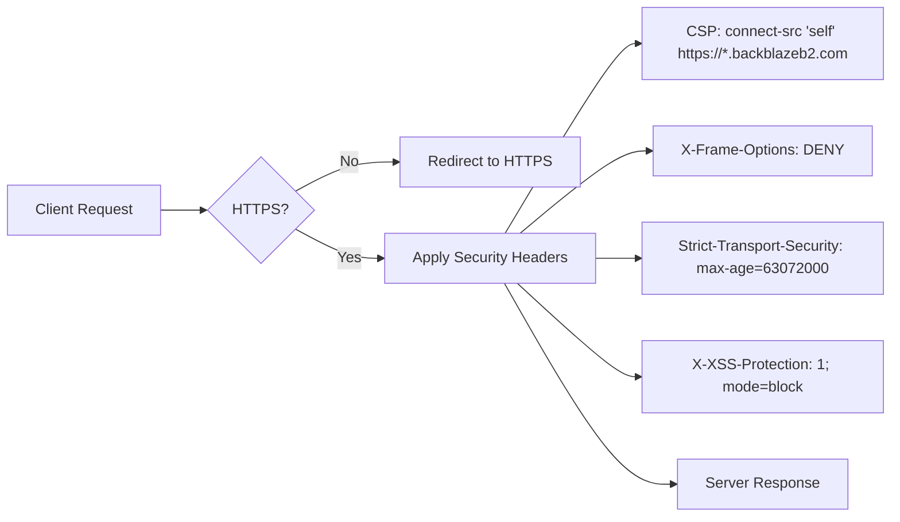
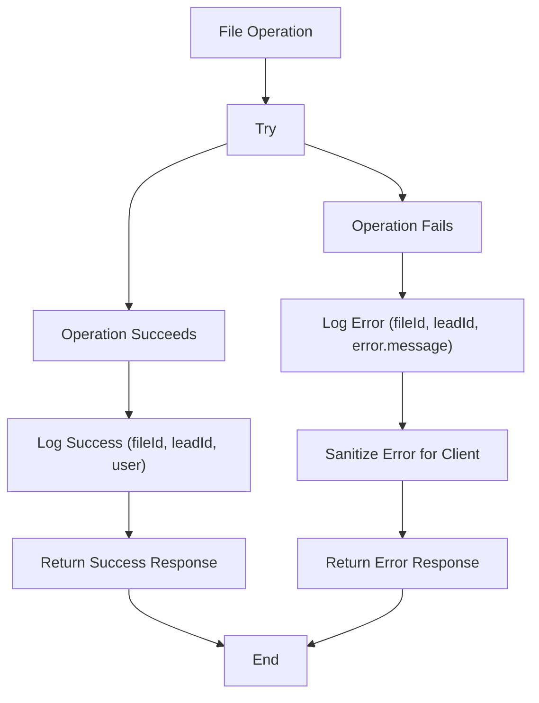

# File Storage Integration

<cite>
**Referenced Files in This Document**   
- [FileUploadService.ts](file://src/services/FileUploadService.ts#L0-L307)
- [schema.prisma](file://prisma/schema.prisma#L0-L258)
- [route.ts](file://src/app/api/leads/[id]/files/route.ts#L0-L253)
- [route.ts](file://src/app/api/leads/[id]/documents/[documentId]/download/route.ts#L0-L81)
- [middleware.ts](file://src/middleware.ts#L0-L189)
- [backblaze-b2.d.ts](file://src/types/backblaze-b2.d.ts#L0-L67)
</cite>

## Table of Contents
1. [Authentication and Configuration](#authentication-and-configuration)
2. [Data Model and Database Schema](#data-model-and-database-schema)
3. [File Upload Workflow](#file-upload-workflow)
4. [Secure File Download Mechanism](#secure-file-download-mechanism)
5. [Security Practices and Access Control](#security-practices-and-access-control)
6. [CORS and Security Headers](#cors-and-security-headers)
7. [Error Handling and Logging](#error-handling-and-logging)

## Authentication and Configuration

The Backblaze B2 integration is configured using environment variables that store the application key ID, application key, bucket name, and bucket ID. These credentials are used to authenticate with the Backblaze B2 service and establish a secure connection for file operations.

The `FileUploadService` class initializes the B2 client during construction using these environment variables. The service implements lazy initialization through the `initialize()` method, which authorizes the connection only when needed and ensures it is not re-authorized unnecessarily.

**Diagram sources**
- [FileUploadService.ts](file://src/services/FileUploadService.ts#L0-L57)
- [FileUploadService.ts](file://src/services/FileUploadService.ts#L59-L85)

**Section sources**
- [FileUploadService.ts](file://src/services/FileUploadService.ts#L0-L85)

## Data Model and Database Schema

The data model includes a `Document` entity that stores metadata about uploaded files and maintains a relationship with the `Lead` entity. This design enables tracking of documents associated with specific leads while storing the actual file content in Backblaze B2.

The `Document` model contains fields for storing the original filename, file size, MIME type, and Backblaze-specific identifiers (file ID and bucket name). It also tracks the user who uploaded the file and the timestamp of upload. The foreign key relationship with `Lead` ensures referential integrity and enables cascading deletion of documents when a lead is removed.

**Diagram sources**
- [schema.prisma](file://prisma/schema.prisma#L130-L158)

**Section sources**
- [schema.prisma](file://prisma/schema.prisma#L130-L158)

## File Upload Workflow

The file upload workflow begins with a POST request to the `/api/leads/[id]/files` endpoint. The process involves several validation and processing steps to ensure secure and reliable file storage.

When a file is submitted through the intake form, the API route first validates authentication and verifies that the lead exists. It then performs client-side validation on file type and size before converting the file to a buffer for upload. The `FileUploadService` handles the actual upload to Backblaze B2 after validating the file against predefined criteria.

The service generates a unique filename using a combination of the lead ID, timestamp, and MD5 hash to prevent naming conflicts and ensure file uniqueness. Upon successful upload, the service stores metadata in the database, creating a reference between the lead and the uploaded document.

**Diagram sources**
- [route.ts](file://src/app/api/leads/[id]/files/route.ts#L0-L253)
- [FileUploadService.ts](file://src/services/FileUploadService.ts#L0-L307)

**Section sources**
- [route.ts](file://src/app/api/leads/[id]/files/route.ts#L0-L253)
- [FileUploadService.ts](file://src/services/FileUploadService.ts#L0-L307)

## Secure File Download Mechanism

The system generates temporary signed URLs for secure file downloads, ensuring that access to documents is time-limited and controlled. The download process begins with a GET request to the `/api/leads/[id]/documents/[documentId]/download` endpoint.

The download route first authenticates the user and verifies that the requested document belongs to the specified lead. It then uses the `FileUploadService.getDownloadUrl()` method to generate a pre-signed URL with a limited expiration period (1 hour by default). The service obtains a download authorization token from Backblaze B2 that is valid for a specified duration, then constructs a download URL that includes this token as a query parameter.

Instead of proxying the file content, the API redirects the client to the generated Backblaze B2 download URL, offloading the file transfer to the storage provider while maintaining secure access control.

**Diagram sources**
- [route.ts](file://src/app/api/leads/[id]/documents/[documentId]/download/route.ts#L0-L81)
- [FileUploadService.ts](file://src/services/FileUploadService.ts#L200-L237)

**Section sources**
- [route.ts](file://src/app/api/leads/[id]/documents/[documentId]/download/route.ts#L0-L81)
- [FileUploadService.ts](file://src/services/FileUploadService.ts#L200-L237)

## Security Practices and Access Control

The application implements multiple layers of security to prevent unauthorized file access. Access control is enforced through NextAuth authentication and role-based permissions. The middleware protects all API routes (except public ones) by requiring valid authentication tokens.

For file-specific operations, the system implements ownership verification by checking that the requested document belongs to the specified lead. This prevents users from accessing documents from leads they shouldn't have access to, even if they know the document ID. The API routes validate both the lead ID and document ID before proceeding with any operations.

The `RoleGuard` component enforces role-based access control on the frontend, while the API routes perform the same checks on the backend to ensure security cannot be bypassed by manipulating the client-side code.

**Diagram sources**
- [middleware.ts](file://src/middleware.ts#L128-L162)
- [route.ts](file://src/app/api/leads/[id]/files/route.ts#L0-L253)
- [route.ts](file://src/app/api/leads/[id]/documents/[documentId]/download/route.ts#L0-L81)

**Section sources**
- [middleware.ts](file://src/middleware.ts#L128-L162)
- [route.ts](file://src/app/api/leads/[id]/files/route.ts#L0-L253)
- [route.ts](file://src/app/api/leads/[id]/documents/[documentId]/download/route.ts#L0-L81)

## CORS and Security Headers

The application configures security headers through Next.js configuration rather than traditional CORS settings. The `next.config.mjs` file defines a Content Security Policy (CSP) that allows connections to Backblaze B2 endpoints (`https://*.backblazeb2.com`) while restricting other external connections.

The CSP header also defines policies for script, style, image, and font sources, helping prevent cross-site scripting (XSS) attacks. Additional security headers include Strict-Transport-Security (HSTS), X-Frame-Options (to prevent clickjacking), and X-Content-Type-Options (to prevent MIME type sniffing).

HTTPS enforcement is implemented both through middleware (for runtime redirects) and Next.js configuration (for build-time redirects), ensuring all traffic uses encrypted connections in production.

**Diagram sources**
- [next.config.mjs](file://next.config.mjs#L18-L71)
- [middleware.ts](file://src/middleware.ts#L87-L126)

**Section sources**
- [next.config.mjs](file://next.config.mjs#L18-L71)
- [middleware.ts](file://src/middleware.ts#L87-L126)

## Error Handling and Logging

The file storage integration implements comprehensive error handling and logging to ensure reliability and aid in troubleshooting. All critical operations are wrapped in try-catch blocks that log detailed error information while returning appropriate HTTP status codes to clients.

The `FileUploadService` class includes extensive logging for both successful operations and failures, capturing relevant context such as file IDs, lead IDs, and user information. Error messages returned to clients are sanitized to prevent information leakage, while detailed error information is preserved in server logs.

For file deletion operations, the system implements a resilient pattern that attempts to delete the file from Backblaze B2 but continues with database cleanup even if the storage deletion fails, preventing orphaned database records.

**Section sources**
- [FileUploadService.ts](file://src/services/FileUploadService.ts#L0-L307)
- [route.ts](file://src/app/api/leads/[id]/files/route.ts#L0-L253)
- [route.ts](file://src/app/api/leads/[id]/documents/[documentId]/download/route.ts#L0-L81)