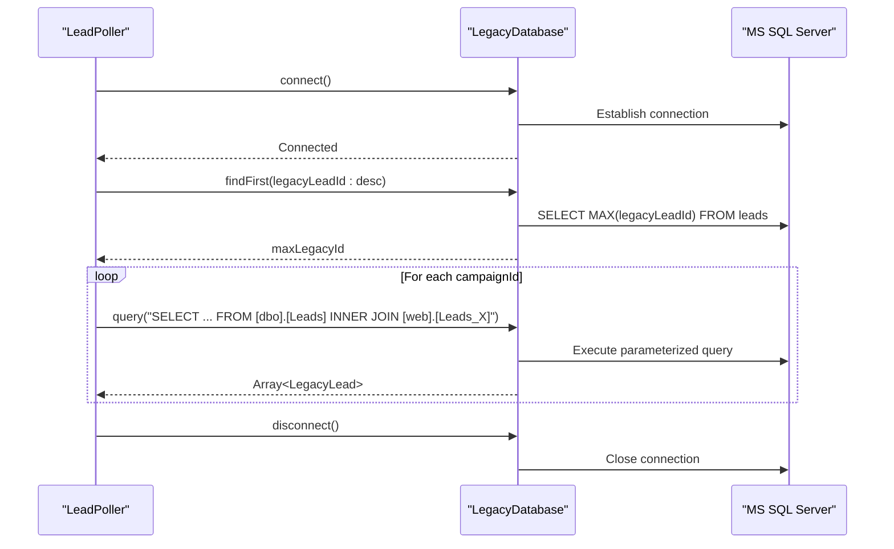
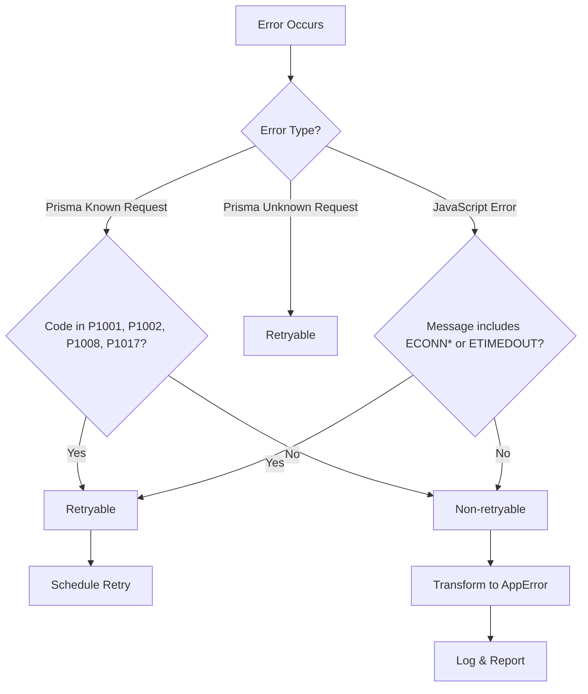
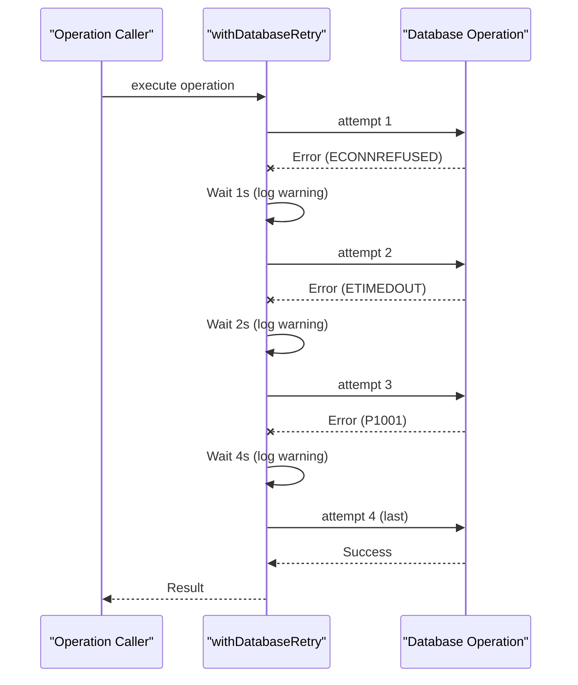
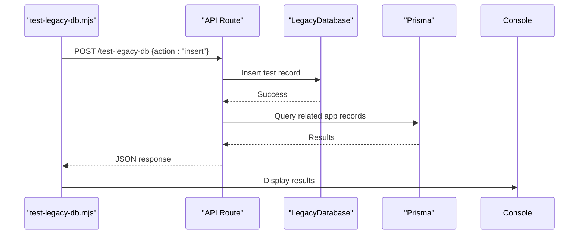

# Legacy Database Integration

<cite>
**Referenced Files in This Document**   
- [LeadPoller.ts](file://src/services/LeadPoller.ts)
- [legacy-db.ts](file://src/lib/legacy-db.ts)
- [test-legacy-db.mjs](file://scripts/test-legacy-db.mjs)
- [route.ts](file://src/app/api/dev/test-legacy-db/route.ts)
- [legacy-db.ts](file://src/lib/legacy-db.ts)
- [database-error-handler.ts](file://src/lib/database-error-handler.ts)
- [ConnectivityCheck.tsx](file://src/components/admin/ConnectivityCheck.tsx)
- [route.ts](file://src/app/api/admin/connectivity/legacy-db/route.ts)
</cite>

## Table of Contents
1. [Introduction](#introduction)
2. [Connection Configuration and Pooling](#connection-configuration-and-pooling)
3. [Query Execution Patterns](#query-execution-patterns)
4. [Data Transformation Logic](#data-transformation-logic)
5. [Error Handling Mechanisms](#error-handling-mechanisms)
6. [Retry Logic and Circuit Breaker Patterns](#retry-logic-and-circuit-breaker-patterns)
7. [Diagnostic Testing Support](#diagnostic-testing-support)
8. [Monitoring Connectivity Health](#monitoring-connectivity-health)

## Introduction
This document provides a comprehensive overview of the MS SQL Server legacy database integration within the application. It details the architecture, configuration, and operational patterns used to poll leads, transform data, and maintain reliable connectivity. The integration is primarily managed through the `LeadPoller` service, which orchestrates communication with the legacy system using environment-based configuration, secure credential management, and robust error handling.

The system supports diagnostic testing via API routes and scripts, and includes monitoring capabilities for tracking connectivity health. This documentation aims to provide both technical and operational insights into how the application interacts with the legacy database, ensuring data consistency, reliability, and security.

## Connection Configuration and Pooling

The legacy database connection is configured using environment variables, enabling secure credential management without hardcoding sensitive information. The connection is established through the `mssql` package, which supports connection pooling to optimize performance and resource utilization.

Configuration parameters are read from environment variables such as `LEGACY_DB_SERVER`, `LEGACY_DB_DATABASE`, `LEGACY_DB_USER`, and `LEGACY_DB_PASSWORD`. Additional options like encryption, certificate trust, timeouts, and port settings are also configurable via environment variables, allowing flexible deployment across different environments.

A singleton pattern is used to manage the database connection pool, ensuring that only one connection instance exists throughout the application lifecycle. This prevents unnecessary connection overhead and ensures consistent state management.

```mermaid
classDiagram
class LegacyDatabase {
-pool : ConnectionPool
-config : LegacyDbConfig
+connect() : Promise~void~
+disconnect() : Promise~void~
+query~T~(queryText : string, parameters? : Record~string, any~) : Promise~T[]~
+testConnection() : Promise~boolean~
+isConnected() : boolean
}
class LegacyDbConfig {
+server : string
+database : string
+user : string
+password : string
+port? : number
+options? : LegacyDbOptions
}
class LegacyDbOptions {
+encrypt? : boolean
+trustServerCertificate? : boolean
+requestTimeout? : number
+connectionTimeout? : number
+enableArithAbort? : boolean
+abortTransactionOnError? : boolean
}
LegacyDatabase --> LegacyDbConfig : "uses"
LegacyDatabase --> "mssql.ConnectionPool" : "manages"
```

**Diagram sources**
- [legacy-db.ts](file://src/lib/legacy-db.ts#L1-L158)

**Section sources**
- [legacy-db.ts](file://src/lib/legacy-db.ts#L1-L158)

## Query Execution Patterns

The integration uses raw SQL queries rather than stored procedures to retrieve lead data from the legacy MS SQL Server database. Queries are dynamically constructed based on campaign IDs and executed using parameterized statements to prevent SQL injection.

Lead polling involves joining two tables: `[dbo].[Leads]` (containing contact information) and `[web].[Leads_CampaignID]` (containing business-specific data). The query selects fields such as name, email, phone, address, business name, industry, years in business, amount needed, and monthly revenue.

Each campaign has its own table (e.g., `Leads_11302`), and the system iterates over configured campaign IDs to fetch leads incrementally since the last imported ID. This ensures only new records are processed.



**Diagram sources**
- [LeadPoller.ts](file://src/services/LeadPoller.ts#L1-L522)
- [legacy-db.ts](file://src/lib/legacy-db.ts#L1-L158)

**Section sources**
- [LeadPoller.ts](file://src/services/LeadPoller.ts#L1-L522)

## Data Transformation Logic

The system maps legacy schema fields to the application's `Lead` model through a structured transformation process in the `transformLegacyLead` method. This includes data sanitization, type conversion, and default value assignment.

Key transformations include:
- **String sanitization**: Trimming whitespace and converting empty strings to `null`
- **Phone number formatting**: Removing non-digit characters and validating length
- **Numeric field handling**: Converting `AmountNeeded` and `MonthlyRevenue` to strings (as per schema migration)
- **Address mapping**: Legacy address fields are mapped to personal (not business) address fields
- **Status initialization**: New leads are set to `PENDING` status with a generated intake token

Fields not present in the legacy system (e.g., business address, DBA, tax ID) are initialized as `null` for later completion during the intake process.

```mermaid
flowchart TD
A[Raw Legacy Lead] --> B{Sanitize Strings}
B --> C[Trim & Nullify Empty]
A --> D{Sanitize Phone}
D --> E[Remove Non-Digits]
E --> F{Valid Length?}
F --> |Yes| G[Keep]
F --> |No| H[Set to Null]
C --> I[Transform to Application Model]
G --> I
I --> J[Map to Lead Fields]
J --> K[Initialize Missing Fields as Null]
K --> L[Set Status: PENDING]
L --> M[Generate Intake Token]
M --> N[Return Omit<Lead, id|createdAt|updatedAt>]
```

**Diagram sources**
- [LeadPoller.ts](file://src/services/LeadPoller.ts#L312-L407)

**Section sources**
- [LeadPoller.ts](file://src/services/LeadPoller.ts#L312-L407)

## Error Handling Mechanisms

The integration implements comprehensive error handling for various failure scenarios:

- **Network failures**: Connection timeouts, ECONNRESET, ECONNREFUSED, ETIMEDOUT
- **Authentication issues**: Invalid credentials or access denied
- **Schema mismatches**: Missing or unexpected fields in query results
- **Data integrity errors**: Duplicate records, constraint violations

Errors are logged with contextual metadata and transformed into standardized application errors using the `transformPrismaError` function. Specific error types include `DatabaseError`, `ValidationError`, `ConflictError`, and `NotFoundError`.

Transient errors trigger retry logic, while permanent errors are reported without retrying. The system distinguishes between operational errors (expected, recoverable) and programming errors (unexpected, fatal).



**Diagram sources**
- [database-error-handler.ts](file://src/lib/database-error-handler.ts#L42-L92)
- [errors.ts](file://src/lib/errors.ts#L0-L143)

**Section sources**
- [database-error-handler.ts](file://src/lib/database-error-handler.ts#L42-L92)

## Retry Logic and Circuit Breaker Patterns

The system implements exponential backoff retry logic for transient database failures. The `withDatabaseRetry` function wraps database operations and retries them up to three times with increasing delays (1s, 2s, 4s by default).

Retry conditions include:
- Prisma connection errors (`P1001`, `P1002`, `P1008`, `P1017`)
- Network errors (`ECONNRESET`, `ECONNREFUSED`, `ETIMEDOUT`)
- Unknown Prisma request errors (assumed temporary)

Each retry attempt is logged with attempt number and delay. After exhausting retries, the final error is transformed and thrown. This pattern prevents cascading failures during temporary outages.

Although a full circuit breaker is not implemented, the retry mechanism serves a similar purpose by preventing repeated failed attempts and allowing time for recovery.



**Diagram sources**
- [database-error-handler.ts](file://src/lib/database-error-handler.ts#L133-L177)

**Section sources**
- [database-error-handler.ts](file://src/lib/database-error-handler.ts#L133-L177)

## Diagnostic Testing Support

The system provides multiple avenues for diagnostic testing of legacy database connectivity:

1. **API Endpoint**: `POST /api/dev/test-legacy-db` allows inserting, deleting, or cleaning up test records
2. **CLI Script**: `scripts/test-legacy-db.mjs` provides a command-line interface to test operations
3. **Status Check**: `GET /api/dev/test-legacy-db` returns current test record status in both databases

The test uses a predefined record with known values to verify write, read, and cleanup operations. This enables end-to-end validation of the integration pipeline, including data transformation and application-level processing.



**Diagram sources**
- [test-legacy-db.mjs](file://scripts/test-legacy-db.mjs#L0-L105)
- [route.ts](file://src/app/api/dev/test-legacy-db/route.ts#L0-L342)

**Section sources**
- [test-legacy-db.mjs](file://scripts/test-legacy-db.mjs#L0-L105)
- [route.ts](file://src/app/api/dev/test-legacy-db/route.ts#L0-L342)

## Monitoring Connectivity Health

Connectivity health is monitored through an admin API endpoint and a corresponding UI component. The `GET /api/admin/connectivity/legacy-db` route performs a connection test and returns detailed status information.

The monitoring process:
1. Authenticates the request (admin-only)
2. Attempts to connect to the legacy database
3. Executes a test query (`SELECT @@VERSION`)
4. Returns connection status, response time, server info, and configuration

The frontend `ConnectivityCheck` component displays real-time status with visual indicators (green/red/yellow) and detailed configuration information, enabling administrators to quickly assess connectivity.

```mermaid
graph TD
A[Admin User] --> B[ConnectivityCheck UI]
B --> C{Click Test}
C --> D[Fetch /api/admin/connectivity/legacy-db]
D --> E[Server: getLegacyDatabase().testConnection()]
E --> F{Connected?}
F --> |Yes| G[Query @@VERSION]
G --> H[Return status: connected]
F --> |No| I[Return status: failed]
H --> J[Display green checkmark]
I --> K[Display red cross]
J --> L[Show response time, server info]
K --> M[Show error message]
```

**Diagram sources**
- [route.ts](file://src/app/api/admin/connectivity/legacy-db/route.ts#L0-L88)
- [ConnectivityCheck.tsx](file://src/components/admin/ConnectivityCheck.tsx#L0-L192)

**Section sources**
- [route.ts](file://src/app/api/admin/connectivity/legacy-db/route.ts#L0-L88)
- [ConnectivityCheck.tsx](file://src/components/admin/ConnectivityCheck.tsx#L0-L192)