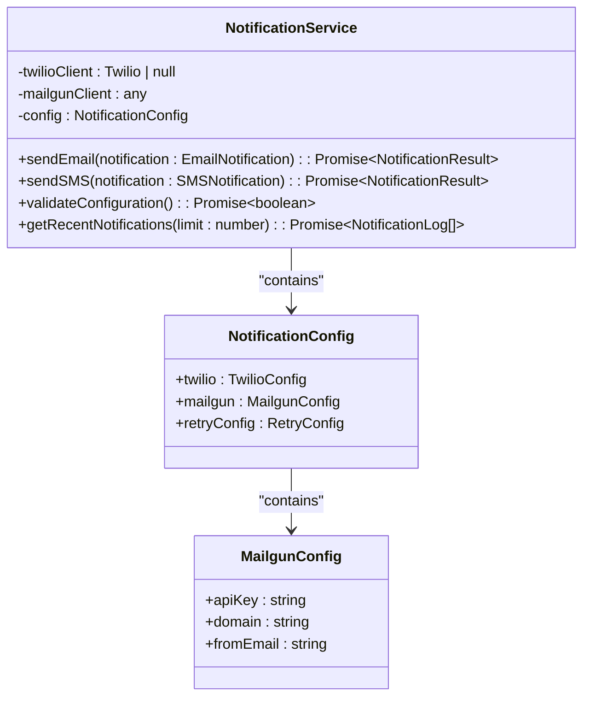
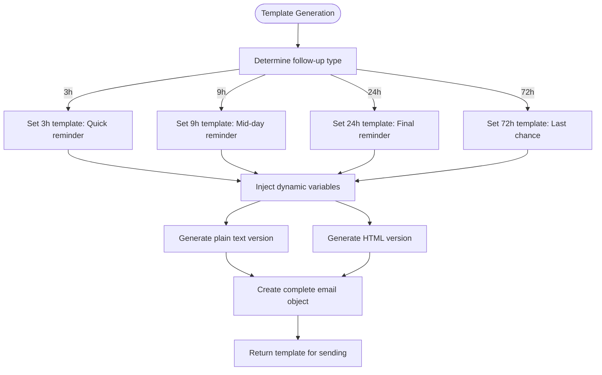
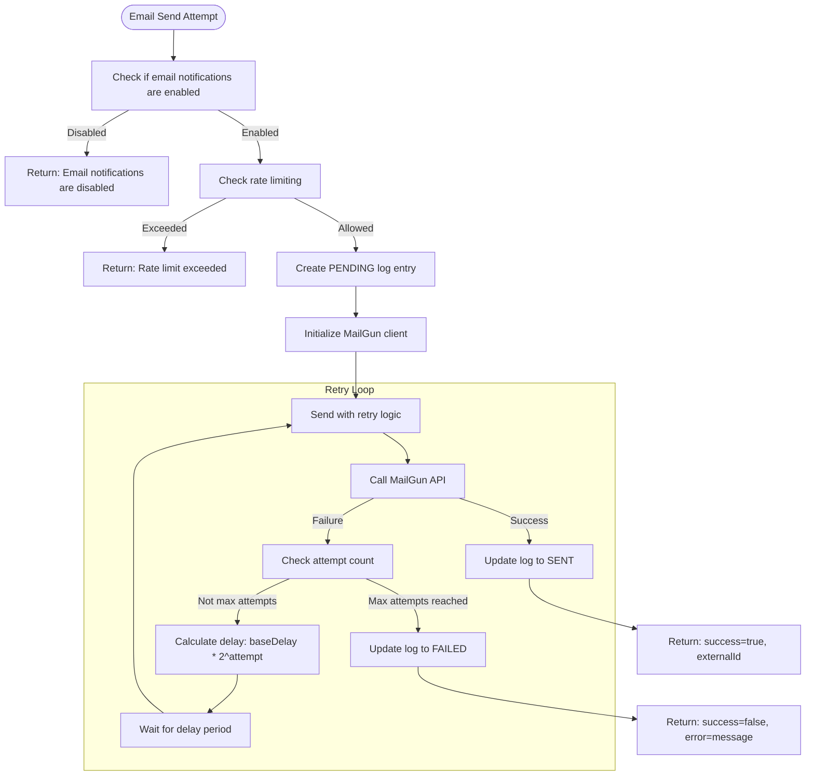
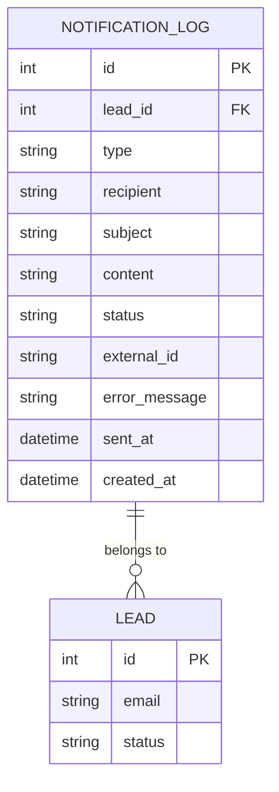
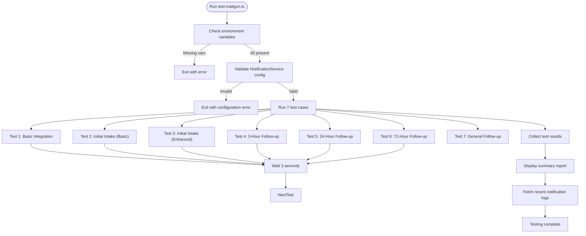

# MailGun Email Integration

<cite>
**Referenced Files in This Document**   
- [NotificationService.ts](file://src/services/NotificationService.ts)
- [test-mailgun.ts](file://test/test-mailgun.ts)
- [notifications.ts](file://src/lib/notifications.ts)
- [FollowUpScheduler.ts](file://src/services/FollowUpScheduler.ts)
- [schema.prisma](file://prisma/schema.prisma)
</cite>

## Table of Contents
1. [Configuration Requirements](#configuration-requirements)
2. [Email Template Structure](#email-template-structure)
3. [sendEmail Method Implementation](#sendemail-method-implementation)
4. [API Interaction Examples](#api-interaction-examples)
5. [Notification Logging and Status Tracking](#notification-logging-and-status-tracking)
6. [Testing Procedures](#testing-procedures)
7. [Best Practices for Sender Reputation](#best-practices-for-sender-reputation)

## Configuration Requirements

The MailGun email integration requires three essential environment variables to be configured for proper operation:

- **MAILGUN_API_KEY**: The API key for authenticating with the MailGun service
- **MAILGUN_DOMAIN**: The domain configured in your MailGun account for sending emails
- **MAILGUN_FROM_EMAIL**: The default sender email address that appears in the "From" field of outgoing emails

These configuration values are loaded during the initialization of the `NotificationService` class, which manages all email and SMS notifications in the application. The service validates these configuration values at startup and provides a `validateConfiguration()` method to programmatically check if all required environment variables are properly set.

The configuration is stored within the `NotificationService` class as part of its internal configuration object, which also includes retry settings for handling transient failures. The service supports both email (via MailGun) and SMS (via Twilio) notifications, with separate configuration sections for each provider.



**Diagram sources**
- [NotificationService.ts](file://src/services/NotificationService.ts#L20-L101)

**Section sources**
- [NotificationService.ts](file://src/services/NotificationService.ts#L53-L101)
- [test-mailgun.ts](file://test/test-mailgun.ts#L322-L367)

## Email Template Structure

The email integration supports both initial notifications and time-based follow-ups at 3-hour, 9-hour, 24-hour, and 72-hour intervals. Templates are structured to include both plain text and HTML versions, with dynamic variable injection for personalization.

### Initial Notification Templates
The initial intake notification is sent when a new lead is created and includes a personalized message with the recipient's name and a unique intake URL. The template is designed to encourage completion of the funding application with a prominent call-to-action button.

### Follow-up Templates
Follow-up notifications are automatically scheduled based on predefined time intervals:
- **3-hour follow-up**: A quick reminder sent shortly after the initial notification
- **9-hour follow-up**: A mid-day reminder for applications started earlier in the day
- **24-hour follow-up**: A final reminder sent one day after the initial notification
- **72-hour follow-up**: A last-chance reminder sent three days after the initial notification

Each follow-up template is dynamically generated based on the follow-up type, with subject lines and messaging that increase in urgency as the time interval increases. The templates support dynamic insertion of:
- Recipient name (first and last name or business name)
- Personalized intake URL with token
- Current timestamp and environment information

The template system uses string interpolation to inject dynamic values into both text and HTML content, ensuring that personalized information appears correctly in all email clients.



**Diagram sources**
- [notifications.ts](file://src/lib/notifications.ts#L25-L221)
- [FollowUpScheduler.ts](file://src/services/FollowUpScheduler.ts#L350-L440)

**Section sources**
- [test-mailgun.ts](file://test/test-mailgun.ts#L21-L200)
- [notifications.ts](file://src/lib/notifications.ts#L25-L221)

## sendEmail Method Implementation

The `sendEmail` method in `NotificationService.ts` implements a robust email sending process with comprehensive error handling, retry logic, and logging capabilities.

### Method Flow
1. **Configuration Check**: Verifies that email notifications are enabled in system settings
2. **Rate Limiting**: Checks if the recipient has exceeded notification limits (2 per hour, 10 per day per lead)
3. **Client Initialization**: Lazily initializes the MailGun client if not already created
4. **Log Creation**: Creates a notification log entry with status "PENDING"
5. **Retry Execution**: Attempts to send the email with exponential backoff retry logic
6. **Status Update**: Updates the log entry to "SENT" on success or "FAILED" on error

### MIME Formatting
The method supports both plain text and HTML email formats. When both `text` and `html` properties are provided in the notification object, the email is sent as a multipart MIME message. The `html` content is optional and can be omitted for plain text-only emails.

### Attachment Handling
The current implementation does not support email attachments. The MailGun client would need to be configured to handle file uploads, and the `sendEmailInternal` method would require modification to include attachment data in the message payload.

### Response Parsing
The method parses the MailGun API response to extract the `id` field, which is stored as the `externalId` in the notification log. This ID can be used for tracking delivery status through MailGun's webhook events (though webhook processing is not currently implemented in this codebase).

```mermaid
sequenceDiagram
participant Client as "Application"
participant Service as "NotificationService"
participant Mailgun as "MailGun API"
participant DB as "Database"
Client->>Service : sendEmail(notification)
Service->>Service : validateConfiguration()
Service->>Service : checkRateLimit()
Service->>DB : create notification log (PENDING)
Service->>Service : initializeClients()
Service->>Service : executeWithRetry()
loop Retry attempts (max 3)
Service->>Mailgun : POST /messages
alt Success
Mailgun-->>Service : 200 OK + message ID
Service->>DB : update log (SENT + externalId)
Service-->>Client : {success : true, externalId}
break
else Error
Service->>Service : calculate delay (exponential backoff)
Service->>Service : sleep(delay)
end
end
alt All retries failed
Service->>DB : update log (FAILED + error)
Service-->>Client : {success : false, error}
end
```

**Diagram sources**
- [NotificationService.ts](file://src/services/NotificationService.ts#L103-L295)

**Section sources**
- [NotificationService.ts](file://src/services/NotificationService.ts#L103-L295)

## API Interaction Examples

### Successful API Interaction
When an email is successfully sent, the MailGun API returns a 200 OK response with a JSON payload containing the message ID:

```json
{
  "id": "<20250826153012.1234567890@your-domain.com>",
  "message": "Queued. Thank you."
}
```

The `sendEmail` method captures this ID and returns a success result:
```typescript
{
  success: true,
  externalId: "<20250826153012.1234567890@your-domain.com>"
}
```

A corresponding entry is created in the `notification_log` table with status "sent" and the external ID.

### Failed API Interactions
The system handles several types of failure scenarios:

#### Authentication Failure
When the MAILGUN_API_KEY is invalid or missing:
```typescript
{
  success: false,
  error: "Mailgun client not initialized"
}
```

#### Invalid Recipient
When the recipient email address is malformed:
```typescript
{
  success: false,
  error: "Email validation failed: invalid email address"
}
```

#### Rate Limiting
When the recipient has received too many notifications:
```typescript
{
  success: false,
  error: "Rate limit exceeded: 2 notifications sent to user@example.com in the last hour"
}
```

#### Bounce Handling
While not explicitly handled in the current code, MailGun would classify bounced emails as delivery failures. These would be recorded in the notification log with status "failed" and an appropriate error message when the MailGun webhook is eventually implemented.

#### Spam Complaints
Similarly, spam complaints from recipients would be reported by MailGun through webhooks. The current system lacks webhook processing, so these events are not currently captured, but would appear as failed deliveries in the logs.

The retry mechanism uses exponential backoff with a base delay of 1 second, doubling with each attempt up to a maximum of 30 seconds, for a maximum of 3 retry attempts.



**Diagram sources**
- [NotificationService.ts](file://src/services/NotificationService.ts#L103-L295)

**Section sources**
- [NotificationService.ts](file://src/services/NotificationService.ts#L103-L295)
- [test-mailgun.ts](file://test/test-mailgun.ts#L240-L284)

## Notification Logging and Status Tracking

Email delivery status is recorded in the `notification_log` database table, which tracks the lifecycle of each notification. The table structure includes fields for:

- **id**: Primary key
- **leadId**: Foreign key to the lead record
- **type**: Notification type (EMAIL or SMS)
- **recipient**: Destination email address or phone number
- **subject**: Email subject line
- **content**: Plain text content
- **status**: Current status (PENDING, SENT, FAILED)
- **externalId**: Message ID from MailGun
- **errorMessage**: Error description if delivery failed
- **sentAt**: Timestamp when successfully sent
- **createdAt**: Creation timestamp

The status transitions follow a clear workflow:
1. **PENDING**: Created when `sendEmail` is called
2. **SENT**: Updated when MailGun API returns success
3. **FAILED**: Updated when all retry attempts fail

The system includes a `getRecentNotifications` method that retrieves the most recent notification logs for monitoring and debugging purposes. Additionally, the `NotificationCleanupService` periodically removes old notification records to prevent database bloat, keeping SENT notifications for 30 days and FAILED notifications for only 7 days.



**Diagram sources**
- [schema.prisma](file://prisma/schema.prisma#L140-L154)
- [NotificationService.ts](file://src/services/NotificationService.ts#L448-L471)

**Section sources**
- [schema.prisma](file://prisma/schema.prisma#L140-L154)
- [NotificationService.ts](file://src/services/NotificationService.ts#L448-L471)

## Testing Procedures

The MailGun integration can be tested using the `test-mailgun.ts` script located in the test directory. This script performs comprehensive testing of the email functionality.

### Test Execution
To run the tests:
1. Set the required environment variables in `.env.local`
2. Update the `TEST_EMAIL` constant in `test-mailgun.ts`
3. Execute: `npx tsx test-mailgun.ts`

### Test Cases
The script runs seven test cases:
1. **Basic Integration Test**: Verifies fundamental MailGun connectivity
2. **Initial Intake Notification (Basic)**: Tests the basic application completion reminder
3. **Initial Intake Notification (Enhanced)**: Tests the enhanced version with business details
4. **3-Hour Follow-up Reminder**: Tests the first follow-up message
5. **24-Hour Follow-up Reminder**: Tests the mid-term follow-up
6. **72-Hour Final Follow-up**: Tests the final reminder message
7. **General Follow-up Reminder**: Tests a standard reminder template

### Environment Validation
The test script first validates that all required environment variables are set:
- MAILGUN_API_KEY
- MAILGUN_DOMAIN
- MAILGUN_FROM_EMAIL

It also checks the NotificationService configuration using the `validateConfiguration()` method before proceeding with individual tests.

### Test Results
The script provides detailed output including:
- Configuration validation status
- Individual test results with success/failure status
- External message IDs for successful deliveries
- Error messages for failed attempts
- Recent notification log entries from the database

This comprehensive testing approach ensures that the MailGun integration is functioning correctly before deployment to production environments.



**Diagram sources**
- [test-mailgun.ts](file://test/test-mailgun.ts#L0-L400)

**Section sources**
- [test-mailgun.ts](file://test/test-mailgun.ts#L0-L400)

## Best Practices for Sender Reputation

Maintaining a good sender reputation is critical for ensuring email deliverability. The following best practices are implemented or recommended for this MailGun integration:

### Implemented Practices
- **Rate Limiting**: The system enforces limits of 2 notifications per hour per recipient and 10 per day per lead to prevent spam complaints
- **Proper Authentication**: Uses API key authentication with MailGun, ensuring messages are properly authenticated
- **Clear Unsubscribe Options**: While not explicitly shown in the code, production templates should include unsubscribe links
- **Accurate From Address**: Uses a configured MAILGUN_FROM_EMAIL that should be a valid, monitored address

### Recommended Practices
- **Domain Verification**: Ensure the MAILGUN_DOMAIN is properly verified with DNS records (SPF, DKIM, DMARC)
- **List Hygiene**: Regularly clean email lists to remove invalid addresses and reduce bounce rates
- **Content Quality**: Maintain high-quality, relevant content that recipients expect and want to receive
- **Engagement Monitoring**: Monitor open and click-through rates to identify deliverability issues
- **Complaint Handling**: Implement processes to quickly remove recipients who mark emails as spam

### Monitoring and Maintenance
- Regularly review the notification logs for patterns of failures
- Monitor bounce and complaint rates through MailGun's analytics
- Use the `getRecentNotifications` method to audit recent deliveries
- Schedule regular testing using the `test-mailgun.ts` script
- Implement webhook processing in the future to receive real-time delivery events from MailGun

Following these practices will help maintain a positive sender reputation, ensuring that emails reach recipients' inboxes rather than being filtered as spam.

**Section sources**
- [NotificationService.ts](file://src/services/NotificationService.ts#L350-L400)
- [test-mailgun.ts](file://test/test-mailgun.ts#L0-L400)