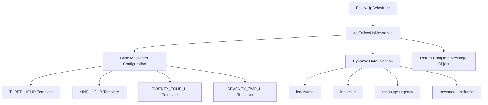
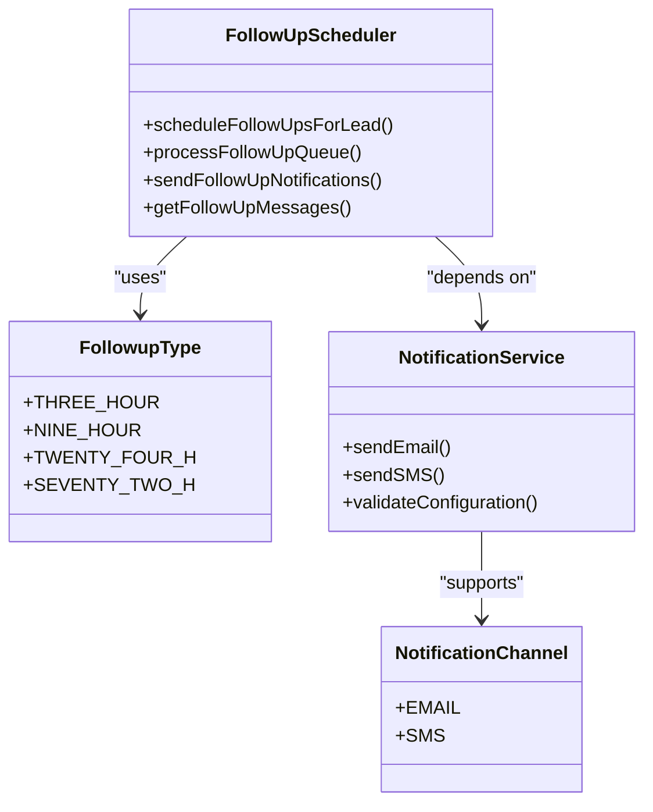
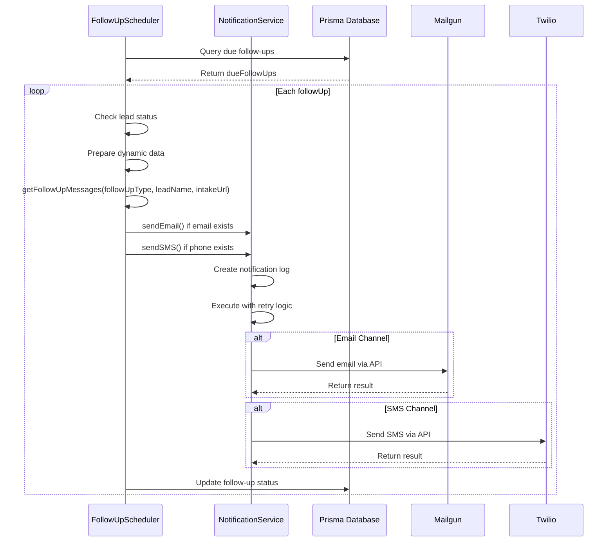
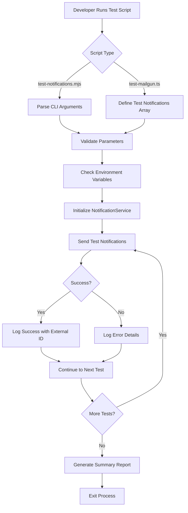
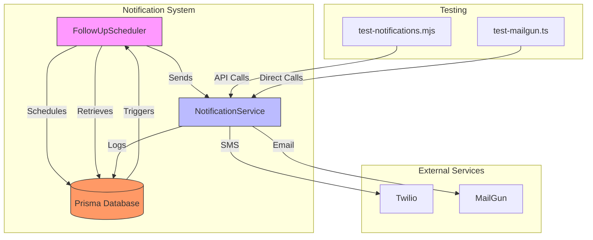

# Message Templating System

<cite>
**Referenced Files in This Document**   
- [FollowUpScheduler.ts](file://src/services/FollowUpScheduler.ts)
- [NotificationService.ts](file://src/services/NotificationService.ts)
- [test-mailgun.ts](file://test/test-mailgun.ts)
- [test-notifications.mjs](file://scripts/test-notifications.mjs)
</cite>

## Table of Contents
1. [Introduction](#introduction)
2. [Template Definition and Structure](#template-definition-and-structure)
3. [Notification Types and Channels](#notification-types-and-channels)
4. [Dynamic Data Injection](#dynamic-data-injection)
5. [Template Resolution Logic](#template-resolution-logic)
6. [Raw Template Examples and Rendered Output](#raw-template-examples-and-rendered-output)
7. [Fallback Mechanisms](#fallback-mechanisms)
8. [Localization Considerations](#localization-considerations)
9. [Testing and Validation](#testing-and-validation)
10. [System Architecture Overview](#system-architecture-overview)

## Introduction
The message templating system in the Fund Track application manages automated notifications sent to applicants via SMS and email. It supports multiple follow-up stages and dynamically personalizes messages using applicant data. The system integrates with Twilio for SMS delivery and MailGun for email delivery, ensuring reliable communication throughout the application process.

**Section sources**
- [FollowUpScheduler.ts](file://src/services/FollowUpScheduler.ts#L1-L491)
- [NotificationService.ts](file://src/services/NotificationService.ts#L1-L471)

## Template Definition and Structure
Message templates are defined within the `FollowUpScheduler` class, specifically in the `getFollowUpMessages` method. Templates are structured as JavaScript template literals that support dynamic variable injection. Each notification type has distinct templates for email (subject, plain text, HTML) and SMS formats.

The base message structure includes:
- **emailSubject**: Subject line for email notifications
- **emailText**: Plain text version of the email body
- **emailHtml**: HTML-formatted email content
- **smsText**: SMS message content

Templates use ES6 template literal syntax (`${variable}`) to inject dynamic data such as applicant names, business names, and intake URLs.



**Diagram sources**
- [FollowUpScheduler.ts](file://src/services/FollowUpScheduler.ts#L374-L429)

**Section sources**
- [FollowUpScheduler.ts](file://src/services/FollowUpScheduler.ts#L374-L429)

## Notification Types and Channels
The system supports four follow-up notification types based on time intervals after initial submission:

| Notification Type | Interval | FollowupType Constant |
|-------------------|---------|----------------------|
| Initial Submission | Immediate | Not explicitly defined in templates |
| 3-Hour Follow-up | 3 hours | FollowupType.THREE_HOUR |
| 9-Hour Follow-up | 9 hours | FollowupType.NINE_HOUR |
| 24-Hour Follow-up | 24 hours | FollowupType.TWENTY_FOUR_H |
| 72-Hour Follow-up | 72 hours | FollowupType.SEVENTY_TWO_H |

Notifications are delivered through two channels:
- **Email**: Using MailGun API with both plain text and HTML formats
- **SMS**: Using Twilio API with plain text messages

The `FollowUpScheduler` schedules these notifications when a lead is imported and processes them when they become due. Each notification type has a specific purpose and tone, progressing from a quick reminder to a final expiration notice.



**Diagram sources**
- [FollowUpScheduler.ts](file://src/services/FollowUpScheduler.ts#L22-L25)
- [FollowUpScheduler.ts](file://src/services/FollowUpScheduler.ts#L77-L80)

**Section sources**
- [FollowUpScheduler.ts](file://src/services/FollowUpScheduler.ts#L22-L25)

## Dynamic Data Injection
Dynamic data is injected into templates using JavaScript template literals. The system extracts data from the lead record and constructs personalized messages. Key dynamic variables include:

- **leadName**: Constructed from firstName and lastName, or falls back to businessName, or defaults to "there"
- **intakeUrl**: Constructed from NEXT_PUBLIC_BASE_URL and intakeToken
- **message.urgency**: Type-specific urgency text
- **message.timeframe**: Type-specific timeframe description

The data injection process occurs in the `sendFollowUpNotifications` method of the `FollowUpScheduler` class. It retrieves lead data including firstName, lastName, businessName, and intakeToken from the database, then passes these values to the `getFollowUpMessages` method.

```mermaid
flowchart TD
A[Database Query] --> B[Extract Lead Data]
B --> C{Check firstName & lastName}
C --> |Present| D[Construct leadName = firstName + lastName]
C --> |Missing| E{Check businessName}
E --> |Present| F[Use businessName as leadName]
E --> |Missing| G[Use default "there"]
D --> H[Construct intakeUrl]
F --> H
G --> H
H --> I[Call getFollowUpMessages]
I --> J[Template Literal Evaluation]
J --> K[Return Personalized Message]
```

**Diagram sources**
- [FollowUpScheduler.ts](file://src/services/FollowUpScheduler.ts#L308-L320)

**Section sources**
- [FollowUpScheduler.ts](file://src/services/FollowUpScheduler.ts#L308-L320)

## Template Resolution Logic
Template resolution is handled by the `getFollowUpMessages` method in the `FollowUpScheduler` class. The logic follows a structured approach based on notification type and channel:

1. **Type-based Selection**: The method uses the `followUpType` parameter to select the appropriate base message configuration
2. **Data Preparation**: Constructs dynamic variables (leadName, intakeUrl) from lead data
3. **Template Population**: Injects dynamic data into template literals
4. **Channel-specific Formatting**: Returns different message formats for email and SMS

The resolution process is triggered when processing the follow-up queue. The `processFollowUpQueue` method retrieves due follow-ups and calls `sendFollowUpNotifications`, which in turn calls `getFollowUpMessages` with the appropriate parameters.

For email notifications, both plain text and HTML versions are generated. For SMS, only the text version is used. The system sends notifications to available channels (email if email is provided, SMS if phone is provided).



**Diagram sources**
- [FollowUpScheduler.ts](file://src/services/FollowUpScheduler.ts#L248-L373)
- [FollowUpScheduler.ts](file://src/services/FollowUpScheduler.ts#L374-L429)

**Section sources**
- [FollowUpScheduler.ts](file://src/services/FollowUpScheduler.ts#L248-L429)

## Raw Template Examples and Rendered Output
The system includes comprehensive test cases that demonstrate raw template strings and their rendered output. These examples are found in the `test-mailgun.ts` file.

### 3-Hour Follow-up Template
**Raw Template:**
```
Hi ${leadName},

We wanted to follow up quickly your merchant funding application that you started just a few hours ago.

Complete your application now: ${intakeUrl}

Don't miss this opportunity to secure funding for your business. The application only takes a few minutes to complete.

If you have any questions, please don't hesitate to contact us.

Best regards,
Merchant Funding Team
```

**Rendered Output:**
```
Hi Mike Johnson,

We wanted to follow up quickly your merchant funding application that you started just a few hours ago.

Complete your application now: http://localhost:3000/application/abc123

Don't miss this opportunity to secure funding for your business. The application only takes a few minutes to complete.

If you have any questions, please don't hesitate to contact us.

Best regards,
Merchant Funding Team
```

### Email HTML Template (24-Hour Follow-up)
**Raw Template:**
```html
<h2>Final Reminder: Complete Your Application Today</h2>
<p>Hi ${leadName},</p>
<p>This is a friendly reminder your merchant funding application that you started yesterday.</p>
<p><a href="${intakeUrl}" style="background-color: #dc3545; color: white; padding: 12px 24px; text-decoration: none; border-radius: 5px; font-weight: bold;">Complete Application Now</a></p>
<p>Don't miss this opportunity to secure funding for your business. The application only takes a few minutes to complete.</p>
<p>If you have any questions, please don't hesitate to contact us.</p>
<p>Best regards,<br>Merchant Funding Team</p>
```

**Rendered Output:**
```html
<h2>Final Reminder: Complete Your Application Today</h2>
<p>Hi Sarah Wilson,</p>
<p>This is a friendly reminder your merchant funding application that you started yesterday.</p>
<p><a href="http://localhost:3000/application/abc123" style="background-color: #dc3545; color: white; padding: 12px 24px; text-decoration: none; border-radius: 5px; font-weight: bold;">Complete Application Now</a></p>
<p>Don't miss this opportunity to secure funding for your business. The application only takes a few minutes to complete.</p>
<p>If you have any questions, please don't hesitate to contact us.</p>
<p>Best regards,<br>Merchant Funding Team</p>
```

### SMS Template (72-Hour Follow-up)
**Raw Template:**
```
Hi ${leadName}! This is your final reminder to complete your merchant funding application. Complete it now: ${intakeUrl}
```

**Rendered Output:**
```
Hi Robert Davis! This is your final reminder to complete your merchant funding application. Complete it now: http://localhost:3000/application/abc123
```

**Section sources**
- [test-mailgun.ts](file://test/test-mailgun.ts#L85-L116)
- [test-mailgun.ts](file://test/test-mailgun.ts#L200-L220)
- [test-mailgun.ts](file://test/test-mailgun.ts#L300-L320)

## Fallback Mechanisms
The system implements several fallback mechanisms to handle missing data and ensure message delivery:

1. **Lead Name Fallback**: When firstName and lastName are not available, the system uses businessName. If neither is available, it defaults to "there".
   ```typescript
   const leadName =
     followUp.lead.firstName && followUp.lead.lastName
       ? `${followUp.lead.firstName} ${followUp.lead.lastName}`
       : followUp.lead.businessName || "there";
   ```

2. **Base URL Fallback**: If NEXT_PUBLIC_BASE_URL is not set, the system defaults to "http://localhost:3000".
   ```typescript
   const baseUrl = (process.env.NEXT_PUBLIC_BASE_URL || "http://localhost:3000").replace(/\/$/, '');
   ```

3. **Retry Logic**: The NotificationService implements exponential backoff retry logic with configurable parameters (maxRetries, baseDelay, maxDelay).

4. **Rate Limiting Fallback**: If rate limit checks fail due to database errors, the system allows the notification but logs the error.

5. **Configuration Validation**: The system validates required environment variables and service configuration before sending notifications.

6. **Channel Availability**: The system sends notifications only to available channels (email if email is provided, SMS if phone is provided).

These fallbacks ensure that the system remains robust even when some data is missing or external services experience temporary issues.

**Section sources**
- [FollowUpScheduler.ts](file://src/services/FollowUpScheduler.ts#L314-L318)
- [FollowUpScheduler.ts](file://src/services/FollowUpScheduler.ts#L310-L312)
- [NotificationService.ts](file://src/services/NotificationService.ts#L200-L205)

## Localization Considerations
The current implementation does not include explicit localization or internationalization support. All templates are hardcoded in English with no mechanism for language selection or translation.

Key observations regarding localization:
- All template text is written in American English
- No language-specific formatting for dates, numbers, or addresses
- No support for right-to-left languages
- Timezone considerations are minimal (follow-up intervals are based on UTC)

Potential localization improvements could include:
- Externalizing template strings to resource files
- Implementing language detection based on user preferences
- Supporting multiple languages for different regions
- Adding timezone-aware scheduling
- Localizing date and time formats

The system currently assumes a primarily English-speaking user base in the United States, as evidenced by the use of US phone number formatting and US-centric business terminology.

**Section sources**
- [FollowUpScheduler.ts](file://src/services/FollowUpScheduler.ts#L380-L429)
- [test-mailgun.ts](file://test/test-mailgun.ts#L85-L116)

## Testing and Validation
The message templating system is validated through two primary test scripts: `test-notifications.mjs` and `test-mailgun.ts`.

### test-notifications.mjs
This script provides a command-line interface for testing notifications:
- Supports both email and SMS message types
- Accepts recipient, subject, message, and optional leadId parameters
- Makes API calls to `/api/dev/test-notifications`
- Validates environment variables before sending
- Provides detailed success/failure output

Usage examples:
```bash
node scripts/test-notifications.mjs email "test@example.com" "Test Subject" "Test message"
node scripts/test-notifications.mjs sms "+1234567890" "Test SMS message" 123
```

### test-mailgun.ts
This comprehensive test script validates MailGun integration:
- Tests multiple notification types (basic, initial intake, follow-ups)
- Uses a predefined array of test notifications
- Validates NotificationService configuration
- Sends test emails and reports results
- Includes descriptive test names and timing
- Provides a summary of successful and failed tests
- Retrieves recent notification logs for verification

The test script includes seven test cases covering:
1. Basic integration test
2. Initial intake notification (basic)
3. Initial intake notification (enhanced)
4. 3-hour follow-up reminder
5. 24-hour follow-up reminder
6. 72-hour final follow-up
7. General follow-up reminder

Both test scripts are designed to validate template rendering, dynamic data injection, and delivery functionality before deployment.



**Diagram sources**
- [test-notifications.mjs](file://scripts/test-notifications.mjs#L1-L101)
- [test-mailgun.ts](file://test/test-mailgun.ts#L1-L400)

**Section sources**
- [test-notifications.mjs](file://scripts/test-notifications.mjs#L1-L101)
- [test-mailgun.ts](file://test/test-mailgun.ts#L1-L400)

## System Architecture Overview
The message templating system is part of a larger notification architecture that integrates with Twilio and MailGun services. The core components work together to schedule, personalize, and deliver notifications to applicants.



The architecture follows a service-oriented pattern where the `FollowUpScheduler` handles business logic and scheduling, while the `NotificationService` manages delivery and integration with external providers. The system uses Prisma as an ORM to interact with the database, storing notification logs and follow-up queue items.

Key architectural features:
- **Separation of Concerns**: Template logic is separated from delivery logic
- **Retry Mechanisms**: Exponential backoff for failed deliveries
- **Rate Limiting**: Prevents spamming recipients
- **Comprehensive Logging**: Tracks all notification attempts
- **Configuration Management**: Centralized settings for retry policies and limits

This architecture ensures reliable, scalable, and maintainable notification delivery throughout the applicant journey.

**Diagram sources**
- [FollowUpScheduler.ts](file://src/services/FollowUpScheduler.ts#L1-L491)
- [NotificationService.ts](file://src/services/NotificationService.ts#L1-L471)

**Section sources**
- [FollowUpScheduler.ts](file://src/services/FollowUpScheduler.ts#L1-L491)
- [NotificationService.ts](file://src/services/NotificationService.ts#L1-L471)