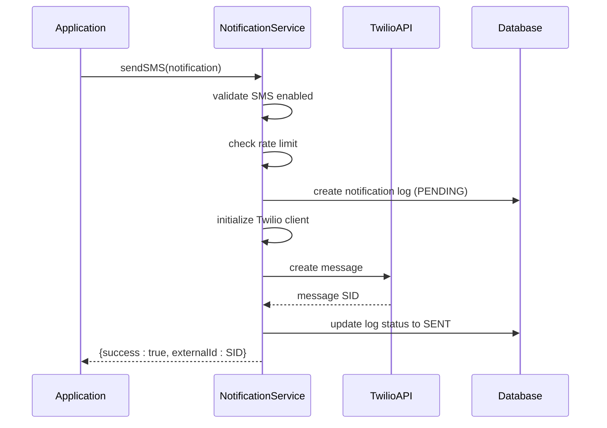
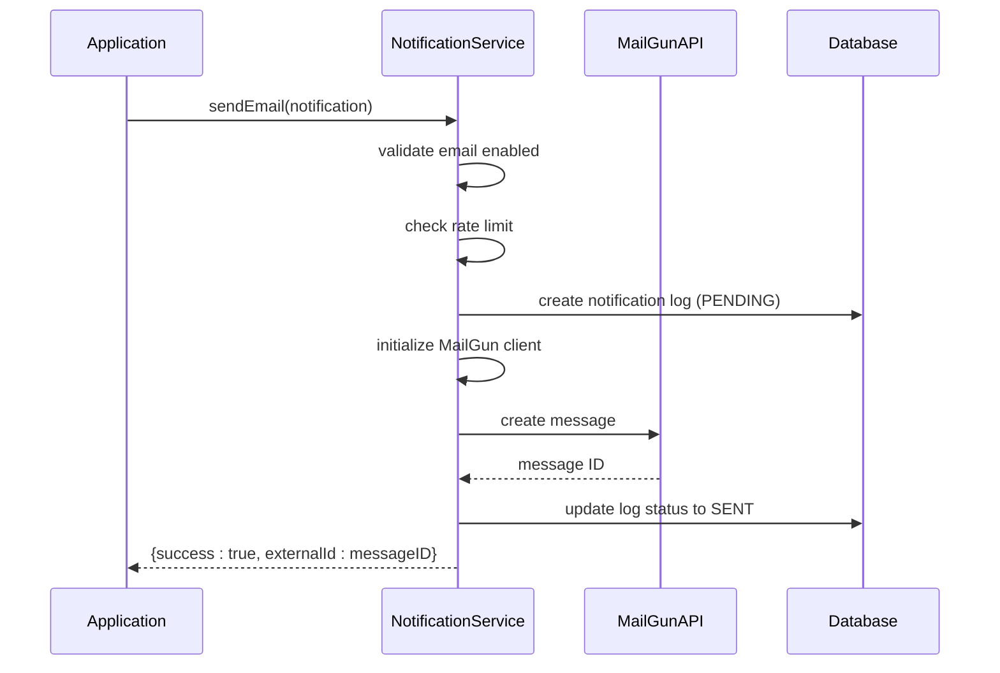
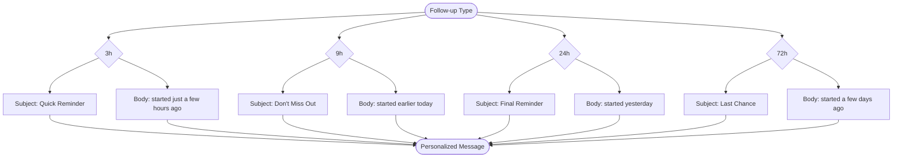
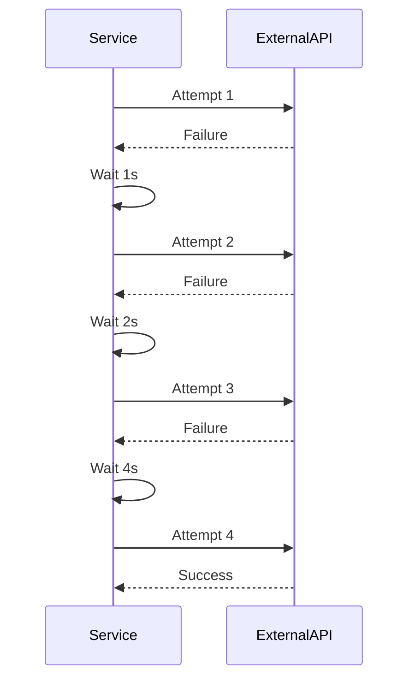
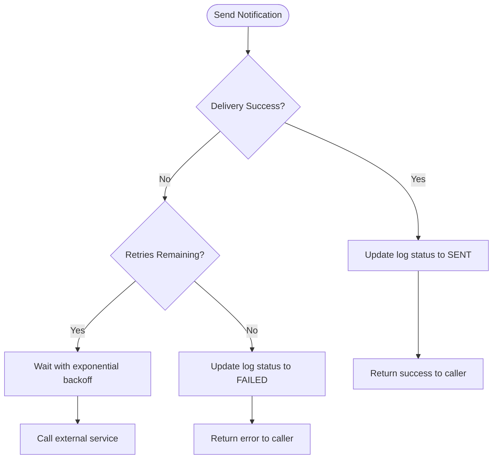
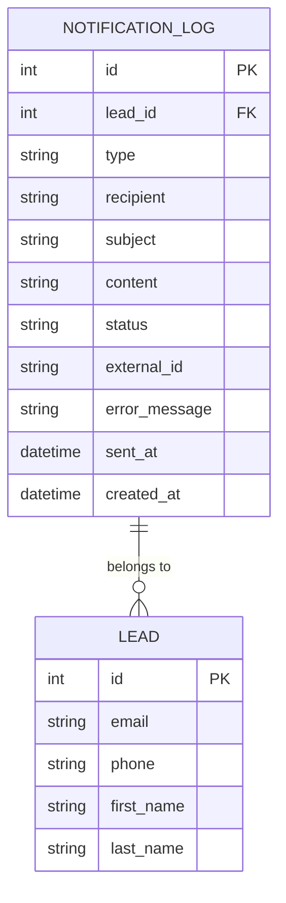
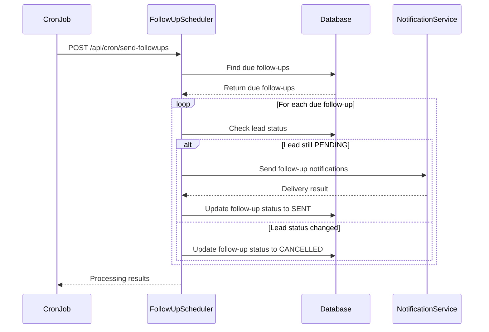

# Notification Integrations

<cite>
**Referenced Files in This Document**   
- [NotificationService.ts](file://src/services/NotificationService.ts)
- [SystemSettingsService.ts](file://src/services/SystemSettingsService.ts)
- [schema.prisma](file://prisma/schema.prisma)
- [FollowUpScheduler.ts](file://src/services/FollowUpScheduler.ts)
- [send-followups/route.ts](file://src/app/api/cron/send-followups/route.ts)
- [test-mailgun.ts](file://test/test-mailgun.ts)
- [system-settings.ts](file://prisma/seeds/system-settings.ts)
</cite>

## Table of Contents
1. [Twilio SMS Integration](#twilio-sms-integration)
2. [MailGun Email Integration](#mailgun-email-integration)
3. [Unified Notification Interface](#unified-notification-interface)
4. [Message Templating System](#message-templating-system)
5. [Rate Limiting and Retry Logic](#rate-limiting-and-retry-logic)
6. [Error Classification and Handling](#error-classification-and-handling)
7. [Notification Logging and Auditing](#notification-logging-and-auditing)
8. [Follow-up Scheduling Architecture](#follow-up-scheduling-architecture)

## Twilio SMS Integration

The Twilio SMS integration is implemented within the `NotificationService` class, which handles all SMS delivery operations through the Twilio API. The service uses environment variables to configure the Twilio client with essential credentials and sender information.

**Configuration Parameters**
- **TWILIO_ACCOUNT_SID**: The Twilio account identifier used for authentication
- **TWILIO_AUTH_TOKEN**: The authentication token for the Twilio account
- **TWILIO_PHONE_NUMBER**: The sender phone number from which SMS messages are sent

The SMS functionality is encapsulated in the `sendSMS` method, which first validates that SMS notifications are enabled in the system settings before proceeding with message delivery. The service creates a notification log entry in the database with status "PENDING" before attempting delivery.



**Section sources**
- [NotificationService.ts](file://src/services/NotificationService.ts#L200-L250)

## MailGun Email Integration

The MailGun email integration is implemented within the same `NotificationService` class, providing parallel functionality for email delivery. The integration uses the MailGun API through the mailgun.js library with form-data support for message submission.

**Configuration Parameters**
- **MAILGUN_API_KEY**: The API key for authenticating with the MailGun service
- **MAILGUN_DOMAIN**: The sending domain configured in MailGun (e.g., "sandbox123.mailgun.org")
- **MAILGUN_FROM_EMAIL**: The sender email address used as the "From" field in emails

The email functionality is managed by the `sendEmail` method, which follows a similar pattern to SMS delivery but with email-specific parameters. The service supports both plain text and HTML content in emails, allowing for rich message formatting.



**Section sources**
- [NotificationService.ts](file://src/services/NotificationService.ts#L150-L200)

## Unified Notification Interface

The `NotificationService` class provides a unified interface for both SMS and email notifications, abstracting the underlying delivery mechanisms through a consistent API. This design allows the application to send notifications without needing to know the specific implementation details of each service.

```mermaid
classDiagram
class NotificationService {
+sendEmail(notification : EmailNotification) Promise~NotificationResult~
+sendSMS(notification : SMSNotification) Promise~NotificationResult~
-sendEmailInternal(notification : EmailNotification) Promise~NotificationResult~
-sendSMSInternal(notification : SMSNotification) Promise~NotificationResult~
-executeWithRetry(fn, operationType) Promise~T~
-checkRateLimit(recipient, type, leadId) Promise~{allowed, reason}~
}
class EmailNotification {
+to : string
+subject : string
+text : string
+html? : string
+leadId? : number
}
class SMSNotification {
+to : string
+message : string
+leadId? : number
}
class NotificationResult {
+success : boolean
+externalId? : string
+error? : string
}
NotificationService --> EmailNotification : "uses"
NotificationService --> SMSNotification : "uses"
NotificationService --> NotificationResult : "returns"
```

The unified interface is implemented through two primary public methods:
- `sendEmail()`: Accepts an `EmailNotification` object with recipient, subject, and content
- `sendSMS()`: Accepts an `SMSNotification` object with recipient and message content

Both methods return a `NotificationResult` object containing success status, external identifier from the service, and error information if applicable.

**Section sources**
- [NotificationService.ts](file://src/services/NotificationService.ts#L100-L150)

## Message Templating System

The message templating system supports both initial notifications and follow-up reminders at 3h, 9h, 24h, and 72h intervals. The templates are dynamically generated based on the follow-up type and personalized with recipient information.

### Initial Notification Template
The initial notification is sent when a lead is first imported into the system:

**Email Subject**: Complete Your Merchant Funding Application  
**Email Body**:  
Hi [Name],  

Thank you for your interest in merchant funding. Please complete your application by clicking the link below:  

[Application URL]  

This secure link will allow you to provide the required information and upload necessary documents.  

If you have any questions, please don't hesitate to contact us.  

Best regards,  
Merchant Funding Team

### Follow-up Reminder Templates

**3-Hour Follow-up**
- **Subject**: Quick Reminder: Complete Your Merchant Funding Application
- **Body**: We wanted to follow up quickly your merchant funding application that you started just a few hours ago.

**9-Hour Follow-up**
- **Subject**: Don't Miss Out: Your Merchant Funding Application
- **Body**: We noticed you haven't completed your merchant funding application that you started earlier today.

**24-Hour Follow-up**
- **Subject**: Final Reminder: Complete Your Application Today
- **Body**: This is a friendly reminder your merchant funding application that you started yesterday.

**72-Hour Follow-up**
- **Subject**: Last Chance: Your Merchant Funding Application Expires Soon
- **Body**: This is your final reminder your merchant funding application that you started a few days ago.



**Section sources**
- [FollowUpScheduler.ts](file://src/services/FollowUpScheduler.ts#L350-L450)

## Rate Limiting and Retry Logic

The notification system implements comprehensive rate limiting and retry logic to prevent spam and ensure reliable delivery.

### Rate Limiting Strategy
The system enforces two levels of rate limiting:
1. **Per-recipient limit**: Maximum of 2 notifications per hour to the same recipient
2. **Per-lead limit**: Maximum of 10 notifications per day for the same lead

The rate limiting is implemented in the `checkRateLimit` method, which queries the notification log to count recent successful deliveries.

### Retry Logic
The system implements exponential backoff retry logic with the following configuration:
- **Maximum retries**: 3 attempts (configurable via system settings)
- **Base delay**: 1,000 milliseconds (configurable via system settings)
- **Maximum delay**: 30,000 milliseconds

The retry mechanism uses exponential backoff, where the delay between attempts doubles with each retry (1s, 2s, 4s, etc.) up to the maximum delay.



**Section sources**
- [NotificationService.ts](file://src/services/NotificationService.ts#L350-L450)

## Error Classification and Handling

The notification system classifies and handles various failure types through comprehensive error handling mechanisms.

### Error Types
- **Invalid recipient**: Invalid phone number format or invalid email address
- **Service unavailable**: Temporary failure of Twilio or MailGun services
- **Authentication failure**: Invalid API keys or credentials
- **Rate limiting**: Exceeding service provider rate limits
- **Content rejection**: Message content blocked by provider filters

### Error Handling Implementation
The system captures errors at multiple levels:
1. **Client initialization errors**: Failed to initialize Twilio or MailGun clients
2. **Delivery errors**: Failed to send message through the external API
3. **Database errors**: Failed to update notification log status

All errors are logged in the notification log with detailed error messages, and the system returns structured error information to the calling application.



**Section sources**
- [NotificationService.ts](file://src/services/NotificationService.ts#L250-L350)

## Notification Logging and Auditing

The system persists all notification activities in the database for auditing and troubleshooting purposes.

### Database Schema
The `notification_log` table stores the following information:
- **leadId**: Reference to the associated lead
- **type**: Notification type (EMAIL or SMS)
- **recipient**: Destination address (email or phone)
- **subject**: Email subject (for emails)
- **content**: Message content
- **status**: Current status (PENDING, SENT, FAILED)
- **externalId**: Message identifier from the external service
- **errorMessage**: Error details if delivery failed
- **sentAt**: Timestamp when successfully sent
- **createdAt**: Timestamp when log entry was created

### Audit Capabilities
The system provides several auditing capabilities:
- **Recent notifications**: Retrieve the most recent notification logs
- **Notification statistics**: Get delivery statistics for specific leads
- **Error tracking**: Identify and analyze failed deliveries



**Section sources**
- [schema.prisma](file://prisma/schema.prisma#L150-L170)
- [NotificationService.ts](file://src/services/NotificationService.ts#L400-L450)

## Follow-up Scheduling Architecture

The follow-up scheduling system manages automated reminders at 3h, 9h, 24h, and 72h intervals through a cron-based architecture.

### Scheduling Workflow
1. **Lead import**: When a lead is imported with status PENDING
2. **Schedule creation**: Four follow-up entries are created in the queue
3. **Cron execution**: The `send-followups` endpoint is called periodically
4. **Queue processing**: Due follow-ups are processed and notifications sent
5. **Status update**: Follow-up status is updated to SENT or CANCELLED



The scheduling is triggered by a cron job that calls the `/api/cron/send-followups` endpoint, which processes all pending follow-ups that are due for delivery.

**Section sources**
- [FollowUpScheduler.ts](file://src/services/FollowUpScheduler.ts#L200-L350)
- [send-followups/route.ts](file://src/app/api/cron/send-followups/route.ts#L10-L100)