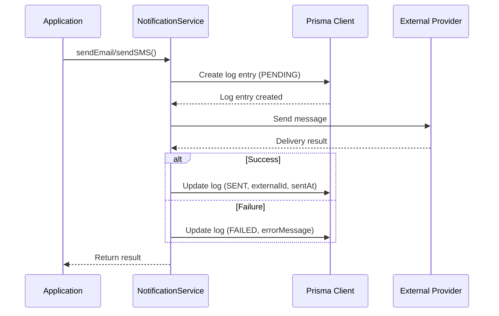
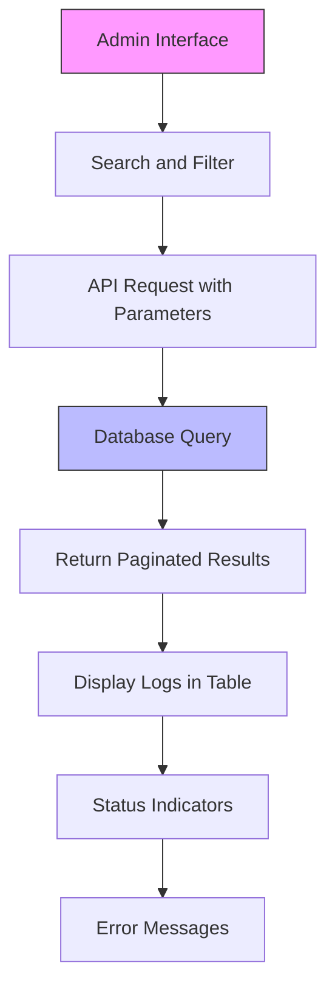
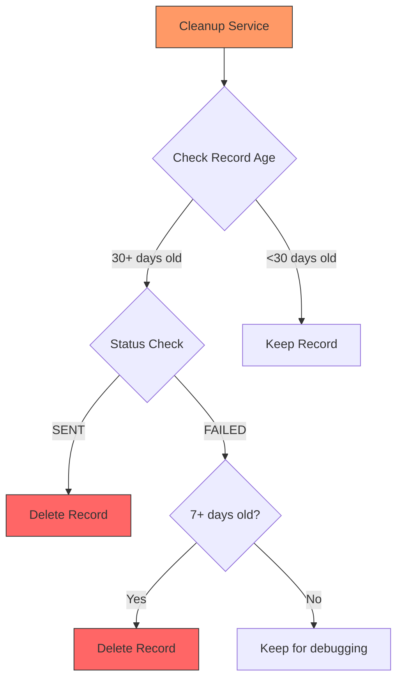

# Notification Logging and Auditing

<cite>
**Referenced Files in This Document**   
- [NotificationService.ts](file://src/services/NotificationService.ts)
- [page.tsx](file://src/app/admin/notifications/page.tsx)
- [route.ts](file://src/app/api/admin/notifications/route.ts)
- [migration.sql](file://prisma/migrations/20250812120000_add_notification_log_indexes/migration.sql)
- [NotificationCleanupService.ts](file://src/services/NotificationCleanupService.ts)
</cite>

## Table of Contents
1. [Introduction](#introduction)
2. [Notification Log Data Model](#notification-log-data-model)
3. [Log Creation and Update Process](#log-creation-and-update-process)
4. [Admin Interface for Notification Logs](#admin-interface-for-notification-logs)
5. [Data Retention and Cleanup Policies](#data-retention-and-cleanup-policies)
6. [Privacy Considerations](#privacy-considerations)
7. [Export Capabilities and Monitoring](#export-capabilities-and-monitoring)
8. [Troubleshooting and Compliance](#troubleshooting-and-compliance)

## Introduction
The notification logging and auditing system tracks every message sent through Twilio or MailGun, providing comprehensive visibility into communication activities. This document details the architecture, functionality, and operational aspects of the system, including log creation, status updates, administrative interfaces, data retention policies, and privacy considerations. The system ensures reliable message tracking for both troubleshooting delivery issues and meeting compliance reporting requirements.

## Notification Log Data Model
The NotificationLog Prisma model captures comprehensive information about each notification sent through the system. The data model includes the following key fields:

**Label Structure Requirements**
- **timestamp**: createdAt (datetime) - Records when the notification was created
- **channel**: type (NotificationType) - Specifies the delivery channel (EMAIL or SMS)
- **recipient**: recipient (string) - Stores the destination address (email or phone number)
- **template type**: subject (string, for email) and content (string) - Contains the message content
- **status**: status (NotificationStatus) - Tracks the current state (PENDING, SENT, FAILED)
- **error codes**: errorMessage (string) - Stores error details if delivery failed
- **provider response**: externalId (string) - Contains the provider's unique identifier (Mailgun ID or Twilio SID)
- **additional fields**: sentAt (datetime) - Records when the notification was successfully sent

The model is optimized for efficient querying with indexes on createdAt and id fields to support cursor-based pagination in the admin interface.

**Section sources**
- [NotificationService.ts](file://src/services/NotificationService.ts#L0-L50)

## Log Creation and Update Process
The notification logging system operates synchronously during send operations, ensuring that every message attempt is recorded before delivery is attempted. The process follows a well-defined sequence:

**Diagram sources**
- [NotificationService.ts](file://src/services/NotificationService.ts#L145-L195)
- [NotificationService.ts](file://src/services/NotificationService.ts#L197-L241)

**Section sources**
- [NotificationService.ts](file://src/services/NotificationService.ts#L145-L295)

When a notification is sent, the system first creates a log entry with status PENDING. If the message is successfully delivered, the log is updated with status SENT, the provider's external ID, and the sent timestamp. If delivery fails, the log is updated with status FAILED and the error message. The system implements retry logic with exponential backoff for failed attempts, but each retry is recorded as a separate log entry rather than updating the same record.

Notably, the system does not currently implement webhook-based delivery confirmation from Twilio or MailGun. Status updates are determined solely by the initial API response from these providers, meaning the system cannot detect delivery issues that occur after the initial acceptance of the message (such as email bounces or SMS delivery failures reported asynchronously).

## Admin Interface for Notification Logs
The administrative interface at /admin/notifications provides staff with comprehensive search, filtering, and audit capabilities for notification logs. The interface is built as a client-side React component that fetches data from an API endpoint.

**Diagram sources**
- [page.tsx](file://src/app/admin/notifications/page.tsx#L0-L21)
- [route.ts](file://src/app/api/admin/notifications/route.ts#L0-L36)

**Section sources**
- [page.tsx](file://src/app/admin/notifications/page.tsx#L0-L249)
- [route.ts](file://src/app/api/admin/notifications/route.ts#L0-L120)

The interface allows filtering by notification type (email or SMS), status (sent, failed, pending), recipient, and general search across multiple fields. Results are displayed in a paginated table with visual indicators for status (green for sent, red for failed). The implementation uses cursor-based pagination with an index on createdAt and id fields for optimal performance, as evidenced by the dedicated database migration.

The API endpoint supports various query parameters including limit, cursor (for pagination), type, status, recipient, and search. The search functionality queries across recipient, subject, content, externalId, and errorMessage fields using case-insensitive pattern matching.

## Data Retention and Cleanup Policies
The system implements automated data retention policies to manage storage requirements while preserving necessary audit information. A dedicated NotificationCleanupService handles the removal of old notification logs according to configurable retention rules.

**Diagram sources**
- [NotificationCleanupService.ts](file://src/services/NotificationCleanupService.ts#L0-L38)

**Section sources**
- [NotificationCleanupService.ts](file://src/services/NotificationCleanupService.ts#L0-L38)

By default, the system retains sent notifications for 30 days and failed notifications for 7 days. This differential retention policy balances the need for debugging recent failures with the requirement to minimize database bloat from successful deliveries. The cleanup process is designed to be idempotent and safe to run regularly, with logging to track deletion activities.

The retention period can be configured through system settings, allowing administrators to adjust the policy based on compliance requirements or storage constraints. The cleanup service can be triggered manually or scheduled to run periodically as part of system maintenance operations.

## Privacy Considerations
The notification logging system handles personal data in accordance with privacy best practices. The logs contain recipient information (email addresses or phone numbers), message content, and associated metadata, which constitutes personal data under most privacy regulations.

The system implements several privacy-preserving measures:
- Data minimization by only storing necessary information for delivery and auditing
- Limited access controls ensuring only authorized staff can view the logs
- Defined retention periods to prevent indefinite storage of personal data
- Secure database storage with appropriate access controls

The logs are used exclusively for operational purposes such as troubleshooting delivery issues and compliance reporting. Access to the admin interface is restricted to staff members with appropriate roles, preventing unauthorized access to personal information.

**Section sources**
- [page.tsx](file://src/app/admin/notifications/page.tsx#L0-L21)
- [NotificationService.ts](file://src/services/NotificationService.ts#L0-L50)

## Export Capabilities and Monitoring
While the current implementation does not include direct export functionality, the system provides monitoring capabilities through several mechanisms. The NotificationService includes methods to retrieve recent notifications for debugging purposes, which can be used to extract log data programmatically.

The system exposes API endpoints that return notification logs in JSON format, enabling external systems to retrieve and process the data. Although there is no dedicated export feature in the admin interface, the API can be leveraged to create export functionality by fetching paginated results and converting them to desired formats (CSV, PDF, etc.).

For monitoring purposes, the system provides:
- Real-time status visibility in the admin interface
- Programmatic access to recent logs via getRecentNotifications method
- Comprehensive error logging for failed deliveries
- Statistics on notification success rates

The lack of webhook integration limits the system's ability to provide complete delivery confirmation, as status updates are based solely on initial provider responses rather than final delivery outcomes.

**Section sources**
- [NotificationService.ts](file://src/services/NotificationService.ts#L448-L471)
- [lib/notifications.ts](file://src/lib/notifications.ts#L171-L220)

## Troubleshooting and Compliance
The notification logging system serves as a critical tool for both troubleshooting delivery issues and meeting compliance reporting requirements. When delivery problems occur, administrators can use the admin interface to:

1. Search for specific notifications by recipient, message content, or time period
2. Examine error messages to identify the root cause of failures
3. Verify that messages were properly sent to the external providers
4. Confirm the external provider's response and tracking ID

For compliance reporting, the system maintains an immutable audit trail of all notification activities, including:
- Complete record of all sent messages
- Timestamps for creation and delivery
- Status tracking for successful and failed deliveries
- Error details for troubleshooting

The logs can be used to demonstrate adherence to communication policies and verify that required notifications were sent to recipients. The system's synchronous logging ensures that no message is sent without being recorded, providing a complete and reliable audit trail.

**Section sources**
- [NotificationService.ts](file://src/services/NotificationService.ts#L145-L195)
- [NotificationService.ts](file://src/services/NotificationService.ts#L197-L241)
- [page.tsx](file://src/app/admin/notifications/page.tsx#L220-L249)