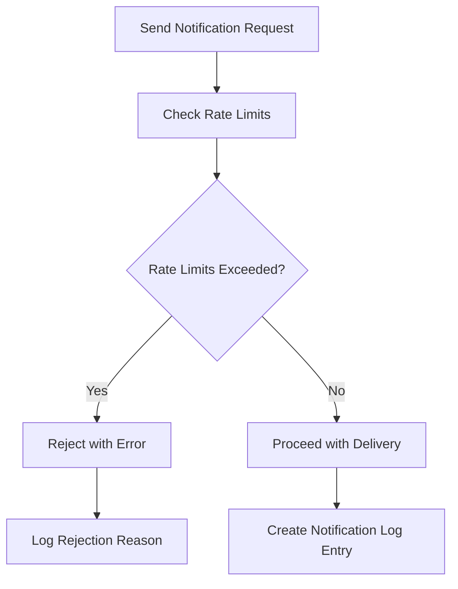
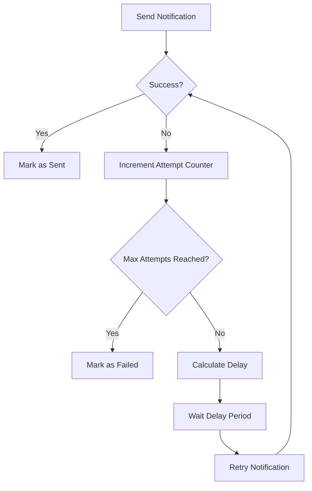
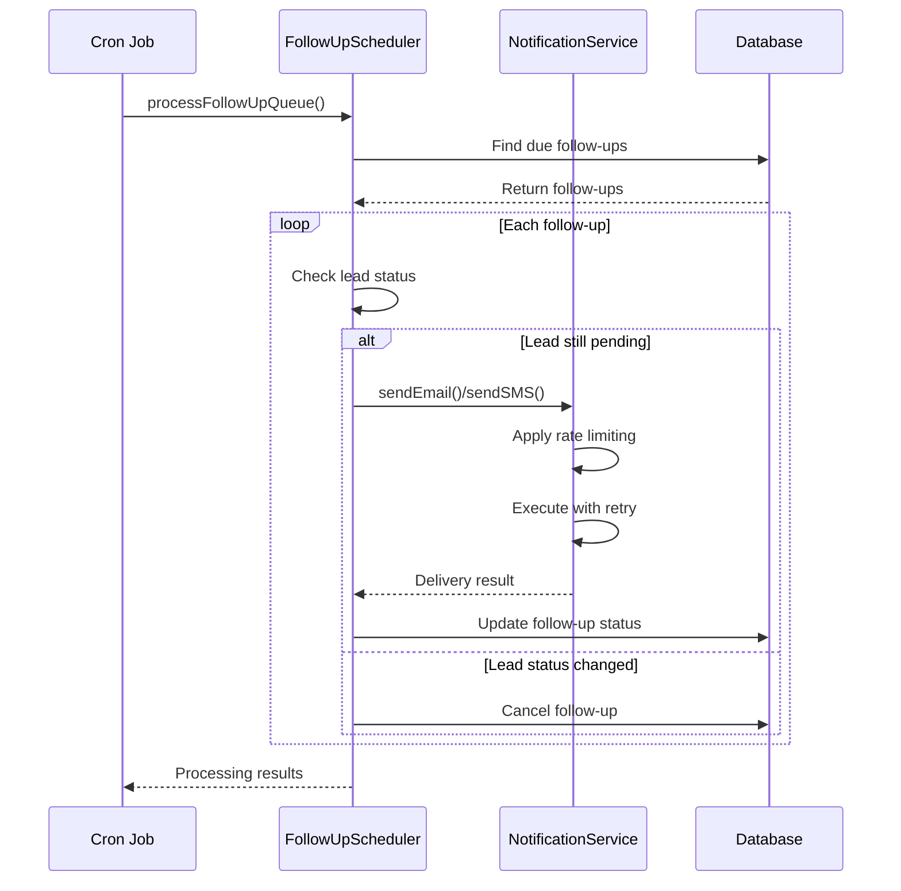
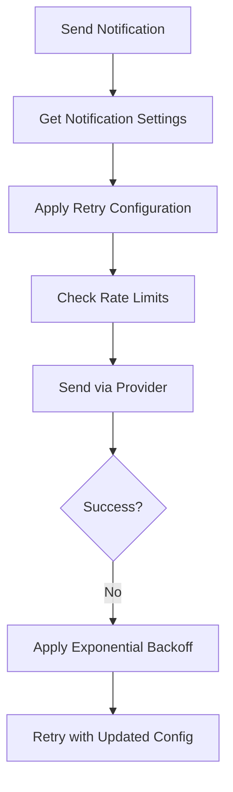
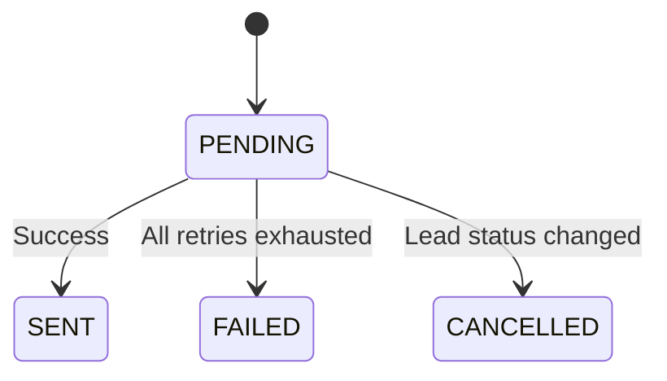
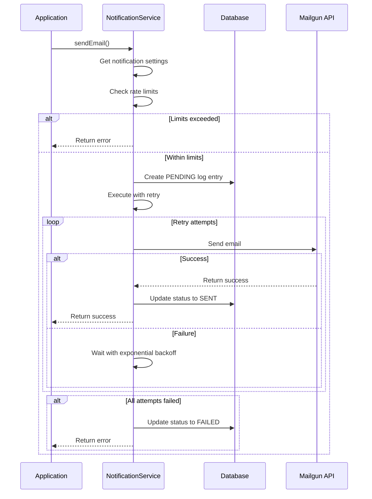
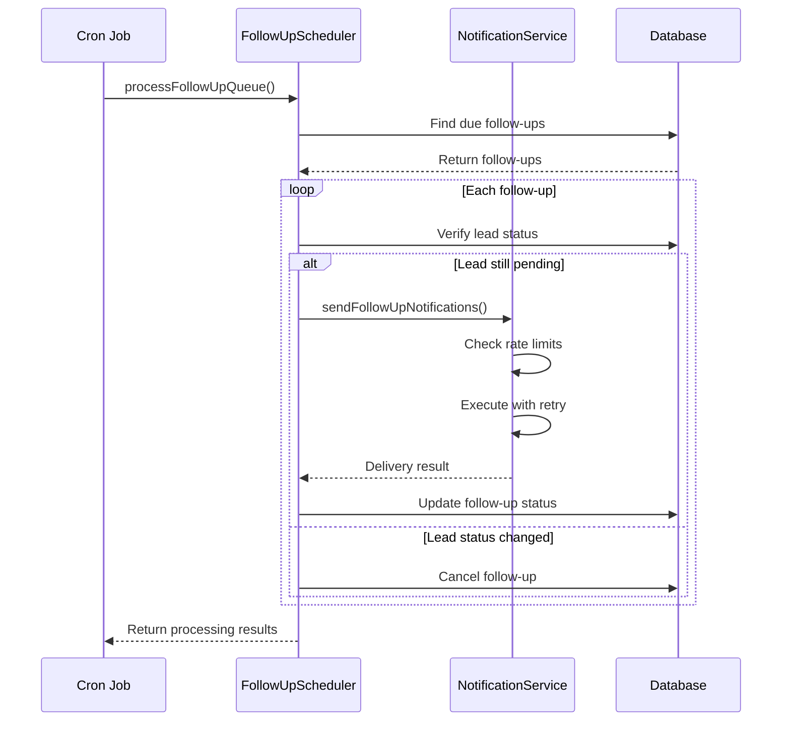

# Rate Limiting and Retry Logic

<cite>
**Referenced Files in This Document**   
- [NotificationService.ts](file://src/services/NotificationService.ts)
- [SystemSettingsService.ts](file://src/services/SystemSettingsService.ts)
- [system-settings.ts](file://prisma/seeds/system-settings.ts)
- [send-followups/route.ts](file://src/app/api/cron/send-followups/route.ts)
- [FollowUpScheduler.ts](file://src/services/FollowUpScheduler.ts)
- [logger.ts](file://src/lib/logger.ts)
- [schema.prisma](file://prisma/schema.prisma)
</cite>

## Table of Contents
1. [Introduction](#introduction)
2. [Rate Limiting Implementation](#rate-limiting-implementation)
3. [Retry Mechanisms](#retry-mechanisms)
4. [Error Classification and Handling](#error-classification-and-handling)
5. [Follow-up Queue Processing](#follow-up-queue-processing)
6. [Configuration and System Settings](#configuration-and-system-settings)
7. [Monitoring and Logging](#monitoring-and-logging)
8. [Database Schema and State Management](#database-schema-and-state-management)
9. [Sequence Diagrams](#sequence-diagrams)

## Introduction
This document details the rate limiting and retry mechanisms implemented in the notification system to ensure reliable delivery while avoiding spam flags. The system handles both email and SMS notifications through external providers (Mailgun and Twilio), implementing throttling, retry strategies, and follow-up scheduling to maximize delivery success. The architecture includes rate limiting at multiple levels, configurable retry behavior, and comprehensive logging for monitoring and troubleshooting.

**Section sources**
- [NotificationService.ts](file://src/services/NotificationService.ts#L1-L50)

## Rate Limiting Implementation
The notification system implements rate limiting at both the recipient and lead levels to prevent spam flags and ensure responsible communication practices. The rate limiting logic is enforced before any notification is sent, checking against historical delivery data in the database.

Two primary rate limiting rules are applied:
- **Per-recipient limit**: Maximum of 2 notifications per hour to the same email address or phone number
- **Per-lead limit**: Maximum of 10 notifications per day for each lead

The rate limiting check is performed in the `checkRateLimit` method of the `NotificationService` class, which queries the `notificationLog` table to count recent successful deliveries. If either limit is exceeded, the notification is rejected with an appropriate error message.

**Diagram sources**
- [NotificationService.ts](file://src/services/NotificationService.ts#L351-L398)

**Section sources**
- [NotificationService.ts](file://src/services/NotificationService.ts#L351-L398)

## Retry Mechanisms
The system implements a robust retry mechanism using exponential backoff to handle transient failures when sending notifications. The retry strategy is applied to both email (via Mailgun) and SMS (via Twilio) deliveries.

### Retry Configuration
The retry behavior is configurable through system settings with the following parameters:
- **Maximum retry attempts**: Configurable number of retry attempts (default: 3)
- **Base delay**: Initial delay between retries in milliseconds (default: 1,000ms)
- **Maximum delay**: Upper limit for exponential backoff (hardcoded at 30,000ms)

The exponential backoff formula used is: `delay = min(baseDelay * 2^attempt, maxDelay)`

For example, with the default configuration:
- Attempt 1: 1,000ms delay
- Attempt 2: 2,000ms delay
- Attempt 3: 4,000ms delay

### Retry Execution
The retry logic is implemented in the `executeWithRetry` method, which wraps the actual notification sending function. After each failed attempt, the system logs a warning message and waits for the calculated delay before retrying. If all retry attempts are exhausted, the notification is marked as failed.

**Diagram sources**
- [NotificationService.ts](file://src/services/NotificationService.ts#L297-L349)

**Section sources**
- [NotificationService.ts](file://src/services/NotificationService.ts#L243-L349)

## Error Classification and Handling
The system classifies errors into transient and permanent failures, though this distinction is implicit in the retry mechanism rather than explicitly coded.

### Transient Failures
Transient failures include:
- Network connectivity issues
- Temporary provider outages
- Rate limiting from external providers
- Timeout errors

These failures trigger the retry mechanism, as they are likely to resolve with subsequent attempts.

### Permanent Failures
Permanent failures include:
- Invalid recipient format
- Disabled notification types
- Missing provider credentials
- Configuration errors

These failures typically prevent the retry mechanism from executing, as they require manual intervention to resolve.

The error handling is implemented in a try-catch block within the `sendEmail` and `sendSMS` methods. When an error occurs, the notification log is updated with the error message, and the failure is propagated back to the caller.

**Section sources**
- [NotificationService.ts](file://src/services/NotificationService.ts#L103-L195)

## Follow-up Queue Processing
Failed notifications and scheduled follow-ups are managed through a dedicated follow-up queue system that operates via cron jobs. This ensures that important communications are not lost due to temporary delivery issues.

### Follow-up Scheduling
When a lead is imported, the system automatically schedules a series of follow-ups at predefined intervals:
- 3 hours after import
- 9 hours after import
- 24 hours after import
- 72 hours after import

These follow-ups are stored in the `followup_queue` table with a PENDING status until they are processed.

### Cron Job Processing
The `send-followups` cron job processes the follow-up queue by:
1. Finding all pending follow-ups that are due
2. Checking if the lead is still in PENDING status
3. Sending email and/or SMS notifications
4. Updating the follow-up status to SENT or CANCELLED

The cron job is accessible via the `/api/cron/send-followups` endpoint and can be triggered manually or scheduled to run at regular intervals.

**Diagram sources**
- [send-followups/route.ts](file://src/app/api/cron/send-followups/route.ts#L1-L103)
- [FollowUpScheduler.ts](file://src/services/FollowUpScheduler.ts#L200-L300)

**Section sources**
- [send-followups/route.ts](file://src/app/api/cron/send-followups/route.ts#L1-L103)
- [FollowUpScheduler.ts](file://src/services/FollowUpScheduler.ts#L1-L490)

## Configuration and System Settings
The notification system's behavior is highly configurable through system settings that can be adjusted without code changes. These settings are stored in the `system_settings` table and cached for performance.

### Configurable Parameters
The following settings control the notification behavior:

:notification_retry_attempts: - Maximum number of retry attempts for failed notifications (default: 3)
:notification_retry_delay: - Base delay in milliseconds between notification retries (default: 1,000)
:sms_notifications_enabled: - Enable or disable SMS notifications globally (default: true)
:email_notifications_enabled: - Enable or disable email notifications globally (default: true)

These settings are initialized from the seed data in `system-settings.ts` and can be modified through the admin interface or API.

### Settings Retrieval
The `getNotificationSettings` function in `SystemSettingsService.ts` retrieves these values with fallback to defaults if not explicitly set. The settings are used to dynamically configure the `NotificationService` instance before each delivery attempt.

**Diagram sources**
- [SystemSettingsService.ts](file://src/services/SystemSettingsService.ts#L346-L347)
- [system-settings.ts](file://prisma/seeds/system-settings.ts#L23-L31)

**Section sources**
- [SystemSettingsService.ts](file://src/services/SystemSettingsService.ts#L346-L347)
- [system-settings.ts](file://prisma/seeds/system-settings.ts#L1-L73)

## Monitoring and Logging
The system implements comprehensive logging to monitor notification delivery, identify bottlenecks, and troubleshoot issues.

### Log Categories
The logger categorizes events into several types:
- :notification: - Notification sending attempts and results
- :background_job: - Follow-up queue processing
- :external_service: - Calls to external providers (Mailgun, Twilio)

### Retry Logging
During retry attempts, the system logs warning messages that include:
- Operation type (email or sms)
- Attempt number
- Error message from the previous attempt
- Delay before the next retry

For example: "email notification attempt 2 failed: Network timeout. Retrying in 2000ms..."

### Monitoring Endpoints
The system provides monitoring endpoints to track the health of the notification system:
- `/api/cron/send-followups` (GET): Returns follow-up queue statistics
- `/api/admin/notifications` (UI): Admin interface for monitoring notifications

These endpoints allow administrators to identify delivery bottlenecks and tune limits based on provider feedback and system performance.

**Section sources**
- [logger.ts](file://src/lib/logger.ts#L1-L350)
- [FollowUpScheduler.ts](file://src/services/FollowUpScheduler.ts#L400-L450)

## Database Schema and State Management
The notification system relies on two primary database tables to manage delivery status and retry tracking.

### NotificationLog Table
The `notification_log` table tracks the status of all notification attempts with the following key fields:
- :status: - Current status (PENDING, SENT, FAILED)
- :recipient: - Target email or phone number
- :type: - Notification type (EMAIL, SMS)
- :errorMessage: - Error details if delivery failed
- :sentAt: - Timestamp when successfully sent
- :createdAt: - Timestamp when record created

### FollowupQueue Table
The `followup_queue` table manages scheduled follow-up communications with:
- :scheduledAt: - When the follow-up should be processed
- :status: - Current status (PENDING, SENT, CANCELLED)
- :followupType: - Type of follow-up (3h, 9h, 24h, 72h)
- :sentAt: - When the follow-up was successfully sent

The state transitions for notifications follow a simple flow: PENDING → (SENT | FAILED), while follow-ups transition from PENDING → (SENT | CANCELLED).

**Diagram sources**
- [schema.prisma](file://prisma/schema.prisma#L200-L257)

**Section sources**
- [schema.prisma](file://prisma/schema.prisma#L200-L257)

## Sequence Diagrams
The following sequence diagrams illustrate the complete flow of notification delivery and retry processing.

### Email Notification Flow

**Diagram sources**
- [NotificationService.ts](file://src/services/NotificationService.ts#L103-L143)

### Follow-up Processing Flow

**Diagram sources**
- [send-followups/route.ts](file://src/app/api/cron/send-followups/route.ts#L1-L103)
- [FollowUpScheduler.ts](file://src/services/FollowUpScheduler.ts#L200-L300)