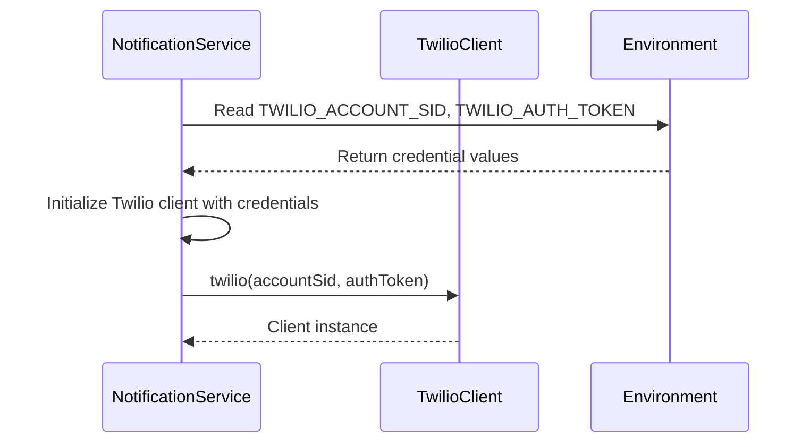
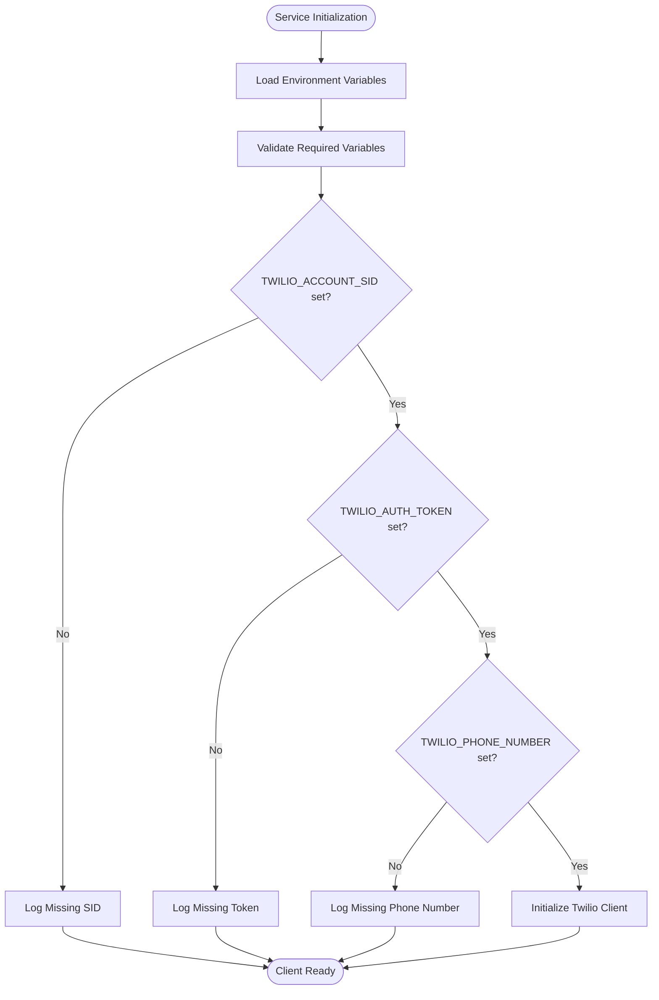
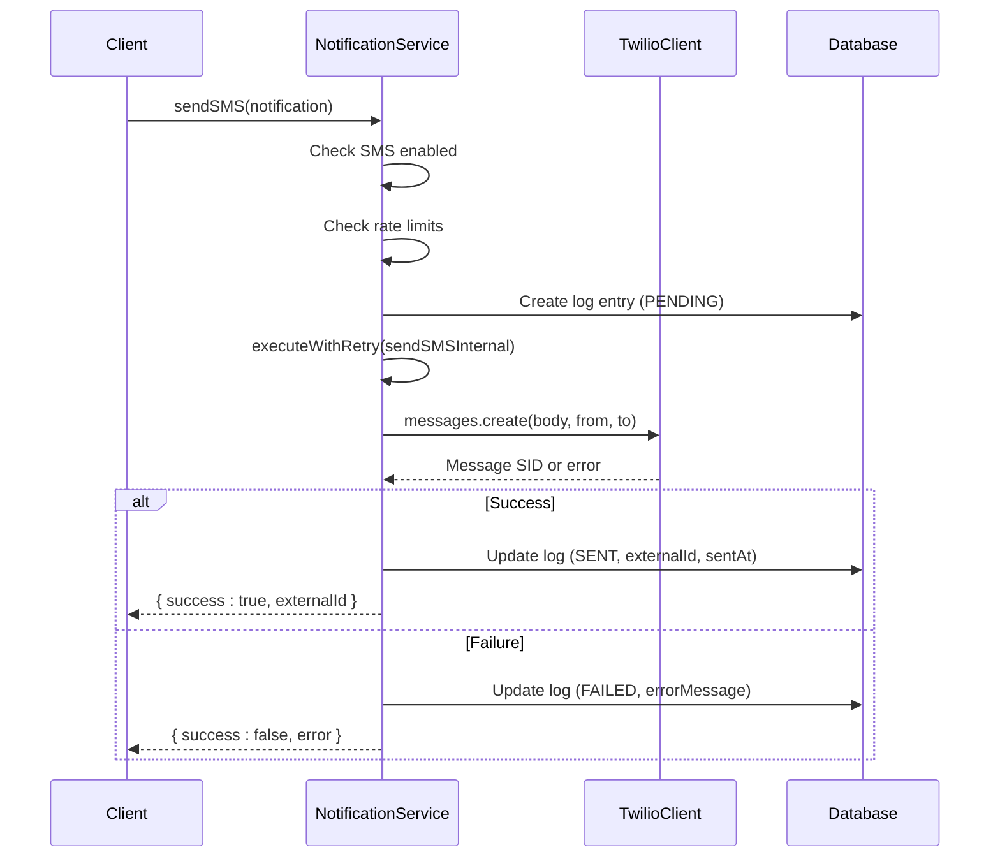
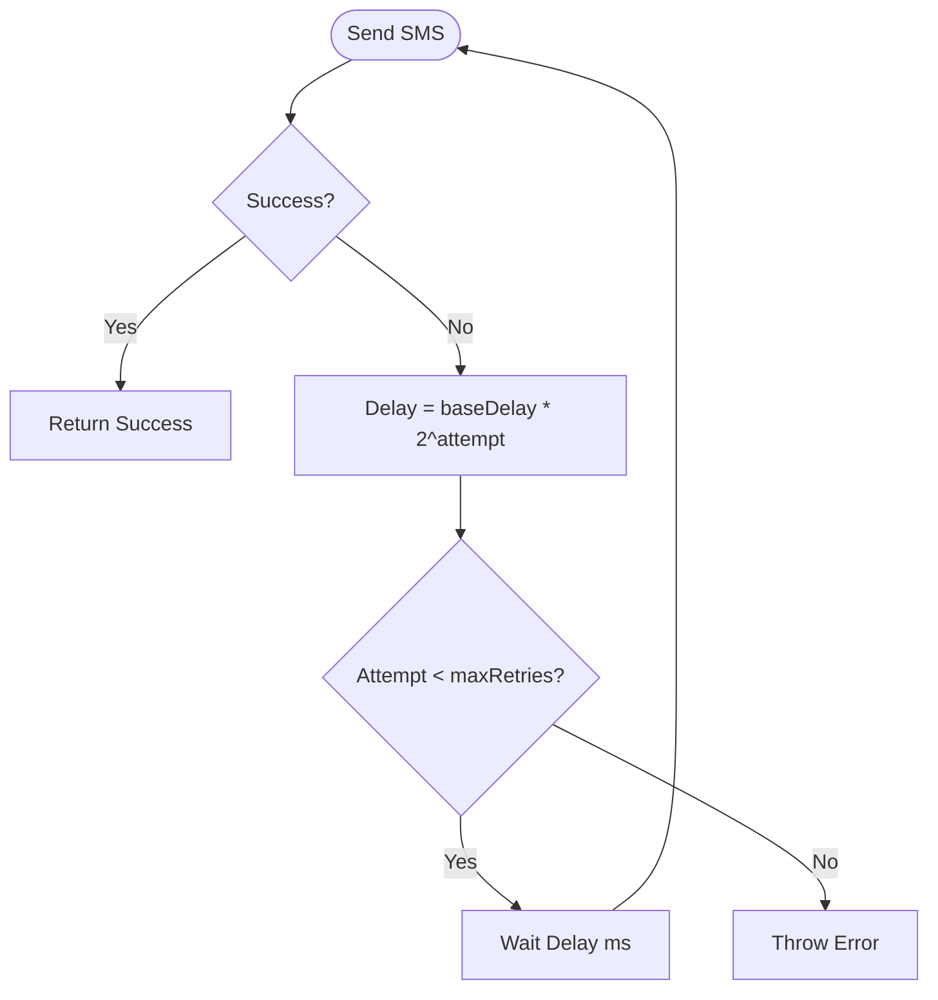
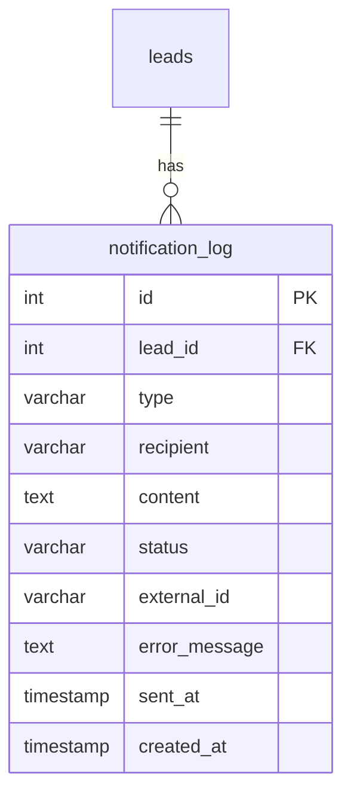

# Twilio SMS Integration

<cite>
**Referenced Files in This Document**   
- [NotificationService.ts](file://src/services/NotificationService.ts#L53-L280)
- [schema.prisma](file://prisma/schema.prisma#L200-L215)
- [SystemSettingsService.ts](file://src/services/SystemSettingsService.ts#L342-L349)
</cite>

## Table of Contents
1. [Twilio Client Initialization](#twilio-client-initialization)
2. [Configuration and Environment Variables](#configuration-and-environment-variables)
3. [SMS Message Templates](#sms-message-templates)
4. [sendSMS Method Implementation](#sendsms-method-implementation)
5. [Error Handling and Retry Logic](#error-handling-and-retry-logic)
6. [Delivery Status Logging and Monitoring](#delivery-status-logging-and-monitoring)
7. [Security Considerations](#security-considerations)
8. [Troubleshooting Guide](#troubleshooting-guide)

## Twilio Client Initialization

The Twilio client is initialized within the `NotificationService` class using environment variables. The initialization occurs lazily via the `initializeClients()` method, which ensures the Twilio client is only created when needed and when valid credentials are present.



**Diagram sources**
- [NotificationService.ts](file://src/services/NotificationService.ts#L53-L67)

**Section sources**
- [NotificationService.ts](file://src/services/NotificationService.ts#L53-L101)

## Configuration and Environment Variables

The Twilio integration relies on three key environment variables, which are loaded during the `NotificationService` constructor:

- **TWILIO_ACCOUNT_SID**: The unique identifier for the Twilio account.
- **TWILIO_AUTH_TOKEN**: The authentication token for API access.
- **TWILIO_PHONE_NUMBER**: The sender's phone number in E.164 format (e.g., +1234567890).

These values are stored in the service configuration and used to initialize the Twilio client. The system validates these variables at startup via the `validateConfiguration()` method, which checks for missing credentials and attempts to initialize the client.



**Diagram sources**
- [NotificationService.ts](file://src/services/NotificationService.ts#L53-L67)
- [NotificationService.ts](file://src/services/NotificationService.ts#L399-L446)

**Section sources**
- [NotificationService.ts](file://src/services/NotificationService.ts#L53-L67)

## SMS Message Templates

SMS messages are dynamically generated based on the context, primarily for application confirmations and follow-up reminders. The message content is constructed externally and passed to the `sendSMS` method. For example, a follow-up reminder includes a personalized message and a link to complete the application:

```
"Hi [Name], this is a reminder to complete your application. Complete your application: https://app.example.com/intake/[token]"
```

The template logic resides in higher-level services (e.g., `lib/notifications.ts`), which assemble the message using recipient data and application URLs before invoking `notificationService.sendSMS()`.

**Section sources**
- [lib/notifications.ts](file://src/lib/notifications.ts#L136-L176)

## sendSMS Method Implementation

The `sendSMS` method in `NotificationService.ts` orchestrates the entire SMS delivery process. It accepts a `SMSNotification` object with the following structure:

```typescript
interface SMSNotification {
  to: string;        // Recipient phone number
  message: string;   // Message content
  leadId?: number;   // Optional lead identifier
}
```

The method performs the following steps:
1. Checks if SMS notifications are enabled via system settings.
2. Enforces rate limiting based on recipient and lead.
3. Creates a `notification_log` database entry with status `PENDING`.
4. Executes the internal send operation with retry logic.
5. Updates the log entry to `SENT` or `FAILED` based on outcome.



**Diagram sources**
- [NotificationService.ts](file://src/services/NotificationService.ts#L166-L233)
- [NotificationService.ts](file://src/services/NotificationService.ts#L265-L280)

**Section sources**
- [NotificationService.ts](file://src/services/NotificationService.ts#L166-L280)

## Error Handling and Retry Logic

The system implements robust error handling for SMS delivery failures. Common issues such as invalid numbers, rate limits, or network issues trigger a retry mechanism with exponential backoff.

The `executeWithRetry` method handles retries with the following configuration:
- **maxRetries**: Configurable via system settings (default: 3)
- **baseDelay**: Initial delay in milliseconds (default: 1000)
- **maxDelay**: Maximum delay between retries (30 seconds)

The retry delay follows exponential backoff: `baseDelay * 2^attempt`, capped at `maxDelay`.



**Section sources**
- [NotificationService.ts](file://src/services/NotificationService.ts#L285-L317)

## Delivery Status Logging and Monitoring

All SMS deliveries are logged in the `notification_log` database table, which tracks key delivery metrics:

- **id**: Unique identifier
- **leadId**: Associated lead (nullable)
- **type**: 'SMS'
- **recipient**: Phone number
- **content**: Message body
- **status**: PENDING, SENT, or FAILED
- **externalId**: Twilio Message SID
- **errorMessage**: Error details if failed
- **sentAt**: Timestamp of successful delivery
- **createdAt**: Creation timestamp

The admin interface (`/admin/notifications`) provides a dashboard for monitoring these logs, allowing staff to view recent deliveries, filter by status, and troubleshoot issues.



**Diagram sources**
- [schema.prisma](file://prisma/schema.prisma#L200-L215)

**Section sources**
- [schema.prisma](file://prisma/schema.prisma#L200-L215)
- [NotificationService.ts](file://src/services/NotificationService.ts#L188-L195)

## Security Considerations

Security for Twilio credentials is maintained through:
- **Environment Variables**: Credentials are never hardcoded and are loaded from `.env.local`.
- **Access Control**: The `.env.local` file is excluded from version control.
- **Runtime Isolation**: Credentials are only accessible within the server environment.
- **Secure Transmission**: All API calls to Twilio use HTTPS with Basic Authentication (credentials in Authorization header).

The system also validates phone numbers during intake to prevent injection and ensures all message content is properly escaped.

**Section sources**
- [NotificationService.ts](file://src/services/NotificationService.ts#L53-L67)

## Troubleshooting Guide

Common issues and their solutions:

### SMS Not Sending
- **Check Environment Variables**: Ensure `TWILIO_ACCOUNT_SID`, `TWILIO_AUTH_TOKEN`, and `TWILIO_PHONE_NUMBER` are set.
- **Verify SMS Enabled**: Check system settings for `sms_notifications_enabled`.
- **Review Logs**: Examine `notification_log` table for error messages.

### "Invalid Number" Errors
- Validate the recipient number is in E.164 format.
- Confirm the number is verified in the Twilio console (for trial accounts).

### Rate Limiting
- The system limits to 2 SMS per hour per recipient and 10 per day per lead.
- Check recent logs for the same recipient to confirm limits aren't exceeded.

### Failed Delivery
- Check Twilio's delivery status via the `external_id` (Message SID) in their dashboard.
- Ensure the Twilio account has sufficient balance and the sender number is active.

**Section sources**
- [NotificationService.ts](file://src/services/NotificationService.ts#L166-L280)
- [NotificationService.ts](file://src/services/NotificationService.ts#L329-L387)