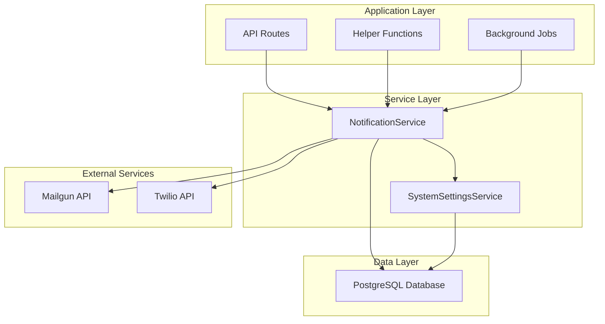
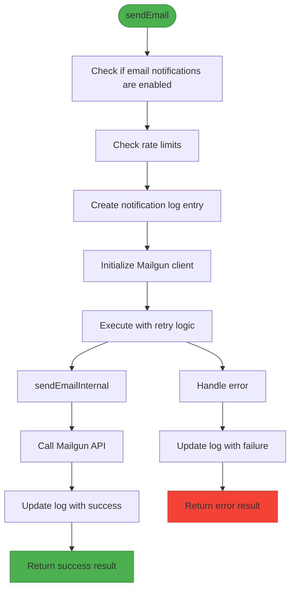
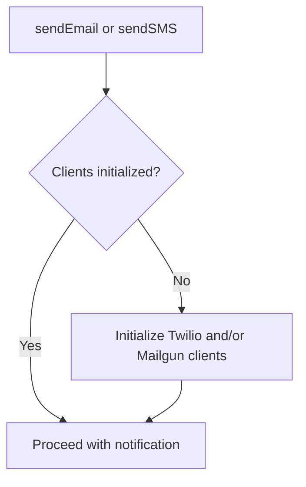
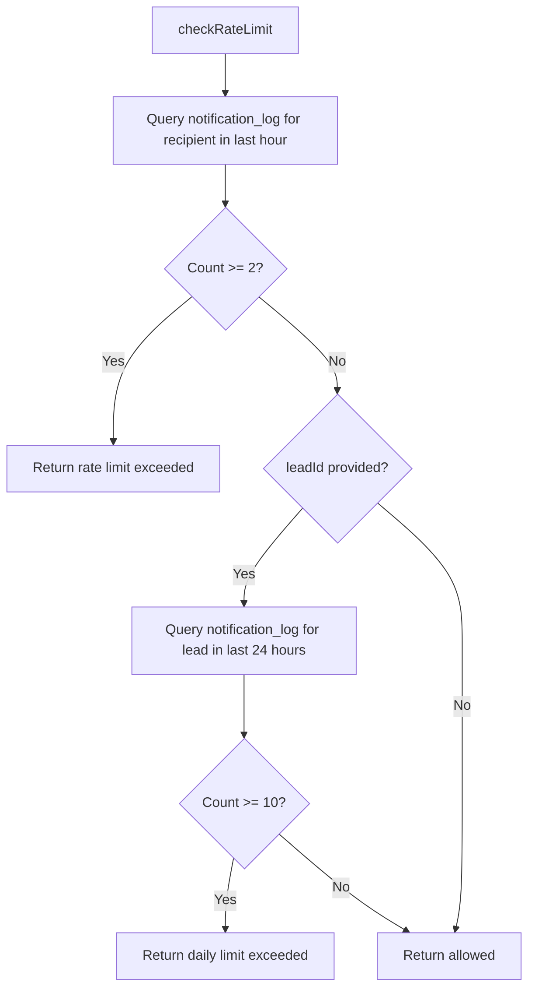
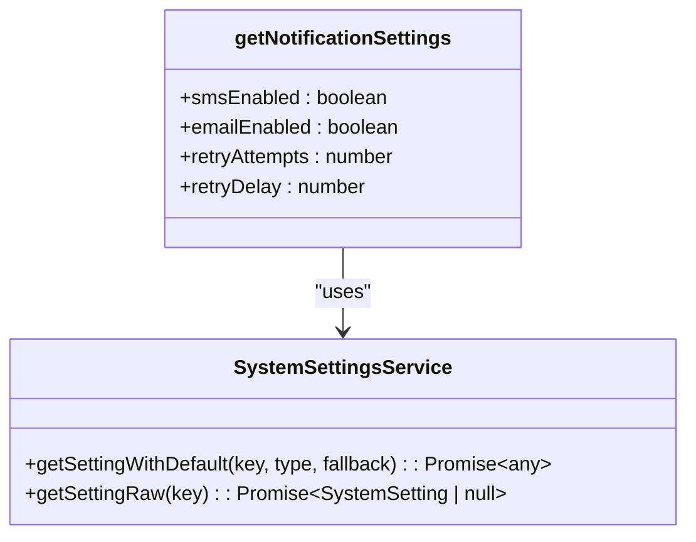
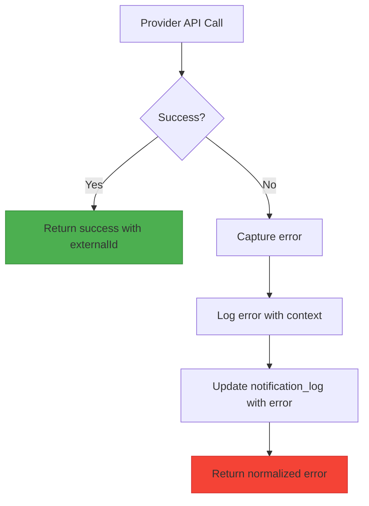
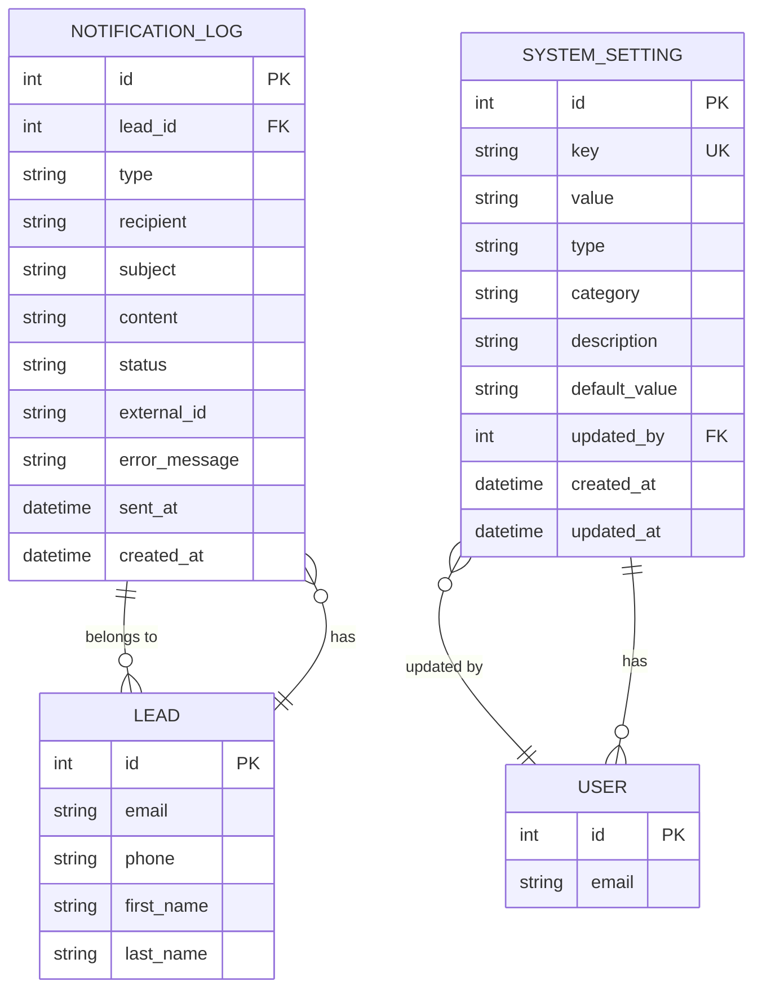

# Unified Notification Interface

<cite>
**Referenced Files in This Document**   
- [NotificationService.ts](file://src/services/NotificationService.ts)
- [SystemSettingsService.ts](file://src/services/SystemSettingsService.ts)
- [schema.prisma](file://prisma/schema.prisma)
- [notifications.ts](file://src/lib/notifications.ts)
- [test-notifications/route.ts](file://src/app/api/dev/test-notifications/route.ts)
- [admin/notifications/route.ts](file://src/app/api/admin/notifications/route.ts)
</cite>

## Table of Contents
1. [Introduction](#introduction)
2. [Core Architecture](#core-architecture)
3. [Common Interface Methods](#common-interface-methods)
4. [Internal Routing and Channel Logic](#internal-routing-and-channel-logic)
5. [Multi-Channel Delivery and Fallback](#multi-channel-delivery-and-fallback)
6. [User Communication Preferences](#user-communication-preferences)
7. [Class Structure and Dependency Injection](#class-structure-and-dependency-injection)
8. [Error Normalization Across Providers](#error-normalization-across-providers)
9. [Sequence Diagrams](#sequence-diagrams)
10. [Benefits of Abstraction](#benefits-of-abstraction)

## Introduction
The Unified Notification Interface in the fund-track application provides a consistent, reliable, and extensible way to send notifications through multiple channels, primarily email (via Mailgun) and SMS (via Twilio). This document details the design and implementation of the `NotificationService` class, which abstracts away the differences between these third-party providers, offering a clean API for the rest of the application. The service handles configuration, rate limiting, retry logic, logging, and error normalization, making it easy to send notifications while maintaining system stability and observability.

**Section sources**
- [NotificationService.ts](file://src/services/NotificationService.ts#L1-L50)

## Core Architecture
The notification system follows a layered architecture with clear separation of concerns. At its core is the `NotificationService` class, which encapsulates the logic for sending notifications through different channels. The service interacts with external providers (Twilio and Mailgun), the database (via Prisma), and the system settings service to determine behavior. Configuration is injected through environment variables, and runtime settings are retrieved from the database, allowing for dynamic control without code changes.



**Diagram sources**
- [NotificationService.ts](file://src/services/NotificationService.ts#L1-L50)
- [SystemSettingsService.ts](file://src/services/SystemSettingsService.ts#L1-L50)

**Section sources**
- [NotificationService.ts](file://src/services/NotificationService.ts#L1-L50)
- [SystemSettingsService.ts](file://src/services/SystemSettingsService.ts#L1-L50)

## Common Interface Methods
The `NotificationService` exposes two primary methods for sending notifications: `sendEmail()` and `sendSMS()`. These methods provide a unified interface regardless of the underlying provider.

### sendEmail Method
The `sendEmail()` method sends an email notification using the Mailgun service. It accepts an `EmailNotification` object with the following properties:
- **to**: Recipient email address
- **subject**: Email subject line
- **text**: Plain text content
- **html**: Optional HTML content
- **leadId**: Optional associated lead identifier



**Diagram sources**
- [NotificationService.ts](file://src/services/NotificationService.ts#L100-L150)

**Section sources**
- [NotificationService.ts](file://src/services/NotificationService.ts#L100-L150)

### sendSMS Method
The `sendSMS()` method sends an SMS notification using the Twilio service. It accepts an `SMSNotification` object with the following properties:
- **to**: Recipient phone number
- **message**: SMS content
- **leadId**: Optional associated lead identifier

The flow is nearly identical to `sendEmail()`, with the main difference being the use of the Twilio client instead of Mailgun.

**Section sources**
- [NotificationService.ts](file://src/services/NotificationService.ts#L152-L200)

## Internal Routing and Channel Logic
The service uses a routing mechanism based on notification type to determine which provider to use. This logic is implicit in the method selection: calling `sendEmail()` routes to Mailgun, while `sendSMS()` routes to Twilio.

### Configuration Management
The service uses a `NotificationConfig` interface to manage configuration:
```typescript
interface NotificationConfig {
  twilio: {
    accountSid: string;
    authToken: string;
    phoneNumber: string;
  };
  mailgun: {
    apiKey: string;
    domain: string;
    fromEmail: string;
  };
  retryConfig: {
    maxRetries: number;
    baseDelay: number;
    maxDelay: number;
  };
}
```

Configuration is loaded from environment variables during construction, providing a secure way to manage credentials.

### Lazy Client Initialization
Clients are initialized lazily to avoid connection overhead when not needed:


**Diagram sources**
- [NotificationService.ts](file://src/services/NotificationService.ts#L75-L95)

**Section sources**
- [NotificationService.ts](file://src/services/NotificationService.ts#L75-L95)

## Multi-Channel Delivery and Fallback
The current implementation supports multi-channel delivery by allowing both email and SMS to be sent for the same event, but it does not implement automatic fallback from one channel to another. Instead, the application logic (such as in `lib/notifications.ts`) decides which channels to use based on available recipient information.

### Rate Limiting Implementation
The service implements rate limiting to prevent spamming recipients:
- **Per-recipient limit**: Maximum of 2 notifications per hour
- **Per-lead limit**: Maximum of 10 notifications per day



**Diagram sources**
- [NotificationService.ts](file://src/services/NotificationService.ts#L329-L387)

**Section sources**
- [NotificationService.ts](file://src/services/NotificationService.ts#L329-L387)

## User Communication Preferences
User communication preferences are managed through system settings rather than individual user profiles. The following settings control notification behavior:
- **sms_notifications_enabled**: Enables/disables SMS notifications
- **email_notifications_enabled**: Enables/disables email notifications
- **notification_retry_attempts**: Number of retry attempts on failure
- **notification_retry_delay**: Base delay for retry backoff (in milliseconds)

These settings are retrieved via the `getNotificationSettings()` function, which uses the `SystemSettingsService` to fetch values with sensible defaults.



**Diagram sources**
- [SystemSettingsService.ts](file://src/services/SystemSettingsService.ts#L342-L349)
- [SystemSettingsService.ts](file://src/services/SystemSettingsService.ts#L50-L100)

**Section sources**
- [SystemSettingsService.ts](file://src/services/SystemSettingsService.ts#L342-L349)

## Class Structure and Dependency Injection
The `NotificationService` class follows the singleton pattern, with a single instance exported as `notificationService`. Dependencies are injected through configuration rather than direct instantiation, promoting testability and flexibility.

### Class Diagram
```mermaid
classDiagram
class NotificationService {
-twilioClient : Twilio | null
-mailgunClient : any | null
-config : NotificationConfig
+sendEmail(notification : EmailNotification) : Promise~NotificationResult~
+sendSMS(notification : SMSNotification) : Promise~NotificationResult~
+validateConfiguration() : Promise~boolean~
+getNotificationStats(leadId : number) : Promise~Record~string, number~~
+getRecentNotifications(limit : number) : Promise~NotificationLog[]~
-initializeClients() : void
-sendEmailInternal(notification : EmailNotification) : Promise~NotificationResult~
-sendSMSInternal(notification : SMSNotification) : Promise~NotificationResult~
-executeWithRetry(fn, operationType) : Promise~T~
-checkRateLimit(recipient, type, leadId) : Promise~{allowed : boolean, reason? : string}~
}
class NotificationConfig {
+twilio : {accountSid, authToken, phoneNumber}
+mailgun : {apiKey, domain, fromEmail}
+retryConfig : {maxRetries, baseDelay, maxDelay}
}
class EmailNotification {
+to : string
+subject : string
+text : string
+html? : string
+leadId? : number
}
class SMSNotification {
+to : string
+message : string
+leadId? : number
}
class NotificationResult {
+success : boolean
+externalId? : string
+error? : string
}
NotificationService --> NotificationConfig : "has"
NotificationService --> EmailNotification : "uses in sendEmail"
NotificationService --> SMSNotification : "uses in sendSMS"
NotificationService --> NotificationResult : "returns"
```

**Diagram sources**
- [NotificationService.ts](file://src/services/NotificationService.ts#L50-L500)

**Section sources**
- [NotificationService.ts](file://src/services/NotificationService.ts#L50-L500)

## Error Normalization Across Providers
The service normalizes errors from different providers into a consistent `NotificationResult` interface:
```typescript
export interface NotificationResult {
  success: boolean;
  externalId?: string;
  error?: string;
}
```

### Error Handling Flow


All errors are caught and transformed into a simple string message, hiding provider-specific details from the caller. The original error is logged for debugging purposes, but not exposed in the API response.

**Section sources**
- [NotificationService.ts](file://src/services/NotificationService.ts#L130-L150)
- [NotificationService.ts](file://src/services/NotificationService.ts#L180-L200)

## Sequence Diagrams
### Email Notification Sequence
```mermaid
sequenceDiagram
participant App as Application
participant NS as NotificationService
participant DB as Database
participant MG as Mailgun
App->>NS : sendEmail(notification)
NS->>NS : validateConfiguration()
NS->>NS : checkRateLimit()
NS->>DB : Create notification_log (PENDING)
NS->>NS : initializeClients()
NS->>NS : executeWithRetry()
loop Retry Logic
NS->>MG : sendEmailInternal()
MG-->>NS : Response or Error
alt Success
NS->>DB : Update log (SENT, externalId)
NS-->>App : {success : true, externalId}
break
else Error and retries remain
NS->>NS : Wait with exponential backoff
else Max retries reached
NS->>DB : Update log (FAILED, error)
NS-->>App : {success : false, error}
end
end
```

**Diagram sources**
- [NotificationService.ts](file://src/services/NotificationService.ts#L100-L150)

### SMS Notification Sequence
```mermaid
sequenceDiagram
participant App as Application
participant NS as NotificationService
participant DB as Database
participant TW as Twilio
App->>NS : sendSMS(notification)
NS->>NS : validateConfiguration()
NS->>NS : checkRateLimit()
NS->>DB : Create notification_log (PENDING)
NS->>NS : initializeClients()
NS->>NS : executeWithRetry()
loop Retry Logic
NS->>TW : sendSMSInternal()
TW-->>NS : Response or Error
alt Success
NS->>DB : Update log (SENT, externalId)
NS-->>App : {success : true, externalId}
break
else Error and retries remain
NS->>NS : Wait with exponential backoff
else Max retries reached
NS->>DB : Update log (FAILED, error)
NS-->>App : {success : false, error}
end
end
```

**Diagram sources**
- [NotificationService.ts](file://src/services/NotificationService.ts#L152-L200)

## Benefits of Abstraction
The unified notification interface provides several key benefits for the application:

### Maintainability
By abstracting provider-specific details, the service makes it easy to maintain and update notification logic. Changes to provider APIs only require updates to the internal methods (`sendEmailInternal`, `sendSMSInternal`) rather than throughout the application.

### Testing
The service can be easily mocked in tests, allowing for reliable unit testing without external dependencies. The `validateConfiguration()` method also enables startup checks to ensure the service is properly configured.

### Extensibility
The architecture makes it straightforward to add new notification channels. For example, adding a push notification channel would require:
1. Creating a new notification interface (e.g., `PushNotification`)
2. Adding a new `sendPush()` method
3. Implementing the internal provider logic
4. Updating configuration and settings

The rest of the application would remain largely unchanged.

### Reliability
The service enhances reliability through:
- **Retry logic**: Exponential backoff with configurable parameters
- **Rate limiting**: Protection against accidental spam
- **Comprehensive logging**: Full audit trail in the `notification_log` table
- **Graceful degradation**: If rate limiting fails, notifications are still allowed

### Monitoring and Administration
The service integrates with administrative interfaces:
- **Admin notifications page**: Allows viewing and searching notification logs
- **Test notifications endpoint**: Enables developers to test the service
- **Configuration validation**: Ensures proper setup before use



**Diagram sources**
- [schema.prisma](file://prisma/schema.prisma#L200-L250)

**Section sources**
- [schema.prisma](file://prisma/schema.prisma#L200-L250)