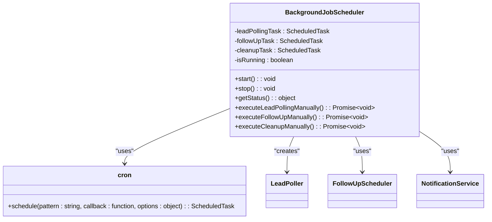
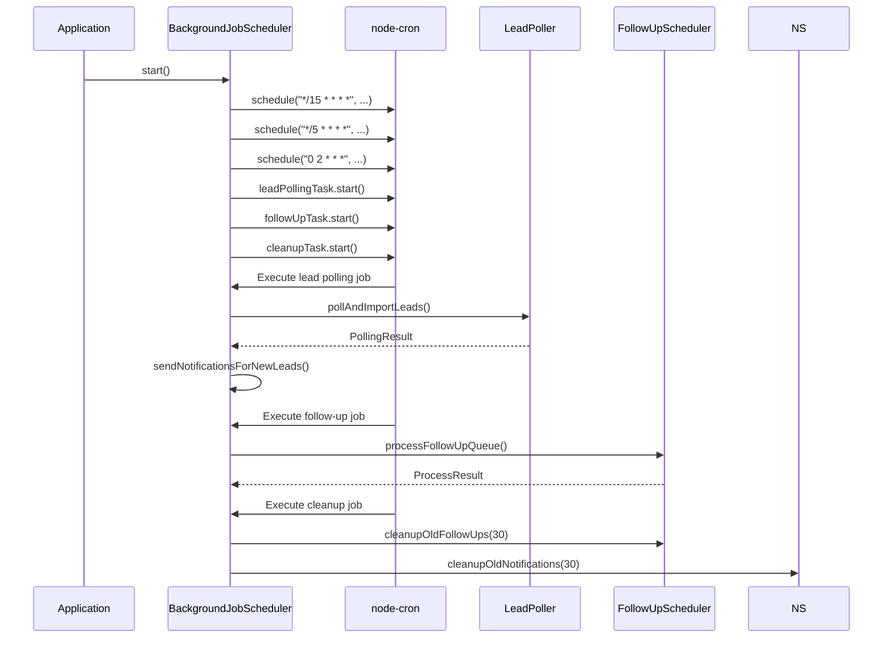
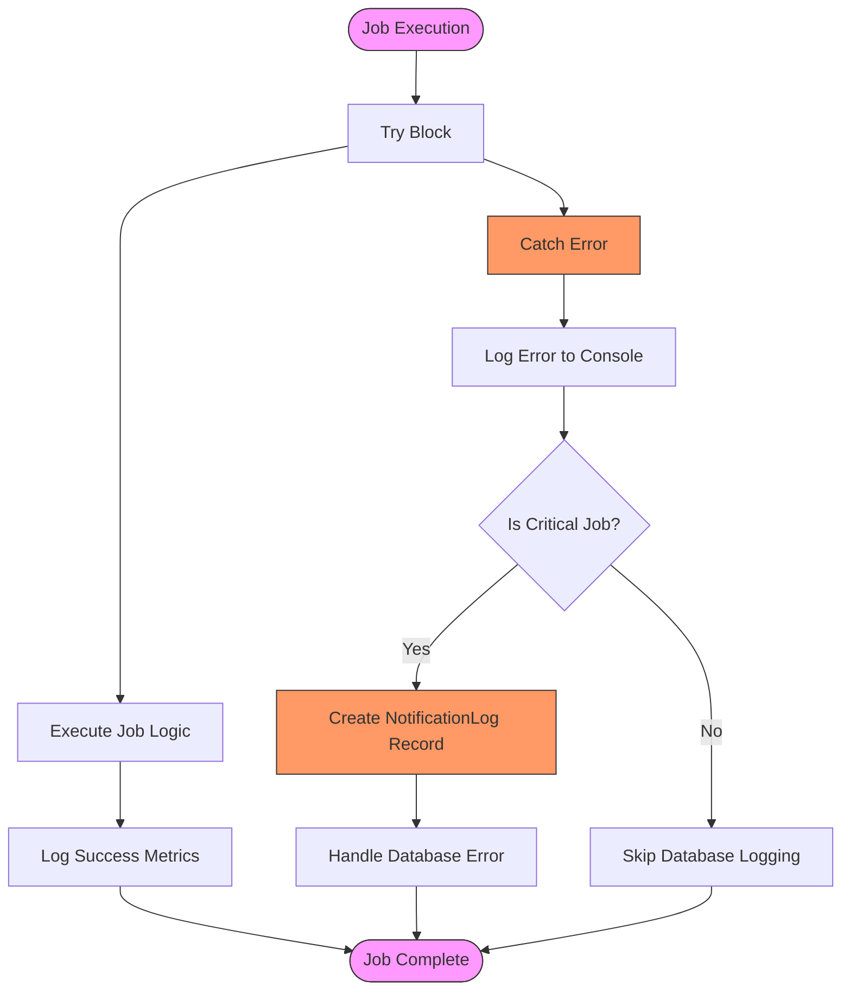
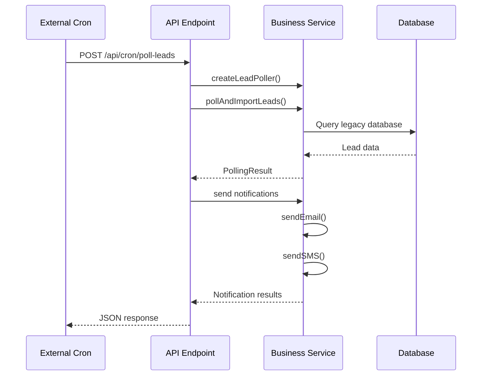
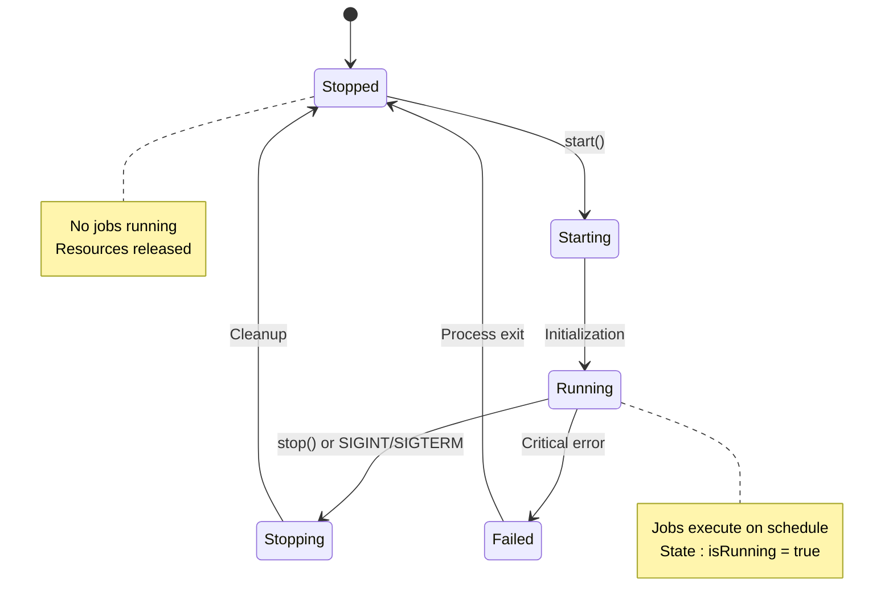
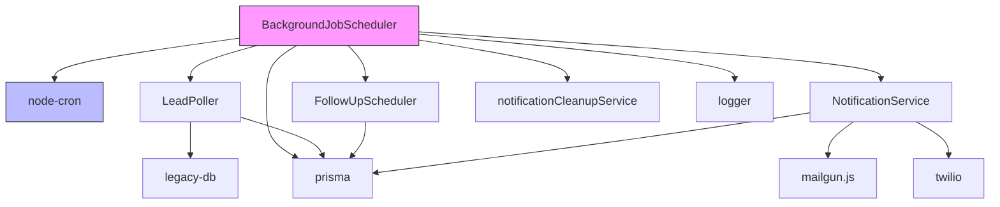

# Background Job Scheduling

<cite>
**Referenced Files in This Document**   
- [BackgroundJobScheduler.ts](file://src/services/BackgroundJobScheduler.ts)
- [poll-leads/route.ts](file://src/app/api/cron/poll-leads/route.ts)
- [send-followups/route.ts](file://src/app/api/cron/send-followups/route.ts)
- [start-scheduler.mjs](file://scripts/start-scheduler.mjs)
- [server-init.ts](file://src/lib/server-init.ts)
- [package.json](file://package.json)
</cite>

## Table of Contents
1. [Introduction](#introduction)
2. [Project Structure](#project-structure)
3. [Core Components](#core-components)
4. [Architecture Overview](#architecture-overview)
5. [Detailed Component Analysis](#detailed-component-analysis)
6. [Dependency Analysis](#dependency-analysis)
7. [Performance Considerations](#performance-considerations)
8. [Troubleshooting Guide](#troubleshooting-guide)
9. [Conclusion](#conclusion)

## Introduction
The BackgroundJobScheduler service orchestrates scheduled background tasks in the Fund Track application, including lead polling, follow-up notifications, and system cleanup operations. This documentation provides a comprehensive analysis of the scheduler's architecture, implementation, and integration patterns. The system uses a hybrid approach combining internal cron scheduling with external API triggers, ensuring reliable execution of time-sensitive operations critical to the application's business workflow.

## Project Structure
The project follows a Next.js application structure with clear separation of concerns. The background job functionality is organized across multiple directories:
- **src/services**: Contains the core BackgroundJobScheduler implementation
- **src/app/api/cron**: Houses API routes for external cron triggers
- **scripts**: Includes utility scripts for scheduler management
- **src/lib**: Contains supporting utilities and initialization logic

The scheduler integrates with other services like LeadPoller, FollowUpScheduler, and NotificationService to execute business-critical operations on predefined schedules.

```mermaid
graph TB
subgraph "Scheduler Core"
BJS[BackgroundJobScheduler]
end
subgraph "API Endpoints"
PL[/api/cron/poll-leads]
SF[/api/cron/send-followups]
end
subgraph "Supporting Services"
LP[LeadPoller]
FS[FollowUpScheduler]
NS[NotificationService]
end
subgraph "Management Scripts"
SS[start-scheduler.mjs]
ES[ensure-scheduler-running.sh]
end
BJS --> LP
BJS --> FS
BJS --> NS
PL --> LP
SF --> FS
SS --> BJS
ES --> PL
```

**Diagram sources**
- [BackgroundJobScheduler.ts](file://src/services/BackgroundJobScheduler.ts)
- [poll-leads/route.ts](file://src/app/api/cron/poll-leads/route.ts)
- [send-followups/route.ts](file://src/app/api/cron/send-followups/route.ts)
- [start-scheduler.mjs](file://scripts/start-scheduler.mjs)

## Core Components
The BackgroundJobScheduler is the central component responsible for orchestrating scheduled tasks. It uses the node-cron library to manage job scheduling and executes three primary jobs: lead polling, follow-up processing, and system cleanup. The scheduler is implemented as a singleton instance, ensuring only one instance runs per process.

The system integrates with external cron systems through dedicated API routes that can trigger specific jobs manually. This hybrid approach allows for both automated scheduling and manual intervention when needed. The scheduler handles process lifecycle events through SIGINT and SIGTERM signal handlers, ensuring graceful shutdown.

**Section sources**
- [BackgroundJobScheduler.ts](file://src/services/BackgroundJobScheduler.ts#L1-L50)
- [start-scheduler.mjs](file://scripts/start-scheduler.mjs#L1-L10)

## Architecture Overview
The background job architecture follows a hybrid scheduling model that combines internal cron scheduling with external API triggers. The core scheduler runs as a singleton service within the application process, managing three scheduled tasks with different frequencies. External systems can also trigger these jobs through dedicated API endpoints, providing flexibility for operations and debugging.

```mermaid
graph TD
subgraph "External Systems"
CronSystem[Cron System]
AdminUI[Admin Interface]
end
subgraph "API Layer"
PLRoute[/api/cron/poll-leads]
SFRRoute[/api/cron/send-followups]
DSRRoute[/api/dev/scheduler-status]
end
subgraph "Scheduler Service"
BJS[BackgroundJobScheduler]
LT[Lead Polling Task]
FT[Follow-up Task]
CT[Cleanup Task]
end
subgraph "Business Services"
LP[LeadPoller]
FS[FollowUpScheduler]
NS[NotificationService]
end
CronSystem --> PLRoute
CronSystem --> SFRRoute
AdminUI --> DSRRoute
DSRRoute --> BJS
PLRoute --> LP
SFRRoute --> FS
BJS --> LT
BJS --> FT
BJS --> CT
LT --> LP
FT --> FS
CT --> NS
LP --> NS
FS --> NS
style BJS fill:#f9f,stroke:#333
style LT fill:#bbf,stroke:#333
style FT fill:#bbf,stroke:#333
style CT fill:#bbf,stroke:#333
```

**Diagram sources**
- [BackgroundJobScheduler.ts](file://src/services/BackgroundJobScheduler.ts)
- [poll-leads/route.ts](file://src/app/api/cron/poll-leads/route.ts)
- [send-followups/route.ts](file://src/app/api/cron/send-followups/route.ts)

## Detailed Component Analysis

### BackgroundJobScheduler Implementation
The BackgroundJobScheduler class manages the lifecycle of scheduled jobs using the node-cron library. It implements a singleton pattern through the exported `backgroundJobScheduler` instance, preventing multiple instances from running simultaneously.



**Diagram sources**
- [BackgroundJobScheduler.ts](file://src/services/BackgroundJobScheduler.ts#L1-L50)

#### Job Registration and Scheduling
The scheduler registers three primary jobs with different cron patterns:

1. **Lead Polling**: Runs every 15 minutes by default (`*/15 * * * *`)
2. **Follow-up Processing**: Runs every 5 minutes by default (`*/5 * * * *`)
3. **Cleanup Operations**: Runs daily at 2:00 AM by default (`0 2 * * *`)

Each job is configured with timezone support (defaulting to America/New_York) and can be customized through environment variables. The scheduler uses the `scheduled: false` option when creating cron jobs, allowing explicit control over when jobs start.



**Diagram sources**
- [BackgroundJobScheduler.ts](file://src/services/BackgroundJobScheduler.ts#L50-L150)
- [poll-leads/route.ts](file://src/app/api/cron/poll-leads/route.ts)

#### Execution and Error Handling
The scheduler implements comprehensive error handling for all scheduled jobs. Each job execution is wrapped in try-catch blocks that log errors to both the console and the database through the NotificationLog model. For critical failures like lead polling, the system creates a database record to ensure the failure is visible in monitoring systems.

The error handling strategy includes:
- Detailed logging with processing time and error context
- Database persistence of critical errors for monitoring
- Graceful degradation when non-critical errors occur
- Separate error handling for each job type



**Diagram sources**
- [BackgroundJobScheduler.ts](file://src/services/BackgroundJobScheduler.ts#L150-L250)

### Integration with External Cron Systems
The application provides API endpoints that allow external cron systems to trigger background jobs. This hybrid approach combines the reliability of external cron with the flexibility of internal scheduling.

#### Cron-Triggered API Routes
Two primary API routes enable external triggering of background jobs:

1. **POST /api/cron/poll-leads**: Triggers lead polling and notification processing
2. **POST /api/cron/send-followups**: Triggers follow-up processing



**Diagram sources**
- [poll-leads/route.ts](file://src/app/api/cron/poll-leads/route.ts)
- [send-followups/route.ts](file://src/app/api/cron/send-followups/route.ts)

### Exactly-Once Execution and Process Lifecycle
The scheduler ensures exactly-once execution through several mechanisms:

1. **Singleton Pattern**: The exported instance prevents multiple schedulers
2. **State Tracking**: The `isRunning` flag prevents duplicate starts
3. **Process Management**: Signal handlers ensure proper cleanup
4. **External Coordination**: Environment variables control scheduler behavior

The system handles process lifecycle events through SIGINT and SIGTERM handlers that gracefully stop the scheduler before process termination. This prevents orphaned tasks and ensures clean shutdown.



**Diagram sources**
- [BackgroundJobScheduler.ts](file://src/services/BackgroundJobScheduler.ts#L100-L150)
- [start-scheduler.mjs](file://scripts/start-scheduler.mjs)

## Dependency Analysis
The BackgroundJobScheduler has well-defined dependencies on other services and external libraries. The primary dependencies include:



**Diagram sources**
- [package.json](file://package.json)
- [BackgroundJobScheduler.ts](file://src/services/BackgroundJobScheduler.ts)

The system uses node-cron (^4.2.1) as its scheduling library, with @types/node-cron (^3.0.11) providing TypeScript definitions. The scheduler depends on several internal services for business logic execution, maintaining loose coupling through well-defined interfaces.

## Performance Considerations
The scheduler is designed with performance and reliability in mind:

1. **Efficient Scheduling**: Uses node-cron's optimized cron expression parsing
2. **Error Resilience**: Isolated error handling prevents job failures from affecting the scheduler
3. **Resource Management**: Proper cleanup of cron tasks during shutdown
4. **Monitoring Integration**: Comprehensive logging for performance tracking

The system includes manual execution methods (`executeLeadPollingManually`, etc.) that are useful for testing and debugging without affecting the regular schedule. These methods share the same execution path as scheduled jobs, ensuring consistent behavior.

## Troubleshooting Guide
Common issues and their solutions:

**Section sources**
- [BackgroundJobScheduler.ts](file://src/services/BackgroundJobScheduler.ts#L300-L400)
- [start-scheduler.mjs](file://scripts/start-scheduler.mjs)
- [server-init.ts](file://src/lib/server-init.ts)

### Scheduler Not Starting
**Symptoms**: Scheduler fails to start, no jobs executing
**Causes**:
- ENABLE_BACKGROUND_JOBS environment variable not set
- Missing required environment variables (MERCHANT_FUNDING_CAMPAIGN_IDS)
- Database connection issues

**Solutions**:
1. Ensure ENABLE_BACKGROUND_JOBS=true in development
2. Verify all required environment variables are set
3. Check database connectivity
4. Use `start-scheduler.mjs` script to manually start

### Job Execution Failures
**Symptoms**: Jobs fail intermittently, errors in logs
**Causes**:
- Temporary network issues with external services
- Database timeouts
- Rate limiting on notification services

**Solutions**:
1. Check error logs for specific error messages
2. Verify external service credentials and connectivity
3. Implement retry logic in affected services
4. Monitor resource usage during peak times

### Duplicate Job Execution
**Symptoms**: Jobs appear to run multiple times
**Causes**:
- Multiple application instances running schedulers
- External cron triggering jobs while internal scheduler is active

**Solutions**:
1. Ensure only one instance runs the scheduler (use environment variables)
2. Coordinate external cron schedules with internal schedules
3. Implement distributed locking if multiple instances are required

## Conclusion
The BackgroundJobScheduler provides a robust foundation for executing scheduled tasks in the Fund Track application. Its hybrid architecture combines internal cron scheduling with external API triggers, offering both automation and manual control. The system demonstrates best practices in error handling, logging, and process management, ensuring reliable execution of critical business operations. Developers can extend the system by adding new jobs following the established patterns, leveraging the comprehensive monitoring and troubleshooting capabilities built into the architecture.