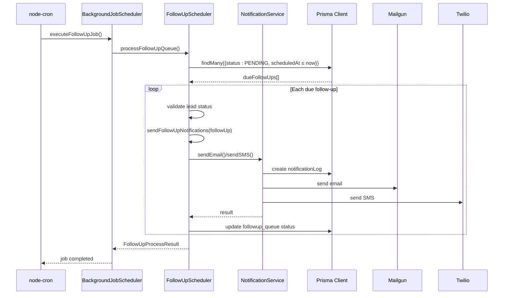
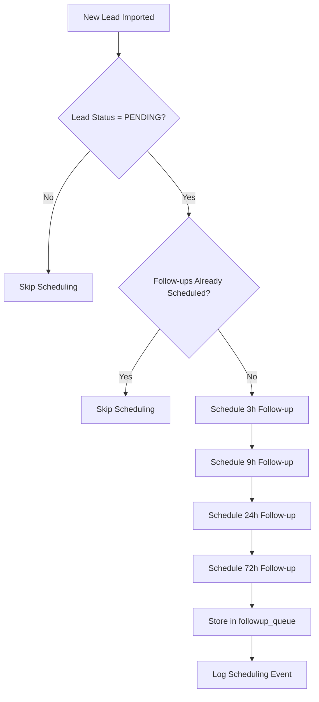
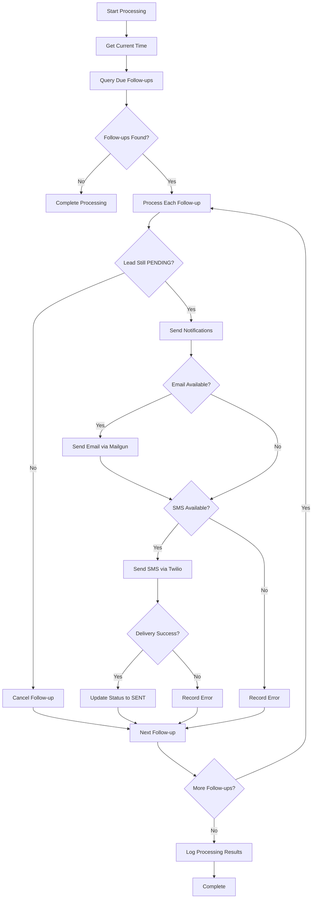
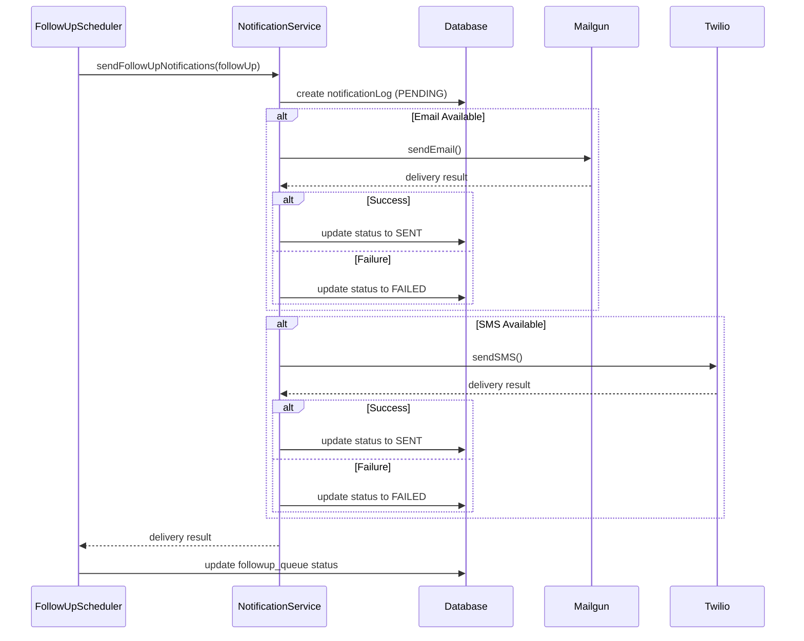
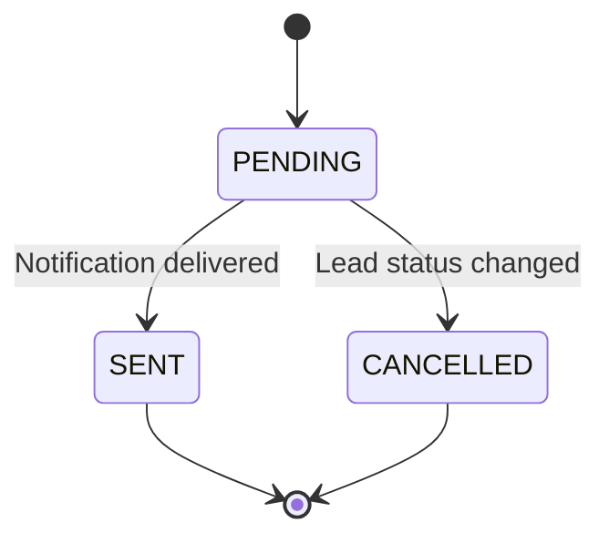
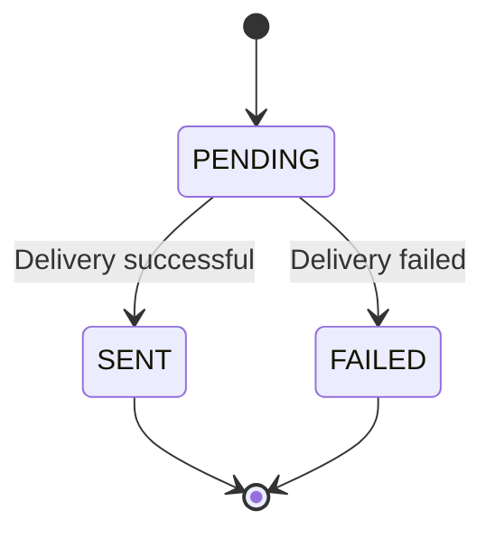
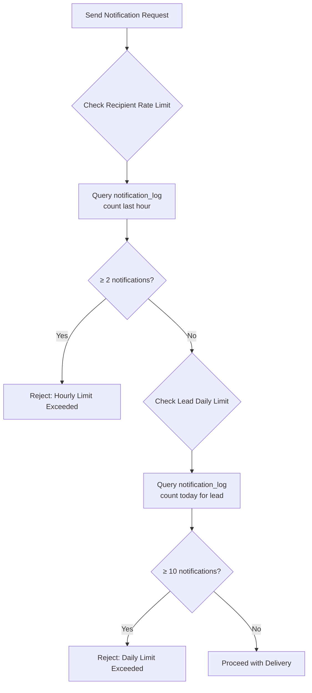
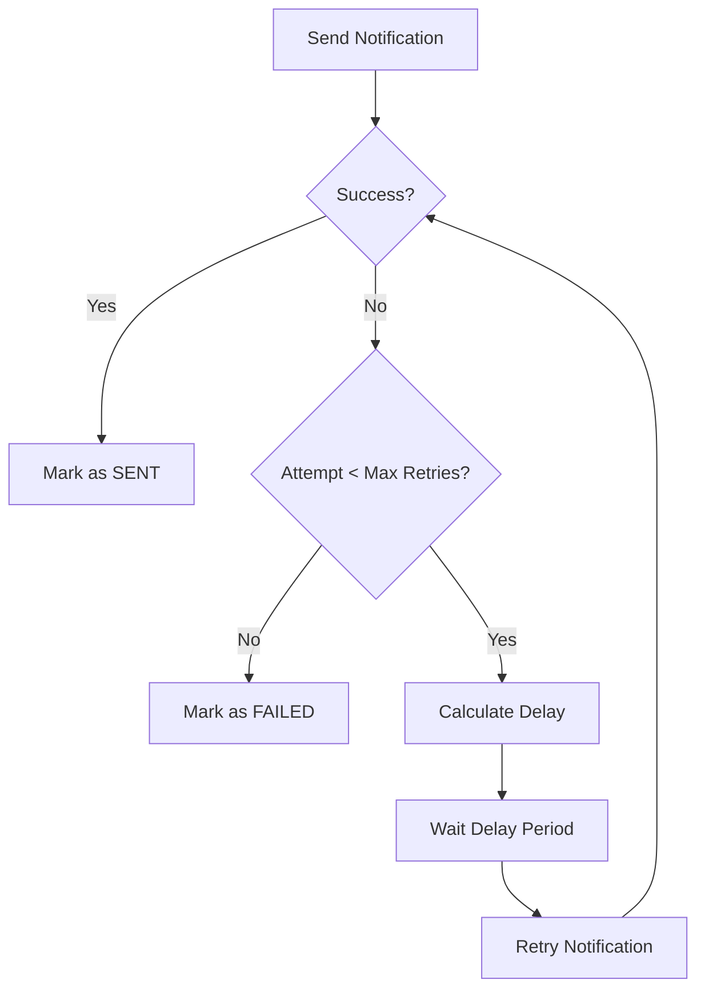

# Follow-up Scheduling Mechanism

<cite>
**Referenced Files in This Document**   
- [FollowUpScheduler.ts](file://src/services/FollowUpScheduler.ts)
- [send-followups/route.ts](file://src/app/api/cron/send-followups/route.ts)
- [NotificationService.ts](file://src/services/NotificationService.ts)
- [BackgroundJobScheduler.ts](file://src/services/BackgroundJobScheduler.ts)
- [schema.prisma](file://prisma/schema.prisma)
</cite>

## Table of Contents
1. [Introduction](#introduction)
2. [Architecture Overview](#architecture-overview)
3. [Core Components](#core-components)
4. [Follow-up Scheduling Workflow](#follow-up-scheduling-workflow)
5. [Time-based Scheduling Rules](#time-based-scheduling-rules)
6. [Notification Delivery and Status Management](#notification-delivery-and-status-management)
7. [Rate Limiting and Retry Mechanisms](#rate-limiting-and-retry-mechanisms)
8. [Timezone Handling and Edge Cases](#timezone-handling-and-edge-cases)
9. [Error Handling and Monitoring](#error-handling-and-monitoring)

## Introduction
The follow-up scheduling mechanism is a critical component of the merchant funding application system, designed to automatically send reminder notifications to leads at predefined intervals. This system ensures timely engagement with potential customers who have initiated but not completed their funding applications. The mechanism operates through a coordinated workflow involving multiple services and follows a precise time-based schedule to maximize conversion rates while maintaining compliance with communication best practices.

**Section sources**
- [FollowUpScheduler.ts](file://src/services/FollowUpScheduler.ts#L1-L50)
- [BackgroundJobScheduler.ts](file://src/services/BackgroundJobScheduler.ts#L1-L50)

## Architecture Overview

```mermaid
graph TD
A[/api/cron/send-followups<br/>API Endpoint] --> B[BackgroundJobScheduler]
B --> C[FollowUpScheduler]
C --> D[NotificationService]
D --> E[Mailgun API]
D --> F[Twilio API]
C --> G[Prisma Client]
D --> G
G --> H[(PostgreSQL Database)]
subgraph "Database Models"
H --> I[followup_queue]
H --> J[notification_log]
H --> K[leads]
end
subgraph "External Services"
E --> Mailgun
F --> Twilio
end
style A fill:#f9f,stroke:#333
style B fill:#bbf,stroke:#333
style C fill:#bbf,stroke:#333
style D fill:#bbf,stroke:#333
style H fill:#f96,stroke:#333
```

**Diagram sources**
- [send-followups/route.ts](file://src/app/api/cron/send-followups/route.ts#L1-L104)
- [BackgroundJobScheduler.ts](file://src/services/BackgroundJobScheduler.ts#L1-L463)
- [FollowUpScheduler.ts](file://src/services/FollowUpScheduler.ts#L1-L491)
- [NotificationService.ts](file://src/services/NotificationService.ts#L1-L472)
- [schema.prisma](file://prisma/schema.prisma#L1-L258)

## Core Components

### FollowUpScheduler Service
The FollowUpScheduler service is responsible for managing the lifecycle of follow-up notifications, from scheduling to processing and cancellation. It maintains a queue of pending follow-ups and processes them according to business rules.

```mermaid
classDiagram
class FollowUpScheduler {
+followUpIntervals : Map
+scheduleFollowUpsForLead(leadId) : FollowUpScheduleResult
+cancelFollowUpsForLead(leadId) : boolean
+processFollowUpQueue() : FollowUpProcessResult
+getFollowUpStats() : Object
+cleanupOldFollowUps(daysOld) : number
}
class NotificationService {
+sendEmail(notification) : NotificationResult
+sendSMS(notification) : NotificationResult
+checkRateLimit(recipient, type, leadId) : {allowed, reason}
}
class PrismaClient {
+followupQueue
+lead
+notificationLog
}
FollowUpScheduler --> NotificationService : "uses"
FollowUpScheduler --> PrismaClient : "queries"
NotificationService --> PrismaClient : "logs"
```

**Diagram sources**
- [FollowUpScheduler.ts](file://src/services/FollowUpScheduler.ts#L1-L491)
- [NotificationService.ts](file://src/services/NotificationService.ts#L1-L472)

### BackgroundJobScheduler Integration
The BackgroundJobScheduler orchestrates the execution of follow-up processing jobs at regular intervals, ensuring that due notifications are processed promptly.



**Diagram sources**
- [BackgroundJobScheduler.ts](file://src/services/BackgroundJobScheduler.ts#L1-L463)
- [FollowUpScheduler.ts](file://src/services/FollowUpScheduler.ts#L1-L491)
- [NotificationService.ts](file://src/services/NotificationService.ts#L1-L472)

**Section sources**
- [BackgroundJobScheduler.ts](file://src/services/BackgroundJobScheduler.ts#L1-L463)
- [FollowUpScheduler.ts](file://src/services/FollowUpScheduler.ts#L1-L491)

## Follow-up Scheduling Workflow

### Initial Scheduling Process
When a new lead is imported into the system, the follow-up scheduling process begins automatically. The FollowUpScheduler creates four follow-up entries in the queue, each with a different time interval.



The scheduling process follows these steps:
1. Verify the lead exists and has a PENDING status
2. Check if follow-ups are already scheduled for this lead
3. Calculate scheduled times based on current timestamp plus interval
4. Create database records for each follow-up type
5. Log the scheduling operation for monitoring

**Section sources**
- [FollowUpScheduler.ts](file://src/services/FollowUpScheduler.ts#L25-L150)

### Processing Pipeline
The processing pipeline executes periodically to identify and deliver due follow-up notifications. The pipeline follows a strict sequence to ensure data consistency and proper error handling.



**Section sources**
- [FollowUpScheduler.ts](file://src/services/FollowUpScheduler.ts#L152-L300)
- [send-followups/route.ts](file://src/app/api/cron/send-followups/route.ts#L1-L104)

## Time-based Scheduling Rules

### Follow-up Intervals
The system implements four distinct follow-up intervals designed to maintain engagement without overwhelming the recipient:

**Follow-up Schedule Rules**
- **3h**: Initial reminder sent three hours after application initiation
- **9h**: Second reminder sent nine hours after application initiation  
- **24h**: Daily reminder sent one day after application initiation
- **72h**: Final reminder sent three days after application initiation

These intervals are defined as constants in the FollowUpScheduler:

```typescript
private readonly followUpIntervals = {
  [FollowupType.THREE_HOUR]: 3 * 60 * 60 * 1000, // 3 hours
  [FollowupType.NINE_HOUR]: 9 * 60 * 60 * 1000,  // 9 hours
  [FollowupType.TWENTY_FOUR_H]: 24 * 60 * 60 * 1000, // 24 hours
  [FollowupType.SEVENTY_TWO_H]: 72 * 60 * 60 * 1000, // 72 hours
};
```

The intervals are stored in the database using the FollowupType enum:

```prisma
enum FollowupType {
  THREE_HOUR    @map("3h")
  NINE_HOUR     @map("9h") 
  TWENTY_FOUR_H @map("24h")
  SEVENTY_TWO_H @map("72h")
}
```

**Section sources**
- [FollowUpScheduler.ts](file://src/services/FollowUpScheduler.ts#L10-L20)
- [schema.prisma](file://prisma/schema.prisma#L220-L227)

## Notification Delivery and Status Management

### Delivery Coordination
The NotificationService coordinates the delivery of follow-up notifications through multiple channels, with built-in fallback mechanisms.



**Section sources**
- [FollowUpScheduler.ts](file://src/services/FollowUpScheduler.ts#L302-L440)
- [NotificationService.ts](file://src/services/NotificationService.ts#L1-L472)

### Status Update Mechanism
The system maintains comprehensive status tracking for both follow-up requests and individual notifications:

**Follow-up Queue Status Flow**


**Notification Log Status Flow**


The status updates are atomic operations performed within database transactions to ensure data consistency. When a follow-up is successfully delivered, both the followup_queue record is updated to SENT status and a corresponding notification_log entry is created or updated.

**Section sources**
- [FollowUpScheduler.ts](file://src/services/FollowUpScheduler.ts#L350-L375)
- [NotificationService.ts](file://src/services/NotificationService.ts#L130-L140)
- [schema.prisma](file://prisma/schema.prisma#L228-L233)

## Rate Limiting and Retry Mechanisms

### Rate Limiting Implementation
The system implements a dual-layer rate limiting strategy to prevent notification spam and ensure compliance with service provider limits.



The rate limiting rules are:
- **Per Recipient**: Maximum of 2 notifications per hour per email/phone number
- **Per Lead**: Maximum of 10 notifications per day per lead ID

These limits are enforced in the NotificationService's checkRateLimit method:

```typescript
private async checkRateLimit(
  recipient: string,
  type: 'EMAIL' | 'SMS',
  leadId?: number
): Promise<{ allowed: boolean; reason?: string }> {
  const oneHourAgo = new Date(now.getTime() - 60 * 60 * 1000);
  const oneDayAgo = new Date(now.getTime() - 24 * 60 * 60 * 1000);

  // Check recipient hourly limit
  const recentNotifications = await prisma.notificationLog.count({
    where: {
      recipient,
      type: type as any,
      status: 'SENT',
      createdAt: { gte: oneHourAgo },
    },
  });

  if (recentNotifications >= 2) {
    return { allowed: false, reason: `Rate limit exceeded: ${recentNotifications} notifications sent to ${recipient} in the last hour` };
  }

  // Check lead daily limit
  if (leadId) {
    const leadNotificationsToday = await prisma.notificationLog.count({
      where: {
        leadId,
        type: type as any,
        status: 'SENT',
        createdAt: { gte: oneDayAgo },
      },
    });

    if (leadNotificationsToday >= 10) {
      return { allowed: false, reason: `Daily limit exceeded: ${leadNotificationsToday} notifications sent to lead ${leadId} today` };
    }
  }

  return { allowed: true };
}
```

**Section sources**
- [NotificationService.ts](file://src/services/NotificationService.ts#L350-L403)

### Retry Mechanism for Failed Notifications
The system implements an exponential backoff retry strategy for failed notifications to handle transient issues with external services.



The retry configuration is defined as:

```typescript
retryConfig: {
  maxRetries: 3,
  baseDelay: 1000, // 1 second
  maxDelay: 30000, // 30 seconds
}
```

The exponential backoff algorithm calculates delays as: `min(baseDelay * 2^attempt, maxDelay)`

For example:
- Attempt 1: 1,000ms delay
- Attempt 2: 2,000ms delay  
- Attempt 3: 4,000ms delay
- Attempt 4: 8,000ms delay (capped at 30,000ms)

The retry logic is implemented in the executeWithRetry method:

```typescript
private async executeWithRetry<T>(
  fn: () => Promise<T>,
  operationType: string
): Promise<T> {
  let lastError: Error;

  for (let attempt = 0; attempt <= this.config.retryConfig.maxRetries; attempt++) {
    try {
      return await fn();
    } catch (error) {
      lastError = error instanceof Error ? error : new Error('Unknown error');

      if (attempt === this.config.retryConfig.maxRetries) {
        break;
      }

      const delay = Math.min(
        this.config.retryConfig.baseDelay * Math.pow(2, attempt),
        this.config.retryConfig.maxDelay
      );

      await this.sleep(delay);
    }
  }

  throw lastError!;
}
```

**Section sources**
- [NotificationService.ts](file://src/services/NotificationService.ts#L240-L349)

## Timezone Handling and Edge Cases

### Timezone Configuration
The system handles timezone-aware scheduling through the BackgroundJobScheduler, which uses the system timezone configuration:

```typescript
this.followUpTask = cron.schedule(
  followUpPattern,
  async () => {
    await this.executeFollowUpJob();
  },
  {
    scheduled: false,
    timezone: process.env.TZ || "America/New_York",
  } as any
);
```

The timezone is configured via the TZ environment variable, defaulting to America/New_York if not specified. This ensures that cron jobs execute according to the intended business timezone rather than the server's local time.

**Section sources**
- [BackgroundJobScheduler.ts](file://src/services/BackgroundJobScheduler.ts#L41-L91)

### Edge Case Handling

#### Daylight Saving Time Changes
The system handles daylight saving time (DST) transitions through the node-cron library, which automatically adjusts for DST changes in the specified timezone. When clocks spring forward, the system may skip a scheduled execution if it falls within the missing hour. When clocks fall back, the system may execute twice if the same time occurs twice.

#### Clock Drift Compensation
The follow-up processing job runs every 5 minutes (configurable via FOLLOWUP_CRON_PATTERN), which provides natural compensation for minor clock drift. The system queries for all follow-ups with scheduledAt ≤ current time, ensuring that no due notifications are missed even if the server clock is slightly off.

#### Lead Status Changes
When a lead's status changes from PENDING to another status (e.g., COMPLETED or REJECTED), all pending follow-ups for that lead are automatically cancelled:

```typescript
async cancelFollowUpsForLead(leadId: number): Promise<boolean> {
  const result = await prisma.followupQueue.updateMany({
    where: {
      leadId,
      status: FollowupStatus.PENDING,
    },
    data: {
      status: FollowupStatus.CANCELLED,
    },
  });
}
```

This prevents unnecessary notifications from being sent to leads who have already completed their applications.

#### System Downtime Recovery
In the event of system downtime, the follow-up processing mechanism is designed to recover gracefully. When the system restarts, the next scheduled job will process all overdue follow-ups (where scheduledAt ≤ current time) in a single execution. The system does not limit the number of follow-ups processed in a single job, ensuring that no notifications are permanently lost due to downtime.

**Section sources**
- [FollowUpScheduler.ts](file://src/services/FollowUpScheduler.ts#L148-L190)
- [BackgroundJobScheduler.ts](file://src/services/BackgroundJobScheduler.ts#L41-L91)

## Error Handling and Monitoring

### Comprehensive Error Handling
The system implements multi-layer error handling to ensure reliability and provide detailed diagnostics:

```mermaid
flowchart TD
A[Processing Follow-up] --> B{Error Occurred?}
B --> |No| C[Continue Processing]
B --> |Yes| D[Log Error with Context]
D --> E{Critical System Error?}
E --> |Yes| F[Send Alert to Admin]
E --> |No| G[Continue with Next Follow-up]
G --> H[Aggregate Errors]
H --> I[Include in Final Result]
```



Each component has its own error handling strategy:
- **FollowUpScheduler**: Catches and logs errors for individual follow-ups while continuing to process others
- **NotificationService**: Implements retry logic for transient failures and detailed error logging
- **BackgroundJobScheduler**: Logs job-level errors and sends alerts for critical failures

### Monitoring and Statistics
The system provides comprehensive monitoring capabilities through several mechanisms:

**Follow-up Statistics Endpoint**
The GET /api/cron/send-followups endpoint returns real-time statistics about the follow-up queue:

```typescript
async getFollowUpStats() {
  const stats = await prisma.followupQueue.groupBy({
    by: ["followupType", "status"],
    _count: true,
  });

  const totalPending = await prisma.followupQueue.count({
    where: { status: FollowupStatus.PENDING },
  });

  return { totalPending, breakdown: stats };
}
```

**Logging Strategy**
The system uses structured logging with different log levels:
- **info**: Normal operation and successful processing
- **backgroundJob**: Scheduled job execution details
- **error**: Errors and failures
- **notification**: Individual notification events

**Health Monitoring**
The system exposes health endpoints and provides status information through the BackgroundJobScheduler.getStatus() method, which includes:
- Current running status
- Cron scheduling patterns
- Next scheduled execution times

**Section sources**
- [FollowUpScheduler.ts](file://src/services/FollowUpScheduler.ts#L440-L489)
- [send-followups/route.ts](file://src/app/api/cron/send-followups/route.ts#L80-L103)
- [BackgroundJobScheduler.ts](file://src/services/BackgroundJobScheduler.ts#L369-L422)