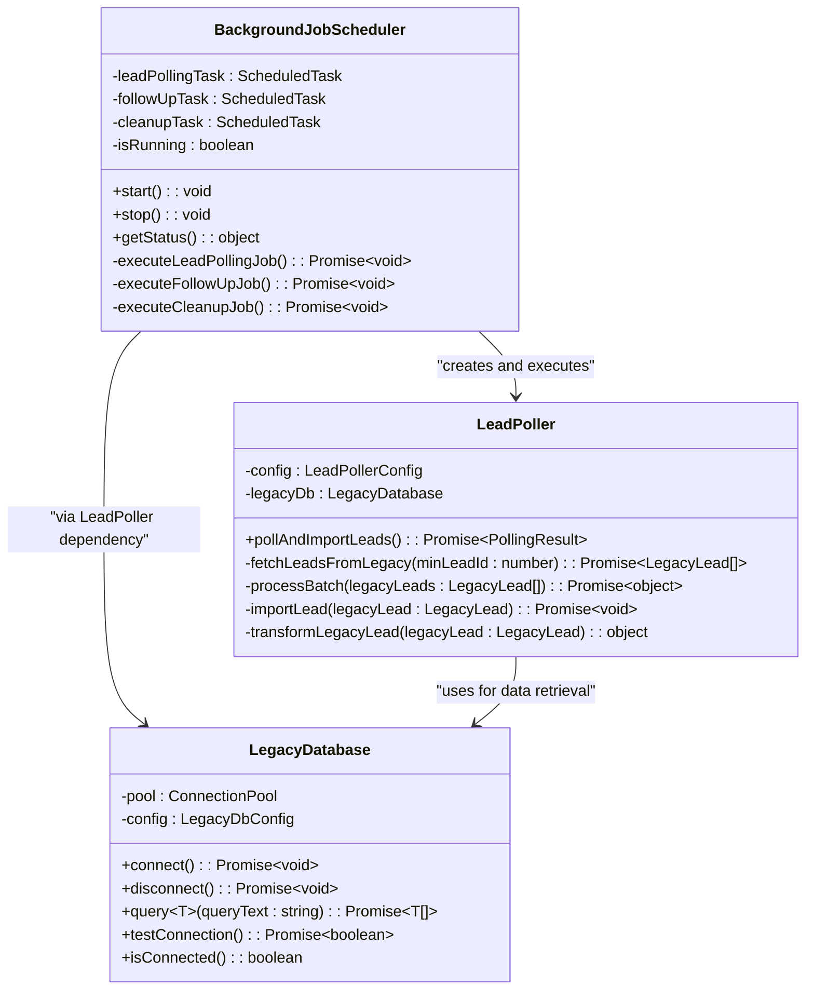
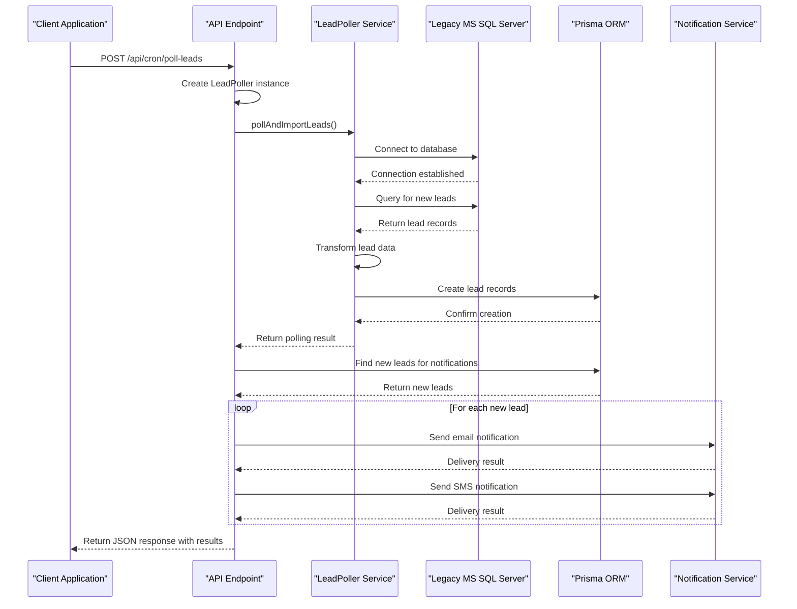
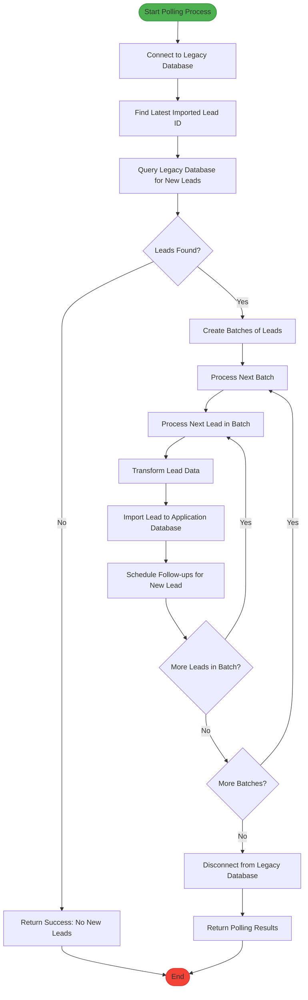
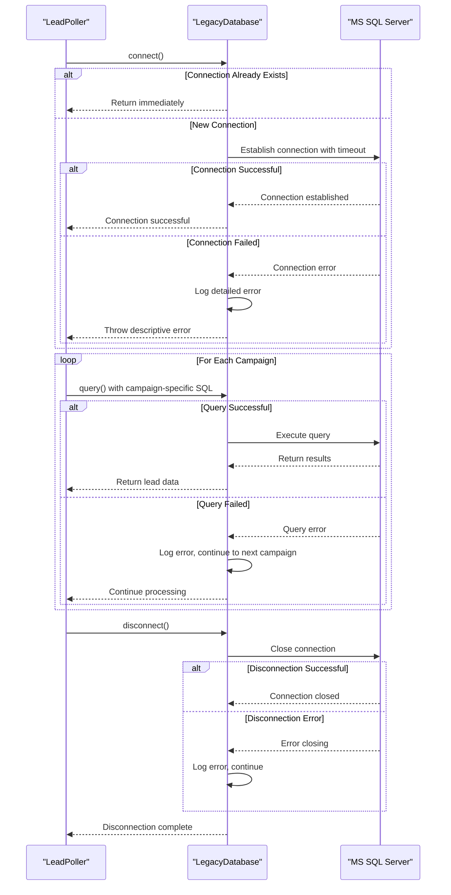
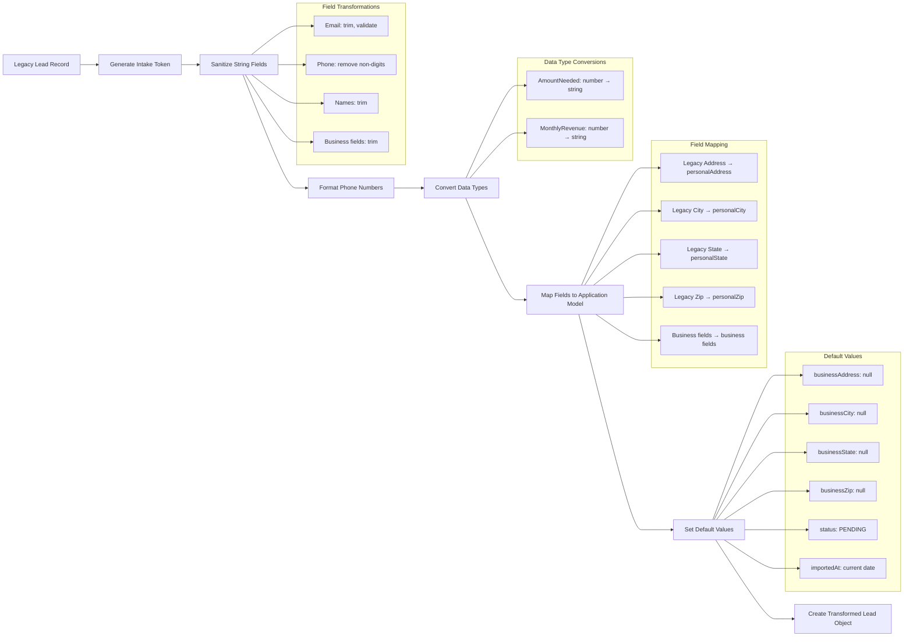
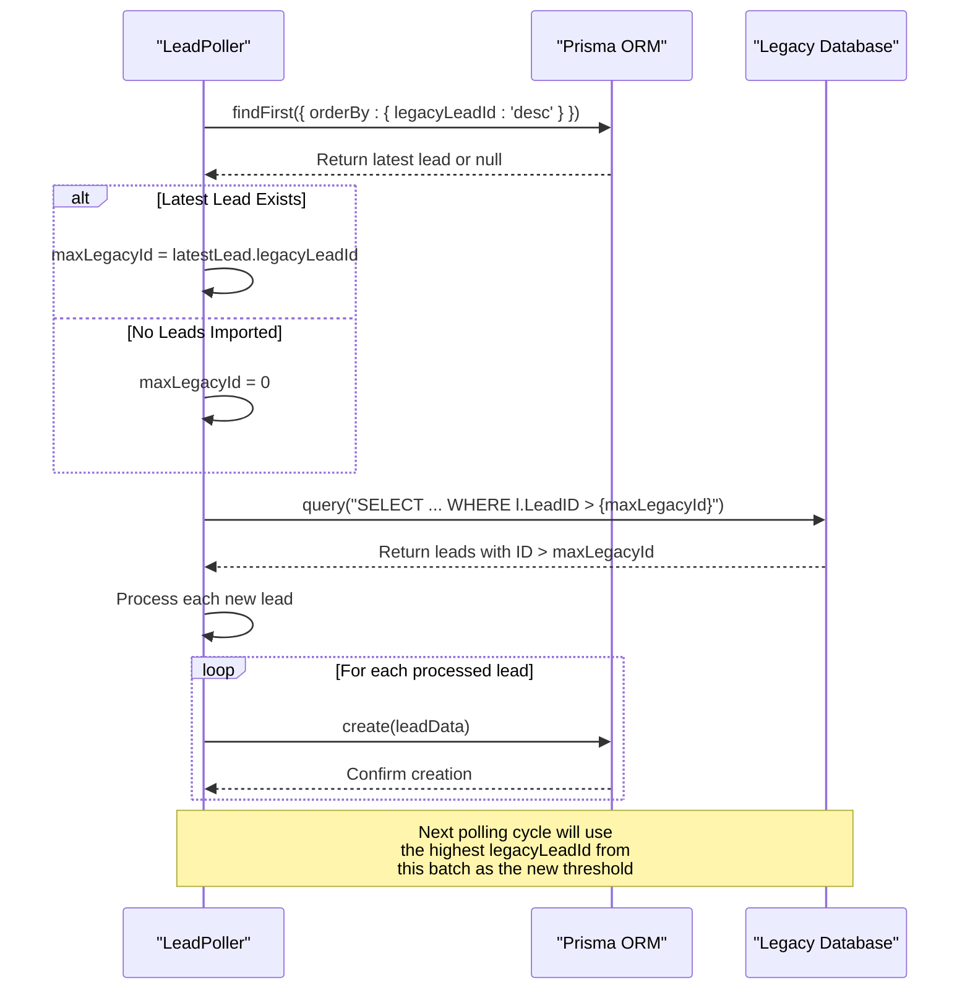
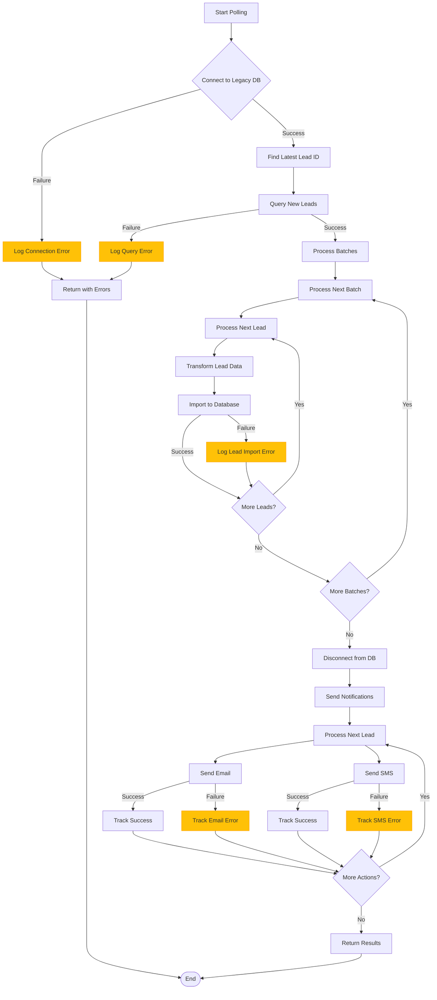

# Lead Polling Integration

<cite>
**Referenced Files in This Document**   
- [BackgroundJobScheduler.ts](file://src/services/BackgroundJobScheduler.ts)
- [LeadPoller.ts](file://src/services/LeadPoller.ts)
- [route.ts](file://src/app/api/cron/poll-leads/route.ts)
- [legacy-db.ts](file://src/lib/legacy-db.ts)
- [status/route.ts](file://src/app/api/admin/background-jobs/status/route.ts)
</cite>

## Table of Contents
1. [Lead Polling System Overview](#lead-polling-system-overview)
2. [Job Registration and Scheduling](#job-registration-and-scheduling)
3. [API Trigger Mechanism](#api-trigger-mechanism)
4. [Lead Polling Execution Flow](#lead-polling-execution-flow)
5. [Database Connectivity and Error Handling](#database-connectivity-and-error-handling)
6. [Data Transformation Pipeline](#data-transformation-pipeline)
7. [Duplicate Detection and State Tracking](#duplicate-detection-and-state-tracking)
8. [Error Scenarios and Resolution Strategies](#error-scenarios-and-resolution-strategies)

## Lead Polling System Overview

The lead polling system integrates a background job scheduler with a legacy MS SQL Server database to import merchant funding leads into the application. The system uses a cron-based scheduling mechanism to periodically poll for new leads and process them in batches. The integration involves multiple components working together to ensure reliable data transfer, transformation, and notification.

The core components of the system include:
- **BackgroundJobScheduler**: Manages the scheduling and execution of periodic jobs
- **LeadPoller**: Handles the actual polling and import of leads from the legacy database
- **LegacyDatabase**: Provides connectivity to the MS SQL Server database
- **/api/cron/poll-leads endpoint**: Allows manual triggering of the polling process

This integration enables the application to automatically ingest leads from external sources, transform them into the application's data model, and initiate follow-up processes for new leads.

**Section sources**
- [BackgroundJobScheduler.ts](file://src/services/BackgroundJobScheduler.ts#L8-L463)
- [LeadPoller.ts](file://src/services/LeadPoller.ts#L21-L522)

## Job Registration and Scheduling

The BackgroundJobScheduler class manages the registration and execution of background jobs, including the lead polling process. The scheduler uses the node-cron library to schedule jobs based on cron expressions, with configuration primarily driven by environment variables.

When the scheduler starts, it registers three main jobs:
1. **Lead Polling Job**: Executes every 15 minutes by default
2. **Follow-up Processing Job**: Executes every 5 minutes by default
3. **Notification Cleanup Job**: Executes daily at 2 AM

The lead polling job is configured with a cron pattern that can be customized via the `LEAD_POLLING_CRON_PATTERN` environment variable. The default pattern `*/15 * * * *` triggers the job every 15 minutes. The scheduler also respects the application's timezone setting through the `TZ` environment variable, defaulting to "America/New_York" if not specified.

**Diagram sources**
- [BackgroundJobScheduler.ts](file://src/services/BackgroundJobScheduler.ts#L8-L463)
- [LeadPoller.ts](file://src/services/LeadPoller.ts#L21-L522)
- [legacy-db.ts](file://src/lib/legacy-db.ts#L12-L158)

**Section sources**
- [BackgroundJobScheduler.ts](file://src/services/BackgroundJobScheduler.ts#L27-L199)

## API Trigger Mechanism

The `/api/cron/poll-leads` endpoint provides a REST API interface to manually trigger the lead polling process. This endpoint accepts POST requests that initiate the same lead polling workflow as the scheduled job, allowing for manual execution when needed.

When a POST request is received, the endpoint creates a LeadPoller instance using the `createLeadPoller` factory function and calls its `pollAndImportLeads` method to begin the polling process. After successfully importing leads, the system automatically sends notifications to new leads via email and SMS.

The API response includes detailed information about the polling result, including:
- **success**: Boolean indicating overall success
- **message**: Descriptive status message
- **pollingResult**: Object containing statistics about the polling operation
- **notificationResults**: Object containing statistics about notification delivery

**Diagram sources**
- [route.ts](file://src/app/api/cron/poll-leads/route.ts#L0-L193)
- [LeadPoller.ts](file://src/services/LeadPoller.ts#L21-L522)

**Section sources**
- [route.ts](file://src/app/api/cron/poll-leads/route.ts#L0-L193)

## Lead Polling Execution Flow

The lead polling execution flow follows a systematic process to retrieve, transform, and import leads from the legacy database. The process begins by establishing a connection to the legacy MS SQL Server database and determining the starting point for data retrieval.

The system tracks the latest imported lead by querying the application database for the highest `legacyLeadId`. This ID serves as the minimum threshold for fetching new leads, ensuring that only previously unprocessed records are retrieved. The query uses the `legacyLeadId` field to identify the most recently imported lead, with a fallback to 0 if no leads have been imported yet.

Once the starting point is established, the system queries the legacy database for leads with IDs greater than the maximum previously imported ID. The query joins the `Leads` table (containing contact information) with campaign-specific tables (containing business information) to create a comprehensive lead record. The results are sorted by ID to maintain chronological order.

After retrieving the leads, the system processes them in batches to manage memory usage and improve performance. The default batch size is 100 leads, but this can be configured via the `LEAD_POLLING_BATCH_SIZE` environment variable. Each batch is processed sequentially, with individual leads being transformed and imported into the application database.

**Diagram sources**
- [LeadPoller.ts](file://src/services/LeadPoller.ts#L21-L522)

**Section sources**
- [LeadPoller.ts](file://src/services/LeadPoller.ts#L52-L117)

## Database Connectivity and Error Handling

The system implements robust connectivity and error handling mechanisms for interacting with the legacy MS SQL Server database. The LegacyDatabase class encapsulates all database operations and provides a consistent interface for connecting, querying, and disconnecting from the database.

Database configuration is managed through environment variables, allowing for flexible deployment across different environments:

**Environment Variables for Legacy Database Connection**
- `LEGACY_DB_SERVER`: Hostname or IP address of the database server
- `LEGACY_DB_DATABASE`: Name of the database to connect to
- `LEGACY_DB_USER`: Username for authentication
- `LEGACY_DB_PASSWORD`: Password for authentication
- `LEGACY_DB_PORT`: Port number (defaults to 1433)
- `LEGACY_DB_ENCRYPT`: Whether to use encryption (true/false)
- `LEGACY_DB_TRUST_CERT`: Whether to trust the server certificate (true/false)
- `LEGACY_DB_REQUEST_TIMEOUT`: Request timeout in milliseconds (defaults to 30,000)
- `LEGACY_DB_CONNECTION_TIMEOUT`: Connection timeout in milliseconds (defaults to 15,000)

The connection process includes several safeguards:
1. The system checks if a connection already exists before attempting to connect
2. Connection and request timeouts are configured to prevent hanging operations
3. Certificate trust is explicitly configured to handle self-signed certificates
4. Errors during connection are caught and rethrown with descriptive messages

When executing queries, the system implements error handling at multiple levels:
- Individual campaign queries are isolated, so a failure in one campaign doesn't prevent processing others
- The system logs detailed error information for troubleshooting
- Connection cleanup is guaranteed through the use of try-finally blocks
- Database connections are properly closed even if errors occur

**Diagram sources**
- [legacy-db.ts](file://src/lib/legacy-db.ts#L12-L158)
- [LeadPoller.ts](file://src/services/LeadPoller.ts#L21-L522)

**Section sources**
- [legacy-db.ts](file://src/lib/legacy-db.ts#L12-L158)

## Data Transformation Pipeline

The data transformation pipeline converts legacy database records into the application's lead data model. This process involves several steps to ensure data integrity, consistency, and proper formatting.

The transformation begins with the `transformLegacyLead` method in the LeadPoller class, which takes a legacy lead record and returns a transformed object compatible with the application's Prisma schema. The transformation process includes:

1. **Token Generation**: A unique intake token is generated for each new lead using the TokenService, enabling secure access to the application process.
2. **Data Sanitization**: String fields are trimmed and validated, with empty or invalid values converted to null.
3. **Phone Number Formatting**: Phone numbers are sanitized by removing non-digit characters and validated for proper length (10-15 digits).
4. **Data Type Conversion**: Numeric values like amount needed and monthly revenue are converted to strings to match the application schema.
5. **Field Mapping**: Legacy fields are mapped to the application's field structure, with personal and business information separated appropriately.

The transformation also handles the distinction between personal and business information. The legacy system stores personal address information in the Leads table, while business information is stored in campaign-specific tables. The transformation process preserves this distinction by mapping personal address fields to `personalAddress`, `personalCity`, etc., while leaving business address fields as null to be filled during the intake process.

**Diagram sources**
- [LeadPoller.ts](file://src/services/LeadPoller.ts#L315-L521)

**Section sources**
- [LeadPoller.ts](file://src/services/LeadPoller.ts#L315-L521)

## Duplicate Detection and State Tracking

The lead polling system implements a state-based approach to prevent duplicate processing of leads while maintaining efficient data retrieval. Rather than using traditional duplicate detection methods that check for existing records, the system tracks processing state through the maximum legacy lead ID that has been imported.

The state tracking mechanism works as follows:
1. Before polling for new leads, the system queries the application database to find the highest `legacyLeadId` value
2. This maximum ID becomes the starting point for the next polling cycle
3. The legacy database query includes a WHERE clause that only returns leads with IDs greater than this threshold
4. This ensures that each lead is processed exactly once, as the system will never retrieve the same lead ID twice

This approach offers several advantages:
- **Efficiency**: No need to check each lead against existing records, reducing database queries
- **Reliability**: The monotonically increasing nature of lead IDs ensures no gaps in processing
- **Simplicity**: The logic is straightforward and easy to understand and maintain
- **Performance**: The database can efficiently use indexes on the LeadID column

The system also tracks the polling state through environment variables and the scheduler's status endpoint. The `MERCHANT_FUNDING_CAMPAIGN_IDS` environment variable specifies which campaign tables to poll, allowing for flexible configuration across environments. The scheduler's status endpoint exposes the current cron patterns and next execution times, providing visibility into the polling schedule.

**Diagram sources**
- [LeadPoller.ts](file://src/services/LeadPoller.ts#L75-L117)
- [status/route.ts](file://src/app/api/admin/background-jobs/status/route.ts#L0-L48)

**Section sources**
- [LeadPoller.ts](file://src/services/LeadPoller.ts#L75-L117)

## Error Scenarios and Resolution Strategies

The lead polling system implements comprehensive error handling strategies to address various failure scenarios, ensuring reliability and data integrity. The system handles errors at multiple levels, from database connectivity issues to individual lead processing failures.

### Partial Batch Failures

When processing leads in batches, the system isolates failures to individual leads rather than failing the entire batch. If an error occurs while importing a specific lead, the system:
1. Logs the error with the lead ID and error message
2. Continues processing the remaining leads in the batch
3. Includes the error in the final polling result statistics

This approach ensures that transient issues with specific records don't prevent the processing of other valid leads. The system maintains a list of errors encountered during the polling process, which is returned in the result object for monitoring and troubleshooting.

### Connection Timeouts

The system handles database connection timeouts through several mechanisms:
1. **Configurable Timeouts**: Both connection and request timeouts are configurable via environment variables
2. **Graceful Error Handling**: Timeout errors are caught and converted to descriptive error messages
3. **Automatic Retry**: The scheduled nature of the job means that transient connectivity issues will be retried in the next polling cycle

The LegacyDatabase class implements connection timeout handling by setting the `connectionTimeout` option in the MSSQL configuration. This prevents the application from hanging indefinitely if the database server is unreachable. Similarly, the `requestTimeout` option prevents individual queries from running too long.

### Other Error Scenarios

The system addresses additional error scenarios through specific strategies:

**Campaign-Specific Failures**: When querying multiple campaign tables, a failure in one campaign doesn't prevent processing others. The system logs the error and continues with the remaining campaigns.

**Follow-up Scheduling Failures**: If scheduling follow-ups for a new lead fails, the system logs a warning but continues the import process. This ensures that the primary function of importing leads isn't blocked by secondary processes.

**Notification Failures**: When sending notifications to new leads, individual email or SMS failures are tracked separately from the main polling result. The system continues sending notifications to other leads even if some fail.

**Database Cleanup**: The system ensures proper cleanup of database connections through try-finally blocks, guaranteeing that connections are closed even if errors occur during processing.

**Diagram sources**
- [LeadPoller.ts](file://src/services/LeadPoller.ts#L21-L522)
- [route.ts](file://src/app/api/cron/poll-leads/route.ts#L0-L193)

**Section sources**
- [LeadPoller.ts](file://src/services/LeadPoller.ts#L117-L316)
- [route.ts](file://src/app/api/cron/poll-leads/route.ts#L0-L193)