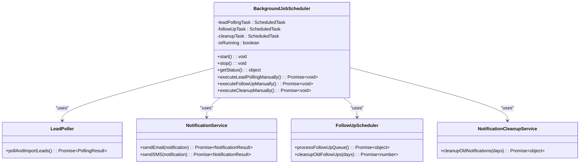
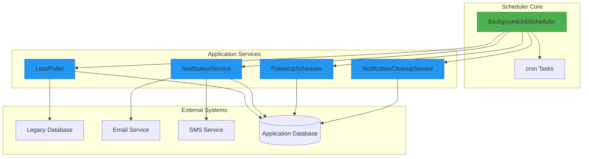
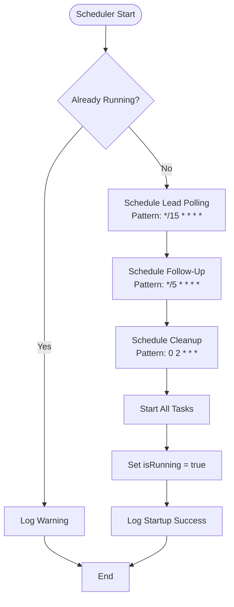
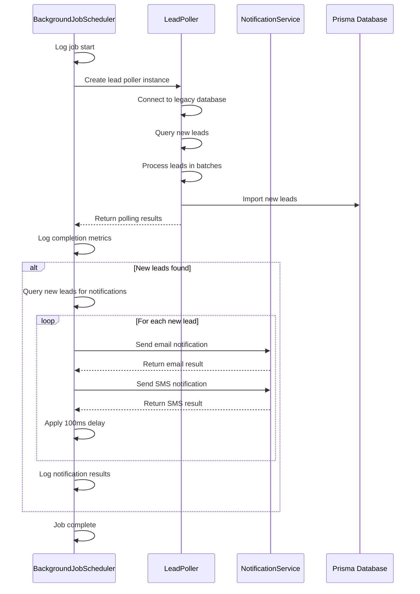
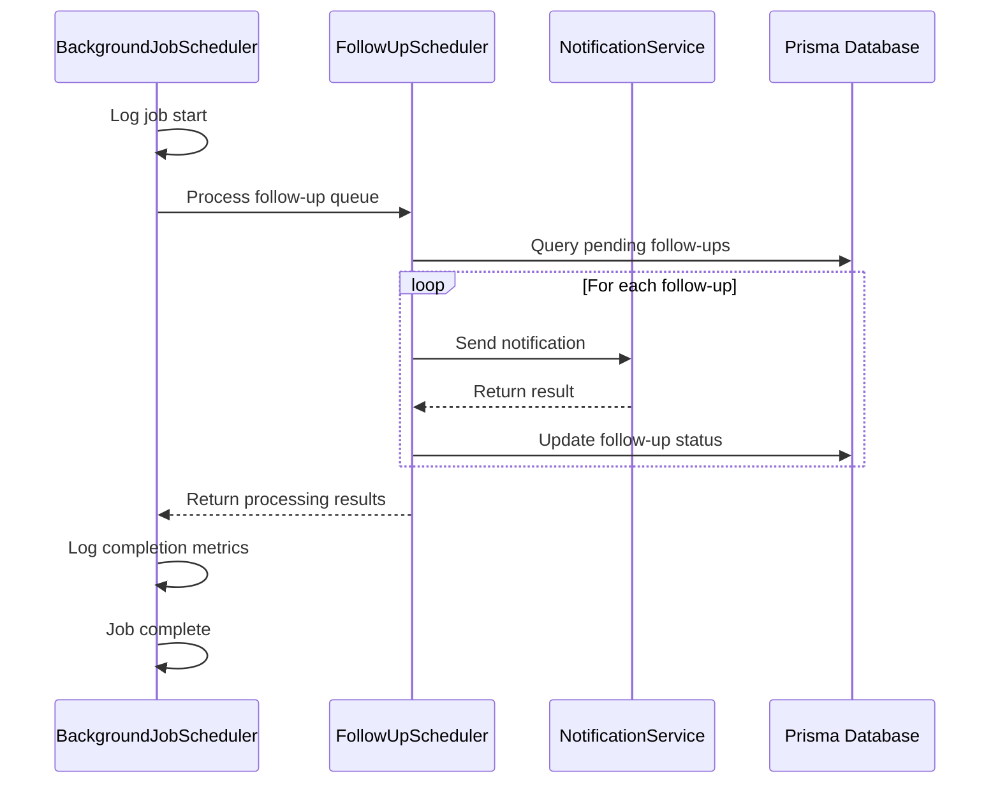
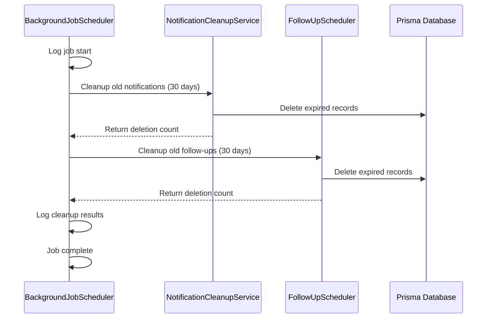
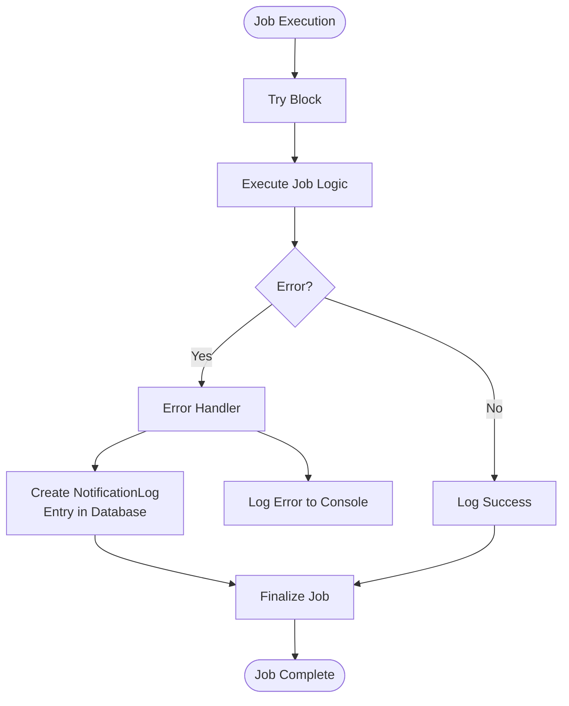
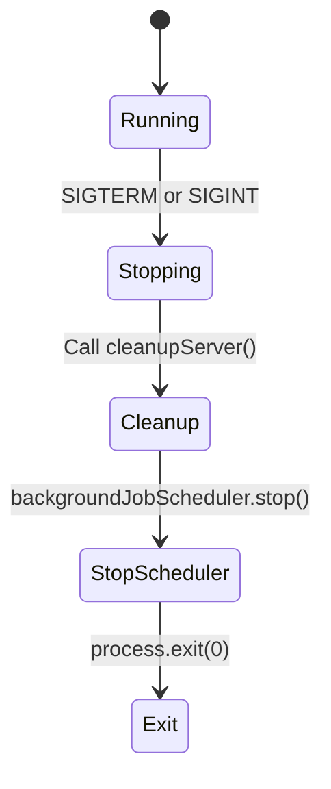

# Scheduler Architecture

<cite>
**Referenced Files in This Document**   
- [BackgroundJobScheduler.ts](file://src/services/BackgroundJobScheduler.ts)
- [server-init.ts](file://src/lib/server-init.ts)
- [start-scheduler.mjs](file://scripts/start-scheduler.mjs)
- [force-start-scheduler.mjs](file://scripts/force-start-scheduler.mjs)
- [scheduler-status/route.ts](file://src/app/api/dev/scheduler-status/route.ts)
- [status/route.ts](file://src/app/api/admin/background-jobs/status/route.ts)
- [LeadPoller.ts](file://src/services/LeadPoller.ts)
- [NotificationService.ts](file://src/services/NotificationService.ts)
- [FollowUpScheduler.ts](file://src/services/FollowUpScheduler.ts)
</cite>

## Table of Contents
1. [Introduction](#introduction)
2. [Core Components](#core-components)
3. [Architecture Overview](#architecture-overview)
4. [Detailed Component Analysis](#detailed-component-analysis)
5. [Job Execution Flow](#job-execution-flow)
6. [Error Handling and Monitoring](#error-handling-and-monitoring)
7. [Process Lifecycle Integration](#process-lifecycle-integration)
8. [External Control Interfaces](#external-control-interfaces)
9. [Conclusion](#conclusion)

## Introduction
The BackgroundJobScheduler class serves as the central orchestrator for scheduled background tasks in the merchant funding application. It manages periodic operations including lead polling, follow-up processing, and system cleanup. This document provides a comprehensive analysis of its architecture, implementation details, and integration points within the application ecosystem.

**Section sources**
- [BackgroundJobScheduler.ts](file://src/services/BackgroundJobScheduler.ts)

## Core Components
The BackgroundJobScheduler implements a singleton pattern to ensure only one instance manages scheduled jobs throughout the application lifecycle. It coordinates three primary background tasks:

- **Lead Polling**: Imports new leads from external legacy databases at regular intervals
- **Follow-up Processing**: Manages automated follow-up communications with applicants
- **Notification Cleanup**: Periodically removes outdated notification records to maintain system performance

Each job is scheduled using cron expressions and executed through the node-cron library, with timing patterns configurable via environment variables. The scheduler maintains references to scheduled tasks and tracks its operational state to prevent duplicate execution.



**Diagram sources**
- [BackgroundJobScheduler.ts](file://src/services/BackgroundJobScheduler.ts#L1-L462)
- [LeadPoller.ts](file://src/services/LeadPoller.ts#L1-L522)
- [NotificationService.ts](file://src/services/NotificationService.ts#L1-L472)
- [FollowUpScheduler.ts](file://src/services/FollowUpScheduler.ts#L1-L345)

**Section sources**
- [BackgroundJobScheduler.ts](file://src/services/BackgroundJobScheduler.ts#L1-L462)

## Architecture Overview
The BackgroundJobScheduler operates as a singleton service that integrates with Node.js timers through the node-cron library. It initializes during server startup and responds to process lifecycle events to ensure graceful shutdown. The scheduler coordinates with various application services to execute time-based operations while maintaining thread-safe execution through proper state management.



**Diagram sources**
- [BackgroundJobScheduler.ts](file://src/services/BackgroundJobScheduler.ts#L1-L462)
- [server-init.ts](file://src/lib/server-init.ts#L1-L178)

**Section sources**
- [BackgroundJobScheduler.ts](file://src/services/BackgroundJobScheduler.ts#L1-L462)
- [server-init.ts](file://src/lib/server-init.ts#L1-L178)

## Detailed Component Analysis

### Singleton Pattern Implementation
The BackgroundJobScheduler implements the singleton pattern through module-level instantiation. The class is exported alongside a pre-instantiated singleton object, ensuring only one instance exists throughout the application:

```typescript
export class BackgroundJobScheduler {
  // Class implementation
}

// Export singleton instance
export const backgroundJobScheduler = new BackgroundJobScheduler();
```

This pattern prevents multiple schedulers from running simultaneously, which could lead to race conditions and duplicate processing. The `isRunning` flag provides additional protection against accidental multiple starts.

**Section sources**
- [BackgroundJobScheduler.ts](file://src/services/BackgroundJobScheduler.ts#L423-L462)

### Job Registry and Scheduling Mechanism
The scheduler maintains an internal registry of scheduled tasks using private properties for each job:

- `leadPollingTask`: Handles periodic import of new leads
- `followUpTask`: Manages automated follow-up sequences
- `cleanupTask`: Performs daily cleanup operations

Each task is created using node-cron with configurable cron patterns from environment variables:



**Diagram sources**
- [BackgroundJobScheduler.ts](file://src/services/BackgroundJobScheduler.ts#L15-L89)

**Section sources**
- [BackgroundJobScheduler.ts](file://src/services/BackgroundJobScheduler.ts#L15-L89)

### Timing Mechanisms and Cron Integration
The scheduler leverages the node-cron library to manage time-based job execution. Each scheduled task is configured with:

- **Configurable cron patterns**: Environment variables allow customization of job frequency
- **Timezone awareness**: Jobs execute according to the application's configured timezone
- **Delayed initialization**: Tasks are created with `scheduled: false` and started after all configurations are set

The default scheduling patterns are:
- Lead Polling: Every 15 minutes (`*/15 * * * *`)
- Follow-up Processing: Every 5 minutes (`*/5 * * * *`)
- Cleanup: Daily at 2:00 AM (`0 2 * * *`)

**Section sources**
- [BackgroundJobScheduler.ts](file://src/services/BackgroundJobScheduler.ts#L25-L89)

## Job Execution Flow
The scheduler orchestrates job execution through a well-defined flow that ensures reliability and proper error handling.

### Lead Polling Job Flow
When the lead polling job executes, it follows this sequence:



**Diagram sources**
- [BackgroundJobScheduler.ts](file://src/services/BackgroundJobScheduler.ts#L93-L188)
- [LeadPoller.ts](file://src/services/LeadPoller.ts#L1-L522)

**Section sources**
- [BackgroundJobScheduler.ts](file://src/services/BackgroundJobScheduler.ts#L93-L188)

### Follow-up Processing Flow
The follow-up job processes scheduled communications:



**Diagram sources**
- [BackgroundJobScheduler.ts](file://src/services/BackgroundJobScheduler.ts#L328-L368)
- [FollowUpScheduler.ts](file://src/services/FollowUpScheduler.ts#L1-L345)

**Section sources**
- [BackgroundJobScheduler.ts](file://src/services/BackgroundJobScheduler.ts#L328-L368)

### Cleanup Job Flow
The daily cleanup job maintains system performance:



**Diagram sources**
- [BackgroundJobScheduler.ts](file://src/services/BackgroundJobScheduler.ts#L423-L461)
- [FollowUpScheduler.ts](file://src/services/FollowUpScheduler.ts#L1-L345)
- [NotificationCleanupService.ts](file://src/services/NotificationCleanupService.ts#L1-L120)

**Section sources**
- [BackgroundJobScheduler.ts](file://src/services/BackgroundJobScheduler.ts#L423-L461)

## Error Handling and Monitoring
The scheduler implements comprehensive error handling to ensure system reliability and provide visibility into job execution.

### Error Handling Strategy
Each job execution is wrapped in try-catch blocks that:

1. Capture and log execution errors
2. Prevent job failures from stopping the scheduler
3. Record failures in the database for monitoring
4. Continue with subsequent jobs despite individual failures

For the lead polling job, errors are logged both to the console and to the database via NotificationLog entries, ensuring administrators are notified of critical failures.



**Diagram sources**
- [BackgroundJobScheduler.ts](file://src/services/BackgroundJobScheduler.ts#L107-L188)

**Section sources**
- [BackgroundJobScheduler.ts](file://src/services/BackgroundJobScheduler.ts#L107-L188)

### Logging Integration
The scheduler integrates with the application's monitoring system through structured logging:

- **Background job logs**: Track job start, completion, and metrics
- **Error logs**: Capture exceptions with context
- **Notification logs**: Record all communication attempts
- **Status logs**: Document scheduler state changes

Log entries include contextual metadata such as processing time, record counts, and error messages, enabling effective monitoring and troubleshooting.

**Section sources**
- [BackgroundJobScheduler.ts](file://src/services/BackgroundJobScheduler.ts#L100-L188)

## Process Lifecycle Integration
The scheduler integrates with Node.js process lifecycle events to ensure proper startup and shutdown behavior.

### Initialization Process
The scheduler is initialized through multiple entry points:

```mermaid
flowchart TD
A[Server Startup] --> B[server-init.ts]
B --> C{Production Environment?}
C --> |Yes| D[Auto-initialize Scheduler]
C --> |No| E{ENABLE_BACKGROUND_JOBS=true?}
E --> |Yes| D
E --> |No| F[Skip Initialization]
D --> G{Scheduler Running?}
G --> |No| H[Start Scheduler]
G --> |Yes| I[Skip Start]
J[Manual Script] --> K[start-scheduler.mjs]
K --> L[Import Scheduler]
L --> M{Running?}
M --> |No| N[Start Scheduler]
M --> |Yes| O[Exit]
P[API Request] --> Q[scheduler-status/route.ts]
Q --> R{Action: start?}
R --> |Yes| S[Call scheduler.start()]
R --> |No| T[Other Actions]
```

**Diagram sources**
- [server-init.ts](file://src/lib/server-init.ts#L1-L178)
- [start-scheduler.mjs](file://scripts/start-scheduler.mjs#L1-L57)
- [scheduler-status/route.ts](file://src/app/api/dev/scheduler-status/route.ts#L43-L51)

**Section sources**
- [server-init.ts](file://src/lib/server-init.ts#L1-L178)
- [start-scheduler.mjs](file://scripts/start-scheduler.mjs#L1-L57)

### Signal Handling
The scheduler responds to standard Unix signals for graceful shutdown:

- **SIGTERM**: Triggered during container orchestration shutdown
- **SIGINT**: Triggered by Ctrl+C in development

When these signals are received, the application calls `cleanupServer()` which stops the scheduler and releases resources before process termination.



**Diagram sources**
- [server-init.ts](file://src/lib/server-init.ts#L130-L177)
- [start-scheduler.mjs](file://scripts/start-scheduler.mjs#L48-L56)

**Section sources**
- [server-init.ts](file://src/lib/server-init.ts#L130-L177)

## External Control Interfaces
The scheduler provides multiple interfaces for monitoring and control.

### API Endpoints
Two API endpoints provide access to scheduler functionality:

```mermaid
graph TD
A[HTTP Request] --> B{Endpoint}
B --> C[/api/dev/scheduler-status]
B --> D[/api/admin/background-jobs/status]
C --> E{Method}
E --> F[GET: Get status]
E --> G[POST: Control actions]
G --> H{Action}
H --> I[start: scheduler.start()]
H --> J[stop: scheduler.stop()]
H --> K[poll: executeLeadPollingManually()]
D --> L[GET: Get status with admin auth]
L --> M[Requires ADMIN role]
M --> N[Returns detailed status]
```

**Diagram sources**
- [scheduler-status/route.ts](file://src/app/api/dev/scheduler-status/route.ts#L1-L82)
- [status/route.ts](file://src/app/api/admin/background-jobs/status/route.ts#L1-L47)

**Section sources**
- [scheduler-status/route.ts](file://src/app/api/dev/scheduler-status/route.ts#L1-L82)
- [status/route.ts](file://src/app/api/admin/background-jobs/status/route.ts#L1-L47)

### Script Interfaces
Several command-line scripts provide direct access to the scheduler:

- `start-scheduler.mjs`: Starts the scheduler with SIGTERM/SIGINT handling
- `force-start-scheduler.mjs`: Force starts the scheduler and tests execution
- `ensure-scheduler-running.sh`: Shell script to verify and start the scheduler
- `check-scheduler.mjs`: Diagnostic script to verify scheduler health

These scripts enable operations and maintenance tasks outside the main application process.

**Section sources**
- [start-scheduler.mjs](file://scripts/start-scheduler.mjs#L1-L57)
- [force-start-scheduler.mjs](file://scripts/force-start-scheduler.mjs#L1-L81)

## Conclusion
The BackgroundJobScheduler serves as the central orchestration point for time-based operations in the merchant funding application. Its singleton implementation ensures exactly one instance manages scheduled tasks, preventing race conditions and duplicate processing. Through integration with node-cron, the scheduler reliably executes lead polling, follow-up processing, and system cleanup according to configurable schedules.

The scheduler demonstrates robust error handling, with comprehensive logging and database persistence of critical failures. It integrates seamlessly with the Node.js process lifecycle, responding appropriately to termination signals to ensure graceful shutdown. Multiple control interfaces—API endpoints, command-line scripts, and direct module access—provide flexibility for operations and troubleshooting.

Key strengths include:
- Thread-safe execution with proper state management
- Configurable scheduling patterns via environment variables
- Comprehensive monitoring and error reporting
- Graceful degradation when individual jobs fail
- Multiple access points for administration and debugging

This architecture ensures reliable background processing while maintaining visibility and control for operations teams.

**Section sources**
- [BackgroundJobScheduler.ts](file://src/services/BackgroundJobScheduler.ts#L1-L462)
- [server-init.ts](file://src/lib/server-init.ts#L1-L178)
- [scheduler-status/route.ts](file://src/app/api/dev/scheduler-status/route.ts#L1-L82)