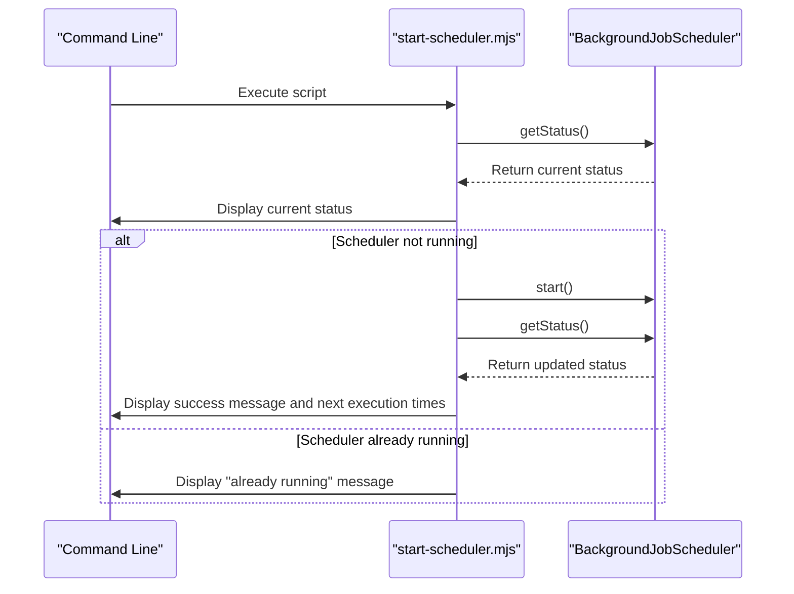
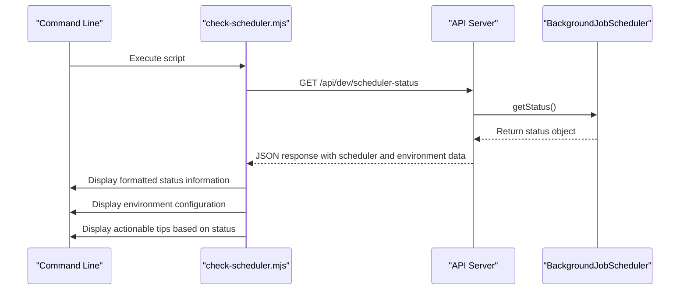
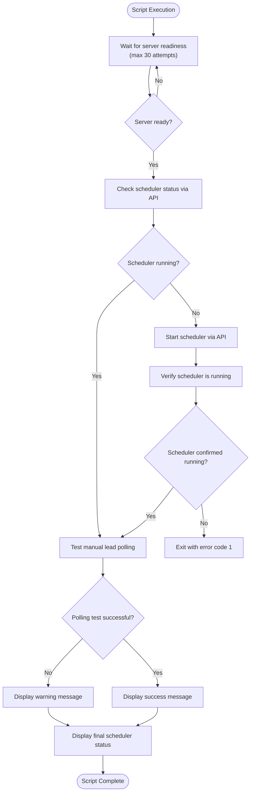
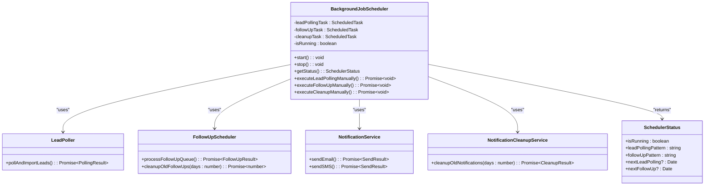
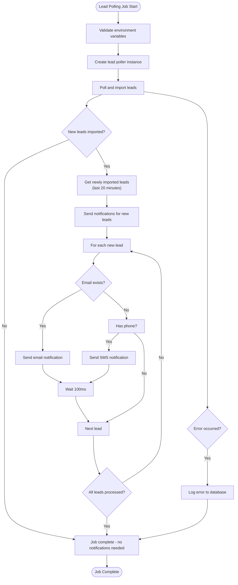
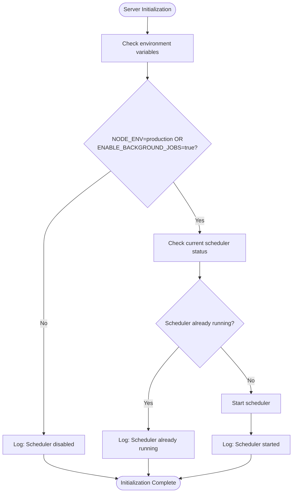
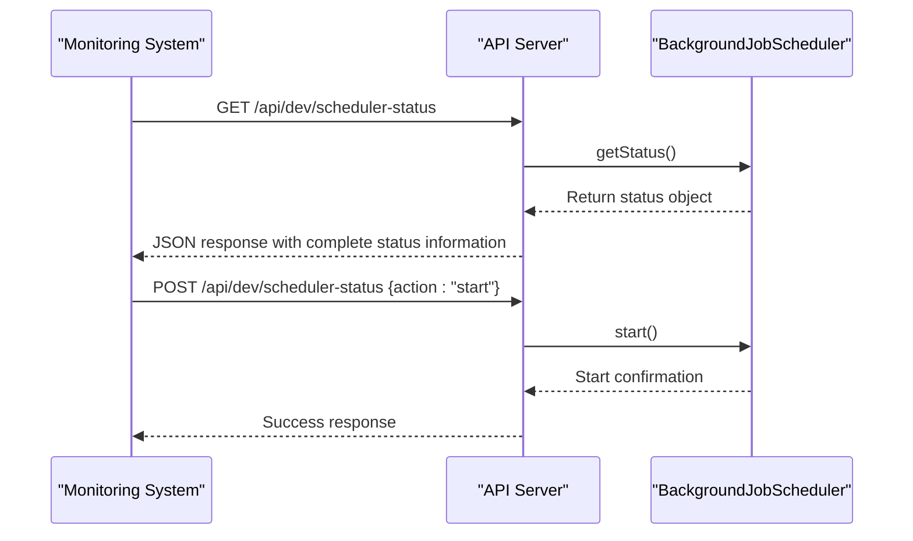
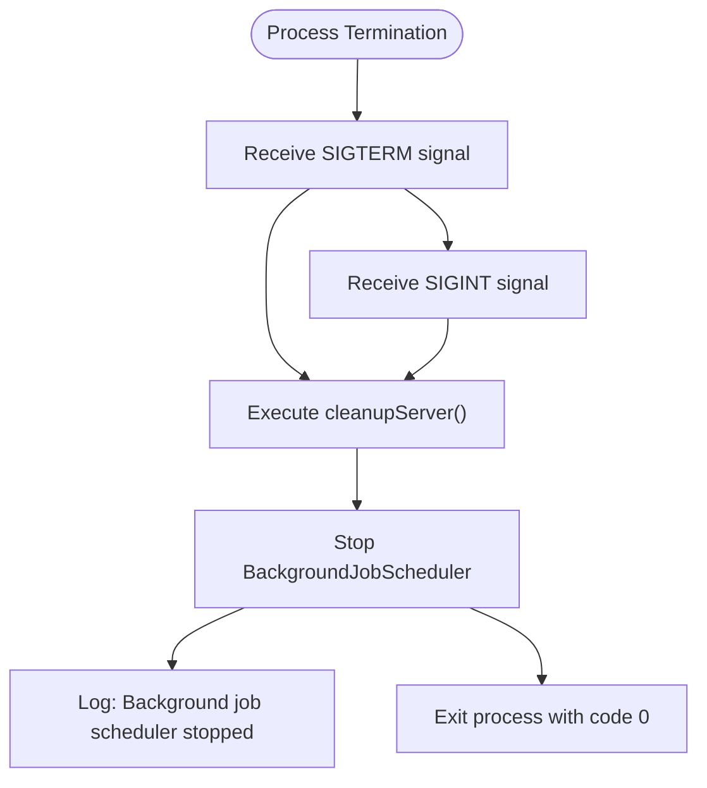

# Scheduler Operations & Management

<cite>
**Referenced Files in This Document**   
- [start-scheduler.mjs](file://scripts/start-scheduler.mjs)
- [check-scheduler.mjs](file://scripts/check-scheduler.mjs)
- [ensure-scheduler-running.sh](file://scripts/ensure-scheduler-running.sh)
- [BackgroundJobScheduler.ts](file://src/services/BackgroundJobScheduler.ts)
- [scheduler-status/route.ts](file://src/app/api/dev/scheduler-status/route.ts)
- [logger.ts](file://src/lib/logger.ts)
- [server-init.ts](file://src/lib/server-init.ts)
</cite>

## Table of Contents
1. [Introduction](#introduction)
2. [Scheduler Scripts Overview](#scheduler-scripts-overview)
3. [Core Scheduler Architecture](#core-scheduler-architecture)
4. [Environment Configuration](#environment-configuration)
5. [Integration with Deployment Systems](#integration-with-deployment-systems)
6. [Monitoring and Logging](#monitoring-and-logging)
7. [Troubleshooting Guide](#troubleshooting-guide)
8. [Best Practices](#best-practices)

## Introduction
This document provides comprehensive operational guidance for the background job scheduler system in the merchant funding application. The scheduler manages critical background tasks including lead polling, follow-up processing, and notification cleanup. This documentation covers the purpose, usage, and integration of scheduler management scripts, along with configuration requirements, monitoring capabilities, and troubleshooting procedures for maintaining reliable scheduler operation.

## Scheduler Scripts Overview

### start-scheduler.mjs
The `start-scheduler.mjs` script provides direct initialization of the background job scheduler. This script is designed for debugging scheduler issues in production environments and allows manual control over scheduler startup.

**Key Features:**
- Direct import of the BackgroundJobScheduler service
- Status verification before and after startup
- Graceful handling of SIGINT and SIGTERM signals
- Immediate feedback on scheduler state and next execution times



**Diagram sources**
- [start-scheduler.mjs](file://scripts/start-scheduler.mjs#L1-L57)

**Section sources**
- [start-scheduler.mjs](file://scripts/start-scheduler.mjs#L1-L57)

### check-scheduler.mjs
The `check-scheduler.mjs` script provides health verification for the scheduler by querying the scheduler status API endpoint. This script is essential for monitoring and diagnostic purposes.

**Key Features:**
- HTTP-based status check via API endpoint
- Comprehensive environment configuration display
- Detailed scheduler status including next execution times
- Actionable troubleshooting tips based on current state
- Manual testing guidance for development environments



**Diagram sources**
- [check-scheduler.mjs](file://scripts/check-scheduler.mjs#L1-L71)
- [scheduler-status/route.ts](file://src/app/api/dev/scheduler-status/route.ts#L1-L82)

**Section sources**
- [check-scheduler.mjs](file://scripts/check-scheduler.mjs#L1-L71)

### ensure-scheduler-running.sh
The `ensure-scheduler-running.sh` script provides process monitoring and automatic recovery for the scheduler. This shell script is designed to be run as a cron job or startup script in production environments.

**Key Features:**
- Server readiness verification with retry logic
- Automated scheduler startup if not running
- Post-startup verification and functionality testing
- Manual polling test to validate scheduler functionality
- Comprehensive status reporting upon completion



**Diagram sources**
- [ensure-scheduler-running.sh](file://scripts/ensure-scheduler-running.sh#L1-L92)

**Section sources**
- [ensure-scheduler-running.sh](file://scripts/ensure-scheduler-running.sh#L1-L92)

## Core Scheduler Architecture

### BackgroundJobScheduler Service
The `BackgroundJobScheduler` class is the core implementation of the scheduler system, managing multiple cron-based background jobs using the node-cron library.

**Key Components:**
- **Lead Polling Task**: Executes every 15 minutes by default to import new leads
- **Follow-up Task**: Processes follow-up queue every 5 minutes
- **Cleanup Task**: Removes old notifications and follow-ups daily at 2 AM
- **Status Management**: Tracks and reports scheduler state and next execution times



**Diagram sources**
- [BackgroundJobScheduler.ts](file://src/services/BackgroundJobScheduler.ts#L1-L462)

**Section sources**
- [BackgroundJobScheduler.ts](file://src/services/BackgroundJobScheduler.ts#L1-L462)

### Scheduler Job Execution Flow
The scheduler executes background jobs through a structured process that includes error handling, logging, and database error logging for critical failures.



**Diagram sources**
- [BackgroundJobScheduler.ts](file://src/services/BackgroundJobScheduler.ts#L100-L250)

## Environment Configuration

### Required Environment Variables
The scheduler operation depends on several environment variables for proper configuration:

- **ENABLE_BACKGROUND_JOBS**: Controls whether background jobs are enabled (set to "true" to enable)
- **LEAD_POLLING_CRON_PATTERN**: Cron pattern for lead polling (default: "*/15 * * * *")
- **FOLLOWUP_CRON_PATTERN**: Cron pattern for follow-up processing (default: "*/5 * * * *")
- **CLEANUP_CRON_PATTERN**: Cron pattern for cleanup jobs (default: "0 2 * * *")
- **TZ**: Timezone for cron scheduling (default: "America/New_York")

### Server Initialization Process
The scheduler is automatically initialized during server startup based on environment configuration:



**Diagram sources**
- [server-init.ts](file://src/lib/server-init.ts#L1-L177)

**Section sources**
- [server-init.ts](file://src/lib/server-init.ts#L1-L177)

## Integration with Deployment Systems

### Container Orchestration Integration
The scheduler management scripts are designed to integrate seamlessly with container orchestration systems like Docker and Kubernetes:

- **ensure-scheduler-running.sh** can be configured as a Kubernetes CronJob to ensure scheduler availability
- **check-scheduler.mjs** serves as a health check endpoint for liveness and readiness probes
- **start-scheduler.mjs** can be used in container startup scripts for manual initialization

### Deployment Pipeline Integration
The scripts can be incorporated into deployment pipelines for zero-downtime deployments:

1. **Pre-deployment**: Use `check-scheduler.mjs` to verify current scheduler state
2. **Deployment**: Deploy new application version
3. **Post-deployment**: Use `ensure-scheduler-running.sh` to verify and restart scheduler if needed
4. **Validation**: Use `check-scheduler.mjs` to confirm scheduler is operational

## Monitoring and Logging

### Logging Format
The scheduler uses structured logging through the Winston logger with specific log levels and formats:

- **[BACKGROUND_JOB]**: Prefix for all background job operations
- **jobType**: Categorizes logs by job type (lead-polling, follow-ups, notifications, cleanup)
- **Structured context**: Includes processing time, counts, and other relevant metrics

**Example Log Entries:**
```
[2025-08-26T12:00:00.000Z] info: [BACKGROUND_JOB] Starting scheduled lead polling job category=background_job,jobType=lead-polling
[2025-08-26T12:00:05.234Z] info: [BACKGROUND_JOB] Lead polling completed category=background_job,jobType=lead-polling,processingTime=5234ms,totalProcessed=25,newLeads=12,duplicatesSkipped=13,errors=0
[2025-08-26T12:05:00.000Z] info: [BACKGROUND_JOB] Starting scheduled follow-up processing job category=background_job,jobType=follow-ups
```

**Section sources**
- [logger.ts](file://src/lib/logger.ts#L1-L350)
- [BackgroundJobScheduler.ts](file://src/services/BackgroundJobScheduler.ts#L100-L250)

### Monitoring Endpoints
The scheduler exposes monitoring endpoints for health verification and control:

- **GET /api/dev/scheduler-status**: Returns current scheduler status and environment configuration
- **POST /api/dev/scheduler-status**: Allows manual control (start, stop, poll actions)
- **/api/health**: General health check endpoint used by ensure-scheduler-running.sh



**Diagram sources**
- [scheduler-status/route.ts](file://src/app/api/dev/scheduler-status/route.ts#L1-L82)
- [ensure-scheduler-running.sh](file://scripts/ensure-scheduler-running.sh#L1-L92)

**Section sources**
- [scheduler-status/route.ts](file://src/app/api/dev/scheduler-status/route.ts#L1-L82)

## Troubleshooting Guide

### Common Issues and Solutions

#### Scheduler Not Starting
**Symptoms:**
- `check-scheduler.mjs` shows "Running: ❌ NO"
- `ensure-scheduler-running.sh` fails to start scheduler
- Error messages indicating "Failed to start scheduler"

**Causes and Solutions:**
- **ENABLE_BACKGROUND_JOBS not set**: Ensure environment variable is set to "true" in development
- **Database connection issues**: Verify database credentials and connectivity
- **Missing dependencies**: Ensure all npm packages are installed
- **Port conflicts**: Verify that port 3000 is available

#### Zombie Processes
**Symptoms:**
- Multiple scheduler instances running simultaneously
- Resource exhaustion (CPU, memory)
- Duplicate processing of leads or follow-ups

**Solutions:**
- Implement proper signal handling (SIGINT, SIGTERM) as shown in start-scheduler.mjs
- Use process monitoring tools to detect and terminate orphaned processes
- Ensure cleanupServer() function is called during shutdown
- Implement singleton pattern to prevent multiple instances



**Section sources**
- [start-scheduler.mjs](file://scripts/start-scheduler.mjs#L45-L55)
- [server-init.ts](file://src/lib/server-init.ts#L80-L128)

#### Memory Leaks
**Symptoms:**
- Gradual increase in memory usage over time
- Application slowdown or crashes
- High garbage collection activity

**Potential Causes:**
- Unreleased database connections
- Accumulation of event listeners
- Caching without proper eviction
- Retained references to large objects

**Monitoring:**
- Use `check-scheduler.mjs` regularly to monitor scheduler health
- Implement external monitoring for memory usage
- Review logs for patterns of increasing processing times

#### Cron Timing Mismatches
**Symptoms:**
- Jobs executing at unexpected times
- Timezone-related scheduling issues
- Daylight saving time complications

**Solutions:**
- Explicitly set the TZ environment variable
- Use UTC for cron patterns when possible
- Verify cron patterns with tools like crontab.guru
- Test scheduling with manual execution before relying on automated timing

```javascript
// Example of cron pattern configuration
const leadPollingPattern = process.env.LEAD_POLLING_CRON_PATTERN || "*/15 * * * *";
const followUpPattern = process.env.FOLLOWUP_CRON_PATTERN || "*/5 * * * *";
const cleanupPattern = process.env.CLEANUP_CRON_PATTERN || "0 2 * * *";
```

**Section sources**
- [BackgroundJobScheduler.ts](file://src/services/BackgroundJobScheduler.ts#L41-L91)

## Best Practices

### Zero-Downtime Deployments
Implement the following practices for zero-downtime deployments:

1. **Graceful Shutdown**: Ensure proper signal handling to allow current jobs to complete
2. **Health Checks**: Use `check-scheduler.mjs` as a pre-deployment verification step
3. **Blue-Green Deployment**: Deploy to secondary environment, verify scheduler operation, then switch traffic
4. **Canary Releases**: Gradually route traffic while monitoring scheduler performance

### Version Upgrades
When upgrading scheduler versions:

1. **Test in Staging**: Verify new version with `ensure-scheduler-running.sh` in staging environment
2. **Backup Configuration**: Preserve current environment variables and cron patterns
3. **Monitor Logs**: Closely monitor structured logs for any anomalies after upgrade
4. **Rollback Plan**: Have a rollback strategy that includes reverting environment variables and code

### Production Recommendations
- Run `ensure-scheduler-running.sh` as a cron job (e.g., every 5 minutes) to ensure scheduler availability
- Use `check-scheduler.mjs` in monitoring dashboards and alerting systems
- Implement external monitoring for memory and CPU usage
- Regularly review logs for error patterns and performance trends
- Test manual operations with `start-scheduler.mjs` during maintenance windows