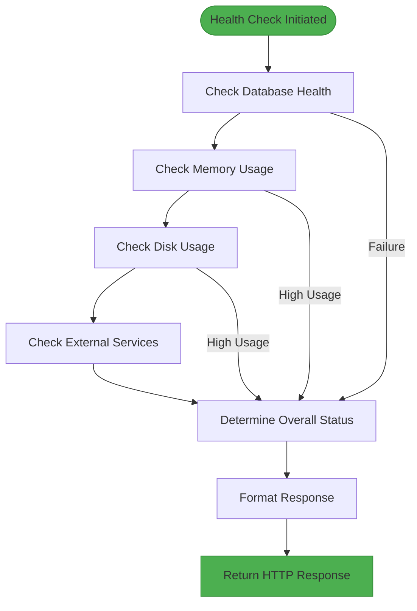
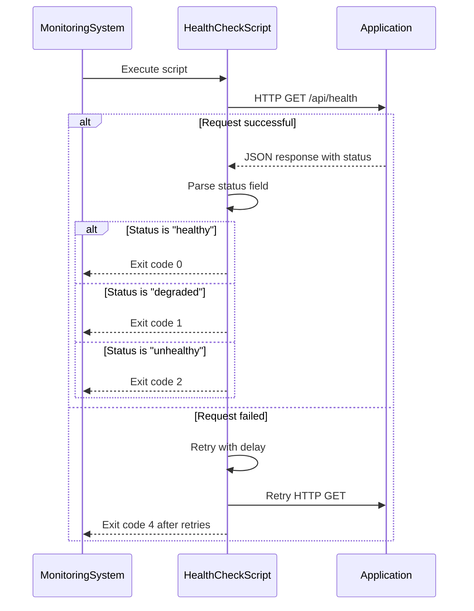
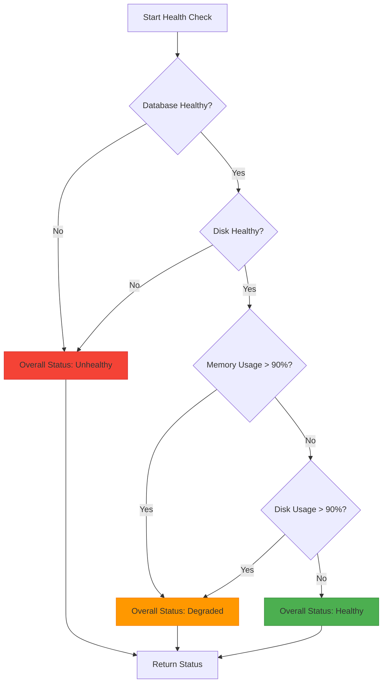
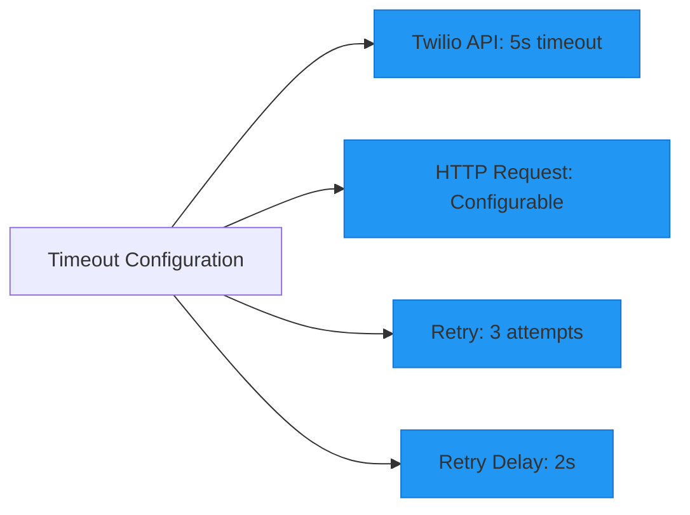
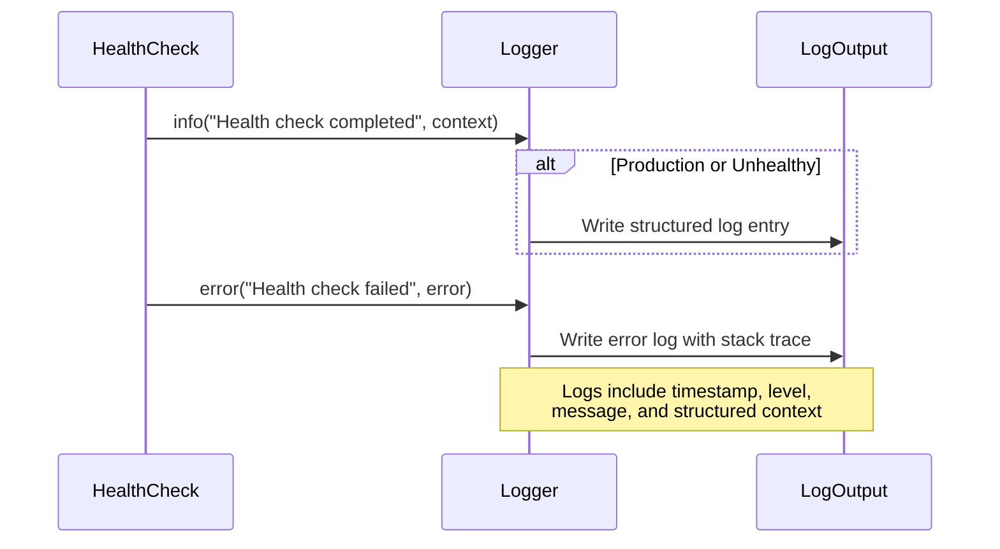

# Health Monitoring

<cite>
**Referenced Files in This Document**   
- [route.ts](file://src/app/api/health/route.ts)
- [health-check.sh](file://scripts/health-check.sh)
- [monitoring.ts](file://src/lib/monitoring.ts)
- [logger.ts](file://src/lib/logger.ts)
</cite>

## Table of Contents
1. [Health Check Endpoints Overview](#health-check-endpoints-overview)
2. [Internal Health Check Implementation](#internal-health-check-implementation)
3. [External Monitoring Integration](#external-monitoring-integration)
4. [Health Status Determination](#health-status-determination)
5. [Response Format and Status Codes](#response-format-and-status-codes)
6. [Thresholds and Timeout Configuration](#thresholds-and-timeout-configuration)
7. [Logging and Error Tracking](#logging-and-error-tracking)
8. [External Service Connectivity Checks](#external-service-connectivity-checks)
9. [Integration with Container Orchestration](#integration-with-container-orchestration)
10. [Troubleshooting Common Issues](#troubleshooting-common-issues)
11. [Extending Health Checks](#extending-health-checks)

## Health Check Endpoints Overview

The application provides comprehensive health monitoring through its API endpoints. The primary health check endpoint at `/api/health` serves as the main interface for monitoring system health. This endpoint performs comprehensive checks on various system components and returns detailed status information.

The health monitoring system is designed to support both simple liveness checks and more comprehensive readiness assessments, making it suitable for integration with container orchestration platforms and load balancing systems. The endpoint is accessible via HTTP GET method and returns JSON-formatted responses containing detailed health information.

**Section sources**
- [route.ts](file://src/app/api/health/route.ts#L0-L293)

## Internal Health Check Implementation

The health check functionality is implemented in the main health route handler, which orchestrates various system checks to determine overall application health. The implementation follows a structured approach to evaluate different aspects of the system.



**Diagram sources**
- [route.ts](file://src/app/api/health/route.ts#L149-L293)

**Section sources**
- [route.ts](file://src/app/api/health/route.ts#L149-L293)

## External Monitoring Integration

The repository includes a dedicated shell script for external health monitoring, which can be used by monitoring systems to check application health. This script provides a robust interface for external systems to evaluate the application's status.



**Diagram sources**
- [health-check.sh](file://scripts/health-check.sh#L0-L117)
- [route.ts](file://src/app/api/health/route.ts#L0-L293)

**Section sources**
- [health-check.sh](file://scripts/health-check.sh#L0-L117)

## Health Status Determination

The health check system evaluates multiple factors to determine the overall status of the application. The status determination logic follows a hierarchical approach, with certain failures taking precedence over others.



**Diagram sources**
- [route.ts](file://src/app/api/health/route.ts#L149-L190)

**Section sources**
- [route.ts](file://src/app/api/health/route.ts#L149-L190)

## Response Format and Status Codes

The health check endpoint returns a standardized JSON response format with comprehensive system information. The response includes detailed checks for various system components along with appropriate HTTP status codes.

### Response Structure

The health check response follows this structure:

```json
{
  "status": "healthy",
  "timestamp": "2025-08-26T10:30:00.000Z",
  "version": "1.0.0",
  "uptime": 3600,
  "checks": {
    "database": {
      "status": "healthy",
      "latency": 15
    },
    "memory": {
      "status": "healthy",
      "usage": {
        "used": 150,
        "total": 512,
        "percentage": 29
      }
    },
    "disk": {
      "status": "healthy",
      "usage": {
        "free": 45,
        "total": 100,
        "percentage": 55
      }
    },
    "externalServices": {
      "twilio": {
        "status": "healthy",
        "latency": 120
      },
      "mailgun": {
        "status": "healthy"
      },
      "backblaze": {
        "status": "healthy"
      }
    },
    "environment": {
      "nodeEnv": "production",
      "nodeVersion": "v18.17.0",
      "platform": "linux",
      "arch": "x64"
    }
  }
}
```

### Status Code Mapping

The endpoint uses the following status code mapping based on the overall health status:

- **200 OK**: When status is "healthy" or "degraded"
- **503 Service Unavailable**: When status is "unhealthy" or when the health check itself fails

This status code strategy allows load balancers and orchestration systems to distinguish between fully functional, partially functional, and completely non-functional instances.

**Section sources**
- [route.ts](file://src/app/api/health/route.ts#L224-L274)

## Thresholds and Timeout Configuration

The health check system uses specific thresholds to determine the health status of various system components. These thresholds are hardcoded in the implementation and cannot be configured through environment variables.

### Resource Utilization Thresholds

- **Memory Usage**: Considered unhealthy when heap memory usage exceeds 90% of total heap memory
- **Disk Usage**: Considered unhealthy when disk usage exceeds 90% of total disk capacity

### Timeout Configuration

The system implements timeouts at multiple levels:

1. **External Service Timeout**: The Twilio service check has a 5-second timeout (5000ms) for API calls
2. **HTTP Request Timeout**: The external health check script uses a configurable timeout for HTTP requests, defaulting to 5 seconds
3. **Retry Configuration**: The health check script will retry failed requests up to 3 times with a 2-second delay between attempts

The external health check script provides environment variables for configuring these timeouts:
- `HEALTH_CHECK_TIMEOUT`: Request timeout in seconds (default: 5)
- `HEALTH_CHECK_RETRIES`: Number of retry attempts (default: 3)
- `HEALTH_CHECK_RETRY_DELAY`: Delay between retries in seconds (default: 2)



**Diagram sources**
- [route.ts](file://src/app/api/health/route.ts#L103-L147)
- [health-check.sh](file://scripts/health-check.sh#L0-L22)

**Section sources**
- [route.ts](file://src/app/api/health/route.ts#L65-L101)
- [route.ts](file://src/app/api/health/route.ts#L103-L147)
- [health-check.sh](file://scripts/health-check.sh#L0-L22)

## Logging and Error Tracking

The health check system includes comprehensive logging to facilitate monitoring and troubleshooting. The logging implementation uses a structured approach with context information.

### Logging Behavior

- **Successful Health Checks**: Logged at INFO level with duration, database latency, memory usage, and disk usage when the environment is not production or when the status is not healthy
- **Failed Health Checks**: Logged at ERROR level with the error details
- **Monitoring Status**: The system logs completion of health checks with relevant metrics

The logging system is implemented using a custom Logger class that supports structured logging with context. In production environments, the log level defaults to 'info', while in development environments, it defaults to 'debug'.



**Diagram sources**
- [route.ts](file://src/app/api/health/route.ts#L224-L274)
- [logger.ts](file://src/lib/logger.ts#L0-L205)

**Section sources**
- [route.ts](file://src/app/api/health/route.ts#L224-L274)
- [logger.ts](file://src/lib/logger.ts#L0-L205)

## External Service Connectivity Checks

The health check system performs connectivity checks for external services that the application depends on for its functionality. These checks are conditional and can be enabled or disabled.

### Checked External Services

The system checks connectivity for three external services:
- **Twilio**: For SMS notifications
- **Mailgun**: For email notifications
- **Backblaze**: For file storage

### Check Implementation

The external service checks are controlled by the `ENABLE_DETAILED_HEALTH_CHECKS` environment variable. When enabled:
- **Twilio**: Makes an API call to the Twilio Accounts endpoint with authentication, measuring latency and checking response status
- **Mailgun**: Verifies configuration is present (no actual API call)
- **Backblaze**: Verifies configuration is present (no actual API call)

When disabled, all external services report status as "unknown". The Twilio check is the only one that performs an actual API call; the others simply verify that the necessary environment variables are set.

```mermaid
flowchart TD
A[External Services Check] --> B{"ENABLE_DETAILED_HEALTH_CHECKS = 'true'?}
B --> |No| C[All services: unknown]
B --> |Yes| D{Twilio Configured?}
D --> |Yes| E[Call Twilio API with 5s timeout]
E --> F{Response OK?}
F --> |Yes| G[Twilio: healthy]
F --> |No| H[Twilio: unhealthy]
D --> |No| I[Twilio: unknown]
G --> J{Mailgun Configured?}
H --> J
I --> J
J --> |Yes| K[Mailgun: healthy]
J --> |No| L[Mailgun: unknown]
K --> M{Backblaze Configured?}
L --> M
M --> |Yes| N[Backblaze: healthy]
M --> |No| O[Backblaze: unknown]
N --> P[Return service statuses]
O --> P
style G fill:#4CAF50,stroke:#388E3C
style H fill:#f44336,stroke:#d32f2f
style K fill:#4CAF50,stroke:#388E3C
style N fill:#4CAF50,stroke:#388E3C
```

**Diagram sources**
- [route.ts](file://src/app/api/health/route.ts#L103-L147)

**Section sources**
- [route.ts](file://src/app/api/health/route.ts#L103-L147)

## Integration with Container Orchestration

The health monitoring system is designed to integrate seamlessly with container orchestration platforms such as Kubernetes, Docker Swarm, or cloud-based container services. The design follows industry best practices for container health checking.

### Liveness and Readiness Probes

Although the application only exposes a single health endpoint, it can serve both liveness and readiness probe purposes:

- **Liveness Probes**: Can use the endpoint to determine if the application is running and responsive. A 503 status indicates the application should be restarted.
- **Readiness Probes**: Can use the endpoint to determine if the application is ready to receive traffic. A "degraded" status might indicate the application should not receive new traffic even though it's still running.

The external health check script provides exit codes that are compatible with container orchestration systems:
- **0**: Healthy - container is healthy and ready
- **1**: Degraded - container is running but in degraded state
- **2**: Unhealthy - container is unhealthy
- **3**: Unknown status - unexpected response
- **4**: Connection failed - cannot reach the application

### Load Balancing Scenarios

In load balancing scenarios, the health check endpoint enables intelligent traffic routing:
- Instances reporting "unhealthy" are removed from the load balancer pool
- Instances reporting "degraded" might receive reduced traffic depending on load balancer configuration
- The detailed response allows monitoring systems to identify specific issues (database, memory, disk) for targeted remediation

**Section sources**
- [health-check.sh](file://scripts/health-check.sh#L55-L117)

## Troubleshooting Common Issues

This section provides guidance on interpreting health check results and diagnosing common failure patterns.

### Interpreting Health Check Results

When analyzing health check responses, consider the following:

1. **Overall Status**: Start with the top-level status field
2. **Component Details**: Examine individual check results to identify specific issues
3. **Error Messages**: Look for error fields in the response for diagnostic information

### Common Failure Patterns

#### Database Connectivity Issues
- **Symptoms**: "unhealthy" status with database check failing
- **Causes**: Database server down, connection limits reached, network issues
- **Diagnosis**: Check database server status, connection pool metrics, network connectivity

#### High Memory Usage
- **Symptoms**: "degraded" status with memory usage > 90%
- **Causes**: Memory leak, insufficient memory allocation, high traffic load
- **Diagnosis**: Monitor memory trends, check for memory leaks, consider scaling

#### High Disk Usage
- **Symptoms**: "unhealthy" status with disk usage > 90%
- **Causes**: Log files filling disk, large file storage, insufficient disk space
- **Diagnosis**: Check disk usage patterns, clean up old files, increase disk capacity

#### External Service Failures
- **Symptoms**: "unhealthy" or "unknown" status for external services
- **Causes**: Network issues, API rate limiting, incorrect credentials
- **Diagnosis**: Verify service availability, check credentials, test connectivity

### Diagnostic Commands

The provided health check script can be used for troubleshooting:
```bash
# Run health check with verbose output
./scripts/health-check.sh --verbose

# Override health check URL for testing
HEALTH_URL=http://localhost:3000/api/health ./scripts/health-check.sh

# Customize timeout and retries
HEALTH_CHECK_TIMEOUT=10 HEALTH_CHECK_RETRIES=5 ./scripts/health-check.sh
```

**Section sources**
- [route.ts](file://src/app/api/health/route.ts#L149-L190)
- [health-check.sh](file://scripts/health-check.sh#L0-L117)

## Extending Health Checks

Developers can extend the health check system to include custom probes for additional services or more sophisticated checks. The current implementation provides a foundation that can be enhanced.

### Custom Database Connectivity Checks

While the application already checks database health through the `checkDatabaseHealth` function, developers can enhance this check by:
- Adding query performance monitoring
- Checking specific database metrics
- Implementing connection pool monitoring

### External Service Availability Checks

The current implementation could be extended to include more comprehensive checks for external services:
- **Mailgun**: Perform an actual API call to verify email sending capability
- **Backblaze**: Test file upload/download functionality
- **Additional Services**: Add checks for other external dependencies

### Resource Utilization Monitoring

The health check system could be enhanced with additional resource monitoring:
- **CPU Usage**: Monitor CPU utilization and alert on high usage
- **Network Connectivity**: Check outbound connectivity to critical services
- **Process Count**: Monitor for zombie processes or process leaks

### Implementation Example

To add a custom health check, developers can extend the existing health check handler:

```typescript
// Example: Adding a cache health check
async function checkCacheHealth() {
  try {
    // Test cache connectivity
    const startTime = Date.now();
    await cacheClient.set('health-check', 'ok', 1);
    const result = await cacheClient.get('health-check');
    const latency = Date.now() - startTime;
    
    return {
      status: result === 'ok' ? 'healthy' : 'unhealthy',
      latency
    };
  } catch (error) {
    return {
      status: 'unhealthy',
      error: error instanceof Error ? error.message : 'Unknown error'
    };
  }
}

// Then integrate into the main health check handler
// Add to the checks object in the health status response
```

Developers should consider the performance impact of additional health checks, especially those that involve network calls, and implement appropriate timeouts and error handling.

**Section sources**
- [route.ts](file://src/app/api/health/route.ts#L149-L293)