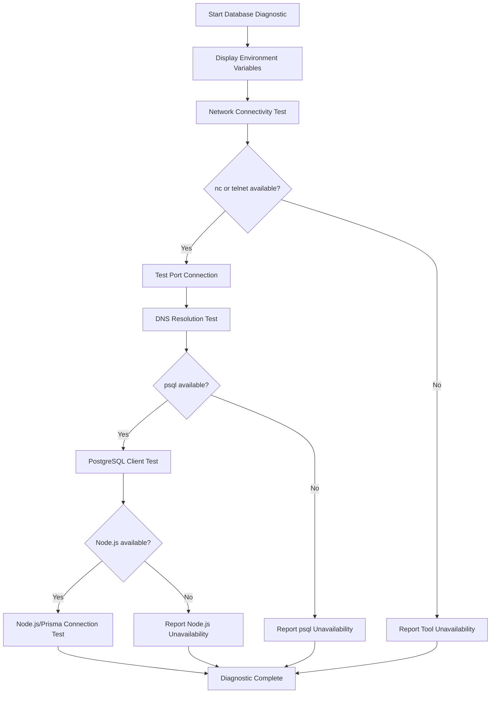
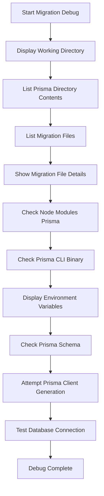
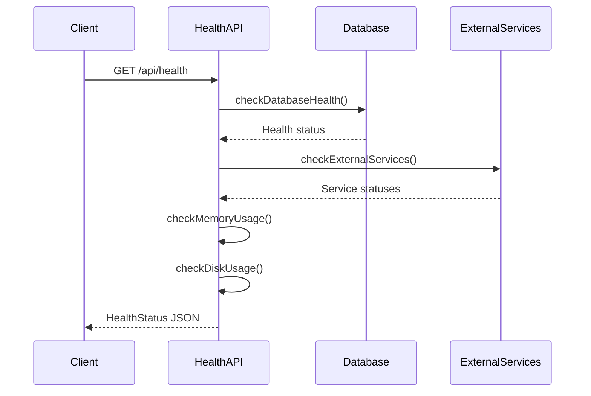
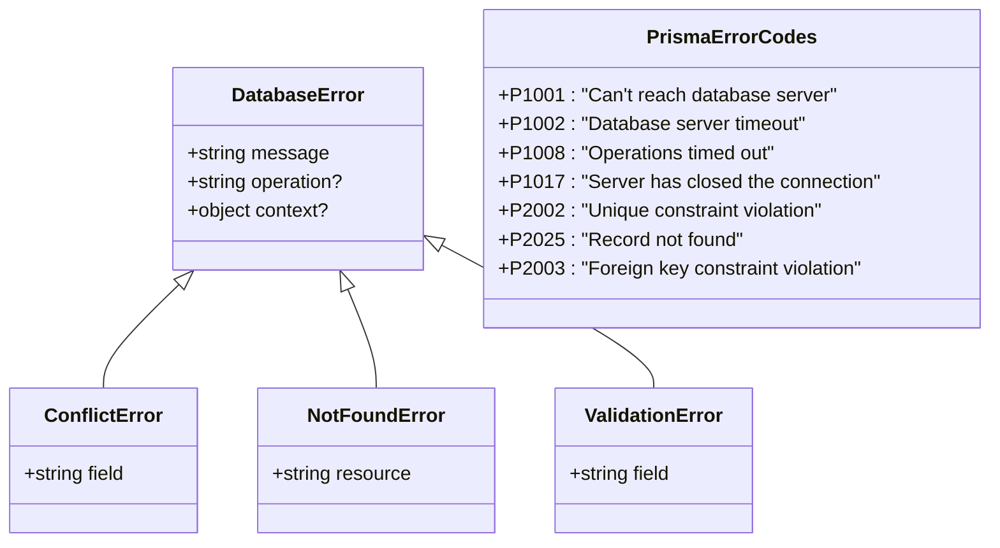

# Diagnostics and Troubleshooting

<cite>
**Referenced Files in This Document**   
- [db-diagnostic.sh](file://scripts/db-diagnostic.sh)
- [debug-migrations.sh](file://scripts/debug-migrations.sh)
- [schema.prisma](file://prisma/schema.prisma)
- [migration_lock.toml](file://prisma/migrations/migration_lock.toml)
- [database-error-handler.ts](file://src/lib/database-error-handler.ts)
- [health-check.sh](file://scripts/health-check.sh)
- [route.ts](file://src/app/api/health/route.ts)
- [legacy-db.ts](file://src/lib/legacy-db.ts)
- [route.ts](file://src/app/api/admin/connectivity/legacy-db/route.ts)
</cite>

## Table of Contents
1. [Introduction](#introduction)
2. [Database Connectivity Diagnostics](#database-connectivity-diagnostics)
3. [Prisma Migration Debugging](#prisma-migration-debugging)
4. [Health Check Systems](#health-check-systems)
5. [Troubleshooting Workflows](#troubleshooting-workflows)
6. [Diagnostic Output Interpretation](#diagnostic-output-interpretation)
7. [Integration with Monitoring](#integration-with-monitoring)
8. [Conclusion](#conclusion)

## Introduction
This document provides comprehensive guidance on system diagnostics and troubleshooting procedures for the fund-track application. It focuses on two primary diagnostic tools: `db-diagnostic.sh` for PostgreSQL connectivity testing and `debug-migrations.sh` for Prisma migration state inspection. The documentation covers functionality, usage patterns, output interpretation, and integration with monitoring systems to enable effective troubleshooting of deployment failures, connection timeouts, and schema synchronization errors.

**Section sources**
- [db-diagnostic.sh](file://scripts/db-diagnostic.sh)
- [debug-migrations.sh](file://scripts/debug-migrations.sh)

## Database Connectivity Diagnostics

The `db-diagnostic.sh` script provides a comprehensive suite of tests to verify database connectivity and service availability. It performs multiple layers of connectivity checks, starting from network-level tests through to application-level database connections.



**Diagram sources**
- [db-diagnostic.sh](file://scripts/db-diagnostic.sh#L1-L78)

### Connectivity Testing Layers
The script implements a multi-layered approach to connectivity testing:

1. **Environment Verification**: Displays the `DATABASE_URL` environment variable to ensure proper configuration
2. **Network Connectivity**: Uses `nc` (netcat) or `telnet` to test TCP connectivity to the database host and port
3. **DNS Resolution**: Checks if the database hostname can be resolved using `nslookup` or `getent`
4. **PostgreSQL Client Test**: Uses the `psql` command-line tool to establish a direct database connection
5. **Application-Level Test**: Uses Node.js and Prisma Client to test the application's database connection

Each test provides clear success (✅) or failure (❌) indicators, making it easy to identify the specific layer where connectivity issues occur.

**Section sources**
- [db-diagnostic.sh](file://scripts/db-diagnostic.sh#L1-L78)

## Prisma Migration Debugging

The `debug-migrations.sh` script is designed to diagnose issues with Prisma migration deployment. It provides detailed information about the migration environment, file structure, and connection status to help resolve lock conflicts and inconsistent migration histories.



**Diagram sources**
- [debug-migrations.sh](file://scripts/debug-migrations.sh#L1-L95)

### Migration State Inspection
The script systematically inspects the migration environment:

1. **File System Verification**: Checks the directory structure of the Prisma configuration and migration files
2. **Migration File Analysis**: Lists all migration files and displays the first few lines of each SQL migration script
3. **Node Modules Inspection**: Verifies the presence of Prisma artifacts in `node_modules`
4. **Environment Validation**: Displays key environment variables including `DATABASE_URL`
5. **Schema Verification**: Confirms the existence and content of the Prisma schema file
6. **Client Generation Test**: Attempts to generate the Prisma client to verify schema validity
7. **Database Connection Test**: Uses `prisma db push` to test database connectivity

This comprehensive inspection helps identify common deployment issues such as missing migration files, incorrect environment configuration, or database connectivity problems.

**Section sources**
- [debug-migrations.sh](file://scripts/debug-migrations.sh#L1-L95)

## Health Check Systems

The application implements a multi-layered health check system that combines shell scripts, API endpoints, and application-level monitoring to ensure system reliability.

### API Health Check Endpoint
The `/api/health` endpoint provides a comprehensive assessment of system health, checking multiple components:



**Diagram sources**
- [route.ts](file://src/app/api/health/route.ts#L1-L293)

### Health Check Components
The health check system evaluates several critical components:

- **Database Health**: Tests connectivity to the PostgreSQL database using a simple query
- **Memory Usage**: Monitors heap memory consumption and triggers alerts at 90% usage
- **Disk Usage**: Checks available disk space and reports unhealthy status above 90% usage
- **External Services**: Validates connectivity to third-party services (Twilio, Mailgun, Backblaze)
- **Environment Information**: Reports Node.js version, platform, and architecture

The system returns an overall status of 'healthy', 'degraded', or 'unhealthy' based on these checks, with appropriate HTTP status codes (200 for healthy/degraded, 503 for unhealthy).

**Section sources**
- [route.ts](file://src/app/api/health/route.ts#L1-L293)
- [health-check.sh](file://scripts/health-check.sh#L1-L117)

## Troubleshooting Workflows

### Database Connection Issues
When experiencing database connection problems, follow this diagnostic workflow:

```mermaid
flowchart Decision
A["Connection Issue Reported"] --> B{"Can reach host?"}
B --> |No| C["Check DNS Resolution"]
C --> D["Verify Hostname Configuration"]
D --> E["Test with nslookup/getent"]
B --> |Yes| F{"Port accessible?"}
F --> |No| G["Test with nc/telnet"]
G --> H["Check Firewall Rules"]
H --> I["Verify Port Configuration"]
F --> |Yes| J{"psql connection works?"}
J --> |No| K["Verify DATABASE_URL"]
K --> L["Check Credentials"]
L --> M["Test with psql command"]
J --> |Yes| N{"Prisma connection works?"}
N --> |No| O["Check Prisma Client"]
O --> P["Verify Node.js Environment"]
P --> Q["Test with Node.js script"]
N --> |Yes| R["Application Issue"]
```

**Diagram sources**
- [db-diagnostic.sh](file://scripts/db-diagnostic.sh#L1-L78)
- [database-error-handler.ts](file://src/lib/database-error-handler.ts#L1-L320)

### Migration Deployment Failures
For migration deployment issues, use this systematic approach:

```mermaid
flowchart Decision
A["Migration Failure"] --> B{"Migration files present?"}
B --> |No| C["Check Git Repository"]
C --> D["Verify Prisma Directory"]
D --> E["Run debug-migrations.sh"]
B --> |Yes| F{"Migration lock file present?"}
F --> |No| G["Check migration_lock.toml"]
G --> H["Verify Git Tracking"]
H --> I["Restore from backup if needed"]
F --> |Yes| J{"Database connection works?"}
J --> |No| K["Run db-diagnostic.sh"]
K --> L["Fix connectivity issues"]
L --> M["Retry migration"]
J --> |Yes| N{"Prisma client generates?"}
N --> |No| O["Check schema.prisma"]
O --> P["Validate schema syntax"]
P --> Q["Fix schema errors"]
N --> |Yes| R["Check migration history table"]
R --> S["Resolve conflicts manually if needed"]
```

**Diagram sources**
- [debug-migrations.sh](file://scripts/debug-migrations.sh#L1-L95)
- [migration_lock.toml](file://prisma/migrations/migration_lock.toml)
- [schema.prisma](file://prisma/schema.prisma)

**Section sources**
- [debug-migrations.sh](file://scripts/debug-migrations.sh#L1-L95)
- [migration_lock.toml](file://prisma/migrations/migration_lock.toml)
- [schema.prisma](file://prisma/schema.prisma)

## Diagnostic Output Interpretation

### Common Failure Patterns
Understanding the output of diagnostic scripts is crucial for efficient troubleshooting:

**db-diagnostic.sh Output Patterns:**
- "❌ Cannot connect to host:port" - Network connectivity issue
- "❌ DNS lookup failed" - DNS resolution problem
- "❌ psql connection failed" - Authentication or database configuration issue
- "❌ Prisma connection failed" - Application-level connection problem

**debug-migrations.sh Output Patterns:**
- "❌ Prisma directory not found" - File system or deployment issue
- "❌ Migration directory not found" - Missing migration files
- "❌ Schema file not found" - Prisma configuration issue
- "❌ Failed to generate Prisma client" - Schema validation error
- "❌ Database connection failed" - Database connectivity problem

### Error Code Reference
The application uses standardized error codes for database operations:



**Diagram sources**
- [database-error-handler.ts](file://src/lib/database-error-handler.ts#L1-L320)

**Section sources**
- [database-error-handler.ts](file://src/lib/database-error-handler.ts#L1-L320)

## Integration with Monitoring

### Monitoring Architecture
The diagnostic tools integrate with monitoring systems through a layered approach:

```mermaid
graph TB
subgraph "Monitoring System"
A[External Monitor] --> B[health-check.sh]
B --> C[/api/health endpoint]
end
subgraph "Application"
C --> D[Database Health Check]
C --> E[Memory Usage Check]
C --> F[Disk Usage Check]
C --> G[External Services Check]
D --> H[Prisma Client]
H --> I[PostgreSQL Database]
G --> J[Twilio]
G --> K[Mailgun]
G --> L[Backblaze]
end
subgraph "Diagnostic Tools"
M[db-diagnostic.sh] --> I
N[debug-migrations.sh] --> I
O[Legacy DB Check] --> P[Legacy MS SQL Server]
end
```

**Diagram sources**
- [health-check.sh](file://scripts/health-check.sh#L1-L117)
- [route.ts](file://src/app/api/health/route.ts#L1-L293)
- [db-diagnostic.sh](file://scripts/db-diagnostic.sh#L1-L78)
- [debug-migrations.sh](file://scripts/debug-migrations.sh#L1-L95)
- [route.ts](file://src/app/api/admin/connectivity/legacy-db/route.ts#L1-L87)

### Proactive Issue Detection
The monitoring integration enables proactive issue detection through:

1. **Regular Health Checks**: External monitoring systems can call the `/api/health` endpoint at regular intervals
2. **Exit Code Standardization**: The `health-check.sh` script uses standardized exit codes for different health states
3. **Legacy System Monitoring**: The `/api/admin/connectivity/legacy-db` endpoint allows monitoring of the legacy MS SQL Server database
4. **Diagnostic Script Automation**: The diagnostic scripts can be incorporated into CI/CD pipelines and deployment workflows

The system provides clear indicators for different health states:
- Exit code 0: Healthy
- Exit code 1: Degraded
- Exit code 2: Unhealthy
- Exit code 3: Unknown status
- Exit code 4: Connection failed

**Section sources**
- [health-check.sh](file://scripts/health-check.sh#L1-L117)
- [route.ts](file://src/app/api/health/route.ts#L1-L293)
- [route.ts](file://src/app/api/admin/connectivity/legacy-db/route.ts#L1-L87)

## Conclusion
The fund-track application provides a comprehensive suite of diagnostic and troubleshooting tools to ensure system reliability and facilitate rapid issue resolution. The `db-diagnostic.sh` and `debug-migrations.sh` scripts offer detailed insights into database connectivity and migration state, while the health check system provides continuous monitoring of application health. By following the troubleshooting workflows and understanding the diagnostic output patterns, operations teams can quickly identify and resolve issues related to deployment failures, connection timeouts, and schema synchronization errors. The integration of these tools with monitoring systems enables proactive issue detection and ensures high system availability.