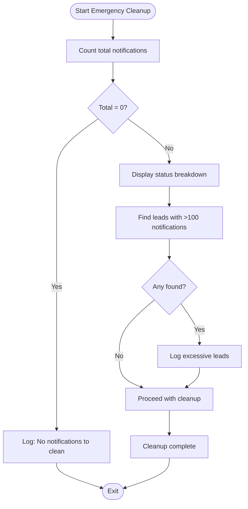
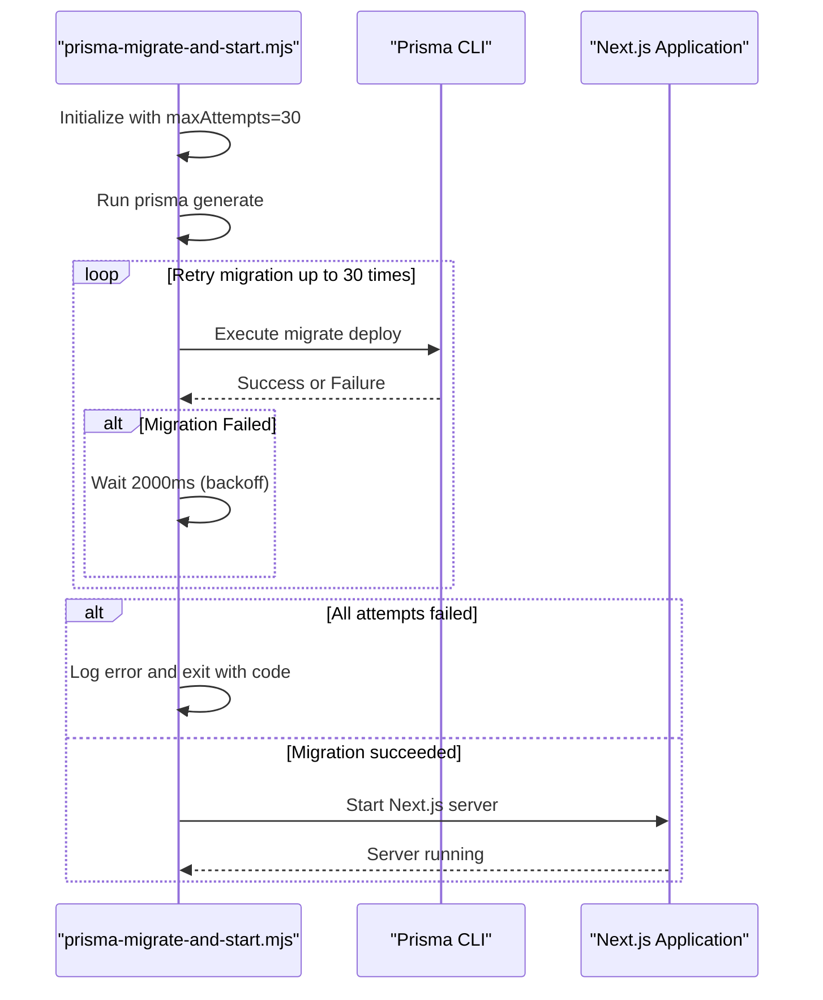
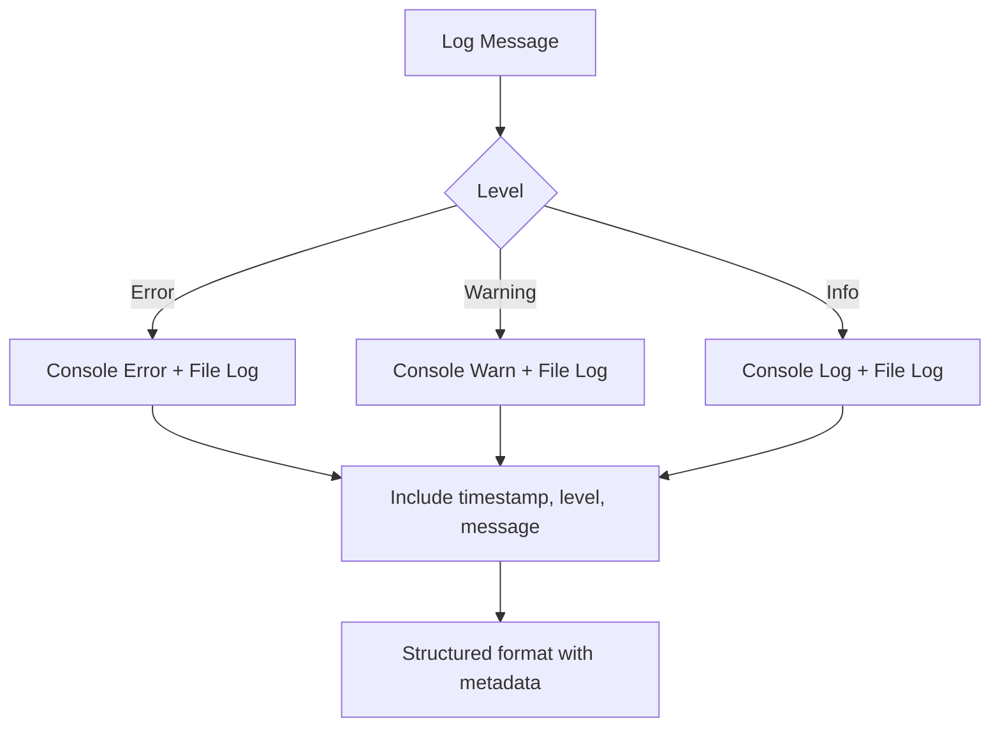

# Emergency Operations

<cite>
**Referenced Files in This Document**   
- [emergency-cleanup.mjs](file://scripts/emergency-cleanup.mjs)
- [prisma-migrate-and-start.mjs](file://scripts/prisma-migrate-and-start.mjs)
- [NotificationCleanupService.ts](file://src/services/NotificationCleanupService.ts)
- [server-init.ts](file://src/lib/server-init.ts)
- [logger.ts](file://src/lib/logger.ts)
</cite>

## Table of Contents
1. [Introduction](#introduction)
2. [Emergency Cleanup Procedures](#emergency-cleanup-procedures)
3. [Prisma Migration and Startup Process](#prisma-migration-and-startup-process)
4. [Runbooks for Critical Scenarios](#runbooks-for-critical-scenarios)
5. [Execution Safeguards and Environment Validation](#execution-safeguards-and-environment-validation)
6. [Logging and Monitoring Practices](#logging-and-monitoring-practices)

## Introduction
This document provides comprehensive guidance on emergency operational procedures for the Fund Track application. It focuses on two critical scripts: `emergency-cleanup.mjs` for resolving corrupted application states and `prisma-migrate-and-start.mjs` for production-safe deployments. The content is designed to assist operations teams in safely managing system failures, database inconsistencies, and deployment issues while preserving data integrity.

## Emergency Cleanup Procedures

The `emergency-cleanup.mjs` script is designed to safely clean up excessive or corrupted notification records in the database without causing data loss. It provides visibility into the current state of the notification system and allows for targeted cleanup of problematic records.



**Diagram sources**
- [emergency-cleanup.mjs](file://scripts/emergency-cleanup.mjs#L0-L49)

The script connects directly to the database using Prisma Client and performs the following operations:
- Counts total notification records before cleanup
- Displays a breakdown of notifications by status (pending, sent, failed)
- Identifies leads with excessive notifications (more than 100) that may indicate system issues
- Provides console output for operator review before any deletion occurs

This script is intended for manual execution by administrators during emergency situations where notification processing has created database bloat or performance issues.

**Section sources**
- [emergency-cleanup.mjs](file://scripts/emergency-cleanup.mjs#L0-L49)
- [NotificationCleanupService.ts](file://src/services/NotificationCleanupService.ts#L210-L230)

## Prisma Migration and Startup Process

The `prisma-migrate-and-start.mjs` script implements a robust, production-safe deployment process that handles database migrations with proper error handling and retry logic before starting the application server.



**Diagram sources**
- [prisma-migrate-and-start.mjs](file://scripts/prisma-migrate-and-start.mjs#L0-L88)

The script follows a structured execution flow:
1. Runs `prisma generate` to ensure the client is up to date (idempotent operation)
2. Checks for the presence of DATABASE_URL environment variable
3. Attempts to apply pending migrations with configurable retry logic
4. Starts the Next.js application on the specified port only after successful migration

Key configuration options:
- `PRISMA_MIGRATE_MAX_ATTEMPTS`: Maximum number of migration attempts (default: 30)
- `PRISMA_MIGRATE_BACKOFF_MS`: Milliseconds to wait between attempts (default: 2000)

The script implements exponential backoff retry logic to handle temporary database connectivity issues during deployment, making it resilient to transient failures in cloud environments.

**Section sources**
- [prisma-migrate-and-start.mjs](file://scripts/prisma-migrate-and-start.mjs#L0-L88)
- [server-init.ts](file://src/lib/server-init.ts#L80-L128)

## Runbooks for Critical Scenarios

### Failed Deployment Recovery
When a deployment fails due to migration issues:

1. **Assess the situation**:
   ```bash
   ./scripts/debug-migrations.sh
   ```
   This script provides detailed information about migration files and database state.

2. **Check current migration status**:
   ```bash
   npx prisma migrate status
   ```

3. **Attempt recovery**:
   - If the failure was transient, re-run the deployment
   - If schema conflicts exist, resolve them manually using Prisma Studio or direct SQL
   - As a last resort, use `prisma migrate resolve` to mark failed migrations

4. **Verify operation**:
   - Check application logs for startup errors
   - Validate API endpoints are responding
   - Confirm database schema matches expected state

### Database Schema Conflict Resolution
When migration conflicts occur between branches:

1. **Stop deployment immediately** if detected
2. **Identify conflicting migrations** using:
   ```bash
   ls prisma/migrations/
   ```
3. **Coordinate with development team** to merge migration scripts
4. **Create a new migration** that reconciles the conflicting changes
5. **Test thoroughly** in staging environment before production deployment
6. **Document the resolution** for future reference

### Data Inconsistency Resolution
For data integrity issues identified during emergency cleanup:

1. **Isolate the affected records** using queries like those in `emergency-cleanup.mjs`
2. **Backup the current state** before making changes
3. **Analyze root cause** of the inconsistency
4. **Apply corrective actions** through validated scripts
5. **Verify data integrity** post-correction
6. **Update monitoring** to detect similar issues in the future

## Execution Safeguards and Environment Validation

Both critical scripts implement multiple safeguards to prevent accidental damage:

- **Pre-execution checks**: The migration script verifies DATABASE_URL exists before proceeding
- **Retry mechanisms**: Configurable retry logic with backoff for transient failures
- **Graceful degradation**: When DATABASE_URL is not set, the migration step is skipped safely
- **Comprehensive logging**: Detailed console output at each execution stage
- **Controlled exit codes**: Scripts exit with appropriate codes for orchestration systems

Environment variables used for configuration:
- `PORT`: Specifies the port for the Next.js server (default: 3000)
- `DATABASE_URL`: Required for migration execution
- `PRISMA_MIGRATE_MAX_ATTEMPTS`: Controls retry behavior
- `PRISMA_MIGRATE_BACKOFF_MS`: Controls delay between retry attempts

These safeguards ensure that operations can be performed safely in production environments with minimal risk of downtime or data loss.

**Section sources**
- [prisma-migrate-and-start.mjs](file://scripts/prisma-migrate-and-start.mjs#L56-L88)
- [emergency-cleanup.mjs](file://scripts/emergency-cleanup.mjs#L0-L49)

## Logging and Monitoring Practices

The system implements comprehensive logging practices to support emergency operations:

- **Structured logging**: All scripts use consistent log prefixes like `[startup]` for easy filtering
- **Error classification**: Different log levels for info, warning, and error conditions
- **Context preservation**: Errors include stack traces and relevant context
- **External service integration**: Logging system supports integration with monitoring tools

Key logging patterns observed:
- Operation start and completion messages
- Progress indicators for long-running operations
- Warning messages for retryable failures
- Detailed error reporting with exit codes
- Success confirmation before proceeding to next phase

The `logger.ts` module provides centralized logging functionality used throughout the application, ensuring consistent format and behavior across all components.



**Diagram sources**
- [logger.ts](file://src/lib/logger.ts#L337-L337)
- [prisma-migrate-and-start.mjs](file://scripts/prisma-migrate-and-start.mjs#L56-L88)

**Section sources**
- [logger.ts](file://src/lib/logger.ts#L337-L337)
- [server-init.ts](file://src/lib/server-init.ts#L80-L128)
- [prisma-migrate-and-start.mjs](file://scripts/prisma-migrate-and-start.mjs#L56-L88)