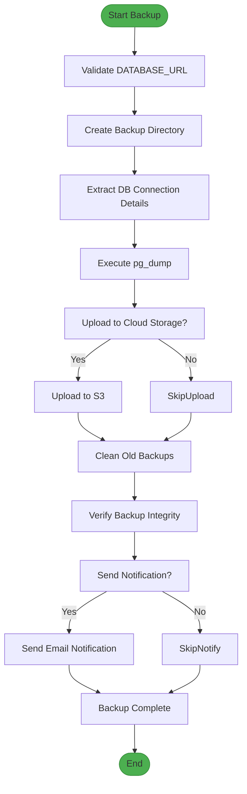
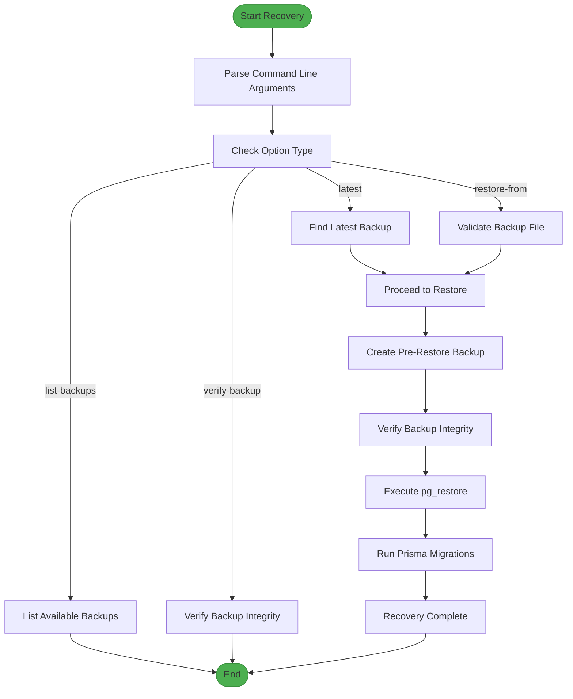
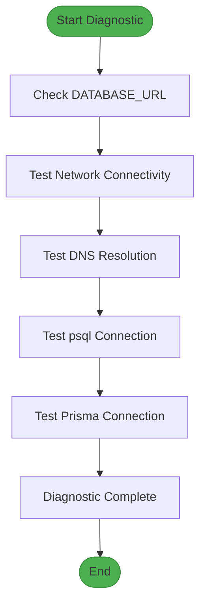
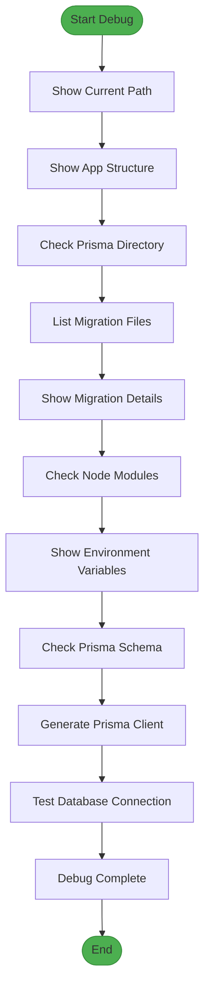
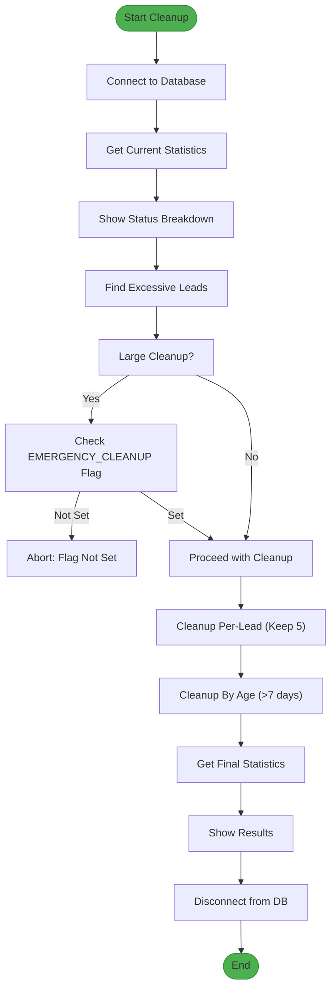
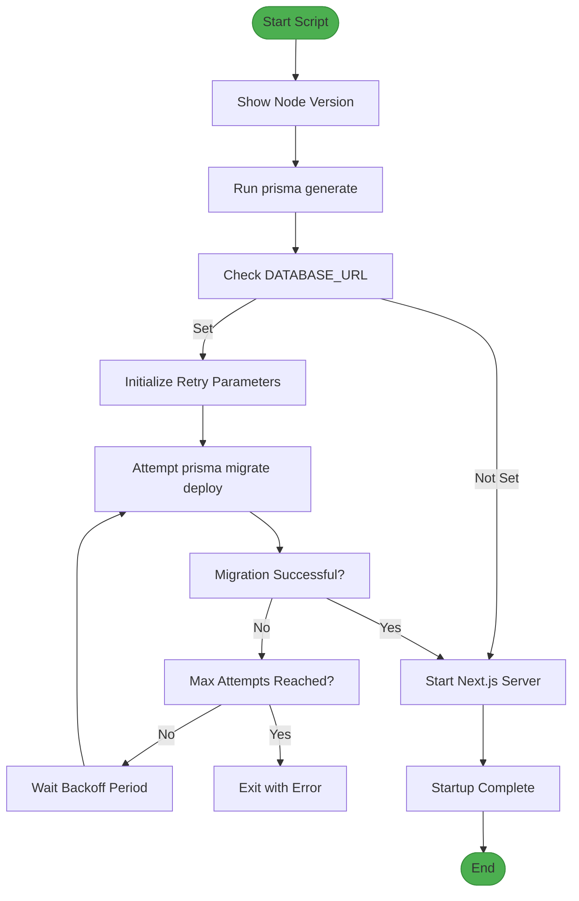

# Maintenance Procedures

<cite>
**Referenced Files in This Document**   
- [backup-database.sh](file://scripts/backup-database.sh)
- [disaster-recovery.sh](file://scripts/disaster-recovery.sh)
- [db-diagnostic.sh](file://scripts/db-diagnostic.sh)
- [debug-migrations.sh](file://scripts/debug-migrations.sh)
- [emergency-cleanup.mjs](file://scripts/emergency-cleanup.mjs)
- [prisma-migrate-and-start.mjs](file://scripts/prisma-migrate-and-start.mjs)
- [NotificationService.ts](file://src/services/NotificationService.ts)
- [emergency-cleanup.mjs](file://scripts/emergency-cleanup.mjs)
- [prisma-migrate-and-start.mjs](file://scripts/prisma-migrate-and-start.mjs)
</cite>

## Table of Contents
1. [Database Backup and Restore Workflow](#database-backup-and-restore-workflow)
2. [Database Connectivity Diagnostics](#database-connectivity-diagnostics)
3. [Migration Debugging Process](#migration-debugging-process)
4. [Emergency Cleanup Procedures](#emergency-cleanup-procedures)
5. [Safe Deployment Workflow](#safe-deployment-workflow)
6. [Best Practices and Real-World Scenarios](#best-practices-and-real-world-scenarios)

## Database Backup and Restore Workflow

This section details the database backup and restore procedures using `backup-database.sh` and `disaster-recovery.sh`. These scripts form the foundation of the disaster recovery strategy, ensuring data integrity and availability.

### Backup Database Script (backup-database.sh)

The `backup-database.sh` script automates the creation of PostgreSQL database backups with comprehensive error handling, cloud storage integration, and retention policies.

**Key Features:**
- **Automated Backup Creation**: Uses `pg_dump` to create compressed custom-format backups
- **Cloud Storage Integration**: Supports AWS S3 upload when configured
- **Retention Management**: Automatically removes backups older than the retention period
- **Integrity Verification**: Validates backup files using `pg_restore --list`
- **Notification System**: Sends email notifications upon successful backup completion

**Configuration Parameters:**
- `BACKUP_DIR`: Directory for storing backups (default: `./backups`)
- `BACKUP_RETENTION_DAYS`: Number of days to retain backups (default: 30)
- `ENABLE_CLOUD_BACKUP`: Flag to enable cloud storage upload
- `BACKUP_STORAGE_BUCKET`: Target cloud storage bucket name
- `ENABLE_BACKUP_NOTIFICATIONS`: Flag to enable email notifications
- `ADMIN_EMAIL`: Recipient email for backup notifications

**Execution Flow:**
1. Validates `DATABASE_URL` environment variable
2. Extracts connection details from `DATABASE_URL`
3. Creates backup directory if it doesn't exist
4. Generates timestamped backup file
5. Executes `pg_dump` with compression
6. Uploads to cloud storage if configured
7. Cleans up old backups based on retention policy
8. Verifies backup integrity
9. Sends completion notification if configured

**Diagram sources**
- [backup-database.sh](file://scripts/backup-database.sh#L1-L120)

**Section sources**
- [backup-database.sh](file://scripts/backup-database.sh#L1-L120)

### Disaster Recovery Script (disaster-recovery.sh)

The `disaster-recovery.sh` script provides comprehensive database restoration capabilities with safety measures and verification procedures.

**Key Features:**
- **Multiple Restoration Options**: Restore from specific file, latest backup, or list available backups
- **Pre-Restore Safety Backup**: Creates a backup of the current database state before restoration
- **Integrity Verification**: Validates backup files before restoration
- **Post-Restoration Migration**: Applies pending Prisma migrations after restoration
- **Comprehensive Logging**: Detailed logging of all operations

**Usage Options:**
- `--list-backups`: Display all available backup files with metadata
- `--latest`: Restore from the most recent backup
- `--restore-from FILE`: Restore from a specific backup file
- `--verify-backup FILE`: Verify the integrity of a backup file
- `--help`: Display usage information

**Execution Flow:**
1. Validates command-line arguments
2. Lists available backups or proceeds with restoration
3. Creates pre-restore backup as safety measure
4. Verifies backup integrity
5. Executes `pg_restore` with appropriate flags
6. Applies Prisma migrations to ensure schema consistency
7. Logs completion status

**Diagram sources**
- [disaster-recovery.sh](file://scripts/disaster-recovery.sh#L1-L259)

**Section sources**
- [disaster-recovery.sh](file://scripts/disaster-recovery.sh#L1-L259)

## Database Connectivity Diagnostics

The `db-diagnostic.sh` script provides comprehensive database connectivity diagnostics to troubleshoot connection issues.

### Database Diagnostic Script (db-diagnostic.sh)

This script performs a series of connectivity tests to identify potential issues in the database connection chain.

**Diagnostic Tests Performed:**
1. **Environment Variables**: Checks if `DATABASE_URL` is set
2. **Network Connectivity**: Tests connection to database host and port using `nc` or `telnet`
3. **DNS Resolution**: Resolves the database hostname using `nslookup` or `getent`
4. **PostgreSQL Client Test**: Attempts to connect using `psql` with the provided `DATABASE_URL`
5. **Node.js/Prisma Test**: Tests connection using Node.js and Prisma client

**Execution Flow:**
1. Displays environment variable status
2. Tests network connectivity to database host and port
3. Performs DNS resolution of the database hostname
4. Tests PostgreSQL client connection
5. Tests Node.js/Prisma connection
6. Displays diagnostic completion message

**Diagram sources**
- [db-diagnostic.sh](file://scripts/db-diagnostic.sh#L1-L79)

**Section sources**
- [db-diagnostic.sh](file://scripts/db-diagnostic.sh#L1-L79)

## Migration Debugging Process

The `debug-migrations.sh` script helps diagnose Prisma migration issues during deployment.

### Migration Debugging Script (debug-migrations.sh)

This diagnostic script provides detailed information about the migration environment to troubleshoot deployment issues.

**Diagnostic Information Collected:**
- Current working directory
- Application directory structure
- Prisma directory contents
- Migration files and their details
- Node modules Prisma configuration
- Prisma CLI binary status
- Environment variables
- Prisma schema file status
- Prisma client generation test
- Database connection test

**Execution Flow:**
1. Displays current working directory
2. Lists application directory structure
3. Checks Prisma directory and migration files
4. Displays migration file details
5. Checks Node modules Prisma configuration
6. Displays environment variables
7. Checks Prisma schema file
8. Attempts to generate Prisma client
9. Tests database connection with `prisma db push`
10. Displays completion message

**Diagram sources**
- [debug-migrations.sh](file://scripts/debug-migrations.sh#L1-L96)

**Section sources**
- [debug-migrations.sh](file://scripts/debug-migrations.sh#L1-L96)

## Emergency Cleanup Procedures

The `emergency-cleanup.mjs` script handles the removal of corrupted data states, specifically targeting excessive notification logs.

### Emergency Cleanup Script (emergency-cleanup.mjs)

This script performs emergency cleanup of notification logs to resolve performance issues caused by data accumulation.

**Cleanup Strategies:**
1. **Per-Lead Cleanup**: Keeps only the 5 most recent notifications per lead
2. **Age-Based Cleanup**: Deletes all notifications older than 7 days

**Safety Features:**
- **Confirmation Requirement**: Requires `EMERGENCY_CLEANUP=true` environment variable for execution
- **Pre-Cleanup Statistics**: Displays current notification counts and breakdown by status
- **Excessive Lead Identification**: Identifies leads with more than 100 notifications
- **Progress Reporting**: Provides detailed output of cleanup operations
- **Final Statistics**: Shows before/after counts and space savings

**Execution Flow:**
1. Connects to database using Prisma Client
2. Retrieves current notification count and status breakdown
3. Identifies leads with excessive notifications
4. Validates emergency flag for large deletions
5. Executes per-lead cleanup (keep 5 most recent)
6. Executes age-based cleanup (delete >7 days old)
7. Displays final statistics
8. Disconnects from database

**Diagram sources**
- [emergency-cleanup.mjs](file://scripts/emergency-cleanup.mjs#L1-L136)

**Section sources**
- [emergency-cleanup.mjs](file://scripts/emergency-cleanup.mjs#L1-L136)

## Safe Deployment Workflow

The `prisma-migrate-and-start.mjs` script ensures safe deployment by combining schema synchronization with application startup.

### Prisma Migration and Start Script (prisma-migrate-and-start.mjs)

This startup script orchestrates the deployment process with robust error handling and retry mechanisms.

**Key Features:**
- **Prisma Client Generation**: Ensures Prisma client is generated before migration
- **Retry Mechanism**: Implements exponential backoff for database connection
- **Graceful Error Handling**: Continues startup if database is not configured
- **Configurable Parameters**: Allows customization of retry attempts and backoff
- **Sequential Execution**: Ensures migrations complete before application startup

**Configuration Parameters:**
- `PORT`: Application port (default: 3000)
- `DATABASE_URL`: Database connection string
- `PRISMA_MIGRATE_MAX_ATTEMPTS`: Maximum migration attempts (default: 30)
- `PRISMA_MIGRATE_BACKOFF_MS`: Backoff delay between attempts (default: 2000ms)

**Execution Flow:**
1. Displays Node.js version
2. Generates Prisma client
3. Checks for `DATABASE_URL`
4. If no database URL, starts application immediately
5. If database URL present, attempts migrations with retry logic
6. Starts Next.js application on specified port

**Diagram sources**
- [prisma-migrate-and-start.mjs](file://scripts/prisma-migrate-and-start.mjs#L1-L90)

**Section sources**
- [prisma-migrate-and-start.mjs](file://scripts/prisma-migrate-and-start.mjs#L1-L90)

## Best Practices and Real-World Scenarios

### Best Practices for Production Execution

**Database Backup Best Practices:**
- Schedule regular automated backups using cron jobs
- Store backups in multiple locations (local and cloud)
- Test backup integrity regularly
- Monitor backup sizes for anomalies
- Implement access controls for backup files

**Disaster Recovery Best Practices:**
- Test recovery procedures regularly in staging environments
- Document recovery steps and assign responsibilities
- Maintain up-to-date contact lists for emergency response
- Keep pre-restore backups for critical operations
- Verify application functionality after recovery

**Migration Debugging Best Practices:**
- Run diagnostics before and after deployment
- Compare migration states between environments
- Monitor migration execution time
- Keep migration scripts version-controlled
- Document known migration issues and solutions

**Emergency Cleanup Best Practices:**
- Use emergency cleanup only when necessary
- Always backup critical data before cleanup
- Monitor system performance before and after cleanup
- Communicate cleanup operations to stakeholders
- Document cleanup reasons and outcomes

**Deployment Best Practices:**
- Use blue-green deployment patterns when possible
- Monitor application health after deployment
- Implement rollback procedures
- Test migrations in staging before production
- Use feature flags for new functionality

### Real-World Scenarios

**Scenario 1: Database Server Failure**
- **Problem**: Production database server crashes due to hardware failure
- **Solution**: Use `disaster-recovery.sh --latest` to restore from the most recent backup
- **Expected Outcome**: Application restored to state at time of last backup with minimal data loss

**Scenario 2: Migration Deployment Failure**
- **Problem**: Prisma migration fails during deployment with unclear error
- **Solution**: Run `debug-migrations.sh` to diagnose environment issues
- **Expected Outcome**: Identification of root cause (missing environment variable, schema mismatch, etc.)

**Scenario 3: Performance Degradation Due to Data Accumulation**
- **Problem**: Application slows down due to excessive notification logs
- **Solution**: Execute `emergency-cleanup.mjs` with `EMERGENCY_CLEANUP=true`
- **Expected Outcome**: Improved application performance with reduced database size

**Scenario 4: Routine Maintenance Backup**
- **Problem**: Need to create daily backups of production database
- **Solution**: Schedule `backup-database.sh` to run daily via cron
- **Expected Outcome**: Reliable backup chain with 30-day retention

**Scenario 5: New Environment Setup**
- **Problem**: Deploying application to new environment with empty database
- **Solution**: Use `prisma-migrate-and-start.mjs` to apply migrations and start application
- **Expected Outcome**: Properly initialized database with latest schema and running application