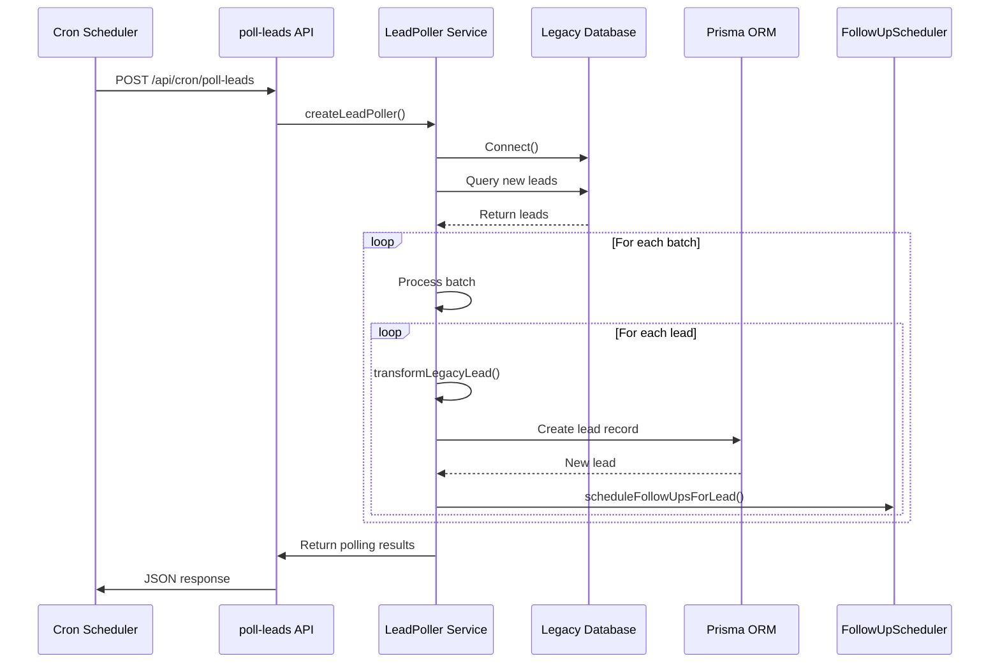
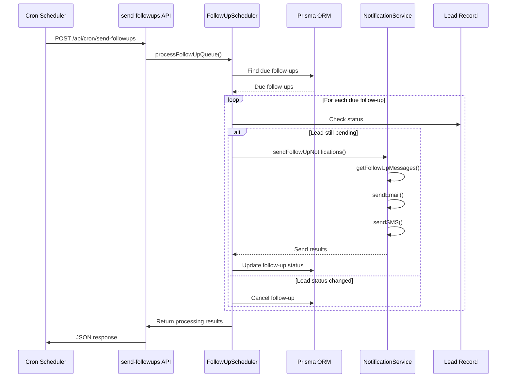
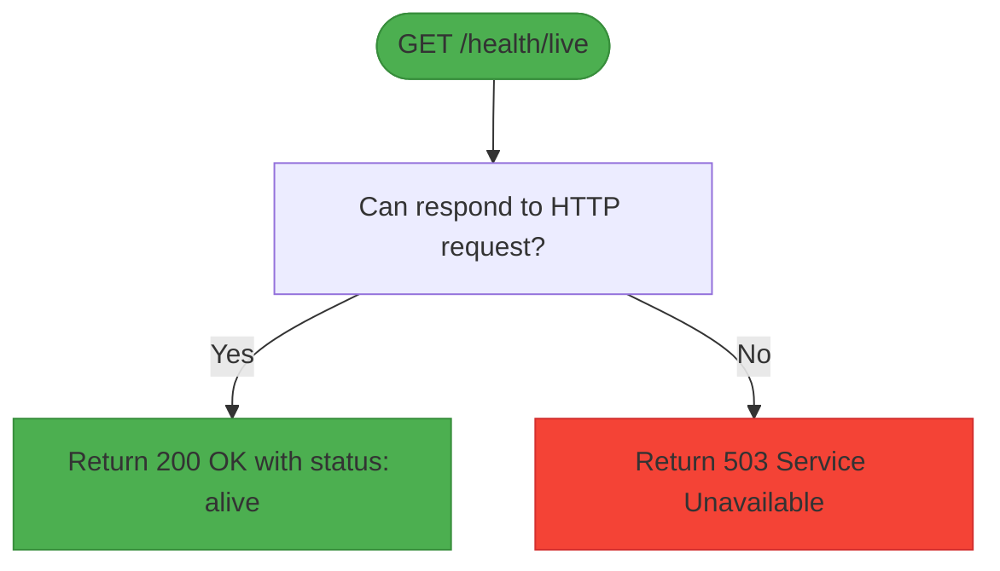
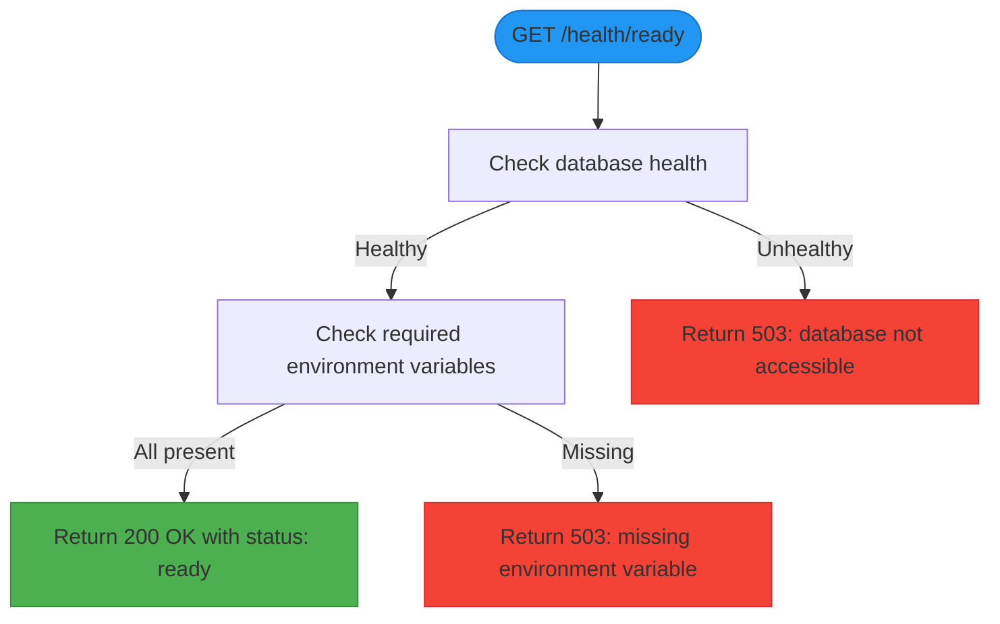
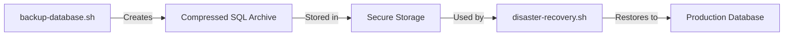
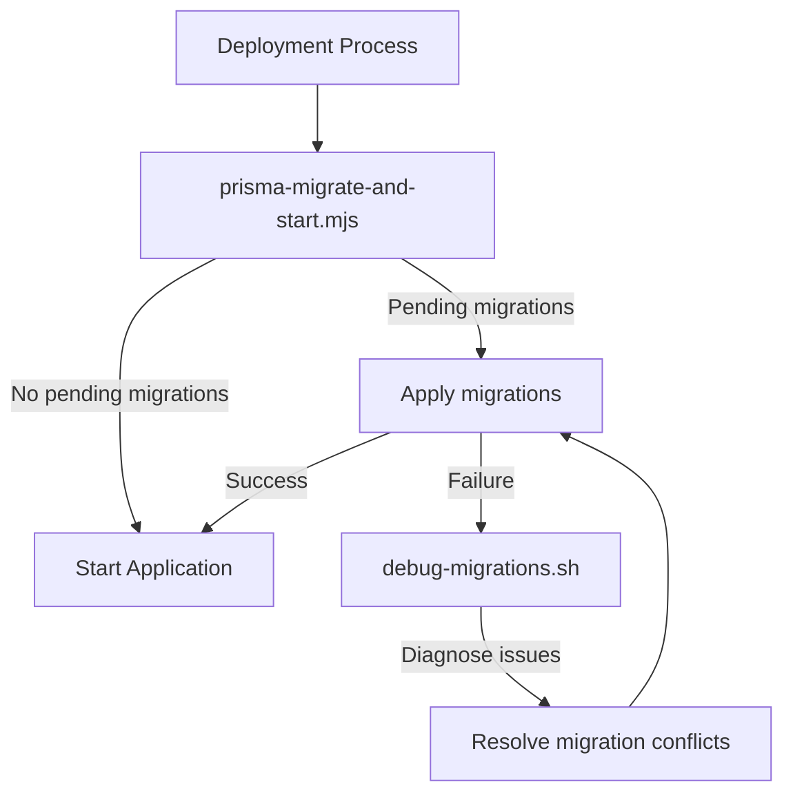
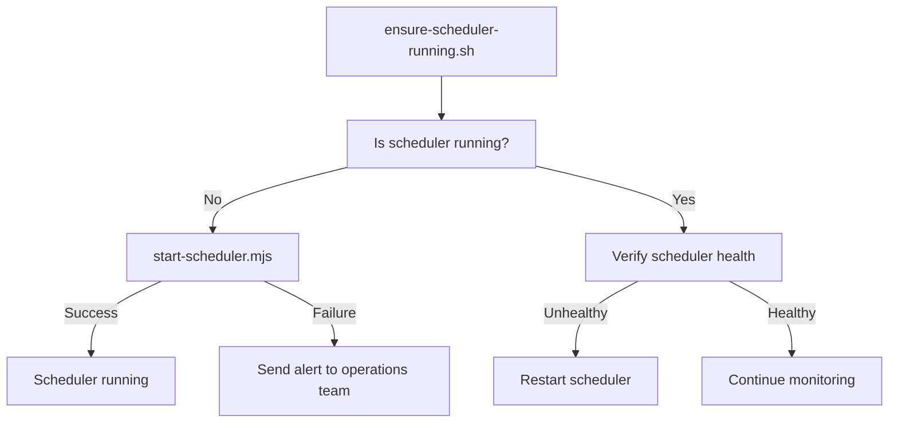
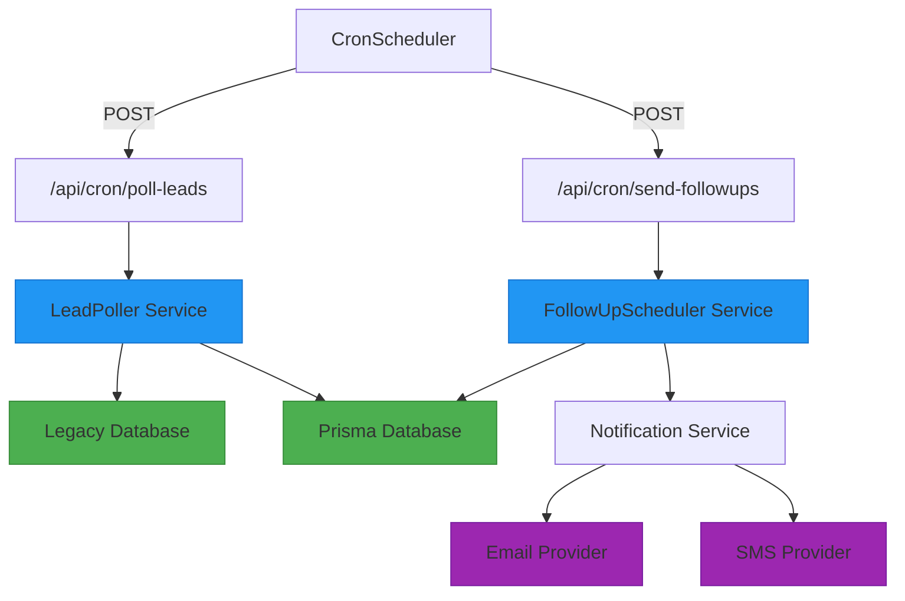
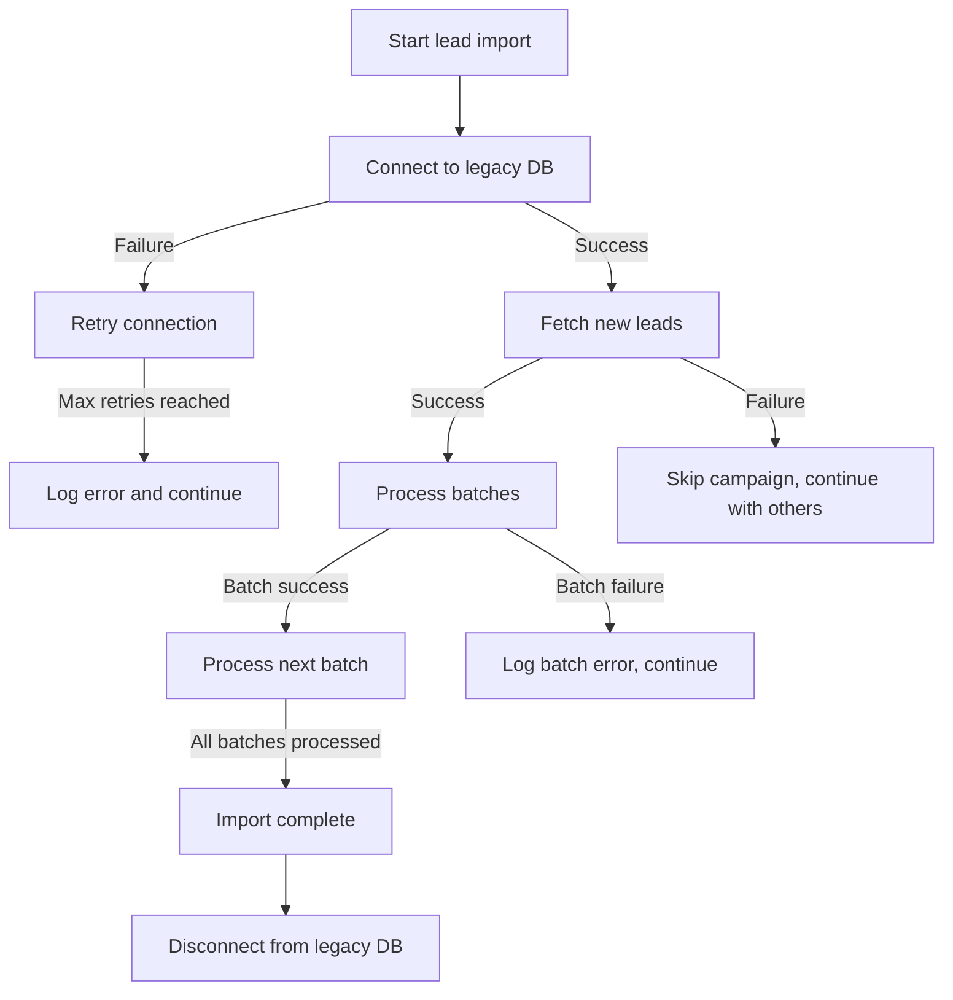
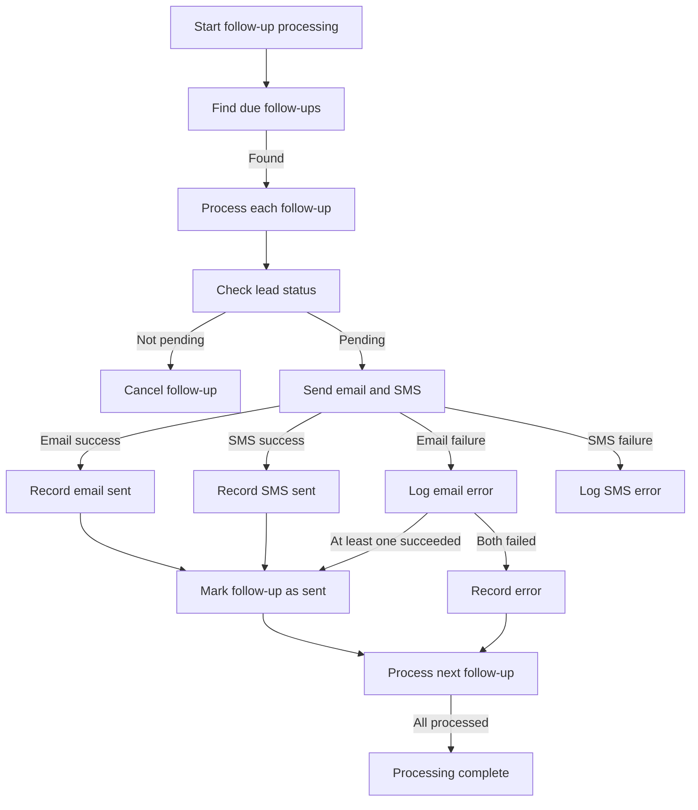

# Operational Capabilities

<cite>
**Referenced Files in This Document**   
- [LeadPoller.ts](file://src/services/LeadPoller.ts)
- [FollowUpScheduler.ts](file://src/services/FollowUpScheduler.ts)
- [poll-leads/route.ts](file://src/app/api/cron/poll-leads/route.ts)
- [send-followups/route.ts](file://src/app/api/cron/send-followups/route.ts)
- [live/route.ts](file://src/app/api/health/live/route.ts)
- [ready/route.ts](file://src/app/api/health/ready/route.ts)
- [backup-database.sh](file://scripts/backup-database.sh)
- [disaster-recovery.sh](file://scripts/disaster-recovery.sh)
- [debug-migrations.sh](file://scripts/debug-migrations.sh)
- [ensure-scheduler-running.sh](file://scripts/ensure-scheduler-running.sh)
- [health-check.sh](file://scripts/health-check.sh)
- [prisma-migrate-and-start.mjs](file://scripts/prisma-migrate-and-start.mjs)
- [start-scheduler.mjs](file://scripts/start-scheduler.mjs)
- [database-error-handler.ts](file://src/lib/database-error-handler.ts)
- [prisma.ts](file://src/lib/prisma.ts)
- [logger.ts](file://src/lib/logger.ts)
</cite>

## Table of Contents
1. [Introduction](#introduction)
2. [Background Job Scheduling](#background-job-scheduling)
3. [Health Monitoring](#health-monitoring)
4. [Maintenance Procedures](#maintenance-procedures)
5. [Job Scheduling Architecture](#job-scheduling-architecture)
6. [Failure Recovery Mechanisms](#failure-recovery-mechanisms)
7. [Operational Best Practices](#operational-best-practices)
8. [Common Operational Tasks](#common-operational-tasks)

## Introduction
The fund-track system is designed to automate lead acquisition and follow-up processes for merchant funding applications. This document details the operational capabilities of the system, focusing on background job scheduling, health monitoring, and maintenance procedures. The system uses cron-triggered endpoints to import leads from a legacy database and send automated notifications to applicants. Health check endpoints ensure system availability and readiness, while a suite of scripts supports database management, migration debugging, disaster recovery, and scheduler operations. The architecture emphasizes reliability, with comprehensive error handling and recovery mechanisms.

## Background Job Scheduling

The fund-track system implements two primary background services for automated operations: LeadPoller and FollowUpScheduler. These services are triggered via cron jobs and handle lead importation and notification workflows respectively.

### LeadPoller Service
The LeadPoller service imports new leads from a legacy database into the current system. It operates by:

1. Connecting to the legacy database using configuration from environment variables
2. Identifying new leads by comparing against the highest legacy lead ID already imported
3. Fetching leads from campaign-specific tables in batches
4. Transforming and sanitizing data for the new schema
5. Creating new lead records with unique intake tokens
6. Scheduling follow-up notifications for new leads



**Diagram sources**
- [LeadPoller.ts](file://src/services/LeadPoller.ts#L100-L522)
- [poll-leads/route.ts](file://src/app/api/cron/poll-leads/route.ts#L10-L180)

**Section sources**
- [LeadPoller.ts](file://src/services/LeadPoller.ts#L1-L522)
- [poll-leads/route.ts](file://src/app/api/cron/poll-leads/route.ts#L1-L193)

### FollowUpScheduler Service
The FollowUpScheduler manages automated notifications to applicants who have not completed their funding applications. When a new lead is imported, the system schedules a series of follow-ups at specific intervals (3, 9, 24, and 72 hours). The scheduler periodically checks for due notifications and sends them via email and SMS.



**Diagram sources**
- [FollowUpScheduler.ts](file://src/services/FollowUpScheduler.ts#L100-L400)
- [send-followups/route.ts](file://src/app/api/cron/send-followups/route.ts#L10-L80)

**Section sources**
- [FollowUpScheduler.ts](file://src/services/FollowUpScheduler.ts#L1-L491)
- [send-followups/route.ts](file://src/app/api/cron/send-followups/route.ts#L1-L104)

## Health Monitoring

The system provides two health check endpoints that serve different purposes in monitoring system status and readiness.

### Liveness Probe (/health/live)
The liveness endpoint determines whether the application is running and should be restarted. It performs a basic check that only verifies the application can respond to requests.



**Section sources**
- [live/route.ts](file://src/app/api/health/live/route.ts#L1-L28)

### Readiness Probe (/health/ready)
The readiness endpoint verifies whether the application is ready to serve traffic by checking critical dependencies including database connectivity and required environment variables.



**Diagram sources**
- [ready/route.ts](file://src/app/api/health/ready/route.ts#L1-L58)
- [database-error-handler.ts](file://src/lib/database-error-handler.ts#L1-L20)

**Section sources**
- [ready/route.ts](file://src/app/api/health/ready/route.ts#L1-L58)

## Maintenance Procedures

The system includes a comprehensive suite of operational scripts for database management, migration debugging, disaster recovery, and scheduler management.

### Database Backup and Recovery
The backup-database.sh script creates compressed backups of the database, while disaster-recovery.sh handles restoration from backups.



**Section sources**
- [backup-database.sh](file://scripts/backup-database.sh)
- [disaster-recovery.sh](file://scripts/disaster-recovery.sh)

### Migration Management
The debug-migrations.sh script helps diagnose and resolve database migration issues, while prisma-migrate-and-start.mjs handles schema synchronization during deployment.



**Section sources**
- [prisma-migrate-and-start.mjs](file://scripts/prisma-migrate-and-start.mjs)
- [debug-migrations.sh](file://scripts/debug-migrations.sh)

### Scheduler Management
The system includes scripts to ensure the background job scheduler is running properly, including ensure-scheduler-running.sh and start-scheduler.mjs.



**Section sources**
- [ensure-scheduler-running.sh](file://scripts/ensure-scheduler-running.sh)
- [start-scheduler.mjs](file://scripts/start-scheduler.mjs)

## Job Scheduling Architecture

The job scheduling architecture follows a cron-triggered pattern with API endpoints that invoke service classes to perform background operations.



**Diagram sources**
- [poll-leads/route.ts](file://src/app/api/cron/poll-leads/route.ts)
- [send-followups/route.ts](file://src/app/api/cron/send-followups/route.ts)
- [LeadPoller.ts](file://src/services/LeadPoller.ts)
- [FollowUpScheduler.ts](file://src/services/FollowUpScheduler.ts)

## Failure Recovery Mechanisms

The system implements multiple failure recovery mechanisms to ensure reliability and data consistency.

### Error Handling in Lead Import
The LeadPoller service includes comprehensive error handling with retry mechanisms and detailed logging.



**Section sources**
- [LeadPoller.ts](file://src/services/LeadPoller.ts#L100-L300)

### Notification Delivery Resilience
The FollowUpScheduler handles notification failures gracefully, ensuring partial success is recorded and processing continues.



**Section sources**
- [FollowUpScheduler.ts](file://src/services/FollowUpScheduler.ts#L200-L400)

## Operational Best Practices

### System Monitoring
Implement comprehensive monitoring using the provided health check endpoints:

- Use /health/live for container orchestration liveness probes
- Use /health/ready for readiness probes before routing traffic
- Monitor follow-up queue statistics via GET /api/cron/send-followups
- Set up alerts for failed background jobs

### Performance Tuning
Optimize system performance by adjusting configuration parameters:

- Adjust LEAD_POLLING_BATCH_SIZE environment variable based on legacy database performance
- Monitor processing time per lead and adjust batch sizes accordingly
- Ensure database indexes are optimized for frequent queries
- Regularly clean up old follow-up records using cleanupOldFollowUps()

### Incident Response
Follow this procedure when incidents occur:

1. Check /health/ready endpoint to verify system readiness
2. Review application logs for error messages
3. Verify database connectivity and environment variables
4. Check the status of background job schedulers
5. Use diagnostic scripts to identify root cause
6. Implement recovery procedures as needed

## Common Operational Tasks

### Manual Lead Polling
To manually trigger lead importation outside the regular cron schedule:

```bash
curl -X POST http://localhost:3000/api/cron/poll-leads
```

This will import new leads from the legacy database and send initial notifications.

### Checking Follow-Up Statistics
To monitor the status of pending follow-ups:

```bash
curl http://localhost:3000/api/cron/send-followups
```

This returns statistics on pending, due, and completed follow-ups.

### Database Backup
To create a database backup:

```bash
./scripts/backup-database.sh
```

This creates a timestamped SQL dump file in the backups directory.

### Disaster Recovery
To restore from a database backup:

```bash
./scripts/disaster-recovery.sh /path/to/backup.sql
```

This restores the database from the specified backup file.

### Scheduler Management
To ensure the scheduler is running:

```bash
./scripts/ensure-scheduler-running.sh
```

This script checks if the scheduler is active and starts it if necessary.

To manually start the scheduler:

```bash
node ./scripts/start-scheduler.mjs
```

This initiates the background job scheduler process.