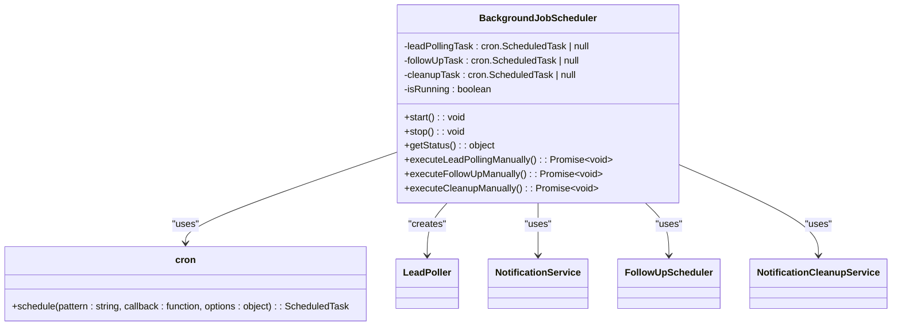
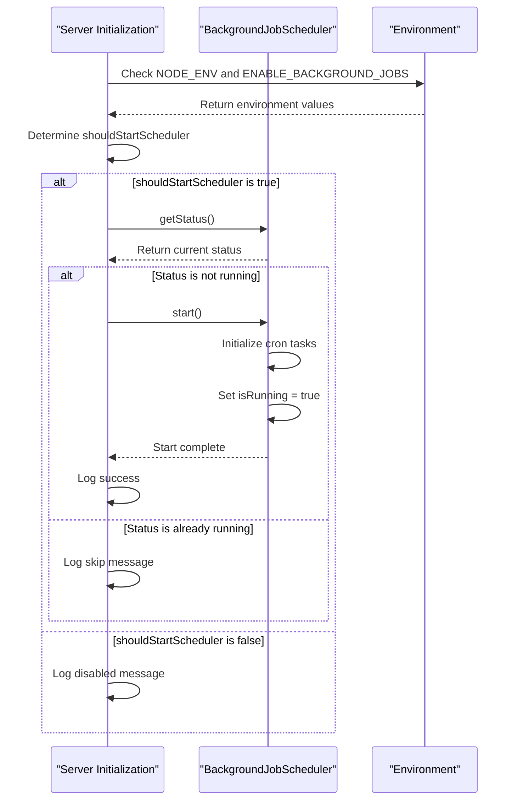
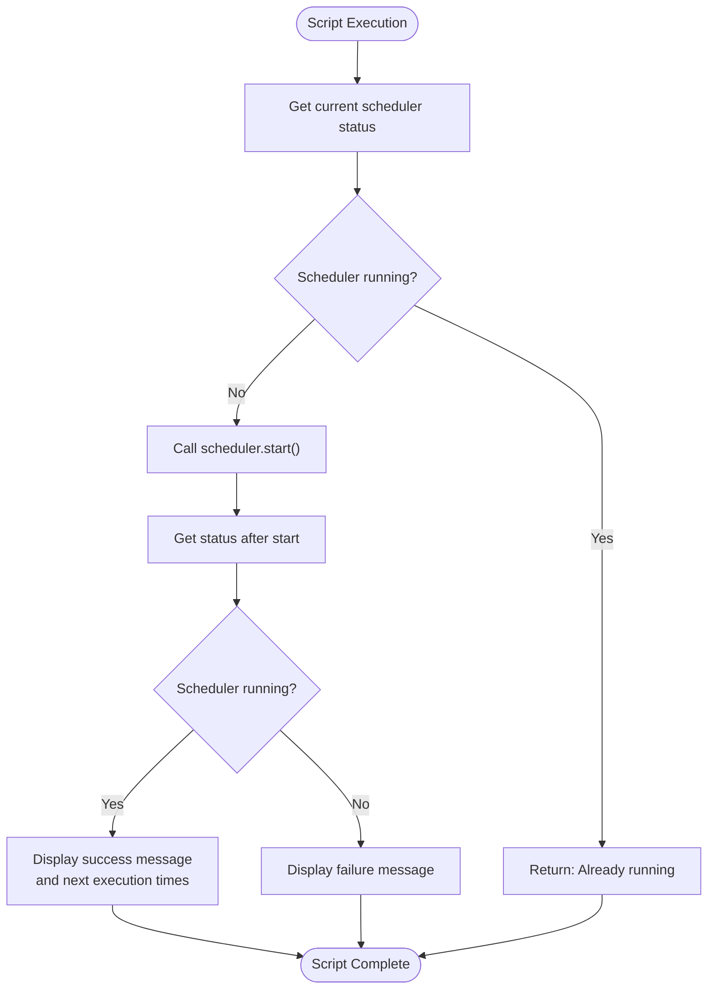
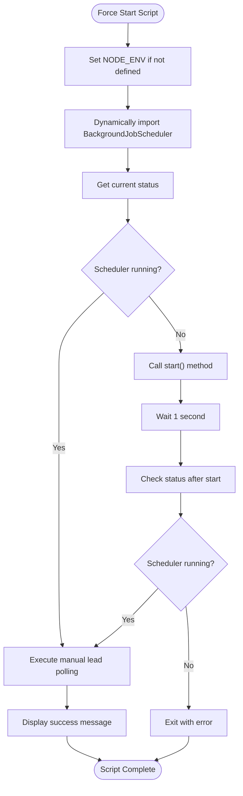
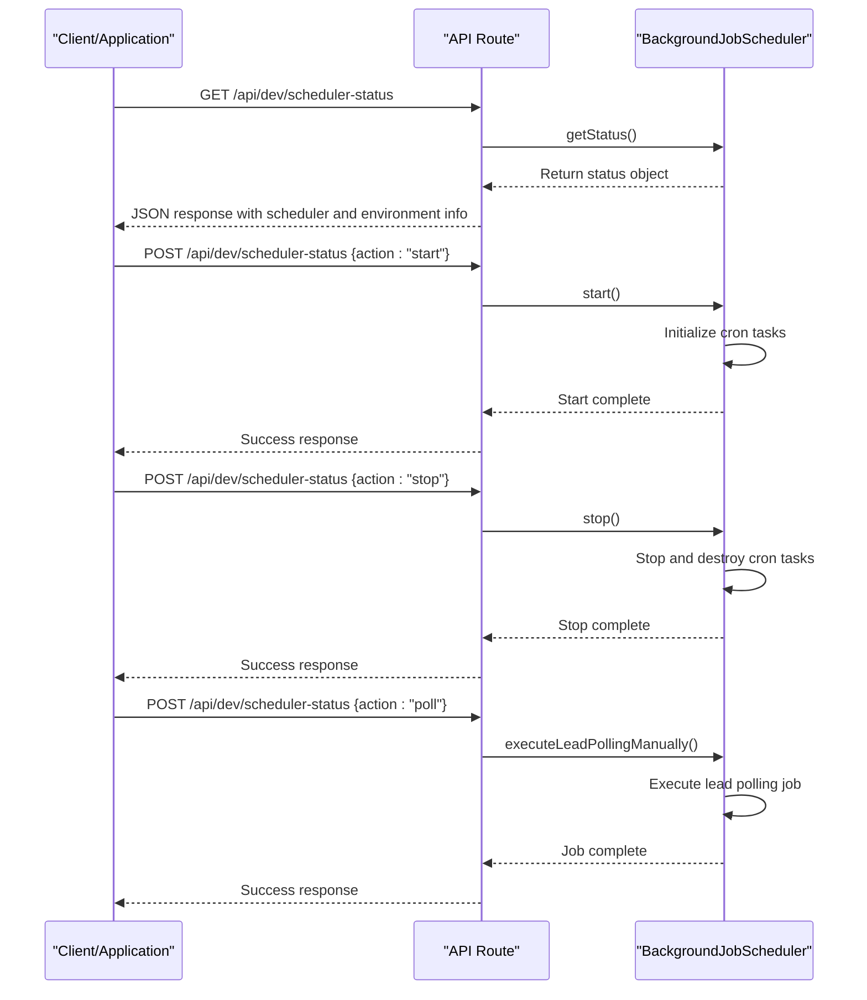
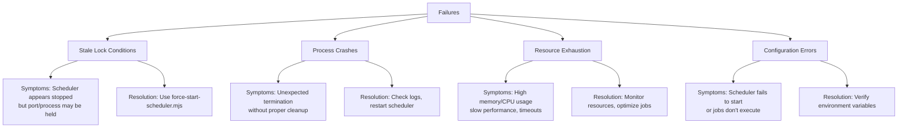
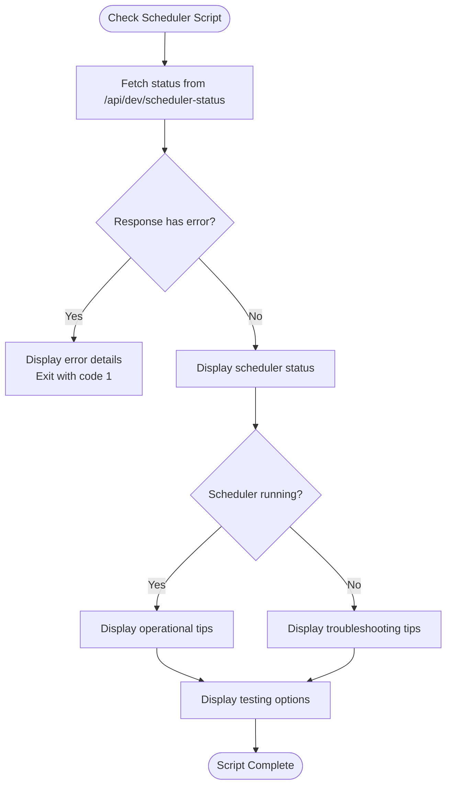
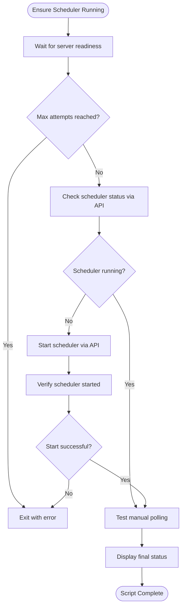

# Scheduler Management

<cite>
**Referenced Files in This Document**   
- [BackgroundJobScheduler.ts](file://src/services/BackgroundJobScheduler.ts#L8-L458)
- [start-scheduler.mjs](file://scripts/start-scheduler.mjs#L0-L57)
- [check-scheduler.mjs](file://scripts/check-scheduler.mjs#L0-L71)
- [ensure-scheduler-running.sh](file://scripts/ensure-scheduler-running.sh#L0-L92)
- [force-start-scheduler.mjs](file://scripts/force-start-scheduler.mjs#L0-L81)
- [scheduler-status/route.ts](file://src/app/api/dev/scheduler-status/route.ts#L0-L82)
- [server-init.ts](file://src/lib/server-init.ts#L0-L178)
</cite>

## Table of Contents
1. [Introduction](#introduction)
2. [Core Scheduler Architecture](#core-scheduler-architecture)
3. [Scheduler Initialization and Startup](#scheduler-initialization-and-startup)
4. [Scheduler Control Scripts](#scheduler-control-scripts)
5. [Inter-Process Communication Mechanism](#inter-process-communication-mechanism)
6. [Operational Procedures](#operational-procedures)
7. [Failure Modes and Recovery](#failure-modes-and-recovery)
8. [Monitoring and Status Inspection](#monitoring-and-status-inspection)

## Introduction
The scheduler management system in the fund-track application orchestrates background job processing for lead polling, follow-up processing, and notification cleanup. This document details the architecture, control mechanisms, and operational procedures for managing the background job scheduler. The system employs a singleton pattern for the BackgroundJobScheduler class, with multiple entry points for initialization, monitoring, and recovery. The scheduler is designed to be resilient, with mechanisms for automatic startup, health monitoring, and recovery from common failure modes.

## Core Scheduler Architecture

**Diagram sources**
- [BackgroundJobScheduler.ts](file://src/services/BackgroundJobScheduler.ts#L8-L458)

**Section sources**
- [BackgroundJobScheduler.ts](file://src/services/BackgroundJobScheduler.ts#L8-L458)

The BackgroundJobScheduler class implements a singleton pattern that manages three scheduled tasks:
- **Lead Polling**: Runs every 15 minutes by default, imports new leads from external sources
- **Follow-up Processing**: Runs every 5 minutes by default, processes scheduled follow-up actions
- **Notification Cleanup**: Runs daily at 2:00 AM, removes old notification records

The scheduler uses the node-cron library to manage task scheduling with configurable cron patterns via environment variables. The singleton instance is exported as `backgroundJobScheduler` and is shared across all modules that import it.

## Scheduler Initialization and Startup

**Diagram sources**
- [server-init.ts](file://src/lib/server-init.ts#L0-L178)
- [BackgroundJobScheduler.ts](file://src/services/BackgroundJobScheduler.ts#L8-L458)

**Section sources**
- [server-init.ts](file://src/lib/server-init.ts#L0-L178)

The scheduler is automatically initialized during server startup through the `initializeServer()` function in `server-init.ts`. The startup decision is based on two factors:
- **Production Environment**: The scheduler starts automatically when `NODE_ENV` is "production"
- **Explicit Enablement**: The scheduler can be enabled in development by setting `ENABLE_BACKGROUND_JOBS=true`

The initialization process includes:
1. Environment validation and logging
2. Notification service configuration validation
3. Scheduler startup decision based on environment variables
4. Current status check before attempting to start
5. Proper error handling to prevent server startup failure

In production environments, the scheduler is auto-initialized with a 2-second delay to ensure all modules are loaded.

## Scheduler Control Scripts

### start-scheduler.mjs
The `start-scheduler.mjs` script provides a direct interface to start the background job scheduler:

**Section sources**
- [start-scheduler.mjs](file://scripts/start-scheduler.mjs#L0-L57)

This script:
- Checks the current scheduler status before attempting to start
- Starts the scheduler if not already running
- Displays detailed status information after startup
- Handles SIGINT and SIGTERM signals to properly stop the scheduler
- Exits with appropriate status codes for automation

### force-start-scheduler.mjs
The `force-start-scheduler.mjs` script bypasses normal startup checks to force the scheduler to start:

**Section sources**
- [force-start-scheduler.mjs](file://scripts/force-start-scheduler.mjs#L0-L81)

This script is designed to overcome stale lock conditions after crashes:
- Sets environment to production if not defined
- Uses dynamic import for ES module compatibility
- Forces startup regardless of previous state
- Tests functionality with manual lead polling
- Includes comprehensive error handling with stack traces

## Inter-Process Communication Mechanism

**Diagram sources**
- [scheduler-status/route.ts](file://src/app/api/dev/scheduler-status/route.ts#L0-L82)
- [BackgroundJobScheduler.ts](file://src/services/BackgroundJobScheduler.ts#L8-L458)

**Section sources**
- [scheduler-status/route.ts](file://src/app/api/dev/scheduler-status/route.ts#L0-L82)

The inter-process communication mechanism is implemented through the `/api/dev/scheduler-status` API endpoint, which supports:
- **GET requests**: Retrieve current scheduler status and environment configuration
- **POST requests**: Execute actions (start, stop, poll) on the scheduler

The API serves as a bridge between external scripts and the singleton scheduler instance, allowing:
- Remote status monitoring
- Programmatic control of the scheduler
- Manual triggering of lead polling
- Environment-aware access control (development only)

## Operational Procedures

### Starting the Scheduler
The scheduler can be started through multiple methods:

1. **Automatic Startup**: During server initialization when conditions are met
2. **Direct Script**: Using `node scripts/start-scheduler.mjs`
3. **API Call**: POST to `/api/dev/scheduler-status` with `{action: "start"}`
4. **Force Start**: Using `node scripts/force-start-scheduler.mjs`

### Stopping the Scheduler
Proper shutdown procedures:
- Send SIGINT or SIGTERM to the process
- Call `scheduler.stop()` directly
- Use the API with `{action: "stop"}`
- Ensure cleanup of cron tasks and state

### Restarting the Scheduler
Recommended restart procedure:
1. Stop the scheduler using proper shutdown
2. Wait for confirmation of shutdown
3. Start the scheduler using preferred method
4. Verify status and next execution times

**Section sources**
- [start-scheduler.mjs](file://scripts/start-scheduler.mjs#L0-L57)
- [force-start-scheduler.mjs](file://scripts/force-start-scheduler.mjs#L0-L81)
- [scheduler-status/route.ts](file://src/app/api/dev/scheduler-status/route.ts#L0-L82)

## Failure Modes and Recovery

### Common Failure Modes

**Section sources**
- [BackgroundJobScheduler.ts](file://src/services/BackgroundJobScheduler.ts#L8-L458)
- [server-init.ts](file://src/lib/server-init.ts#L0-L178)

### Recovery Procedures

#### Stale Lock Conditions
When the scheduler fails to start due to stale state after a crash:
1. Use `force-start-scheduler.mjs` to bypass normal startup checks
2. The script will attempt to start the scheduler regardless of previous state
3. Verify operation by checking logs and next execution times

#### Process Crashes
When the scheduler process terminates unexpectedly:
1. Check application logs for error messages
2. Verify system resources (memory, CPU)
3. Restart the scheduler using `start-scheduler.mjs`
4. Monitor for recurring issues

#### Resource Exhaustion
When system resources are depleted:
1. Monitor memory and CPU usage
2. Consider adjusting cron patterns to reduce frequency
3. Optimize job processing logic
4. Scale system resources as needed

## Monitoring and Status Inspection

### check-scheduler.mjs
The `check-scheduler.mjs` script provides comprehensive status inspection:

**Section sources**
- [check-scheduler.mjs](file://scripts/check-scheduler.mjs#L0-L71)

This script:
- Retrieves scheduler status via API
- Displays detailed status information
- Provides environment configuration details
- Offers troubleshooting tips based on current state
- Suggests testing options for verification

### ensure-scheduler-running.sh
The `ensure-scheduler-running.sh` wrapper script monitors and restarts the scheduler:

**Section sources**
- [ensure-scheduler-running.sh](file://scripts/ensure-scheduler-running.sh#L0-L92)

This shell script:
- Waits for the server to become ready
- Checks the current scheduler status
- Starts the scheduler if not running
- Verifies successful startup
- Tests functionality with manual polling
- Can be used as a cron job for continuous monitoring