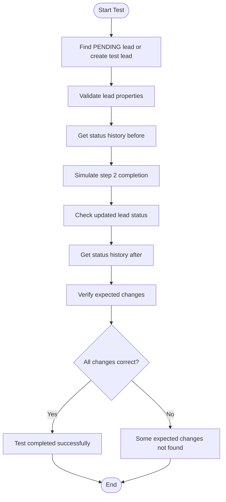
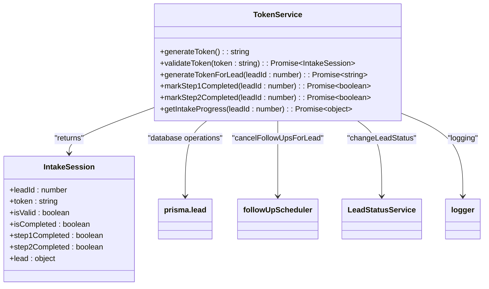
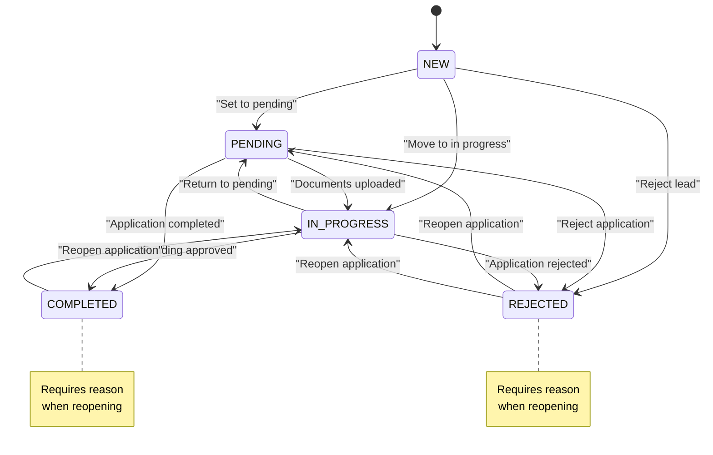
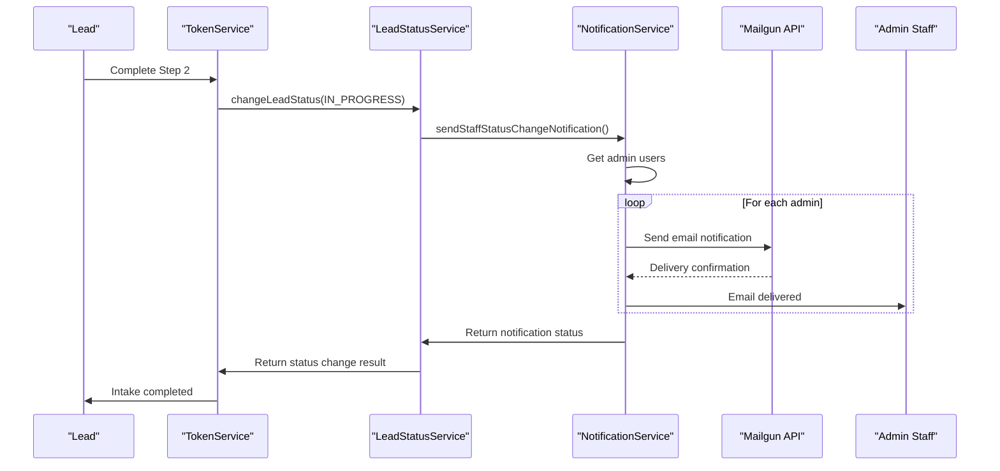
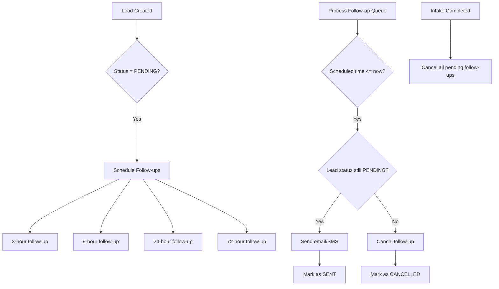
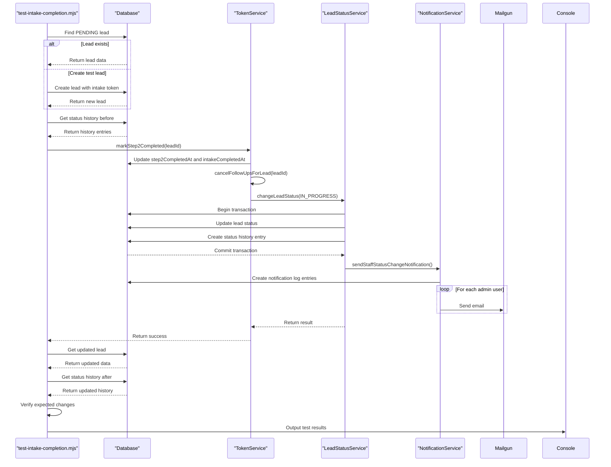

# Intake Workflow End-to-End Testing

<cite>
**Referenced Files in This Document**   
- [test-intake-completion.mjs](file://scripts/test-intake-completion.mjs)
- [TokenService.ts](file://src/services/TokenService.ts)
- [LeadStatusService.ts](file://src/services/LeadStatusService.ts)
- [NotificationService.ts](file://src/services/NotificationService.ts)
- [FollowUpScheduler.ts](file://src/services/FollowUpScheduler.ts)
- [schema.prisma](file://prisma/schema.prisma)
- [route.ts](file://src/app/api/intake/[token]/route.ts)
- [step1/route.ts](file://src/app/api/intake/[token]/step1/route.ts)
- [step2/route.ts](file://src/app/api/intake/[token]/step2/route.ts)
- [page.tsx](file://src/app/application/[token]/page.tsx)
</cite>

## Table of Contents
1. [Introduction](#introduction)
2. [Test Script Overview](#test-script-overview)
3. [Intake Workflow Architecture](#intake-workflow-architecture)
4. [Token Service Implementation](#token-service-implementation)
5. [Status Transition Logic](#status-transition-logic)
6. [Notification System](#notification-system)
7. [Follow-up Management](#follow-up-management)
8. [Database Schema](#database-schema)
9. [API Endpoints](#api-endpoints)
10. [Test Execution Flow](#test-execution-flow)
11. [Usage Examples](#usage-examples)
12. [Result Interpretation](#result-interpretation)
13. [Configuration Requirements](#configuration-requirements)
14. [Extending Test Scenarios](#extending-test-scenarios)

## Introduction
This document provides comprehensive documentation for the end-to-end testing of the intake completion workflow in the fund-track application. The test script validates the complete journey of a prospect through the multi-step intake process, from initial token validation to final completion and staff notification. The system uses a token-based authentication mechanism to allow prospects to securely complete their application in multiple sessions. The workflow involves two main steps: collection of business and personal information (Step 1), followed by document upload (Step 2). Upon completion, the system updates the lead status, cancels pending follow-ups, and notifies staff members.

**Section sources**
- [test-intake-completion.mjs](file://scripts/test-intake-completion.mjs#L1-L170)

## Test Script Overview
The test-intake-completion.mjs script simulates a prospect completing the entire intake workflow, validating that all business logic executes correctly. The script first attempts to find an existing lead with PENDING status, or creates a test lead if none exists. It then simulates the completion of Step 2 (document upload) by calling the markStep2Completed method on the TokenService. The test verifies that this action triggers the expected changes: updating the lead's status to IN_PROGRESS, marking both intake steps as completed, creating a status history entry, and sending notifications to staff. The script includes comprehensive logging to track each step of the process and provides clear pass/fail indicators based on the verification of expected outcomes.



**Diagram sources**
- [test-intake-completion.mjs](file://scripts/test-intake-completion.mjs#L1-L170)

**Section sources**
- [test-intake-completion.mjs](file://scripts/test-intake-completion.mjs#L1-L170)

## Intake Workflow Architecture
The intake workflow follows a token-based, multi-step process that allows prospects to complete their application at their convenience. The architecture consists of several key components working together: the frontend application that guides the user through the steps, API endpoints that handle form submissions and document uploads, business logic services that manage state transitions, and notification systems that alert staff when action is required. The workflow begins when a lead is assigned an intake token, which serves as both authentication and session identifier. The prospect accesses the intake form via a URL containing this token, completes Step 1 (information collection), and later returns to complete Step 2 (document upload). The system maintains progress through timestamp fields that indicate which steps have been completed.

```mermaid
graph TB
subgraph "Frontend"
UI[User Interface]
Workflow[IntakeWorkflow Component]
end
subgraph "API Layer"
MainRoute[/api/intake/{token}]
Step1Route[/api/intake/{token}/step1]
Step2Route[/api/intake/{token}/step2]
SaveRoute[/api/intake/{token}/save]
end
subgraph "Business Logic"
TokenService[TokenService]
LeadStatusService[LeadStatusService]
FollowUpScheduler[FollowUpScheduler]
NotificationService[NotificationService]
end
subgraph "Data Layer"
Prisma[Prisma Client]
PostgreSQL[(PostgreSQL Database)]
end
UI --> Workflow
Workflow --> MainRoute
Workflow --> Step1Route
Workflow --> Step2Route
Workflow --> SaveRoute
MainRoute --> TokenService
Step1Route --> TokenService
Step2Route --> TokenService
Step2Route --> FollowUpScheduler
Step2Route --> LeadStatusService
Step1Route --> Prisma
Step2Route --> Prisma
TokenService --> Prisma
LeadStatusService --> Prisma
FollowUpScheduler --> Prisma
LeadStatusService --> NotificationService
Prisma --> PostgreSQL
```

**Diagram sources**
- [test-intake-completion.mjs](file://scripts/test-intake-completion.mjs#L1-L170)
- [TokenService.ts](file://src/services/TokenService.ts#L56-L312)
- [LeadStatusService.ts](file://src/services/LeadStatusService.ts#L28-L452)
- [NotificationService.ts](file://src/services/NotificationService.ts#L47-L468)
- [FollowUpScheduler.ts](file://src/services/FollowUpScheduler.ts#L19-L486)

**Section sources**
- [test-intake-completion.mjs](file://scripts/test-intake-completion.mjs#L1-L170)
- [TokenService.ts](file://src/services/TokenService.ts#L56-L312)

## Token Service Implementation
The TokenService class provides the core functionality for managing the intake workflow through secure tokens. It handles token generation, validation, and step completion marking. The service uses cryptographic random number generation to create secure 32-byte hexadecimal tokens that are stored in the database and associated with specific leads. The validateToken method checks if a token exists and returns the current intake session state, including whether the intake is completed and which steps have been finished. The markStep2Completed method is particularly important as it triggers the final stage of the intake process, updating timestamps, changing the lead status, and initiating notifications. The service also provides methods for marking Step 1 as completed and retrieving intake progress.



**Diagram sources**
- [TokenService.ts](file://src/services/TokenService.ts#L56-L312)

**Section sources**
- [TokenService.ts](file://src/services/TokenService.ts#L56-L312)

## Status Transition Logic
The LeadStatusService implements a state machine pattern to manage lead status transitions with strict validation rules. The service defines allowed transitions between states (NEW, PENDING, IN_PROGRESS, COMPLETED, REJECTED) and enforces business rules such as requiring reasons for certain transitions. When a lead's status changes, the service creates audit entries in the leadStatusHistory table, cancels pending follow-ups if appropriate, and triggers staff notifications for significant changes. The changeLeadStatus method executes within a database transaction to ensure data consistency, updating the lead record and creating a history entry atomically. The service also validates transitions before making changes, preventing invalid state changes that could compromise data integrity.



**Diagram sources**
- [LeadStatusService.ts](file://src/services/LeadStatusService.ts#L28-L452)

**Section sources**
- [LeadStatusService.ts](file://src/services/LeadStatusService.ts#L28-L452)

## Notification System
The NotificationService handles all communication with leads and staff members through email and SMS channels. The service integrates with Mailgun for email delivery and Twilio for SMS messaging, with configurable retry logic and rate limiting to prevent spam. When significant status changes occur, such as a lead moving to IN_PROGRESS after document upload, the service sends notifications to all admin users. The service creates log entries in the notificationLog table for auditing purposes, tracking the status of each notification (PENDING, SENT, FAILED). It also implements rate limiting to prevent excessive notifications to the same recipient, allowing a maximum of 2 notifications per hour per recipient and 10 per day per lead.



**Diagram sources**
- [NotificationService.ts](file://src/services/NotificationService.ts#L47-L468)
- [LeadStatusService.ts](file://src/services/LeadStatusService.ts#L28-L452)
- [TokenService.ts](file://src/services/TokenService.ts#L56-L312)

**Section sources**
- [NotificationService.ts](file://src/services/NotificationService.ts#L47-L468)

## Follow-up Management
The FollowUpScheduler manages automated follow-up communications with leads who have not completed their intake process. When a lead is created with PENDING status, the scheduler creates a series of follow-up tasks at 3, 9, 24, and 72 hours. These tasks trigger email and SMS reminders to encourage the prospect to complete their application. When a lead completes the intake process, the markStep2Completed method automatically cancels all pending follow-ups for that lead, preventing unnecessary communications. The scheduler runs periodically to process due follow-ups, checking each lead's status before sending notifications to ensure only appropriate leads receive reminders.



**Diagram sources**
- [FollowUpScheduler.ts](file://src/services/FollowUpScheduler.ts#L19-L486)
- [TokenService.ts](file://src/services/TokenService.ts#L56-L312)

**Section sources**
- [FollowUpScheduler.ts](file://src/services/FollowUpScheduler.ts#L19-L486)

## Database Schema
The database schema is designed to support the intake workflow with comprehensive tracking of lead status, documents, and communications. The Lead table contains all prospect information and workflow state indicators, including timestamps for each step of the intake process. The leadStatusHistory table provides an audit trail of all status changes, while the followupQueue table manages automated reminders. The notificationLog table records all communications for compliance and troubleshooting. The schema uses enums to enforce valid status values and includes appropriate indexes for query performance. Field mappings ensure compatibility with the underlying database while maintaining readable names in the application code.

```mermaid
erDiagram
LEAD {
Int id PK
BigInt legacyLeadId UK
Int campaignId
String? email
String? phone
String? firstName
String? lastName
String? businessName
String? dba
String? businessAddress
String? businessPhone
String? businessEmail
String? mobile
String? businessCity
String? businessState
String? businessZip
String? industry
Int? yearsInBusiness
String? amountNeeded
String? monthlyRevenue
String? ownershipPercentage
String? taxId
String? stateOfInc
String? dateBusinessStarted
String? legalEntity
String? natureOfBusiness
String? hasExistingLoans
String? dateOfBirth
String? socialSecurity
String? personalAddress
String? personalCity
String? personalState
String? personalZip
String? legalName
LeadStatus status
String? intakeToken UK
DateTime? intakeCompletedAt
DateTime? step1CompletedAt
DateTime? step2CompletedAt
DateTime createdAt
DateTime updatedAt
DateTime importedAt
}
LEAD_STATUS_HISTORY {
Int id PK
Int leadId FK
LeadStatus? previousStatus
LeadStatus newStatus
Int changedBy FK
String? reason
DateTime createdAt
}
FOLLOWUP_QUEUE {
Int id PK
Int leadId FK
DateTime scheduledAt
FollowupType followupType
FollowupStatus status
DateTime? sentAt
DateTime createdAt
}
NOTIFICATION_LOG {
Int id PK
Int? leadId FK
NotificationType type
String recipient
String? subject
String? content
NotificationStatus status
String? externalId
String? errorMessage
DateTime? sentAt
DateTime createdAt
}
DOCUMENT {
Int id PK
Int leadId FK
String filename
String originalFilename
Int fileSize
String mimeType
String b2FileId
String b2BucketName
Int? uploadedBy FK
DateTime uploadedAt
}
USER {
Int id PK
String email UK
String passwordHash
UserRole role
DateTime createdAt
DateTime updatedAt
}
LEAD ||--o{ LEAD_STATUS_HISTORY : "has history"
LEAD ||--o{ FOLLOWUP_QUEUE : "has follow-ups"
LEAD ||--o{ NOTIFICATION_LOG : "has notifications"
LEAD ||--o{ DOCUMENT : "has documents"
LEAD_STATUS_HISTORY }|--|| USER : "changed by"
FOLLOWUP_QUEUE }|--|| LEAD : "belongs to"
NOTIFICATION_LOG }|--|| LEAD : "belongs to"
DOCUMENT }|--|| LEAD : "belongs to"
DOCUMENT }|--|| USER : "uploaded by"
```

**Diagram sources**
- [schema.prisma](file://prisma/schema.prisma#L0-L257)

**Section sources**
- [schema.prisma](file://prisma/schema.prisma#L0-L257)

## API Endpoints
The intake workflow is supported by a set of API endpoints that handle different aspects of the process. The main endpoint validates tokens and returns intake session data, while step-specific endpoints process form submissions and document uploads. The save endpoint allows partial progress to be saved between sessions. All endpoints implement comprehensive validation, including token validation, required field checks, and format validation for emails and phone numbers. The endpoints follow REST conventions with appropriate HTTP status codes and JSON responses that include success indicators, messages, and data payloads. Error responses include descriptive messages to aid debugging while protecting sensitive information in production environments.

```mermaid
flowchart TD
A[/api/intake/{token}] --> B{GET}
A --> C{POST}
B --> D[Validate token and return session data]
C --> E[Save partial progress]
F[/api/intake/{token}/step1] --> G{POST}
G --> H[Validate and save step 1 data]
G --> I[Mark step 1 as completed]
J[/api/intake/{token}/step2] --> K{POST}
K --> L[Validate document upload]
K --> M[Upload documents to B2]
K --> N[Store document metadata]
K --> O[Mark step 2 as completed]
P[/api/intake/{token}/save] --> Q{POST}
Q --> R[Save partial step 1 data]
style A fill:#f9f,stroke:#333
style F fill:#f9f,stroke:#333
style J fill:#f9f,stroke:#333
style P fill:#f9f,stroke:#333
```

**Diagram sources**
- [route.ts](file://src/app/api/intake/[token]/route.ts#L0-L37)
- [step1/route.ts](file://src/app/api/intake/[token]/step1/route.ts#L0-L303)
- [step2/route.ts](file://src/app/api/intake/[token]/step2/route.ts#L0-L151)
- [save/route.ts](file://src/app/api/intake/[token]/save/route.ts#L0-L129)

**Section sources**
- [route.ts](file://src/app/api/intake/[token]/route.ts#L0-L37)
- [step1/route.ts](file://src/app/api/intake/[token]/step1/route.ts#L0-L303)
- [step2/route.ts](file://src/app/api/intake/[token]/step2/route.ts#L0-L151)
- [save/route.ts](file://src/app/api/intake/[token]/save/route.ts#L0-L129)

## Test Execution Flow
The test execution flow follows a structured sequence to validate the end-to-end intake completion process. The script begins by locating or creating a test lead with PENDING status and a valid intake token. It then captures the current state of the lead, including status and completion timestamps, and retrieves the status history before the test. The core of the test simulates Step 2 completion by calling the markStep2Completed method, which should trigger the business logic for intake completion. After this operation, the script verifies that the lead's status has changed to IN_PROGRESS, both intake steps are marked as completed, the intake completion timestamp is set, and a new status history entry has been created. The test provides detailed logging at each step to facilitate debugging if any verification fails.



**Diagram sources**
- [test-intake-completion.mjs](file://scripts/test-intake-completion.mjs#L1-L170)
- [TokenService.ts](file://src/services/TokenService.ts#L56-L312)
- [LeadStatusService.ts](file://src/services/LeadStatusService.ts#L28-L452)
- [NotificationService.ts](file://src/services/NotificationService.ts#L47-L468)

**Section sources**
- [test-intake-completion.mjs](file://scripts/test-intake-completion.mjs#L1-L170)

## Usage Examples
The test script can be executed to validate both successful completion flows and edge cases. For a successful test, the script will output detailed information about the test lead, status changes, and verification results, concluding with a success message. The script handles cases where no suitable test lead exists by creating one automatically. Edge cases that can be tested include attempts to complete Step 2 without completing Step 1, uploading an incorrect number of documents, or submitting invalid file types. These scenarios are handled by the API endpoints with appropriate error responses that can be verified in test assertions. The script's modular design allows for easy extension to test additional scenarios by modifying the test data or adding new validation checks.

**Successful Completion Example:**
```
🧪 Testing intake completion workflow...

📋 Using test lead: Test User (Test Business LLC)
   Lead ID: 12345
   Current Status: PENDING
   Step 1 Completed: Yes
   Step 2 Completed: No
   Intake Completed: No

🚀 Simulating step 2 completion (document upload)...
✅ Step 2 marked as completed successfully

📋 Updated lead status:
   Status: PENDING → IN_PROGRESS
   Step 2 Completed: No → Yes
   Intake Completed: No → Yes

✅ All expected changes verified:
   ✓ Lead status changed to IN_PROGRESS
   ✓ Step 2 marked as completed
   ✓ Intake marked as completed
   ✓ Status history entry created

🎉 Test completed successfully! Staff will now be notified when documents are uploaded.
```

**Section sources**
- [test-intake-completion.mjs](file://scripts/test-intake-completion.mjs#L1-L170)

## Result Interpretation
Interpreting test results involves verifying that all expected changes occurred when the intake process was completed. A successful test will show that the lead status changed from PENDING to IN_PROGRESS, both step completion timestamps are set, and the intake completion timestamp is populated. The status history should show a new entry reflecting the status change, typically initiated by a system user with a reason indicating document upload. The test output provides a clear checklist of verifications, with checkmarks for successful validations and crosses for failures. If any verification fails, the output will indicate which specific check did not pass, allowing for targeted debugging. Database state changes can be further verified by querying the lead, leadStatusHistory, and notificationLog tables directly.

**Key Verification Points:**
- **Status Change**: Lead status must transition from PENDING to IN_PROGRESS
- **Timestamps**: step2CompletedAt and intakeCompletedAt must be set
- **History Entry**: A new leadStatusHistory record must be created
- **Follow-up Cancellation**: Pending follow-ups for the lead should be cancelled
- **Notifications**: Staff notification emails should be logged in notificationLog

**Section sources**
- [test-intake-completion.mjs](file://scripts/test-intake-completion.mjs#L1-L170)

## Configuration Requirements
The test script requires specific configuration to run successfully. The environment must have access to the database through the DATABASE_URL environment variable. For notification testing, Mailgun API credentials must be configured (MAILGUN_API_KEY, MAILGUN_DOMAIN, MAILGUN_FROM_EMAIL). The system requires an admin user to exist in the database, as status changes are attributed to a system user. Test tokens are generated automatically by the script when needed, but the TokenService relies on Node.js crypto module for secure token generation. The script assumes that the Prisma client is properly configured and that all database migrations have been applied. For document upload testing, Backblaze B2 storage credentials must be configured in the FileUploadService.

**Required Environment Variables:**
- DATABASE_URL: PostgreSQL connection string
- MAILGUN_API_KEY: Mailgun API key for email notifications
- MAILGUN_DOMAIN: Mailgun sending domain
- MAILGUN_FROM_EMAIL: Email address for sender
- NEXT_PUBLIC_BASE_URL: Base URL for application links

**Section sources**
- [test-intake-completion.mjs](file://scripts/test-intake-completion.mjs#L1-L170)
- [NotificationService.ts](file://src/services/NotificationService.ts#L47-L468)

## Extending Test Scenarios
The test script can be extended to cover additional scenarios by modifying the test data or adding new test cases. Additional scenarios could include testing validation errors for incomplete submissions, verifying behavior when document uploads fail, or testing the save progress functionality. The script could be enhanced to test multiple leads in sequence or to verify edge cases like token expiration or duplicate token usage. For more comprehensive testing, the script could be converted into a Jest test suite with proper assertions and coverage reporting. The modular design of the TokenService and related components makes it easy to create specialized test cases by calling specific methods with controlled inputs.

**Potential Extensions:**
- Test validation of required fields in Step 1
- Test document upload with invalid file types
- Test behavior when intake token is invalid or expired
- Test save progress functionality for partial completions
- Test concurrent access to the same intake token
- Test database transaction rollback on errors
- Test notification rate limiting behavior

**Section sources**
- [test-intake-completion.mjs](file://scripts/test-intake-completion.mjs#L1-L170)
- [TokenService.ts](file://src/services/TokenService.ts#L56-L312)