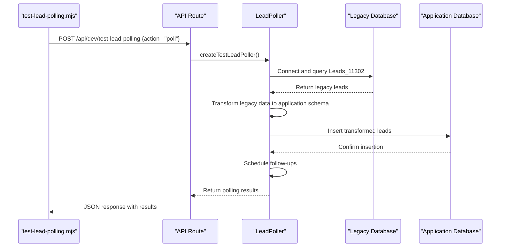
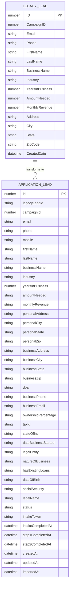

# Lead Polling Process Simulation

<cite>
**Referenced Files in This Document**   
- [test-lead-polling.mjs](file://scripts/test-lead-polling.mjs)
- [route.ts](file://src/app/api/dev/test-lead-polling/route.ts)
- [LeadPoller.ts](file://src/services/LeadPoller.ts)
- [legacy-db.ts](file://src/lib/legacy-db.ts)
- [schema.prisma](file://prisma/schema.prisma)
</cite>

## Table of Contents
1. [Introduction](#introduction)
2. [Script Overview](#script-overview)
3. [Architecture and Flow](#architecture-and-flow)
4. [Data Transformation and Validation](#data-transformation-and-validation)
5. [Usage Examples and Output Interpretation](#usage-examples-and-output-interpretation)
6. [Configuration and Dependencies](#configuration-and-dependencies)
7. [Integration Testing Guidance](#integration-testing-guidance)

## Introduction
The **test-lead-polling.mjs** script is a command-line utility designed to simulate the lead import process from a legacy database into the application. It enables developers and QA engineers to validate data transformation logic, test schema mappings, and verify business rule enforcement without affecting production data. This document provides a comprehensive analysis of the script's functionality, integration points, and usage patterns, with a focus on its role in migration validation and integration testing.

The script interacts with a dedicated API endpoint (`/api/dev/test-lead-polling`) that uses a test-specific instance of the `LeadPoller` service, configured to process leads from campaign ID 11302. This allows for isolated testing of the lead ingestion pipeline, including data fetching, transformation, database insertion, and follow-up scheduling.

## Script Overview
The **test-lead-polling.mjs** script provides a simple CLI interface for triggering and monitoring test lead polling operations. It supports two primary commands: `poll` and `status`.

```javascript
#!/usr/bin/env node

import { createRequire } from 'module';
const require = createRequire(import.meta.url);

// Simple CLI script for testing lead polling
const args = process.argv.slice(2);

if (args.length === 0) {
  console.log(`
Usage: node scripts/test-lead-polling.mjs <command>

Commands:
  poll      - Trigger test lead polling for campaign 11302
  status    - Get test poller status

Examples:
  node scripts/test-lead-polling.mjs poll
  node scripts/test-lead-polling.mjs status

This script uses a test poller configured for campaign ID 11302 (the test record campaign).
`);
  process.exit(1);
}
```

**Section sources**
- [test-lead-polling.mjs](file://scripts/test-lead-polling.mjs#L1-L25)

### Command Processing
The script validates the provided command and makes HTTP requests to the test API endpoint. When the `poll` command is executed, it sends a POST request with the action payload. For the `status` command, it performs a GET request to retrieve configuration details.

```javascript
const [command] = args;

if (!['poll', 'status'].includes(command)) {
  console.error('Error: Command must be "poll" or "status"');
  process.exit(1);
}

// Make the API call
const baseUrl = process.env.NEXTAUTH_URL || 'http://localhost:3000';
const url = `${baseUrl}/api/dev/test-lead-polling`;

console.log(`Executing ${command} operation...`);

try {
  let response;
  
  if (command === 'status') {
    response = await fetch(url, {
      method: 'GET',
    });
  } else {
    response = await fetch(url, {
      method: 'POST',
      headers: {
        'Content-Type': 'application/json',
      },
      body: JSON.stringify({
        action: command,
      }),
    });
  }
```

**Section sources**
- [test-lead-polling.mjs](file://scripts/test-lead-polling.mjs#L27-L65)

## Architecture and Flow
The test lead polling process involves multiple components working together to simulate the production lead import workflow. The architecture follows a client-server pattern where the CLI script acts as a client to the API endpoint.



**Diagram sources**
- [test-lead-polling.mjs](file://scripts/test-lead-polling.mjs#L0-L104)
- [route.ts](file://src/app/api/dev/test-lead-polling/route.ts#L0-L78)
- [LeadPoller.ts](file://src/services/LeadPoller.ts#L0-L521)

### API Endpoint Implementation
The `/api/dev/test-lead-polling` endpoint handles both POST and GET requests. The POST method processes the polling action, while the GET method returns configuration metadata.

```typescript
export async function POST(request: NextRequest) {
    try {
        const body = await request.json();
        const { action } = body;

        if (!action || !['poll', 'status'].includes(action)) {
            return NextResponse.json(
                { error: 'Action must be "poll" or "status"' },
                { status: 400 }
            );
        }

        const testPoller = createTestLeadPoller();

        let result;

        switch (action) {
            case 'poll':
                console.log('🧪 Starting test lead polling...');
                result = await testPoller.pollAndImportLeads();
                break;
            case 'status':
                result = {
                    message: 'Test poller status',
                    campaignIds: [11302],
                    batchSize: 10,
                };
                break;
        }

        return NextResponse.json({
            success: true,
            action,
            result,
            timestamp: new Date().toISOString(),
        });
    } catch (error) {
        console.error('Test lead polling error:', error);
        return NextResponse.json(
            {
                error: 'Internal server error',
                details: error instanceof Error ? error.message : 'Unknown error'
            },
            { status: 500 }
        );
    }
}
```

**Section sources**
- [route.ts](file://src/app/api/dev/test-lead-polling/route.ts#L1-L50)

### Test Poller Configuration
The test environment uses a specialized factory function `createTestLeadPoller()` that configures the `LeadPoller` with test-specific parameters, including the campaign ID 11302 and a reduced batch size of 10.

```typescript
export function createTestLeadPoller(): LeadPoller {
  return new LeadPoller({
    campaignIds: [11302], // Test campaign ID - corresponds to Leads_11302 table
    batchSize: 10,
  });
}
```

**Section sources**
- [LeadPoller.ts](file://src/services/LeadPoller.ts#L516-L521)

## Data Transformation and Validation
The lead polling process involves extensive data transformation and validation to ensure compatibility between the legacy and application schemas. The `transformLegacyLead()` method handles the mapping of fields from the legacy database format to the application's `Lead` model.

### Field Mapping and Transformation
The transformation process includes field renaming, data type conversion, and business rule enforcement. Key transformations include:

- **Email and Phone Sanitization**: Trimming whitespace and removing invalid characters
- **Data Type Conversion**: Converting numeric fields to strings as required by the schema
- **Default Value Assignment**: Setting initial values for application-specific fields
- **Status Initialization**: Setting the initial status to PENDING with a generated intake token

```typescript
private transformLegacyLead(legacyLead: LegacyLead): Omit<Lead, 'id' | 'createdAt' | 'updatedAt'> {
    // Generate intake token for new leads
    const intakeToken = TokenService.generateToken();
    
    // Sanitize data
    const sanitizedEmail = this.sanitizeString(legacyLead.Email);
    const sanitizedPhone = this.sanitizePhone(legacyLead.Phone);
    const sanitizedFirstName = this.sanitizeString(legacyLead.FirstName);
    const sanitizedLastName = this.sanitizeString(legacyLead.LastName);
    const sanitizedBusinessName = this.sanitizeString(legacyLead.BusinessName);
    const sanitizedIndustry = this.sanitizeString(legacyLead.Industry);
    const sanitizedAddress = this.sanitizeString(legacyLead.Address);
    const sanitizedCity = this.sanitizeString(legacyLead.City);
    const sanitizedState = this.sanitizeString(legacyLead.State);
    const sanitizedZipCode = this.sanitizeString(legacyLead.ZipCode);
    
    return {
      legacyLeadId: BigInt(legacyLead.ID),
      campaignId: legacyLead.CampaignID,
      
      // Contact Information
      email: sanitizedEmail,
      phone: sanitizedPhone,
      mobile: null,
      firstName: sanitizedFirstName,
      lastName: sanitizedLastName,
      
      // Business Information (from legacy DB)
      businessName: sanitizedBusinessName,
      industry: sanitizedIndustry,
      yearsInBusiness: legacyLead.YearsInBusiness || null,
      amountNeeded: legacyLead.AmountNeeded != null ? String(legacyLead.AmountNeeded) : null,
      monthlyRevenue: legacyLead.MonthlyRevenue != null ? String(legacyLead.MonthlyRevenue) : null,
      
      // Personal Address Information (from Leads table)
      personalAddress: sanitizedAddress,
      personalCity: sanitizedCity,
      personalState: sanitizedState,
      personalZip: sanitizedZipCode,
      legalName: null,
      
      // System fields
      status: LeadStatus.PENDING,
      intakeToken,
      intakeCompletedAt: null,
      step1CompletedAt: null,
      step2CompletedAt: null,
      importedAt: new Date(),
    };
}
```

**Section sources**
- [LeadPoller.ts](file://src/services/LeadPoller.ts#L322-L497)

### Data Sanitization Rules
The script implements strict sanitization rules to ensure data quality:

- **String Fields**: Trimmed and converted to null if empty
- **Phone Numbers**: Stripped of non-digit characters and validated for length (10-15 digits)
- **Numeric Fields**: Converted to strings as required by the application schema
- **Null Handling**: Proper handling of null and undefined values

```typescript
private sanitizeString(value: string | null | undefined): string | null {
    if (!value || typeof value !== 'string') {
      return null;
    }

    const trimmed = value.trim();
    return trimmed.length > 0 ? trimmed : null;
}

private sanitizePhone(phone: string | null | undefined): string | null {
    if (!phone || typeof phone !== 'string') {
      return null;
    }

    // Remove all non-digit characters
    const digitsOnly = phone.replace(/\D/g, '');

    // Return null if no digits or invalid length
    if (digitsOnly.length < 10 || digitsOnly.length > 15) {
      return null;
    }

    return digitsOnly;
}
```

**Section sources**
- [LeadPoller.ts](file://src/services/LeadPoller.ts#L455-L497)

### Schema Definitions
The data transformation process maps between two distinct schemas: the legacy database schema and the application's Prisma schema.



**Diagram sources**
- [legacy-db.ts](file://src/lib/legacy-db.ts#L19-L37)
- [schema.prisma](file://prisma/schema.prisma)

## Usage Examples and Output Interpretation
The **test-lead-polling.mjs** script provides clear, formatted output for both successful operations and error conditions. Understanding this output is crucial for interpreting test results and diagnosing issues.

### Successful Poll Operation
When a poll operation completes successfully, the script displays detailed results including processing statistics and error information.

```
Executing poll operation...
✅ Success!
Action: poll
Timestamp: 2025-08-27T10:30:45.123Z

📊 Polling Results:
Total Processed: 5
New Leads: 5
Duplicates Skipped: 0
Errors: 0
Processing Time: 1250ms
```

This output indicates that 5 leads were processed successfully with no errors. The processing time of 1250ms suggests acceptable performance for the test batch.

### Error Conditions
When errors occur during processing, the script provides detailed error reporting:

```
Executing poll operation...
❌ Failed!
Error: Internal server error
Details: Failed to connect to legacy database

---

Executing poll operation...
✅ Success!
Action: poll
Timestamp: 2025-08-27T10:35:22.456Z

📊 Polling Results:
Total Processed: 3
New Leads: 2
Duplicates Skipped: 0
Errors: 1
Processing Time: 890ms

❌ Errors:
  1. Failed to import lead 1005: Invalid phone number format
```

This output shows a partial success scenario where 2 leads were imported successfully, but one failed due to invalid phone number format. The error message provides specific information for troubleshooting.

### Status Command Output
The status command provides configuration information about the test poller:

```
Executing status operation...
📊 Test Poller Status:
====================
Campaign IDs: 11302
Batch Size: 10
Available Actions: poll, status

📖 Usage:
  poll: POST with {"action": "poll"} to trigger test polling
  status: POST with {"action": "status"} to get poller status
```

This information is useful for verifying the test environment configuration before running import operations.

**Section sources**
- [test-lead-polling.mjs](file://scripts/test-lead-polling.mjs#L67-L104)

## Configuration and Dependencies
The test lead polling system relies on several configuration parameters and external dependencies to function correctly.

### Environment Variables
The script uses the `NEXTAUTH_URL` environment variable to determine the base URL for API requests. If not set, it defaults to `http://localhost:3000`.

```javascript
const baseUrl = process.env.NEXTAUTH_URL || 'http://localhost:3000';
```

### Required Services
The complete workflow depends on the availability of several services:

- **Legacy Database**: Must be accessible and contain test data in the Leads_11302 table
- **Application Database**: Must be running and properly configured
- **API Server**: Must be operational to handle test requests
- **Token Service**: Required for generating intake tokens
- **Follow-up Scheduler**: Needed for post-import automation

### Test Data Requirements
For the test to be effective, the legacy database must contain appropriate test records in the `Leads_11302` table. These records should include a mix of valid and edge-case data to thoroughly test the transformation logic.

**Section sources**
- [test-lead-polling.mjs](file://scripts/test-lead-polling.mjs#L59-L65)
- [LeadPoller.ts](file://src/services/LeadPoller.ts#L516-L521)

## Integration Testing Guidance
The **test-lead-polling.mjs** script is an essential tool for verifying migration logic and integration points, particularly after schema changes or during system upgrades.

### Verification After Schema Changes
When the application schema changes, use this script to validate that:

1. Data transformation logic correctly maps legacy fields to new schema fields
2. Data type conversions are handled properly
3. Default values and business rules are enforced
4. Required fields are populated appropriately

Run the script with a small batch of test data and verify that the imported records match expected values in the application database.

### Integration Testing Workflow
Follow this workflow for comprehensive integration testing:

1. **Setup Test Environment**: Ensure test databases contain appropriate data
2. **Verify Configuration**: Use the `status` command to confirm poller settings
3. **Execute Test Poll**: Run the `poll` command with a small dataset
4. **Validate Results**: Check output for success/failure and processing statistics
5. **Inspect Database**: Verify that leads were imported correctly with proper field mappings
6. **Test Edge Cases**: Create test records with null values, special characters, and boundary conditions
7. **Verify Automation**: Confirm that follow-ups are scheduled for new leads

### Common Issues and Troubleshooting
- **Connection Errors**: Verify database connectivity and credentials
- **Data Type Mismatches**: Check that numeric fields are properly converted to strings
- **Validation Failures**: Review sanitization rules for string and phone fields
- **Missing Records**: Ensure the legacy database contains records with IDs greater than the last imported lead
- **Performance Issues**: Monitor processing time and consider batch size adjustments

This script provides a reliable mechanism for ensuring data integrity during migrations and integration scenarios, helping to prevent data loss and corruption in production environments.

**Section sources**
- [test-lead-polling.mjs](file://scripts/test-lead-polling.mjs)
- [LeadPoller.ts](file://src/services/LeadPoller.ts)
- [route.ts](file://src/app/api/dev/test-lead-polling/route.ts)