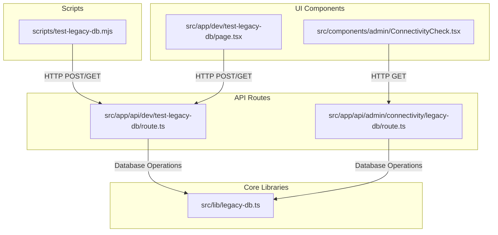
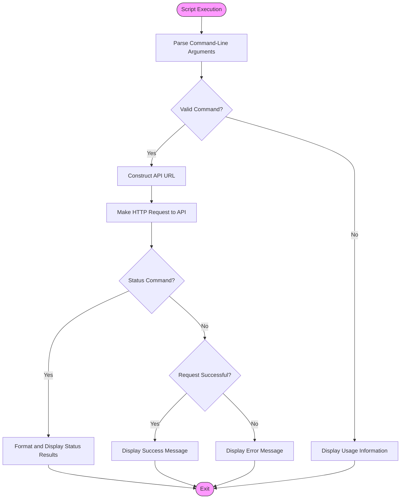
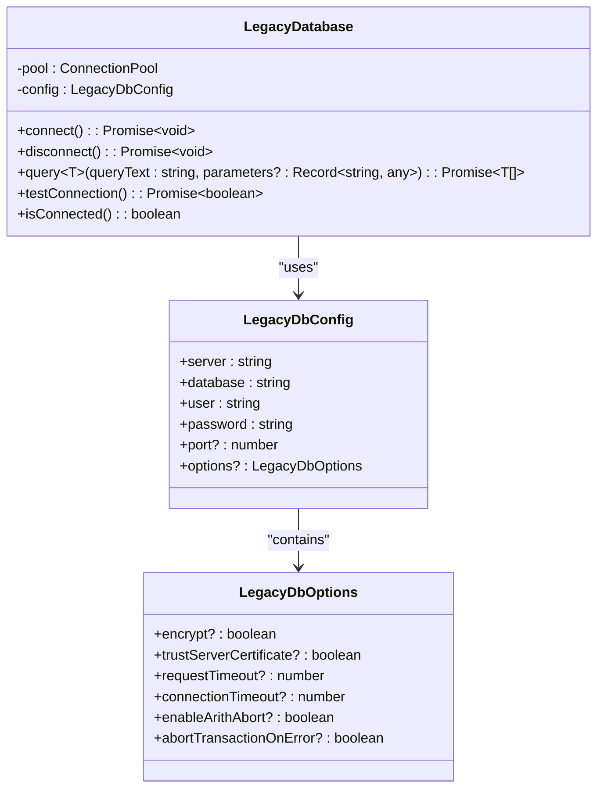
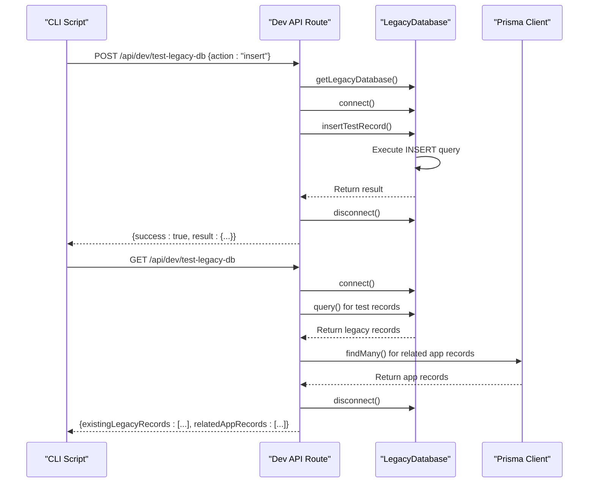

# Legacy Database Connectivity Testing

<cite>
**Referenced Files in This Document**   
- [test-legacy-db.mjs](file://scripts/test-legacy-db.mjs)
- [legacy-db.ts](file://src/lib/legacy-db.ts)
- [route.ts](file://src/app/api/dev/test-legacy-db/route.ts)
- [connectivity/legacy-db/route.ts](file://src/app/api/admin/connectivity/legacy-db/route.ts)
- [ConnectivityCheck.tsx](file://src/components/admin/ConnectivityCheck.tsx)
- [page.tsx](file://src/app/dev/test-legacy-db/page.tsx)
</cite>

## Table of Contents
1. [Introduction](#introduction)
2. [Project Structure and Integration Points](#project-structure-and-integration-points)
3. [Core Components](#core-components)
4. [Architecture Overview](#architecture-overview)
5. [Detailed Component Analysis](#detailed-component-analysis)
6. [Connection Configuration and Environment Variables](#connection-configuration-and-environment-variables)
7. [Query Execution and Schema Validation](#query-execution-and-schema-validation)
8. [Error Handling Mechanisms](#error-handling-mechanisms)
9. [Usage Examples and Command-Line Invocation](#usage-examples-and-command-line-invocation)
10. [Diagnostic Output Interpretation](#diagnostic-output-interpretation)
11. [Troubleshooting Common Connectivity Issues](#troubleshooting-common-connectivity-issues)
12. [Integration with CI/CD and Incident Response](#integration-with-cicd-and-incident-response)

## Introduction
This document provides a comprehensive analysis of the legacy database connectivity testing system in the fund-track application. The system enables verification of connectivity to an MS SQL Server database, validation of schema integrity, and testing of data accessibility from the legacy system. The primary component is the `test-legacy-db.mjs` script, which serves as a command-line interface for executing various test operations against the legacy database. This documentation covers implementation details, usage patterns, error handling, and integration scenarios to support both development and operational use cases.

## Project Structure and Integration Points
The legacy database testing functionality is distributed across multiple directories in the project structure, with clear separation between scripts, API routes, and UI components. The system integrates command-line tools with web-based interfaces, providing multiple access points for database connectivity testing.



**Diagram sources**
- [test-legacy-db.mjs](file://scripts/test-legacy-db.mjs)
- [route.ts](file://src/app/api/dev/test-legacy-db/route.ts)
- [connectivity/legacy-db/route.ts](file://src/app/api/admin/connectivity/legacy-db/route.ts)
- [ConnectivityCheck.tsx](file://src/components/admin/ConnectivityCheck.tsx)
- [page.tsx](file://src/app/dev/test-legacy-db/page.tsx)
- [legacy-db.ts](file://src/lib/legacy-db.ts)

## Core Components
The legacy database connectivity testing system consists of several core components that work together to provide comprehensive testing capabilities. These components include the command-line script, API routes, database connection library, and user interface elements. The system is designed to validate both connectivity and data integrity between the application and the legacy MS SQL Server database.

**Section sources**
- [test-legacy-db.mjs](file://scripts/test-legacy-db.mjs#L1-L104)
- [legacy-db.ts](file://src/lib/legacy-db.ts#L1-L157)
- [route.ts](file://src/app/api/dev/test-legacy-db/route.ts#L1-L341)

## Architecture Overview
The architecture of the legacy database connectivity testing system follows a layered approach with clear separation of concerns. The system exposes both programmatic and user interfaces for testing database connectivity, with all operations ultimately routed through a centralized database connection service.

```mermaid
graph TD
Client[Client] --> |CLI or Web| Interface
subgraph "Interface Layer"
Interface[API Endpoints]
CLI[Command Line Interface]
Web[Web Interface]
end
subgraph "Service Layer"
DevRoute[/api/dev/test-legacy-db\\n(POST/GET)]
AdminRoute[/api/admin/connectivity/legacy-db\\n(GET)]
end
subgraph "Database Layer"
LegacyDB[LegacyDatabase Class]
MSSQL[MS SQL Server]
end
CLI --> DevRoute
Web --> DevRoute
Web --> AdminRoute
DevRoute --> LegacyDB
AdminRoute --> LegacyDB
LegacyDB --> MSSQL
style DevRoute fill:#f9f,stroke:#333
style AdminRoute fill:#f9f,stroke:#333
style LegacyDB fill:#bbf,stroke:#333
```

**Diagram sources**
- [test-legacy-db.mjs](file://scripts/test-legacy-db.mjs#L1-L104)
- [route.ts](file://src/app/api/dev/test-legacy-db/route.ts#L1-L341)
- [connectivity/legacy-db/route.ts](file://src/app/api/admin/connectivity/legacy-db/route.ts#L1-L87)
- [legacy-db.ts](file://src/lib/legacy-db.ts#L1-L157)

## Detailed Component Analysis

### test-legacy-db.mjs Script Analysis
The `test-legacy-db.mjs` script serves as a command-line interface for testing legacy database operations. It provides four distinct commands: insert, delete, cleanup, and status, each corresponding to specific test scenarios for validating database connectivity and data integrity.



**Diagram sources**
- [test-legacy-db.mjs](file://scripts/test-legacy-db.mjs#L1-L104)

**Section sources**
- [test-legacy-db.mjs](file://scripts/test-legacy-db.mjs#L1-L104)

### LegacyDatabase Class Analysis
The `LegacyDatabase` class provides the core functionality for connecting to and interacting with the MS SQL Server database. It encapsulates connection management, query execution, and error handling in a reusable component that follows the singleton pattern through the `getLegacyDatabase` factory function.



**Diagram sources**
- [legacy-db.ts](file://src/lib/legacy-db.ts#L1-L157)

**Section sources**
- [legacy-db.ts](file://src/lib/legacy-db.ts#L1-L157)

### API Route Implementation Analysis
The API routes provide web-based access to legacy database testing functionality, with separate endpoints for development testing and administrative connectivity checks. The `/api/dev/test-legacy-db` endpoint supports both POST and GET requests for executing test operations and retrieving status information.



**Diagram sources**
- [route.ts](file://src/app/api/dev/test-legacy-db/route.ts#L1-L341)

**Section sources**
- [route.ts](file://src/app/api/dev/test-legacy-db/route.ts#L1-L341)

## Connection Configuration and Environment Variables
The legacy database connectivity system relies on environment variables for configuration, allowing for flexible deployment across different environments without code changes. The configuration includes essential connection parameters and optional settings for security and performance tuning.

**Configuration Parameters**
- `LEGACY_DB_SERVER`: Hostname or IP address of the MS SQL Server
- `LEGACY_DB_DATABASE`: Name of the database to connect to (default: "LeadData2")
- `LEGACY_DB_USER`: Username for authentication
- `LEGACY_DB_PASSWORD`: Password for authentication
- `LEGACY_DB_PORT`: Port number (default: 1433)
- `LEGACY_DB_ENCRYPT`: Whether to use encryption (true/false)
- `LEGACY_DB_TRUST_CERT`: Whether to trust server certificate (true/false)
- `LEGACY_DB_REQUEST_TIMEOUT`: Query timeout in milliseconds (default: 30000)
- `LEGACY_DB_CONNECTION_TIMEOUT`: Connection timeout in milliseconds (default: 15000)

The system implements sensible defaults for optional parameters while requiring essential credentials through environment variables. The configuration is centralized in the `getLegacyDatabase` function, which creates a singleton instance of the `LegacyDatabase` class with the configured settings.

**Section sources**
- [legacy-db.ts](file://src/lib/legacy-db.ts#L130-L157)
- [connectivity/legacy-db/route.ts](file://src/app/api/admin/connectivity/legacy-db/route.ts#L69-L73)

## Query Execution and Schema Validation
The system implements robust query execution mechanisms with parameterized queries to prevent SQL injection and ensure data integrity. The testing framework validates schema integrity by using a comprehensive set of test record values that match the expected schema of the legacy database.

**Default Test Record Structure**
```json
{
  "CampaignID": 11302,
  "SourceID": 6343,
  "PublisherID": 40235,
  "SubID": "TEST",
  "FirstName": "TEST",
  "LastName": "TEST",
  "Email": "ARDABASOGLU@GMAIL.COM",
  "Phone": "+15005550006",
  "Address": "1260 NW 133 AVE",
  "City": "Fort Lauderdale",
  "State": "FL",
  "ZipCode": "33323",
  "Country": "USA",
  "TestLead": 1,
  "NetworkID": 10000,
  "LeadCost": 0.00,
  "Currency": "USD",
  "Payin": 0.00,
  "PayOutType": 1,
  "CurrencyIn": "USD"
}
```

The system validates schema integrity through several mechanisms:
1. **Insert Operation**: Attempts to insert a test record with all required fields
2. **Select Operation**: Queries for existing test records using all field values as filters
3. **Delete Operation**: Removes test records using the same field criteria
4. **Status Check**: Verifies the presence and consistency of test records in both legacy and application databases

The `serializeBigInt` utility function ensures proper handling of BigInt values that may be returned from the database, converting them to strings for JSON serialization.

**Section sources**
- [route.ts](file://src/app/api/dev/test-legacy-db/route.ts#L20-L54)
- [route.ts](file://src/app/api/dev/test-legacy-db/route.ts#L142-L190)

## Error Handling Mechanisms
The system implements comprehensive error handling at multiple levels to provide meaningful feedback and maintain stability during connectivity testing operations.

**Client-Side Error Handling (test-legacy-db.mjs)**
- Validates command-line arguments and displays usage information for invalid inputs
- Catches network errors during API communication
- Provides formatted output for both successful operations and failures
- Exits with appropriate status codes (1 for errors)

**Server-Side Error Handling (API Routes)**
- Validates request body and returns 400 status for invalid actions
- Catches exceptions during database operations and returns 500 status with error details
- Implements try-catch blocks around all database operations
- Ensures database connections are properly closed even when errors occur

**Database Layer Error Handling (LegacyDatabase)**
- Validates connection state before query execution
- Provides descriptive error messages for connection failures
- Implements connection pooling with proper cleanup
- Includes both high-level connection testing and low-level query execution error handling

The error handling system follows a consistent pattern of logging errors for debugging while returning user-friendly messages that indicate the nature of the problem without exposing sensitive implementation details.

**Section sources**
- [test-legacy-db.mjs](file://scripts/test-legacy-db.mjs#L80-L104)
- [route.ts](file://src/app/api/dev/test-legacy-db/route.ts#L55-L103)
- [legacy-db.ts](file://src/lib/legacy-db.ts#L40-L54)

## Usage Examples and Command-Line Invocation
The `test-legacy-db.mjs` script provides a simple command-line interface for testing legacy database connectivity. The script requires specific environment variables to be set before execution.

**Prerequisites**
```bash
export LEGACY_DB_SERVER="your-server-address"
export LEGACY_DB_DATABASE="LeadData2"
export LEGACY_DB_USER="your-username"
export LEGACY_DB_PASSWORD="your-password"
export LEGACY_DB_PORT="1433"
```

**Command Examples**
```bash
# Insert a test record into the legacy database
node scripts/test-legacy-db.mjs insert

# Delete test records from both legacy and application databases
node scripts/test-legacy-db.mjs delete

# Cleanup related records from the application database only
node scripts/test-legacy-db.mjs cleanup

# Check current test records in both databases
node scripts/test-legacy-db.mjs status
```

**Expected Success Output (insert command)**
```
Executing insert operation...
✅ Success!
Action: insert
Timestamp: 2025-08-26T10:30:45.123Z

Result Details:
{
  "message": "Test record inserted successfully",
  "newLeadId": 12345,
  "insertedValues": {
    "CampaignID": 11302,
    "SourceID": 6343,
    "PublisherID": 40235,
    "SubID": "TEST",
    "FirstName": "TEST",
    "LastName": "TEST",
    "Email": "ARDABASOGLU@GMAIL.COM",
    "Phone": "+15005550006",
    "Address": "1260 NW 133 AVE",
    "City": "Fort Lauderdale",
    "State": "FL",
    "ZipCode": "33323",
    "Country": "USA",
    "TestLead": 1,
    "NetworkID": 10000,
    "LeadCost": 0,
    "Currency": "USD",
    "Payin": 0,
    "PayOutType": 1,
    "CurrencyIn": "USD"
  }
}
```

**Expected Failure Output (connection error)**
```
Executing insert operation...
❌ Network error: fetch failed
```

**Status Command Output**
```
Executing status operation...
📊 Current Status:
================
Legacy Database Records: 1
App Database Records: 1

🗄️ Legacy Records:
  1. Lead ID: 12345, Campaign: 11302, Created: 8/26/2025, 10:30:45 AM

📱 App Records:
  1. App ID: clxyz123, Legacy ID: 12345, Status: NEW
```

**Section sources**
- [test-legacy-db.mjs](file://scripts/test-legacy-db.mjs#L10-L35)
- [test-legacy-db.mjs](file://scripts/test-legacy-db.mjs#L80-L104)

## Diagnostic Output Interpretation
The diagnostic output from the legacy database testing system provides comprehensive information for assessing connectivity and data integrity. Understanding the output format is essential for effective troubleshooting and validation.

**Success Output Components**
- **Status Indicator**: ✅ emoji indicates successful operation
- **Action**: The command that was executed (insert, delete, cleanup, status)
- **Timestamp**: ISO 8601 formatted timestamp of when the operation completed
- **Result Details**: JSON-formatted details of the operation result, including any generated IDs or affected record counts

**Failure Output Components**
- **Status Indicator**: ❌ emoji indicates failed operation
- **Error Message**: Descriptive text explaining the nature of the failure
- **Details**: Additional context about the error, when available

**Status Command Output Components**
- **Record Counts**: Number of test records found in both legacy and application databases
- **Legacy Records**: Detailed list of matching records in the legacy database, including Lead ID, Campaign ID, and creation timestamp
- **App Records**: Detailed list of related records in the application database, including App ID, Legacy ID, and status

The system uses consistent formatting and emoji indicators to make the output easily scannable, allowing users to quickly assess the results of connectivity tests.

**Section sources**
- [test-legacy-db.mjs](file://scripts/test-legacy-db.mjs#L80-L104)
- [route.ts](file://src/app/api/dev/test-legacy-db/route.ts#L105-L139)

## Troubleshooting Common Connectivity Issues
This section provides guidance for diagnosing and resolving common issues encountered when testing legacy database connectivity.

**Network Timeouts**
- **Symptoms**: "Network error: fetch failed" or connection timeout messages
- **Causes**: Firewall restrictions, network latency, incorrect server address or port
- **Solutions**: 
  - Verify network connectivity to the database server
  - Check firewall rules to ensure port 1433 (or configured port) is open
  - Validate the LEGACY_DB_SERVER and LEGACY_DB_PORT environment variables
  - Increase LEGACY_DB_CONNECTION_TIMEOUT and LEGACY_DB_REQUEST_TIMEOUT values

**Authentication Failures**
- **Symptoms**: "Failed to connect to legacy database" with login-related error messages
- **Causes**: Incorrect username or password, account locked or disabled, insufficient privileges
- **Solutions**:
  - Verify LEGACY_DB_USER and LEGACY_DB_PASSWORD environment variables
  - Test credentials using a database client tool
  - Confirm the database user has appropriate permissions
  - Check if the account has expired or been locked

**Schema Mismatches**
- **Symptoms**: Query failures, missing columns, or data type conversion errors
- **Causes**: Database schema changes, version mismatches between environments
- **Solutions**:
  - Compare the current schema with the expected schema used in test queries
  - Update the DEFAULT_TEST_RECORD and query statements to match the current schema
  - Verify that all required columns exist and have compatible data types
  - Check for recent migrations that may have altered the schema

**Additional Troubleshooting Steps**
1. Use the `status` command to verify the current state of test records
2. Check the application logs for detailed error messages
3. Test basic connectivity using the admin connectivity check UI
4. Verify that the MS SQL Server instance is running and accessible
5. Confirm that the database name specified in LEGACY_DB_DATABASE exists and is accessible

**Section sources**
- [legacy-db.ts](file://src/lib/legacy-db.ts#L40-L54)
- [route.ts](file://src/app/api/dev/test-legacy-db/route.ts#L55-L103)
- [test-legacy-db.mjs](file://scripts/test-legacy-db.mjs#L80-L104)

## Integration with CI/CD and Incident Response
The legacy database connectivity testing system is designed to integrate seamlessly with CI/CD pipelines and incident response procedures, providing automated validation of database connectivity.

**CI/CD Pipeline Integration**
The test script can be incorporated into continuous integration workflows to verify database connectivity during deployment:

```yaml
# Example CI/CD pipeline step
- name: Test Legacy Database Connectivity
  run: |
    export LEGACY_DB_SERVER=${{ secrets.LEGACY_DB_SERVER }}
    export LEGACY_DB_DATABASE=${{ secrets.LEGACY_DB_DATABASE }}
    export LEGACY_DB_USER=${{ secrets.LEGACY_DB_USER }}
    export LEGACY_DB_PASSWORD=${{ secrets.LEGACY_DB_PASSWORD }}
    node scripts/test-legacy-db.mjs status
```

This integration ensures that database connectivity is validated before and after deployments, helping to prevent issues caused by configuration changes or network reconfigurations.

**Incident Response Usage**
During database connectivity incidents, the testing system provides several valuable capabilities:
- **Rapid Assessment**: The `status` command quickly reveals the current state of test records in both databases
- **Isolation Testing**: The `insert` and `delete` commands can verify write operations and data consistency
- **Automated Diagnostics**: The structured output can be parsed by monitoring systems to detect and alert on connectivity issues
- **Recovery Verification**: After resolving an incident, the tests can confirm that full read/write functionality has been restored

The system's dual interface (command-line and web-based) allows operations teams to use the most appropriate tool for the situation, whether responding to alerts in a terminal or investigating issues through a user-friendly web interface.

**Section sources**
- [test-legacy-db.mjs](file://scripts/test-legacy-db.mjs)
- [connectivity/legacy-db/route.ts](file://src/app/api/admin/connectivity/legacy-db/route.ts)
- [ConnectivityCheck.tsx](file://src/components/admin/ConnectivityCheck.tsx)