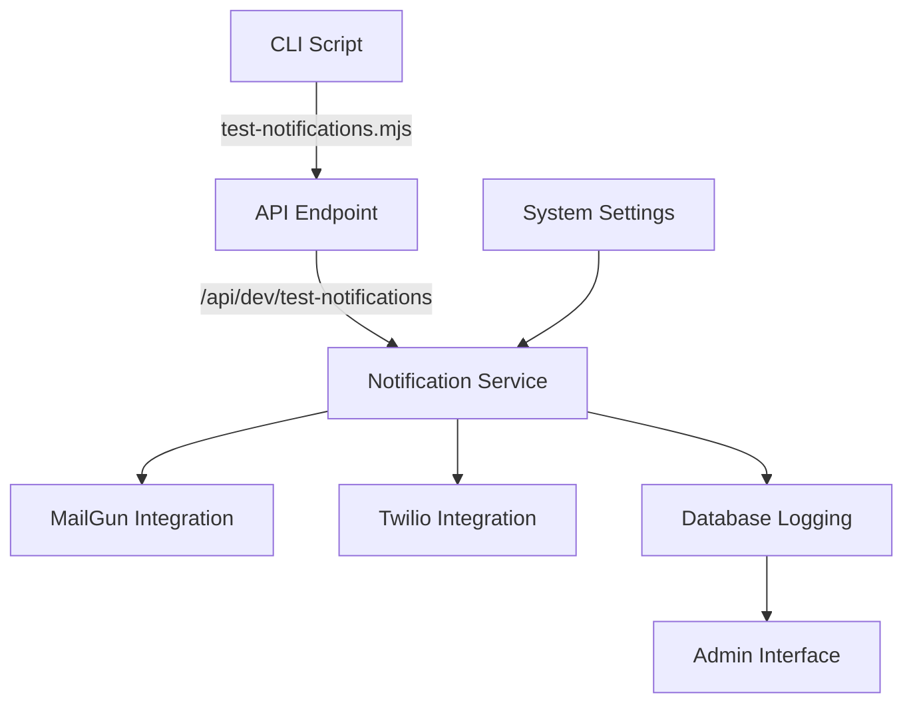
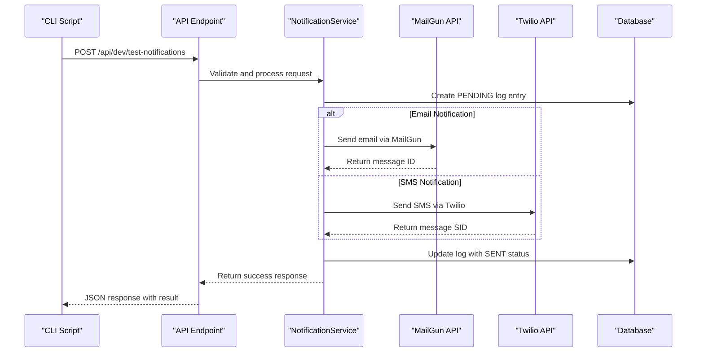
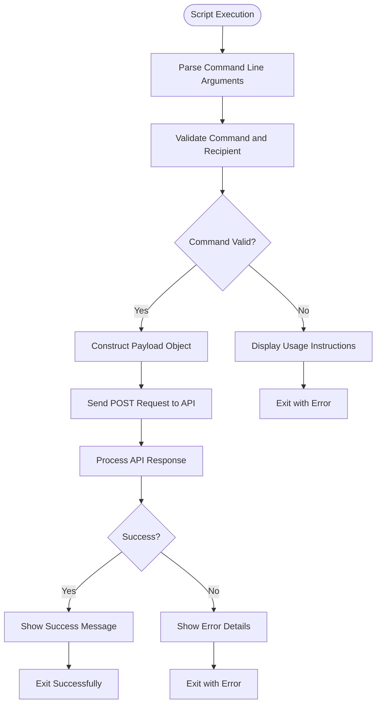
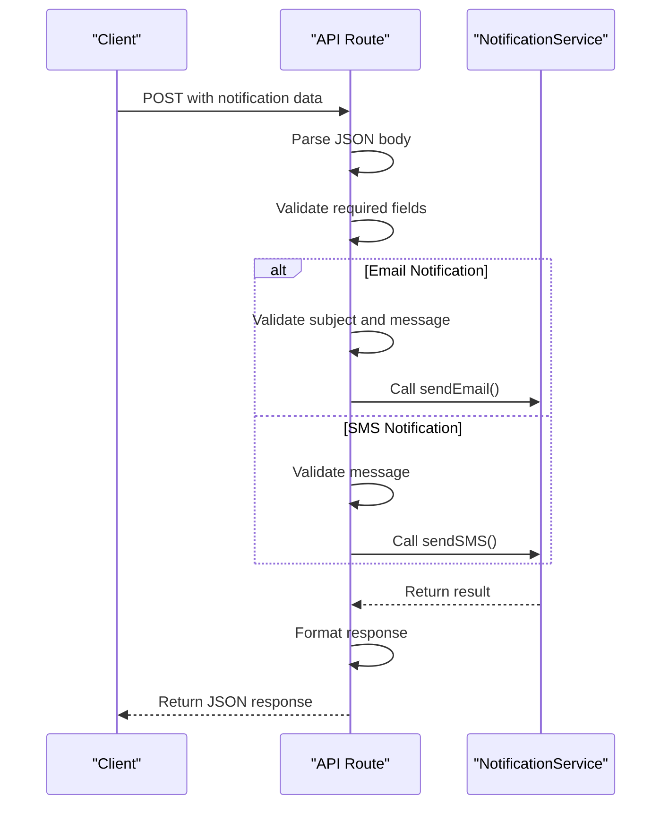
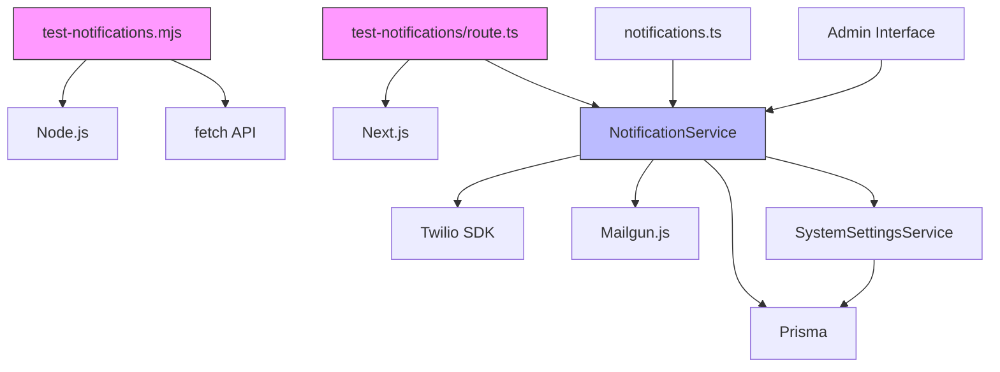

# Notification Integration Testing

<cite>
**Referenced Files in This Document**   
- [test-notifications.mjs](file://scripts/test-notifications.mjs)
- [notifications.ts](file://src/lib/notifications.ts)
- [NotificationService.ts](file://src/services/NotificationService.ts)
- [test-notifications/route.ts](file://src/app/api/dev/test-notifications/route.ts)
- [SystemSettingsService.ts](file://src/services/SystemSettingsService.ts)
- [schema.prisma](file://prisma/schema.prisma)
</cite>

## Table of Contents
1. [Introduction](#introduction)
2. [Project Structure](#project-structure)
3. [Core Components](#core-components)
4. [Architecture Overview](#architecture-overview)
5. [Detailed Component Analysis](#detailed-component-analysis)
6. [Dependency Analysis](#dependency-analysis)
7. [Performance Considerations](#performance-considerations)
8. [Troubleshooting Guide](#troubleshooting-guide)
9. [Conclusion](#conclusion)

## Introduction
This document provides comprehensive documentation for the notification integration testing system in the Fund Track application. The system enables verification of Twilio and MailGun integrations through a dedicated testing script and API endpoint. The documentation covers the implementation of test message construction, delivery pipeline execution, response validation, and comprehensive error handling. It also details security considerations, rate limiting policies, and best practices for safely configuring test recipients across different environments.

## Project Structure
The notification testing functionality is distributed across multiple directories in the project structure:
- **scripts/**: Contains the CLI script `test-notifications.mjs` for executing notification tests
- **src/lib/**: Houses the `notifications.ts` file with helper functions for common notification scenarios
- **src/services/**: Contains the core `NotificationService.ts` implementation and `SystemSettingsService.ts`
- **src/app/api/dev/**: Includes the API route handler `test-notifications/route.ts`
- **prisma/**: Contains the database schema and migrations for notification logging



**Diagram sources**
- [test-notifications.mjs](file://scripts/test-notifications.mjs)
- [test-notifications/route.ts](file://src/app/api/dev/test-notifications/route.ts)
- [NotificationService.ts](file://src/services/NotificationService.ts)

**Section sources**
- [test-notifications.mjs](file://scripts/test-notifications.mjs)
- [test-notifications/route.ts](file://src/app/api/dev/test-notifications/route.ts)

## Core Components
The notification testing system consists of several core components that work together to enable comprehensive integration testing. The primary components include the CLI testing script, the API route handler, the NotificationService class, and the underlying database schema for tracking delivery status. These components implement a robust delivery pipeline with retry logic, rate limiting, and comprehensive error handling.

**Section sources**
- [test-notifications.mjs](file://scripts/test-notifications.mjs#L1-L101)
- [NotificationService.ts](file://src/services/NotificationService.ts#L1-L471)
- [test-notifications/route.ts](file://src/app/api/dev/test-notifications/route.ts#L1-L109)

## Architecture Overview
The notification integration testing architecture follows a layered approach with clear separation of concerns. The system begins with a CLI script that sends HTTP requests to a dedicated API endpoint. This endpoint processes the request and delegates to the NotificationService, which handles the actual integration with Twilio and MailGun services. Throughout the process, comprehensive logging ensures visibility into delivery status and potential issues.



**Diagram sources**
- [test-notifications.mjs](file://scripts/test-notifications.mjs#L50-L101)
- [test-notifications/route.ts](file://src/app/api/dev/test-notifications/route.ts#L1-L109)
- [NotificationService.ts](file://src/services/NotificationService.ts#L115-L223)

## Detailed Component Analysis

### CLI Testing Script Analysis
The `test-notifications.mjs` script provides a command-line interface for testing notification integrations. It accepts commands for email and SMS notifications with required parameters and validates input before making API calls.



**Diagram sources**
- [test-notifications.mjs](file://scripts/test-notifications.mjs#L1-L101)

**Section sources**
- [test-notifications.mjs](file://scripts/test-notifications.mjs#L1-L101)

### Notification Service Implementation
The NotificationService class implements the core delivery pipeline for both email and SMS notifications, with comprehensive error handling and retry logic.

```mermaid
classDiagram
class NotificationService {
-twilioClient : Twilio | null
-mailgunClient : any | null
-config : NotificationConfig
+sendEmail(notification : EmailNotification) : Promise~NotificationResult~
+sendSMS(notification : SMSNotification) : Promise~NotificationResult~
-sendEmailInternal(notification : EmailNotification) : Promise~NotificationResult~
-sendSMSInternal(notification : SMSNotification) : Promise~NotificationResult~
-executeWithRetry~T~(fn : () => Promise~T~, operationType : string) : Promise~T~
-checkRateLimit(recipient : string, type : 'EMAIL' | 'SMS', leadId? : number) : Promise~{ allowed : boolean; reason? : string }~
+validateConfiguration() : Promise~boolean~
}
class NotificationConfig {
+twilio : TwilioConfig
+mailgun : MailgunConfig
+retryConfig : RetryConfig
}
class TwilioConfig {
+accountSid : string
+authToken : string
+phoneNumber : string
}
class MailgunConfig {
+apiKey : string
+domain : string
+fromEmail : string
}
class RetryConfig {
+maxRetries : number
+baseDelay : number
+maxDelay : number
}
class EmailNotification {
+to : string
+subject : string
+text : string
+html? : string
+leadId? : number
}
class SMSNotification {
+to : string
+message : string
+leadId? : number
}
class NotificationResult {
+success : boolean
+externalId? : string
+error? : string
}
NotificationService --> NotificationConfig : "has"
NotificationService --> EmailNotification : "sends"
NotificationService --> SMSNotification : "sends"
NotificationService --> NotificationResult : "returns"
```

**Diagram sources**
- [NotificationService.ts](file://src/services/NotificationService.ts#L1-L471)

**Section sources**
- [NotificationService.ts](file://src/services/NotificationService.ts#L1-L471)

### API Route Handler Analysis
The API route handler processes incoming test notification requests, validates parameters, and orchestrates the delivery process through the NotificationService.



**Diagram sources**
- [test-notifications/route.ts](file://src/app/api/dev/test-notifications/route.ts#L1-L109)

**Section sources**
- [test-notifications/route.ts](file://src/app/api/dev/test-notifications/route.ts#L1-L109)

## Dependency Analysis
The notification testing system has several key dependencies that enable its functionality:



**Diagram sources**
- [test-notifications.mjs](file://scripts/test-notifications.mjs)
- [test-notifications/route.ts](file://src/app/api/dev/test-notifications/route.ts)
- [NotificationService.ts](file://src/services/NotificationService.ts)

**Section sources**
- [test-notifications.mjs](file://scripts/test-notifications.mjs)
- [test-notifications/route.ts](file://src/app/api/dev/test-notifications/route.ts)
- [NotificationService.ts](file://src/services/NotificationService.ts)

## Performance Considerations
The notification service implements several performance optimizations:
- **Lazy client initialization**: Twilio and MailGun clients are initialized only when needed
- **Exponential backoff retry logic**: Failed notifications are retried with increasing delays to avoid overwhelming external services
- **Rate limiting**: Prevents spam by limiting notifications to 2 per hour per recipient and 10 per day per lead
- **Database indexing**: The notification_log table has optimized indexes for querying by creation time and ID

The retry configuration defaults to 3 attempts with a base delay of 1 second, increasing exponentially up to a maximum of 30 seconds between attempts. This balances reliability with system responsiveness.

**Section sources**
- [NotificationService.ts](file://src/services/NotificationService.ts#L297-L349)
- [schema.prisma](file://prisma/schema.prisma#L200-L208)
- [NotificationService.ts](file://src/services/NotificationService.ts#L351-L403)

## Troubleshooting Guide
This section provides guidance for common issues encountered when testing notification integrations.

### API Authentication Failures
Common causes and solutions:
- **Missing environment variables**: Ensure all required variables are set in .env.local
  - Email: MAILGUN_API_KEY, MAILGUN_DOMAIN, MAILGUN_FROM_EMAIL
  - SMS: TWILIO_ACCOUNT_SID, TWILIO_AUTH_TOKEN, TWILIO_PHONE_NUMBER
- **Invalid credentials**: Verify the credentials are correct and have appropriate permissions
- **Service disabled in settings**: Check that email_notifications_enabled and sms_notifications_enabled are set to true in the database

### Rate Limiting Issues
The system enforces rate limits to prevent spam:
- Maximum of 2 notifications per hour to the same recipient
- Maximum of 10 notifications per day to the same lead
- If rate limits are exceeded, the service returns a descriptive error message

### Message Content Validation Errors
Common content issues:
- **Email without subject or message**: Both are required fields
- **SMS without message**: Message content is required
- **Invalid recipient format**: Ensure email addresses are valid and phone numbers include country code

### Testing in Different Environments
Security considerations for safe testing:
- **Use test recipients**: Configure TEST_EMAIL in test scripts to avoid sending to real users
- **Environment-specific configuration**: Use different .env files for development, staging, and production
- **Disable production notifications during testing**: Temporarily set email/sms_enabled to false when needed

### Common Error Scenarios
| Error Type | Cause | Solution |
|-----------|------|----------|
| "Twilio client not initialized" | Missing Twilio credentials | Verify TWILIO_ACCOUNT_SID and TWILIO_AUTH_TOKEN |
| "Mailgun client not initialized" | Missing MailGun API key | Verify MAILGUN_API_KEY is set |
| "Rate limit exceeded" | Too many notifications to same recipient | Wait for rate limit window to expire |
| "Email notifications are disabled" | email_notifications_enabled is false | Update setting in system_settings table |
| "SMS notifications are disabled" | sms_notifications_enabled is false | Update setting in system_settings table |

**Section sources**
- [NotificationService.ts](file://src/services/NotificationService.ts#L243-L295)
- [NotificationService.ts](file://src/services/NotificationService.ts#L351-L403)
- [SystemSettingsService.ts](file://src/services/SystemSettingsService.ts#L1-L351)
- [test-notifications.mjs](file://scripts/test-notifications.mjs#L1-L101)

## Conclusion
The notification integration testing system provides a comprehensive solution for verifying Twilio and MailGun integrations in the Fund Track application. The system's modular architecture, with clear separation between the CLI interface, API endpoint, and core service implementation, enables reliable testing of both email and SMS notification channels. Key features like retry logic, rate limiting, and comprehensive logging ensure robust delivery and easy troubleshooting. The implementation demonstrates best practices in API design, error handling, and security, making it a reliable component of the overall application architecture.