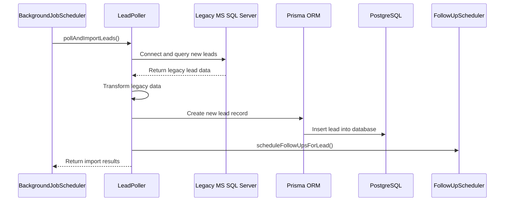
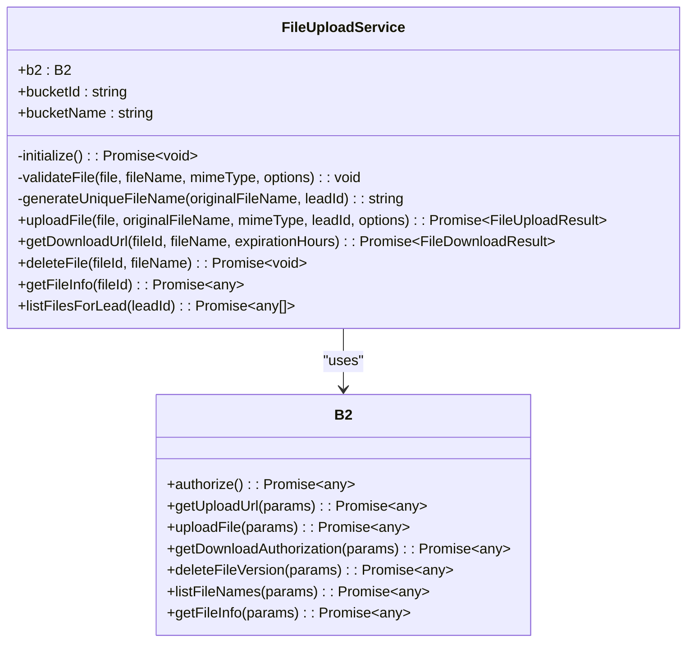
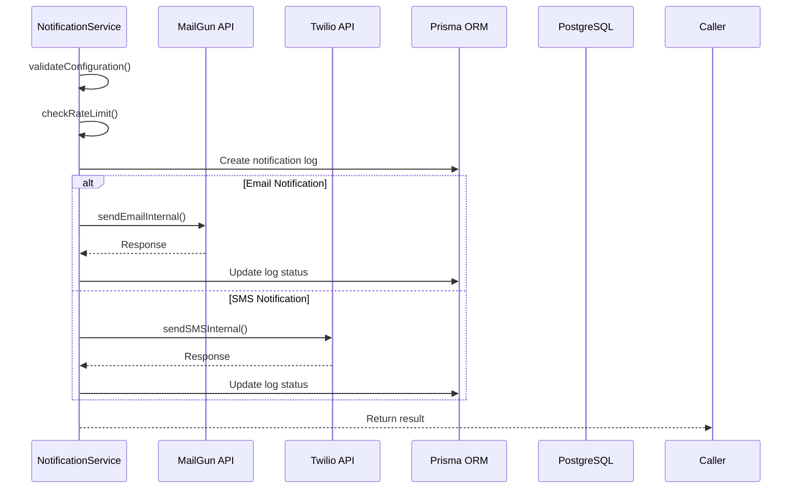
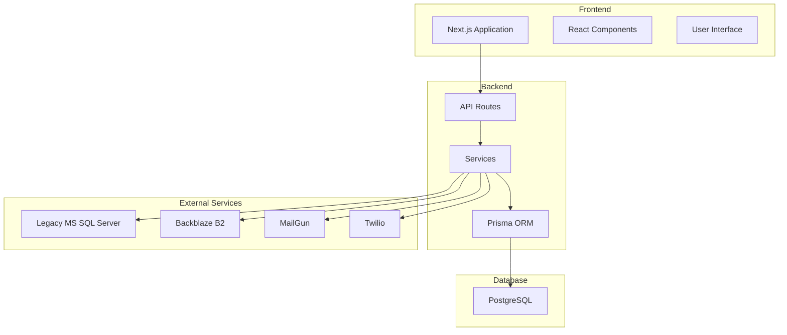
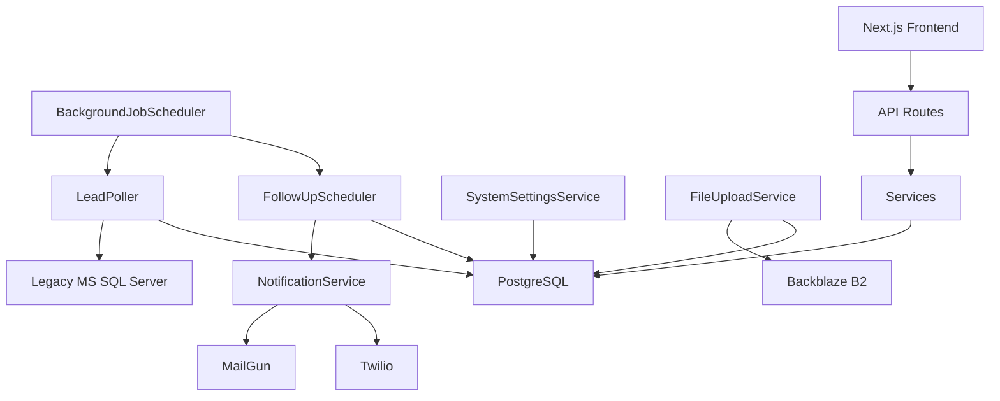
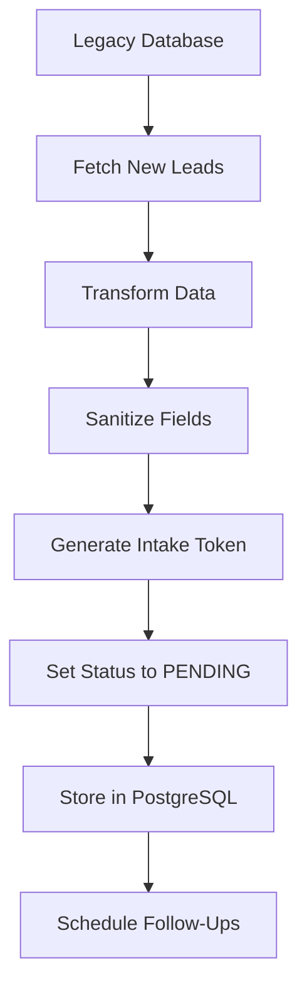
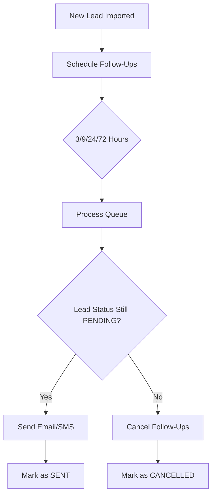
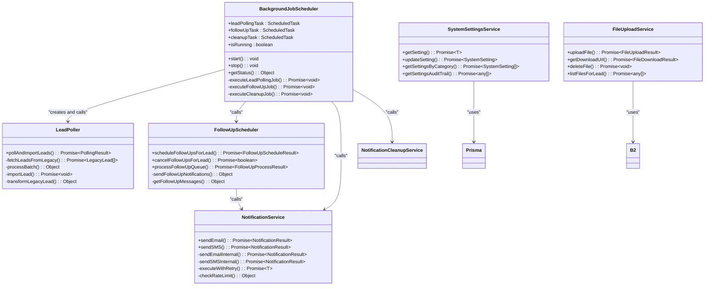

# System Overview

<cite>
**Referenced Files in This Document**   
- [NotificationService.ts](file://src/services/NotificationService.ts)
- [FileUploadService.ts](file://src/services/FileUploadService.ts)
- [LeadPoller.ts](file://src/services/LeadPoller.ts)
- [FollowUpScheduler.ts](file://src/services/FollowUpScheduler.ts)
- [BackgroundJobScheduler.ts](file://src/services/BackgroundJobScheduler.ts)
- [SystemSettingsService.ts](file://src/services/SystemSettingsService.ts)
- [schema.prisma](file://prisma/schema.prisma)
</cite>

## Table of Contents
1. [System Overview](#system-overview)
2. [Core Capabilities](#core-capabilities)
3. [System Architecture](#system-architecture)
4. [User Roles and Workflows](#user-roles-and-workflows)
5. [External Integrations](#external-integrations)
6. [Data Flow and Processing](#data-flow-and-processing)
7. [Operational Environment](#operational-environment)

## Core Capabilities

The fund-track system is a comprehensive lead management platform designed for merchant funding operations. It provides automated workflows for lead acquisition, intake, and follow-up, with robust integration capabilities and document management.

### Automated Lead Import from Legacy MS SQL Server

The system automatically imports leads from a legacy MS SQL Server database through a polling mechanism. The **LeadPoller** service queries campaign-specific tables in the legacy database, transforming and importing new leads into the modern application.

Key features:
- Incremental import based on the highest previously imported lead ID
- Batch processing for efficiency
- Data transformation from legacy format to application format
- Automatic generation of intake tokens for new leads
- Error handling and logging for failed imports

**Diagram sources**
- [LeadPoller.ts](file://src/services/LeadPoller.ts#L21-L497)
- [BackgroundJobScheduler.ts](file://src/services/BackgroundJobScheduler.ts#L8-L458)

**Section sources**
- [LeadPoller.ts](file://src/services/LeadPoller.ts#L21-L497)

### Multi-Step Intake Workflow

The system implements a multi-step intake workflow that guides prospects through the application process. The workflow is token-based, ensuring secure access to the application form.

Key components:
- Token-based authentication via **TokenService**
- Two-step form process (personal/business information)
- Progress tracking with timestamps for each step
- Status management throughout the intake process

The workflow begins when a prospect receives a secure link with an intake token. The system validates the token and presents the appropriate form step based on completion status.

### Document Management via Backblaze B2

The system uses Backblaze B2 for secure document storage, managed through the **FileUploadService**. This service handles all aspects of file management including upload, download, and deletion.

Key features:
- Secure file upload with validation
- Unique file naming to prevent conflicts
- Temporary download URLs with expiration
- File type and size restrictions
- Integration with lead records

**Diagram sources**
- [FileUploadService.ts](file://src/services/FileUploadService.ts#L24-L302)

**Section sources**
- [FileUploadService.ts](file://src/services/FileUploadService.ts#L24-L302)

### Automated Email/SMS Notifications

The system implements automated notifications through **MailGun** for email and **Twilio** for SMS, managed by the **NotificationService**. These notifications are triggered at key points in the lead lifecycle.

Key features:
- Configurable notification settings
- Rate limiting to prevent spam
- Retry logic with exponential backoff
- Comprehensive logging and error handling
- Integration with follow-up scheduling

**Diagram sources**
- [NotificationService.ts](file://src/services/NotificationService.ts#L47-L468)

**Section sources**
- [NotificationService.ts](file://src/services/NotificationService.ts#L47-L468)

## System Architecture

The fund-track system follows a modern full-stack architecture with a Next.js frontend, Node.js backend services, and Prisma ORM for database access.

### High-Level Architecture

**Diagram sources**
- [schema.prisma](file://prisma/schema.prisma)
- [BackgroundJobScheduler.ts](file://src/services/BackgroundJobScheduler.ts#L8-L458)

### Component Interactions

The system architecture combines several key components that work together to manage the lead lifecycle:

1. **BackgroundJobScheduler**: Orchestrates periodic tasks including lead polling and follow-up processing
2. **LeadPoller**: Imports leads from the legacy system on a scheduled basis
3. **FollowUpScheduler**: Manages automated follow-up communications
4. **NotificationService**: Handles email and SMS delivery
5. **FileUploadService**: Manages document storage in Backblaze B2
6. **SystemSettingsService**: Provides configuration management with caching

These components interact through a combination of direct method calls and database state changes, creating a cohesive system for lead management.

**Diagram sources**
- [BackgroundJobScheduler.ts](file://src/services/BackgroundJobScheduler.ts#L8-L458)
- [FollowUpScheduler.ts](file://src/services/FollowUpScheduler.ts#L19-L486)
- [SystemSettingsService.ts](file://src/services/SystemSettingsService.ts#L29-L336)

## User Roles and Workflows

The system supports three primary user roles, each with distinct workflows and permissions.

### Prospect Workflow

Prospects are potential merchants who have expressed interest in funding. Their workflow is primarily self-service through a token-based intake process.

1. Receive secure link via email/SMS with intake token
2. Complete Step 1 of the application (personal information)
3. Complete Step 2 of the application (business information)
4. Upload required documents
5. Receive confirmation of application submission

The system guides prospects through this process with automated follow-up notifications at predefined intervals (3, 9, 24, and 72 hours) if the application is not completed.

### Staff Workflow

Staff members manage leads and support the intake process. Their workflow includes:

1. Access the dashboard to view leads
2. Filter and search leads by various criteria
3. View detailed lead information including status history
4. Add notes to lead records
5. Monitor document uploads
6. Manually trigger follow-ups if needed

Staff access is controlled through authentication and role-based permissions, ensuring data privacy and security.

### Administrator Workflow

Administrators have full system access and additional configuration capabilities:

1. Manage system settings through the admin interface
2. Configure notification templates and timing
3. Monitor system health and job status
4. View audit logs for setting changes
5. Manage user accounts and permissions
6. Access comprehensive metrics and reporting

Administrators can also trigger background jobs manually for testing or troubleshooting purposes.

## External Integrations

The system integrates with several external services to provide a complete lead management solution.

### Legacy MS SQL Server Integration

The system connects to a legacy MS SQL Server database to import leads. This integration is handled by the **LeadPoller** service, which:

- Connects to the legacy database using configured credentials
- Queries campaign-specific tables for new leads
- Transforms legacy data into the application's data model
- Imports leads into the PostgreSQL database

The integration is designed to be resilient, with error handling and logging to ensure data integrity.

### Backblaze B2 Integration

Document storage is provided by Backblaze B2, accessed through the **FileUploadService**. This integration:

- Stores all uploaded documents securely in the cloud
- Generates temporary download URLs with expiration
- Validates file types and sizes before upload
- Associates documents with specific leads
- Provides methods for listing and deleting files

### MailGun Integration

Email notifications are sent through MailGun, managed by the **NotificationService**. This integration:

- Sends automated follow-up emails to prospects
- Provides configurable email templates
- Implements rate limiting to prevent spam
- Includes retry logic for failed deliveries
- Logs all email activity for auditing

### Twilio Integration

SMS notifications are sent through Twilio, also managed by the **NotificationService**. This integration:

- Sends text message reminders to prospects
- Supports international phone numbers
- Implements rate limiting
- Includes delivery confirmation
- Logs all SMS activity

## Data Flow and Processing

The system processes data through several key workflows that transform raw leads into complete applications.

### Lead Import and Transformation

When leads are imported from the legacy system, they undergo a transformation process:

1. Query the legacy database for leads with IDs greater than the last imported lead
2. Transform the legacy data structure into the application's data model
3. Sanitize and validate all fields
4. Generate a unique intake token
5. Set initial status to PENDING
6. Store the lead in the PostgreSQL database

**Diagram sources**
- [LeadPoller.ts](file://src/services/LeadPoller.ts#L21-L497)

**Section sources**
- [LeadPoller.ts](file://src/services/LeadPoller.ts#L21-L497)

### Follow-Up Processing

The follow-up system ensures prospects are reminded to complete their applications:

1. When a new lead is imported, four follow-ups are scheduled (3, 9, 24, and 72 hours)
2. The **FollowUpScheduler** processes the queue every 5 minutes
3. For each due follow-up, notifications are sent via email and/or SMS
4. If a lead completes the application, pending follow-ups are cancelled
5. All follow-up activity is logged for auditing

**Diagram sources**
- [FollowUpScheduler.ts](file://src/services/FollowUpScheduler.ts#L19-L486)

**Section sources**
- [FollowUpScheduler.ts](file://src/services/FollowUpScheduler.ts#L19-L486)

## Operational Environment

The system is designed for reliable operation in a production environment with several key assumptions and requirements.

### Deployment Assumptions

- **Runtime Environment**: Node.js 18+
- **Database**: PostgreSQL 14+
- **Frontend**: Next.js 13+ with React 18
- **Storage**: Backblaze B2 bucket
- **External Services**: MailGun, Twilio, and legacy MS SQL Server access

### Operational Goals

The system is designed to meet the following operational goals:

1. **Reliability**: Background jobs run on a regular schedule with error handling and logging
2. **Scalability**: The architecture supports increased lead volume through efficient batch processing
3. **Maintainability**: Clear separation of concerns and comprehensive logging
4. **Security**: Token-based access control and secure storage of sensitive data
5. **Auditability**: Comprehensive logging of all system actions and changes

### Monitoring and Maintenance

The system includes several features for monitoring and maintenance:

- **Health Checks**: API endpoints for liveness and readiness probes
- **Job Status**: Dashboard for monitoring background job execution
- **Notification Logs**: Complete record of all email and SMS notifications
- **Settings Audit Trail**: History of configuration changes
- **Automated Cleanup**: Regular cleanup of old notification and follow-up records

The **BackgroundJobScheduler** manages three key background processes:
- Lead polling every 15 minutes
- Follow-up processing every 5 minutes
- Daily cleanup at 2:00 AM

These schedules are configurable through environment variables, allowing operations to adjust timing based on workload and requirements.

**Diagram sources**
- [BackgroundJobScheduler.ts](file://src/services/BackgroundJobScheduler.ts#L8-L458)
- [LeadPoller.ts](file://src/services/LeadPoller.ts#L21-L497)
- [FollowUpScheduler.ts](file://src/services/FollowUpScheduler.ts#L19-L486)
- [NotificationService.ts](file://src/services/NotificationService.ts#L47-L468)
- [FileUploadService.ts](file://src/services/FileUploadService.ts#L24-L302)
- [SystemSettingsService.ts](file://src/services/SystemSettingsService.ts#L29-L336)

**Section sources**
- [BackgroundJobScheduler.ts](file://src/services/BackgroundJobScheduler.ts#L8-L458)
- [LeadPoller.ts](file://src/services/LeadPoller.ts#L21-L497)
- [FollowUpScheduler.ts](file://src/services/FollowUpScheduler.ts#L19-L486)
- [NotificationService.ts](file://src/services/NotificationService.ts#L47-L468)
- [FileUploadService.ts](file://src/services/FileUploadService.ts#L24-L302)
- [SystemSettingsService.ts](file://src/services/SystemSettingsService.ts#L29-L336)