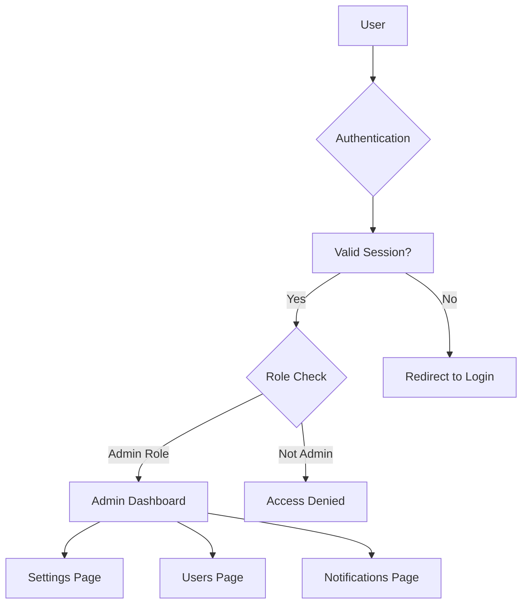
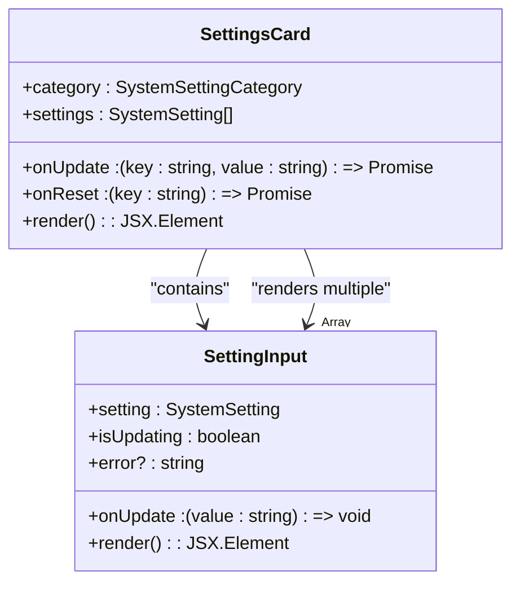
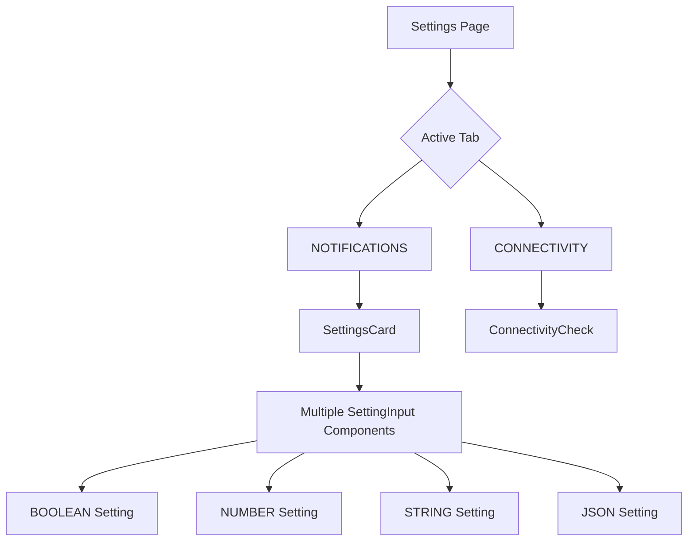
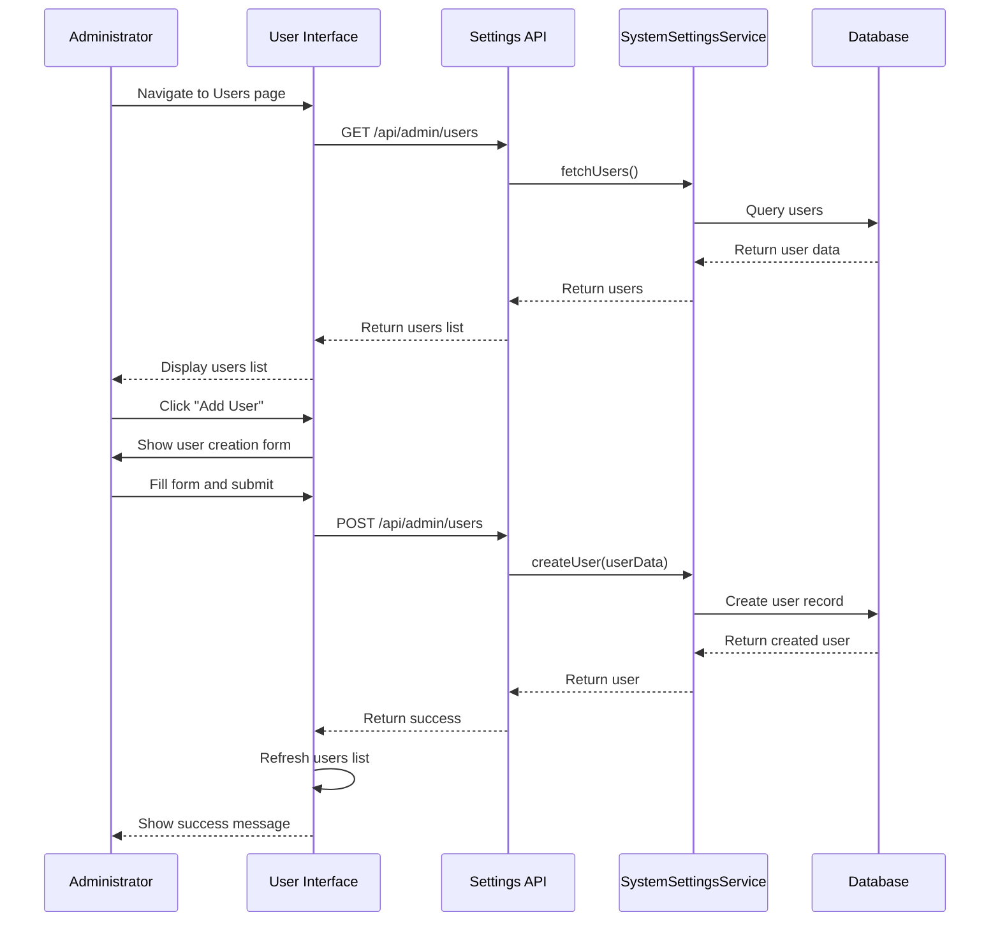
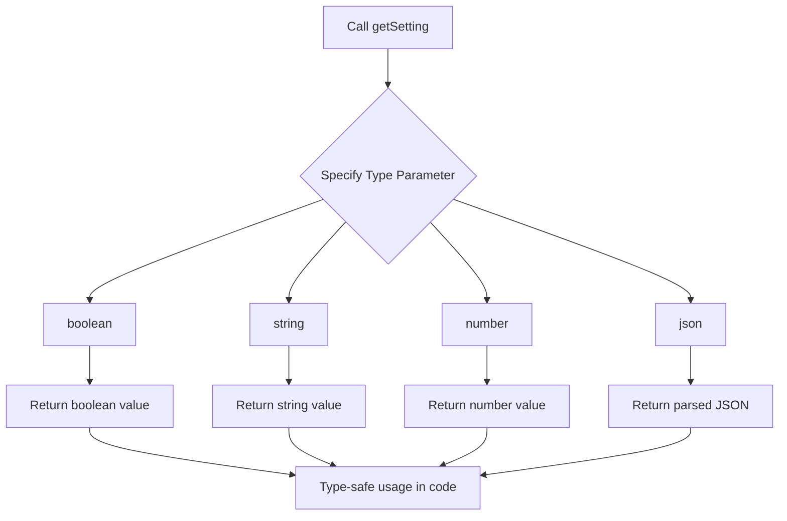
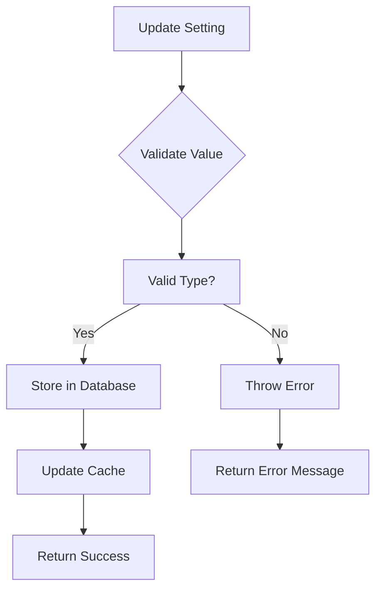
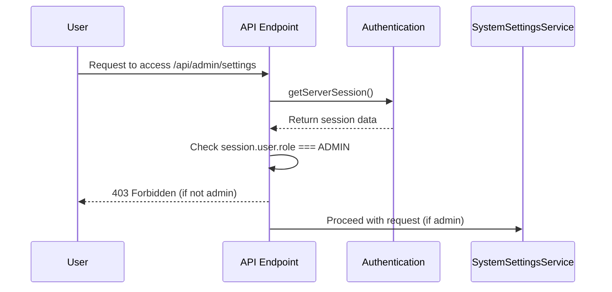

# Administrator System Configuration Workflow

<cite>
**Referenced Files in This Document**   
- [SystemSettingsService.ts](file://src/services/SystemSettingsService.ts)
- [SettingsCard.tsx](file://src/components/admin/SettingsCard.tsx)
- [SettingInput.tsx](file://src/components/admin/SettingInput.tsx)
- [settings/page.tsx](file://src/app/admin/settings/page.tsx)
- [system-settings.ts](file://prisma/seeds/system-settings.ts)
- [route.ts](file://src/app/api/admin/settings/route.ts)
- [users/page.tsx](file://src/app/admin/users/page.tsx)
- [RoleGuard.tsx](file://src/components/auth/RoleGuard.tsx)
</cite>

## Table of Contents
1. [Introduction](#introduction)
2. [Accessing the Admin Panel](#accessing-the-admin-panel)
3. [System Settings Management](#system-settings-management)
4. [User Management](#user-management)
5. [Settings Architecture and Implementation](#settings-architecture-and-implementation)
6. [Security and Audit Logging](#security-and-audit-logging)
7. [Practical Administrative Tasks](#practical-administrative-tasks)
8. [Conclusion](#conclusion)

## Introduction
This document details the administrator system configuration workflow in the fund-track system. It explains how administrators manage system settings, users, and monitor system health through a secure, role-based interface. The system provides type-safe access to configurable settings through the SystemSettingsService, comprehensive audit logging, and intuitive UI components for managing key-value settings with proper validation. The documentation covers the implementation details, security considerations, and practical examples of common administrative tasks.

## Accessing the Admin Panel
Administrators access the admin panel through dedicated routes that enforce role-based access control. The main admin dashboard serves as the central hub for administrative functions, providing navigation to settings, user management, and notification configuration.

The admin panel is protected by the `AdminOnly` component, which ensures only users with the ADMIN role can access administrative functionality. Unauthorized users are redirected or shown access denied messages.



**Diagram sources**
- [page.tsx](file://src/app/admin/page.tsx#L0-L78)
- [RoleGuard.tsx](file://src/components/auth/RoleGuard.tsx#L41-L74)

**Section sources**
- [page.tsx](file://src/app/admin/page.tsx#L0-L78)

## System Settings Management
The system settings interface allows administrators to configure various aspects of the application, including notifications, connectivity, and other system-wide preferences. Settings are organized by category and presented in a user-friendly card-based layout.

### Settings Interface Components
The settings interface is built using two primary components: `SettingsCard` and `SettingInput`. These components work together to provide a consistent and intuitive experience for managing system configurations.



**Diagram sources**
- [SettingsCard.tsx](file://src/components/admin/SettingsCard.tsx#L0-L139)
- [SettingInput.tsx](file://src/components/admin/SettingInput.tsx#L0-L164)

**Section sources**
- [SettingsCard.tsx](file://src/components/admin/SettingsCard.tsx#L0-L139)
- [SettingInput.tsx](file://src/components/admin/SettingInput.tsx#L0-L164)

### Settings Categories and Organization
Settings are organized into categories to improve usability and discoverability. The current implementation includes categories such as NOTIFICATIONS and CONNECTIVITY, with each category containing related settings.

The `SettingsCard` component renders a group of settings belonging to the same category, displaying the category name, description, and individual settings with their respective input controls.



**Diagram sources**
- [settings/page.tsx](file://src/app/admin/settings/page.tsx#L0-L264)

**Section sources**
- [settings/page.tsx](file://src/app/admin/settings/page.tsx#L0-L264)

## User Management
The user management interface enables administrators to create, update, and deactivate staff accounts. This functionality is critical for onboarding new team members and managing access to the system.

### User Management Workflow
The user management workflow follows a standard CRUD (Create, Read, Update, Delete) pattern, with appropriate validation and error handling at each step.



**Diagram sources**
- [users/page.tsx](file://src/app/admin/users/page.tsx#L0-L493)
- [route.ts](file://src/app/api/admin/users/route.ts#L0-L106)

**Section sources**
- [users/page.tsx](file://src/app/admin/users/page.tsx#L0-L493)

### User Creation and Modification
Administrators can create new user accounts and modify existing ones through a modal interface. The process includes validation of required fields and appropriate feedback for successful operations or errors.

When creating a new user, administrators must provide:
- **Email**: The user's email address, used for login and notifications
- **Password**: A secure password for the user account
- **Role**: The user's role (ADMIN or USER), determining their access level

For existing users, administrators can:
- Update the user's email address
- Change the user's role
- Reset the user's password
- Deactivate the user account

## Settings Architecture and Implementation
The system settings architecture is designed for type safety, performance, and maintainability. The core of this architecture is the `SystemSettingsService` class, which provides a robust interface for accessing and modifying system configurations.

### SystemSettingsService Implementation
The `SystemSettingsService` class implements a comprehensive settings management system with caching, type safety, and validation.

```mermaid
classDiagram
class SystemSettingsService {
-cache : SettingsCache
+getSetting<T>(key : string, type : T) : Promise<SystemSettingValue[T]>
+getSettingWithDefault<T>(key : string, type : T, fallback : SystemSettingValue[T]) : Promise<SystemSettingValue[T]>
+getSettingRaw(key : string) : Promise<SystemSetting | null>
+getSettingsByCategory(category : SystemSettingCategory) : Promise<SystemSetting[]>
+getAllSettings() : Promise<SystemSetting[]>
+updateSetting(key : string, value : string, updatedBy? : number) : Promise<SystemSetting>
+updateSettings(updates : Array<{key : string; value : string}>, updatedBy? : number) : Promise<SystemSetting[]>
+resetSetting(key : string, updatedBy? : number) : Promise<SystemSetting>
+resetCategorySettings(category : SystemSettingCategory, updatedBy? : number) : Promise<SystemSetting[]>
+getSettingsAuditTrail(limit : number) : Promise<SystemSetting[]>
-validateSettingValue(value : string, type : SystemSettingType) : void
-parseSettingValue<T>(value : string, type : T) : SystemSettingValue[T]
-refreshCacheIfNeeded() : Promise<void>
-refreshCache() : Promise<void>
}
class SettingsCache {
+data : Map<string, SystemSetting>
+lastUpdated : Date
+ttl : number
}
SystemSettingsService --> SettingsCache : "uses"
```

**Diagram sources**
- [SystemSettingsService.ts](file://src/services/SystemSettingsService.ts#L0-L352)

**Section sources**
- [SystemSettingsService.ts](file://src/services/SystemSettingsService.ts#L0-L352)

### Type-Safe Settings Access
The system enforces type safety when accessing settings through generic methods that validate the setting type at runtime. This prevents type-related errors and ensures settings are used correctly throughout the application.

The `SystemSettingValue` interface defines the possible types for settings:

```typescript
interface SystemSettingValue {
  boolean: boolean;
  string: string;
  number: number;
  json: any;
}
```

Methods like `getSetting<T>()` and `getSettingWithDefault<T>()` use TypeScript generics to ensure type safety:



**Section sources**
- [SystemSettingsService.ts](file://src/services/SystemSettingsService.ts#L20-L28)

### Settings Validation and Parsing
The service includes robust validation and parsing mechanisms to ensure data integrity:

- **Validation**: Before updating a setting, the service validates that the value matches the expected type (boolean, number, JSON, or string)
- **Parsing**: When retrieving a setting, the service parses the string value into the appropriate JavaScript type
- **Error Handling**: Invalid values result in descriptive error messages, preventing corrupt data from being stored



**Section sources**
- [SystemSettingsService.ts](file://src/services/SystemSettingsService.ts#L29-L336)

## Security and Audit Logging
The system implements comprehensive security measures to protect sensitive configuration data and maintain an audit trail of all changes.

### Role-Based Access Control
Access to administrative functions is strictly controlled through role-based access control (RBAC). Only users with the ADMIN role can access the admin panel and modify system settings.

The `RoleGuard` component enforces these restrictions at the UI level, while API endpoints perform server-side validation to prevent unauthorized access.



**Diagram sources**
- [route.ts](file://src/app/api/admin/settings/route.ts#L0-L106)
- [RoleGuard.tsx](file://src/components/auth/RoleGuard.tsx#L41-L74)

**Section sources**
- [route.ts](file://src/app/api/admin/settings/route.ts#L0-L106)

### Settings Audit Trail
All changes to system settings are logged in an audit trail that records:
- The setting key that was changed
- The new value
- The timestamp of the change
- The user who made the change (when available)

The audit log is accessible through the settings interface, allowing administrators to review recent configuration changes.

```mermaid
classDiagram
class AuditLogEntry {
+id : number
+key : string
+value : string
+updatedAt : string
+user : { id : number, email : string }
}
class SettingsAuditLog {
+fetchAuditLog() : Promise<void>
+render() : JSX.Element
}
SettingsAuditLog --> AuditLogEntry : "displays"
```

**Diagram sources**
- [SettingsAuditLog.tsx](file://src/components/admin/SettingsAuditLog.tsx#L0-L53)
- [route.ts](file://src/app/api/admin/settings/audit/route.ts#L0-L32)

**Section sources**
- [SettingsAuditLog.tsx](file://src/components/admin/SettingsAuditLog.tsx#L0-L53)

## Practical Administrative Tasks
This section provides examples of common administrative tasks that can be performed through the system configuration workflow.

### Adjusting Follow-Up Timing
Administrators can configure notification retry settings to control how often the system attempts to send follow-up communications:

- **notification_retry_attempts**: Sets the maximum number of retry attempts for failed notifications
- **notification_retry_delay**: Sets the base delay in milliseconds between notification retries

These settings directly affect the behavior of the notification scheduling system, allowing administrators to balance reliability with resource usage.

### Enabling/Disabling Features
Boolean settings allow administrators to enable or disable system features globally:

- **sms_notifications_enabled**: Controls whether SMS notifications are sent
- **email_notifications_enabled**: Controls whether email notifications are sent

These toggles provide a simple way to activate or deactivate features without requiring code changes or system restarts.

### Onboarding New Staff Members
The user management interface simplifies the process of onboarding new staff members:

1. Navigate to the Users page in the admin panel
2. Click the "Add User" button
3. Enter the new user's email, password, and role
4. Submit the form to create the account

The new user can then log in with their credentials and begin using the system according to their assigned role.

## Conclusion
The administrator system configuration workflow in the fund-track system provides a comprehensive, secure, and user-friendly interface for managing system settings and users. The architecture emphasizes type safety, performance through caching, and security through role-based access control and audit logging. The modular component design allows for easy extension and maintenance, while the intuitive UI enables administrators to efficiently configure the system to meet organizational needs. By following the patterns and practices documented here, administrators can effectively manage the system and ensure it operates according to business requirements.