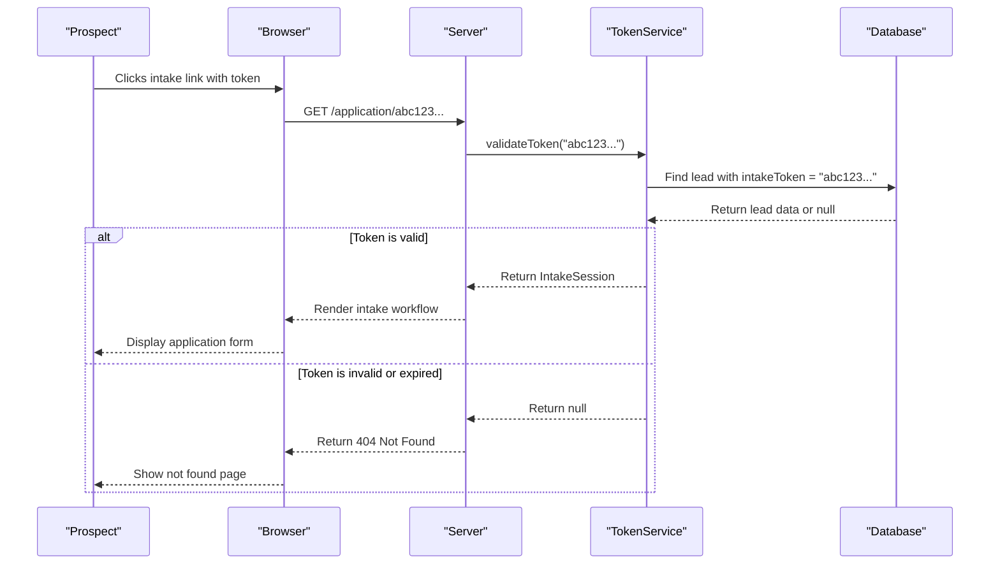
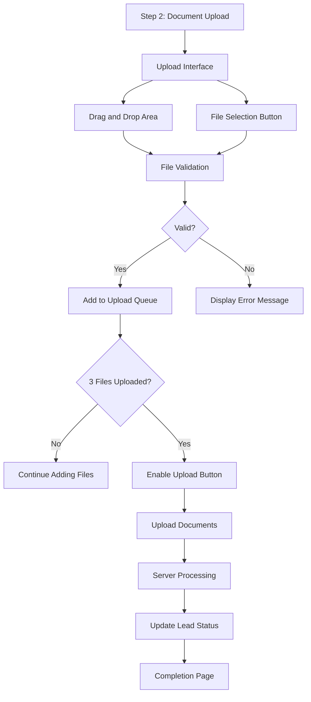
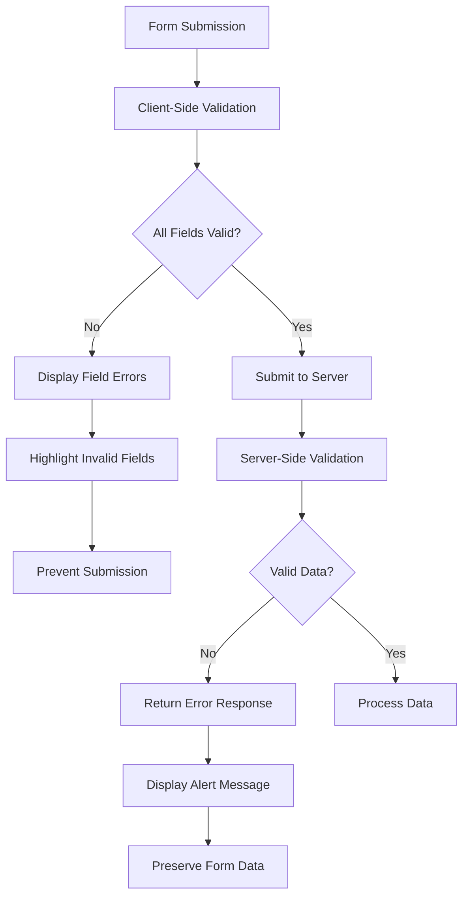
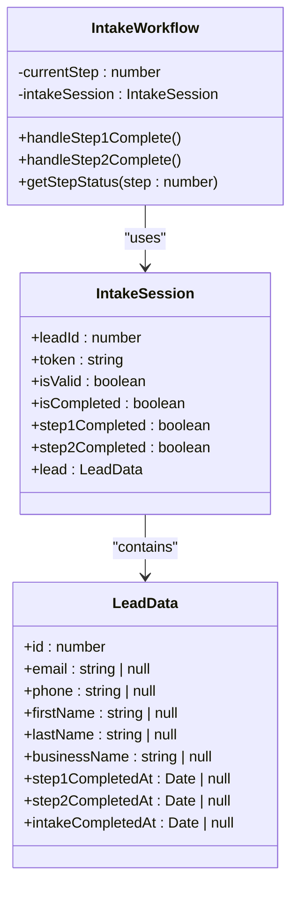
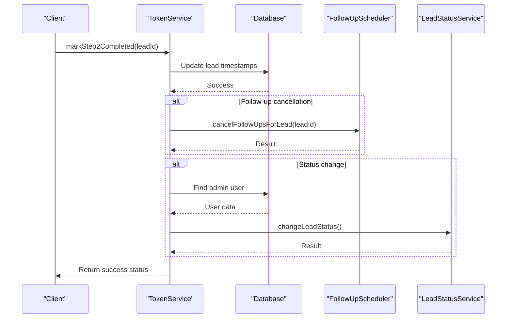
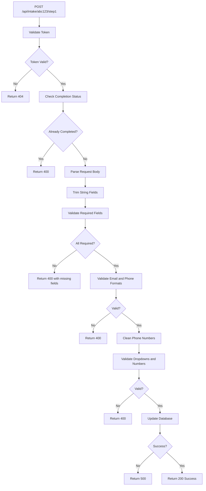
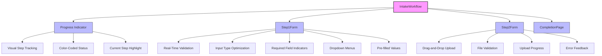

# Prospect Intake Workflow

<cite>
**Referenced Files in This Document**   
- [TokenService.ts](file://src/services/TokenService.ts#L0-L312)
- [IntakeWorkflow.tsx](file://src/components/intake/IntakeWorkflow.tsx#L0-L95)
- [Step1Form.tsx](file://src/components/intake/Step1Form.tsx#L0-L398)
- [Step2Form.tsx](file://src/components/intake/Step2Form.tsx#L0-L311)
- [step1/route.ts](file://src/app/api/intake/[token]/step1/route.ts#L0-L303)
- [step2/route.ts](file://src/app/api/intake/[token]/step2/route.ts#L0-L151)
- [page.tsx](file://src/app/application/[token]/page.tsx#L0-L221)
</cite>

## Table of Contents
1. [Prospect Intake Overview](#prospect-intake-overview)
2. [Token-Based Access Mechanism](#token-based-access-mechanism)
3. [Two-Step Form Flow](#two-step-form-flow)
4. [Data Validation and Error Handling](#data-validation-and-error-handling)
5. [Session Persistence](#session-persistence)
6. [TokenService Implementation](#tokenservice-implementation)
7. [Intake API Routes](#intake-api-routes)
8. [UI/UX Considerations](#uiux-considerations)
9. [Scenario Examples](#scenario-examples)
10. [Troubleshooting Guide](#troubleshooting-guide)

## Prospect Intake Overview

The prospect intake workflow in the fund-track system enables potential business clients to securely submit their funding application through a token-protected, two-step process. The workflow begins when a prospect receives a unique token that grants access to the intake system. This token-based approach ensures that only authorized individuals can initiate the application process while maintaining data security and privacy.

The workflow is implemented as a Next.js application with server-side API routes handling data processing and a client-side React component managing the user interface. The system is designed to collect comprehensive business and personal information in the first step, followed by document uploads in the second step. The entire process is stateful, with progress tracked between sessions to provide a seamless user experience.

The intake process is integrated with the system's lead management functionality, where each prospect is represented as a "lead" in the database. As the prospect progresses through the intake steps, the corresponding lead record is updated to reflect their progress, enabling staff to monitor and manage applications efficiently.

**Section sources**
- [page.tsx](file://src/app/application/[token]/page.tsx#L0-L221)
- [IntakeWorkflow.tsx](file://src/components/intake/IntakeWorkflow.tsx#L0-L95)

## Token-Based Access Mechanism

The prospect intake workflow employs a secure token-based authentication system that allows prospects to access the application process without requiring traditional login credentials. This mechanism uses cryptographically secure tokens generated by the TokenService to authenticate and authorize access to the intake process.

When a new prospect is created in the system, the TokenService generates a unique 64-character hexadecimal token using Node.js's crypto module. This token is stored in the database as the `intakeToken` field of the lead record. The prospect receives this token via a secure channel (typically email) and uses it to access the intake workflow at the `/application/[token]` route.

The token validation process occurs when the prospect accesses the intake page. The `IntakePage` component calls `TokenService.validateToken(token)` to verify the token's validity and retrieve the associated intake session data. This function queries the database for a lead with a matching `intakeToken` and returns an `IntakeSession` object containing the lead's information and progress status. If no valid token is found, the system returns a 404 error, effectively preventing unauthorized access.

**Diagram sources**
- [TokenService.ts](file://src/services/TokenService.ts#L43-L77)
- [page.tsx](file://src/app/application/[token]/page.tsx#L0-L221)

**Section sources**
- [TokenService.ts](file://src/services/TokenService.ts#L43-L77)
- [page.tsx](file://src/app/application/[token]/page.tsx#L0-L221)

## Two-Step Form Flow

The prospect intake workflow is structured as a two-step form process designed to collect information in a logical sequence while minimizing user burden. This approach breaks down the application into manageable sections, improving completion rates and data quality.

### Step 1: Business and Personal Information

The first step collects comprehensive business and personal information through a detailed form. This step is implemented in the `Step1Form` component and includes three main sections:

1. **Business Details**: Legal business name, DBA, address, contact information, ownership percentage, tax ID, incorporation details, business history, and financial information.
2. **Personal Details**: Prospect's name, date of birth, social security number, personal address, and contact information.
3. **Legal Information**: Legal name and email address.

The form uses controlled components to manage state, with all input values stored in the `formData` state object. Each field is validated both on the client side during user input and on the server side upon submission to ensure data integrity.

```mermaid
flowchart TD
A[Step 1: Business and Personal Information] --> B[Business Details Section]
A --> C[Personal Details Section]
A --> D[Legal Information Section]
B --> B1[Legal Business Name]
B --> B2[DBA]
B --> B3[Business Address]
B --> B4[Business Phone]
B --> B5[Company Email]
B --> B6[Mobile]
B --> B7[City, State, Zip]
B --> B8[Ownership Percentage]
B --> B9[Tax ID]
B --> B10[State of Incorporation]
B --> B11[Date Business Started]
B --> B12[Legal Entity]
B --> B13[Nature of Business]
B --> B14[Existing Loans]
B --> B15[Industry]
B --> B16[Years in Business]
B --> B17[Monthly Revenue]
B --> B18[Amount Requested]
C --> C1[First Name]
C --> C2[Last Name]
C --> C3[Date of Birth]
C --> C4[Social Security]
C --> C5[Personal Address]
C --> C6[City, State, Zip]
D --> D1[Legal Name]
D --> D2[Email Address]
```

**Diagram sources**
- [Step1Form.tsx](file://src/components/intake/Step1Form.tsx#L0-L398)

### Step 2: Additional Details and Document Upload

The second step focuses on document collection, requiring prospects to upload exactly three financial documents such as bank statements or financial records. This step is implemented in the `Step2Form` component and provides a drag-and-drop interface for file uploads.

The document upload process includes client-side validation to ensure files meet the system requirements:
- Accepted formats: PDF, JPG, PNG, DOCX
- Maximum file size: 10MB per document
- Exactly three documents required

The interface provides real-time feedback on upload progress and validation status, with visual indicators for each file's upload progress and any errors encountered during validation.

**Diagram sources**
- [Step2Form.tsx](file://src/components/intake/Step2Form.tsx#L0-L311)

**Section sources**
- [Step1Form.tsx](file://src/components/intake/Step1Form.tsx#L0-L398)
- [Step2Form.tsx](file://src/components/intake/Step2Form.tsx#L0-L311)

## Data Validation and Error Handling

The prospect intake workflow implements comprehensive data validation at both the client and server levels to ensure data quality and prevent submission of incomplete or malformed information. The validation strategy follows a layered approach, providing immediate feedback to users while maintaining data integrity on the server side.

### Client-Side Validation

The `Step1Form` component implements real-time validation through the `validateForm` function, which checks for:
- Required fields (all fields marked with *)
- Email format validation using regex pattern `/^[^'''\s@]+@[^'''\s@]+\.[^'''\s@]+$/`
- Phone number format validation using regex pattern `/^[\d\s\-\(\)\+\.]{10,}$/`
- Numeric range validation for ownership percentage (0-100) and years in business (0-100)

When validation fails, the form displays error messages below the corresponding fields and prevents submission until all errors are resolved. The validation occurs both on form submission and dynamically as users interact with form fields.

### Server-Side Validation

The API routes implement rigorous server-side validation to ensure data integrity and security. The `step1/route.ts` implementation validates:
- Token presence and validity
- Required fields (comprehensive list of 28 required fields)
- Email format for both personal and business emails
- Phone number format for business phone and mobile
- Numeric validation for ownership percentage and years in business
- Dropdown value validation for monthly revenue and amount requested

When validation fails on the server, the API returns appropriate HTTP status codes and error messages that are handled by the client-side form. For example, missing required fields trigger a 400 response with a list of missing fields, while internal server errors trigger a 500 response.

The error handling strategy includes detailed logging for debugging purposes while exposing only generic error messages to users in production to prevent information disclosure. The system also implements try-catch blocks around database operations to gracefully handle unexpected errors without crashing.

**Section sources**
- [step1/route.ts](file://src/app/api/intake/[token]/step1/route.ts#L0-L303)
- [Step1Form.tsx](file://src/components/intake/Step1Form.tsx#L0-L398)

## Session Persistence

The prospect intake workflow maintains session persistence between steps through a combination of server-side state management and client-side state tracking. This ensures that prospects can complete the application process even if they need to pause and return later, improving user experience and completion rates.

### Server-Side State Management

The system uses the database to persist intake progress by updating specific timestamp fields in the lead record:
- `step1CompletedAt`: Timestamp when Step 1 is completed
- `step2CompletedAt`: Timestamp when Step 2 is completed
- `intakeCompletedAt`: Timestamp when the entire intake process is completed

When a prospect accesses the intake workflow, the `TokenService.validateToken()` method retrieves the current state of these fields and returns an `IntakeSession` object that includes boolean flags for `step1Completed`, `step2Completed`, and `isCompleted`. This allows the system to determine the prospect's current position in the workflow and resume from the appropriate step.

The `IntakeWorkflow` component uses this information to initialize the `currentStep` state:
- If `isCompleted` is true, set current step to 3 (completion)
- If `step1Completed` is true, set current step to 2 (document upload)
- Otherwise, start at step 1 (information collection)

### Client-Side State Tracking

The client-side implementation uses React's useState hook to manage the current step in the workflow. The initial state is determined by the intake session data received from the server, ensuring consistency between server and client state.

**Diagram sources**
- [TokenService.ts](file://src/services/TokenService.ts#L0-L312)
- [IntakeWorkflow.tsx](file://src/components/intake/IntakeWorkflow.tsx#L0-L95)

**Section sources**
- [TokenService.ts](file://src/services/TokenService.ts#L0-L312)
- [IntakeWorkflow.tsx](file://src/components/intake/IntakeWorkflow.tsx#L0-L95)

## TokenService Implementation

The TokenService is a critical component of the prospect intake workflow, responsible for secure token generation, validation, and intake progress tracking. Implemented as a static class in `TokenService.ts`, it provides a centralized interface for token-related operations throughout the application.

### Token Generation and Validation

The service implements two primary methods for token management:
- `generateToken()`: Creates a cryptographically secure 32-byte random token using Node.js's crypto module and converts it to a 64-character hexadecimal string.
- `validateToken(token)`: Validates a token by querying the database for a lead with a matching `intakeToken` and returning an `IntakeSession` object with the lead's data and progress status.

The token validation process includes comprehensive error handling to prevent information leakage. If a token is invalid or expired, the method returns null rather than throwing an error, which the calling code can handle appropriately.

### Intake Progress Management

The TokenService also manages the progression of the intake process through several methods:
- `markStep1Completed(leadId)`: Updates the `step1CompletedAt` timestamp in the database
- `markStep2Completed(leadId)`: Updates both `step2CompletedAt` and `intakeCompletedAt` timestamps
- `getIntakeProgress(leadId)`: Retrieves the current progress status for a lead

Notably, the `markStep2Completed` method includes additional business logic beyond simple database updates. After marking the intake as completed, it:
1. Cancels any pending follow-ups for the lead
2. Changes the lead status to "IN_PROGRESS" to alert staff that the application is ready for review
3. Logs these actions for audit purposes

This integration with other system components (FollowUpScheduler and LeadStatusService) demonstrates the TokenService's role as a coordination point between different parts of the application.

**Diagram sources**
- [TokenService.ts](file://src/services/TokenService.ts#L0-L312)

**Section sources**
- [TokenService.ts](file://src/services/TokenService.ts#L0-L312)

## Intake API Routes

The intake workflow is supported by a set of API routes that handle data processing and storage. These routes are implemented as Next.js API endpoints and follow a REST-like pattern with token-based authentication.

### Route Structure

The API routes are organized under the `/api/intake/[token]` path, where `[token]` is a dynamic route parameter representing the prospect's intake token. The main routes include:
- `GET /api/intake/[token]`: Retrieves the current intake session data
- `POST /api/intake/[token]/step1`: Processes and stores Step 1 form data
- `POST /api/intake/[token]/step2`: Handles document uploads for Step 2

Each route follows a consistent pattern of token validation, business logic execution, and response generation. The token validation is performed using the TokenService, ensuring a single source of truth for authentication across all intake routes.

### Data Processing Flow

The `step1/route.ts` implementation demonstrates the complete data processing flow:
1. Validate the token using TokenService.validateToken()
2. Check if the intake process is already completed
3. Parse and trim the request body data
4. Validate required fields and data formats
5. Clean and transform data (e.g., normalize phone numbers)
6. Update the lead record in the database
7. Return a success response

The route handles various error conditions with appropriate HTTP status codes:
- 400 Bad Request: Missing token, missing required fields, or invalid data
- 404 Not Found: Invalid or expired token
- 500 Internal Server Error: Database or server-side errors

**Diagram sources**
- [step1/route.ts](file://src/app/api/intake/[token]/step1/route.ts#L0-L303)
- [step2/route.ts](file://src/app/api/intake/[token]/step2/route.ts#L0-L151)

**Section sources**
- [step1/route.ts](file://src/app/api/intake/[token]/step1/route.ts#L0-L303)
- [step2/route.ts](file://src/app/api/intake/[token]/step2/route.ts#L0-L151)

## UI/UX Considerations

The IntakeWorkflow component implements several user experience features designed to guide prospects through the application process smoothly and reduce abandonment rates.

### Progress Tracking

The workflow includes a visual progress indicator that shows the user's current position in the two-step process. The indicator uses color coding to distinguish between completed, current, and upcoming steps:
- Green (completed): Steps that have been successfully completed
- Blue (current): The current step being worked on
- Gray (upcoming): Steps that have not yet been reached

This visual feedback helps users understand their progress and what remains to be completed, reducing anxiety and improving completion rates.

### Input Handling

The form components implement several UX best practices:
- Real-time validation with immediate feedback
- Appropriate input types (email, tel, date) for better mobile experience
- Clear labeling with asterisks (*) to indicate required fields
- Dropdown menus for standardized data entry
- File upload interface with drag-and-drop support

The Step1Form pre-fills existing values from the intake session, allowing prospects to resume their application with previously entered data. This persistence reduces re-entry effort and improves user satisfaction.

### Responsive Design

The interface is designed to be responsive, adapting to different screen sizes:
- Single-column layout on mobile devices
- Multi-column grid layout on larger screens
- Appropriate font sizes and spacing for readability
- Touch-friendly button sizes

The document upload interface in Step2Form provides multiple ways to add files (drag-and-drop and file selection button) to accommodate different user preferences and device capabilities.

**Diagram sources**
- [IntakeWorkflow.tsx](file://src/components/intake/IntakeWorkflow.tsx#L0-L95)
- [Step1Form.tsx](file://src/components/intake/Step1Form.tsx#L0-L398)
- [Step2Form.tsx](file://src/components/intake/Step2Form.tsx#L0-L311)

**Section sources**
- [IntakeWorkflow.tsx](file://src/components/intake/IntakeWorkflow.tsx#L0-L95)
- [Step1Form.tsx](file://src/components/intake/Step1Form.tsx#L0-L398)
- [Step2Form.tsx](file://src/components/intake/Step2Form.tsx#L0-L311)

## Scenario Examples

### Successful Intake Scenario

1. **Token Access**: Prospect receives email with intake link containing token
2. **Step 1 Completion**: Prospect fills out business and personal information form with valid data
3. **Form Submission**: System validates data on client and server sides, saves to database
4. **Step 2 Upload**: Prospect uploads three valid financial documents (PDF, JPG, DOCX) under 10MB each
5. **Document Processing**: System uploads files to Backblaze B2, creates document records
6. **Completion**: System marks intake as completed, updates lead status to "IN_PROGRESS"
7. **Confirmation**: Prospect sees completion page with confirmation message

### Failed Intake Scenarios

**Expired Token**
- Prospect attempts to access intake link with expired token
- System returns 404 Not Found
- User sees "Page Not Found" error
- Resolution: Contact support for new token

**Incomplete Step 1 Submission**
- Prospect submits Step 1 form with missing required fields
- Client-side validation displays error messages
- Form submission is blocked
- Resolution: Fill in all required fields and resubmit

**Invalid Document Upload**
- Prospect attempts to upload four documents
- System displays error: "Please upload exactly 3 documents"
- Upload button remains disabled
- Resolution: Remove one document and try again

**Large File Upload**
- Prospect attempts to upload 15MB PDF file
- System validates file size client-side
- Error message: "File size must be less than 10MB"
- File is not added to upload queue
- Resolution: Compress file or upload smaller version

**Section sources**
- [step1/route.ts](file://src/app/api/intake/[token]/step1/route.ts#L0-L303)
- [step2/route.ts](file://src/app/api/intake/[token]/step2/route.ts#L0-L151)
- [Step1Form.tsx](file://src/components/intake/Step1Form.tsx#L0-L398)
- [Step2Form.tsx](file://src/components/intake/Step2Form.tsx#L0-L311)

## Troubleshooting Guide

### Common Issues and Solutions

**Expired Token**
- **Symptoms**: "Page Not Found" error when accessing intake link
- **Cause**: Token has expired or been invalidated
- **Solution**: Contact support team to request a new intake link

**Incomplete Form Submission**
- **Symptoms**: Form submission fails with validation errors
- **Cause**: Required fields are missing or contain invalid data
- **Solution**: Check all fields marked with * and ensure they contain valid information

**Document Upload Failures**
- **Symptoms**: "Upload failed" message or specific file errors
- **Common Causes**:
  - File format not supported (only PDF, JPG, PNG, DOCX allowed)
  - File size exceeds 10MB limit
  - Network connectivity issues during upload
- **Solutions**:
  - Convert documents to supported formats
  - Compress large files before uploading
  - Check internet connection and retry

**Browser Compatibility Issues**
- **Symptoms**: Form elements not working correctly or layout issues
- **Supported Browsers**: Chrome, Firefox, Safari, Edge (latest versions)
- **Solutions**: Update browser to latest version or try a different browser

### Best Practices for Users

1. **Complete in One Session**: While the system supports resuming, completing the process in one session reduces the risk of token expiration.
2. **Prepare Documents in Advance**: Have all required financial documents ready in supported formats before starting.
3. **Check Internet Connection**: Ensure stable internet connection, especially during document upload.
4. **Use Valid Email**: Provide a valid email address as it may be used for follow-up communication.
5. **Verify Phone Numbers**: Ensure phone numbers are entered in correct format to enable contact if needed.

**Section sources**
- [step1/route.ts](file://src/app/api/intake/[token]/step1/route.ts#L0-L303)
- [step2/route.ts](file://src/app/api/intake/[token]/step2/route.ts#L0-L151)
- [Step1Form.tsx](file://src/components/intake/Step1Form.tsx#L0-L398)
- [Step2Form.tsx](file://src/components/intake/Step2Form.tsx#L0-L311)