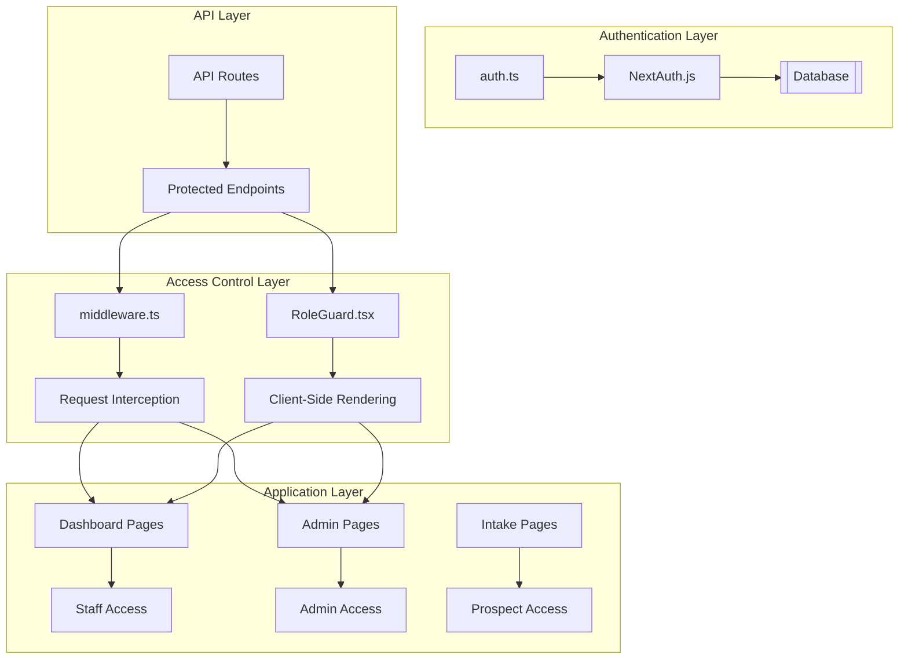
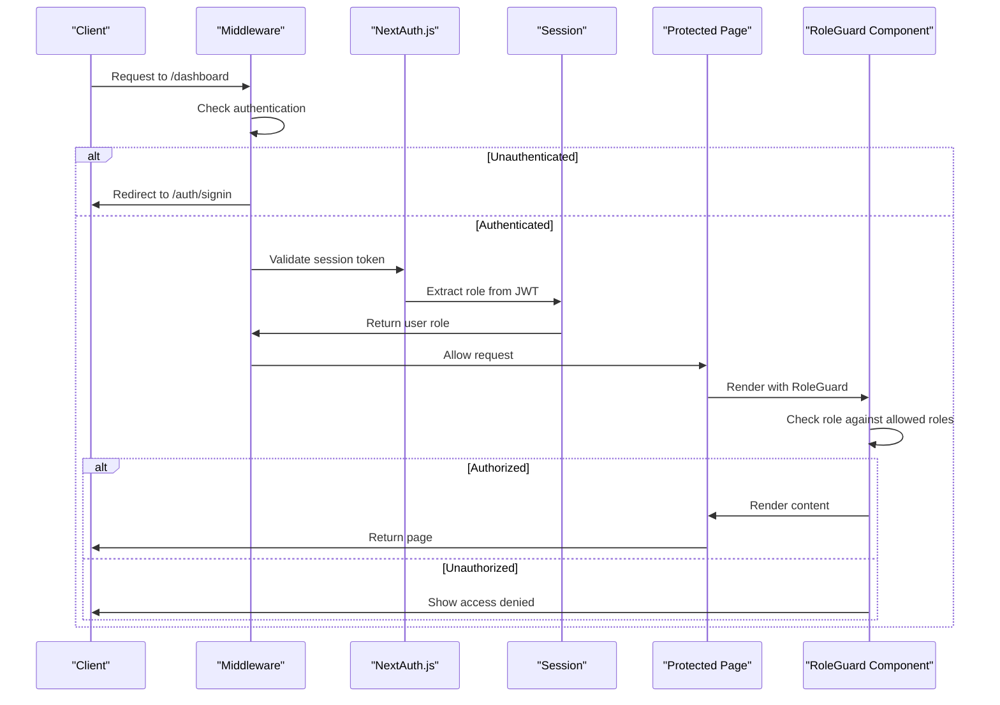
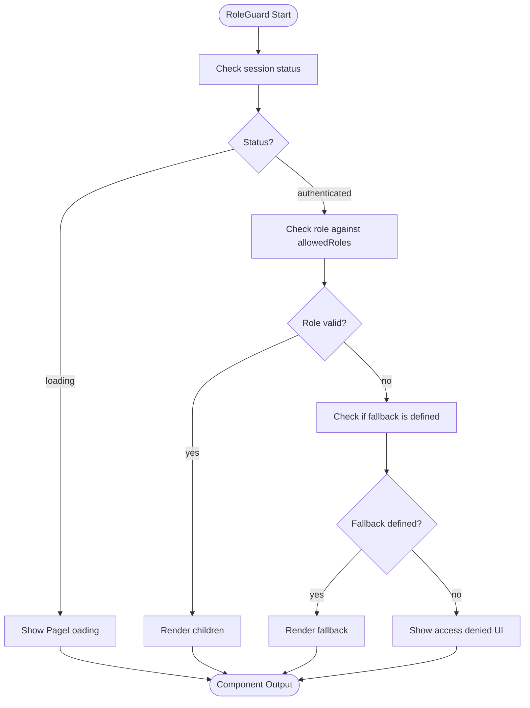

# Role-Based Access Control Implementation

<cite>
**Referenced Files in This Document**   
- [auth.ts](file://src/lib/auth.ts#L1-L70)
- [RoleGuard.tsx](file://src/components/auth/RoleGuard.tsx#L1-L75)
- [middleware.ts](file://src/middleware.ts#L1-L189)
- [schema.prisma](file://prisma/schema.prisma#L150-L154)
- [...nextauth]/route.ts](file://src/app/api/auth/[...nextauth]/route.ts#L1-L6)
- [page.tsx](file://src/app/page.tsx#L1-L51)
- [admin/page.tsx](file://src/app/admin/page.tsx#L1-L110)
- [dashboard/page.tsx](file://src/app/dashboard/page.tsx)
</cite>

## Table of Contents
1. [Introduction](#introduction)
2. [Project Structure](#project-structure)
3. [Core Components](#core-components)
4. [Architecture Overview](#architecture-overview)
5. [Detailed Component Analysis](#detailed-component-analysis)
6. [Role Hierarchy and Permissions](#role-hierarchy-and-permissions)
7. [Authentication Implementation](#authentication-implementation)
8. [Middleware-Based Access Control](#middleware-based-access-control)
9. [Client-Side Role Guard](#client-side-role-guard)
10. [API Route Protection](#api-route-protection)
11. [Performance Considerations](#performance-considerations)
12. [Troubleshooting Guide](#troubleshooting-guide)
13. [Security Best Practices](#security-best-practices)

## Introduction
This document provides comprehensive documentation for the Role-Based Access Control (RBAC) system in the fund-track application. The RBAC implementation uses NextAuth.js for authentication, combines middleware-based server-side protection with client-side RoleGuard components, and defines a clear role hierarchy to control access to different parts of the application. The system supports three distinct user roles: prospect (unauthenticated with token access), staff (authenticated with dashboard access), and admin (full system access). This documentation details the implementation, usage patterns, and best practices for securing both page-level and API route-level endpoints.

## Project Structure
The fund-track application follows a Next.js App Router structure with a clear separation of concerns. Authentication and authorization logic is centralized in specific locations:

- **Authentication Configuration**: `src/lib/auth.ts` contains the NextAuth.js configuration
- **Role Guard Component**: `src/components/auth/RoleGuard.tsx` provides client-side role-based rendering
- **Request Interception**: `src/middleware.ts` handles server-side access control
- **API Routes**: Authentication and protected API endpoints are in `src/app/api/`
- **Protected Pages**: Dashboard and admin interfaces are in `src/app/dashboard/` and `src/app/admin/`
- **Database Schema**: User roles are defined in `prisma/schema.prisma`

The structure enables a layered security approach where protection is applied at multiple levels: network (middleware), route (API guards), and component (client-side rendering).



**Diagram sources**
- [auth.ts](file://src/lib/auth.ts#L1-L70)
- [middleware.ts](file://src/middleware.ts#L1-L189)
- [RoleGuard.tsx](file://src/components/auth/RoleGuard.tsx#L1-L75)

**Section sources**
- [auth.ts](file://src/lib/auth.ts#L1-L70)
- [middleware.ts](file://src/middleware.ts#L1-L189)
- [RoleGuard.tsx](file://src/components/auth/RoleGuard.tsx#L1-L75)

## Core Components
The RBAC system in fund-track consists of several core components that work together to provide comprehensive access control:

1. **NextAuth.js Configuration**: Centralized authentication logic with credential-based login
2. **RoleGuard Component**: Client-side component for role-based rendering of UI elements
3. **Middleware**: Server-side request interceptor for route protection
4. **UserRole Enum**: Database-defined roles that determine user permissions
5. **Session Management**: JWT-based session strategy with role persistence

These components form a defense-in-depth approach where access control is enforced at multiple levels, reducing the risk of unauthorized access even if one layer is compromised.

**Section sources**
- [auth.ts](file://src/lib/auth.ts#L1-L70)
- [RoleGuard.tsx](file://src/components/auth/RoleGuard.tsx#L1-L75)
- [middleware.ts](file://src/middleware.ts#L1-L189)

## Architecture Overview
The RBAC architecture in fund-track implements a multi-layered security model that combines server-side and client-side protection mechanisms. The system follows a zero-trust principle where access is denied by default and must be explicitly granted based on user roles.

When a user attempts to access a protected resource, the request flows through multiple validation layers:

1. **Network Level**: Middleware intercepts all requests and performs initial validation
2. **Authentication Level**: NextAuth.js verifies user credentials and establishes session
3. **Authorization Level**: Role-based checks determine if the user has permission
4. **Application Level**: Components render content based on user role

This layered approach ensures that even if a user somehow bypasses one layer of protection, subsequent layers will still prevent unauthorized access.



**Diagram sources**
- [middleware.ts](file://src/middleware.ts#L1-L189)
- [auth.ts](file://src/lib/auth.ts#L1-L70)
- [RoleGuard.tsx](file://src/components/auth/RoleGuard.tsx#L1-L75)

## Detailed Component Analysis

### Authentication Configuration Analysis
The authentication system is configured in `auth.ts` using NextAuth.js with credential-based providers. The configuration includes a custom authorize function that validates user credentials against the database and returns user information including role.

```mermaid
classDiagram
class NextAuthOptions {
+adapter : PrismaAdapter
+providers : CredentialsProvider[]
+session : {strategy : "jwt"}
+callbacks : {jwt(), session()}
+pages : {signIn : "/auth/signin"}
}
class CredentialsProvider {
+name : "credentials"
+credentials : {email, password}
+authorize(credentials) : User | null
}
class User {
+id : string
+email : string
+role : UserRole
}
NextAuthOptions --> CredentialsProvider : "uses"
CredentialsProvider --> User : "returns"
User --> UserRole : "has"
class UserRole {
+ADMIN
+USER
}
```

**Diagram sources**
- [auth.ts](file://src/lib/auth.ts#L1-L70)

**Section sources**
- [auth.ts](file://src/lib/auth.ts#L1-L70)

### RoleGuard Component Analysis
The RoleGuard component provides client-side role-based rendering, allowing different UI elements to be shown or hidden based on the user's role. It uses NextAuth.js's useSession hook to access the current user's session and role information.



**Diagram sources**
- [RoleGuard.tsx](file://src/components/auth/RoleGuard.tsx#L1-L75)

**Section sources**
- [RoleGuard.tsx](file://src/components/auth/RoleGuard.tsx#L1-L75)

## Role Hierarchy and Permissions
The fund-track application implements a three-tier role hierarchy that defines access levels for different types of users:

1. **Prospect**: Unauthenticated users with token-based access to intake forms
2. **Staff (USER)**: Authenticated users with access to the dashboard and lead management
3. **Admin (ADMIN)**: Users with full system access, including user management and settings

The roles are defined in the database schema as an enum, ensuring data integrity and type safety throughout the application.

```mermaid
erDiagram
USER_ROLE ||--o{ USER : "has"
USER_ROLE {
string role PK
string description
}
USER {
int id PK
string email UK
string passwordHash
string role FK
datetime createdAt
datetime updatedAt
}
USER_ROLE {
"ADMIN" ADMIN
"USER" USER
}
classDef roleClass fill:#4a90e2,stroke:#333;
class ADMIN,USER roleClass
```

The role hierarchy follows a progressive access model where higher-level roles inherit the permissions of lower-level roles. Admins can access all staff functionality plus additional administrative features.

**Diagram sources**
- [schema.prisma](file://prisma/schema.prisma#L150-L154)

**Section sources**
- [schema.prisma](file://prisma/schema.prisma#L150-L154)
- [page.tsx](file://src/app/page.tsx#L1-L51)
- [admin/page.tsx](file://src/app/admin/page.tsx#L1-L110)

## Authentication Implementation
The authentication system is implemented using NextAuth.js with a credentials provider. The configuration in `auth.ts` sets up a complete authentication flow that includes user validation, session management, and role persistence.

Key implementation details:

- **Credentials Provider**: Uses email and password for authentication
- **Password Hashing**: Integrates bcrypt for secure password storage
- **Session Strategy**: Uses JWT to store session information including user role
- **Prisma Adapter**: Connects to the PostgreSQL database via Prisma

The authentication flow works as follows:
1. User submits email and password on the sign-in page
2. The credentials provider's authorize function validates the credentials
3. User is retrieved from the database and password is verified using bcrypt
4. If valid, user information including role is returned and stored in the JWT
5. The session callback adds the role to the session object for easy access

```typescript
// Example from auth.ts
async authorize(credentials) {
  if (!credentials?.email || !credentials?.password) {
    return null
  }

  const user = await prisma.user.findUnique({
    where: { email: credentials.email }
  })

  if (!user) {
    return null
  }

  const isPasswordValid = await bcrypt.compare(
    credentials.password,
    user.passwordHash
  )

  if (!isPasswordValid) {
    return null
  }

  return {
    id: user.id.toString(),
    email: user.email,
    role: user.role,
  }
}
```

**Section sources**
- [auth.ts](file://src/lib/auth.ts#L1-L70)
- [...nextauth]/route.ts](file://src/app/api/auth/[...nextauth]/route.ts#L1-L6)

## Middleware-Based Access Control
The middleware implementation in `middleware.ts` provides server-side request interception and access control. It uses NextAuth.js's withAuth function to protect routes and implements additional security features.

Key features of the middleware:

- **Route Protection**: Protects dashboard, API routes, and admin pages
- **Rate Limiting**: Prevents abuse of endpoints
- **Security Headers**: Adds security headers to responses
- **HTTPS Enforcement**: Redirects HTTP requests to HTTPS in production
- **Bot Detection**: Blocks suspicious bot traffic to sensitive endpoints

The middleware uses a two-part approach with both a main function and authorized callbacks:

1. **Authorized Callbacks**: Determine whether a request should be allowed to proceed
2. **Main Middleware Function**: Performs additional processing and redirects

```typescript
// Example from middleware.ts
export default withAuth(
  function middleware(req) {
    const token = req.nextauth.token
    const { pathname } = req.nextUrl

    // Rate limiting check
    if (!rateLimit(req)) {
      return new NextResponse('Too Many Requests', { status: 429 })
    }

    // HTTPS enforcement
    if (process.env.NODE_ENV === 'production' && 
        process.env.FORCE_HTTPS === 'true' && 
        req.headers.get('x-forwarded-proto') === 'http') {
      return NextResponse.redirect(`https://${req.headers.get('host')}${req.nextUrl.pathname}${req.nextUrl.search}`, 301)
    }

    // Allow access to intake pages without authentication
    if (pathname.startsWith("/application/")) {
      return addSecurityHeaders(NextResponse.next())
    }

    // Protect dashboard and API routes
    if (pathname.startsWith("/dashboard") || 
        (pathname.startsWith("/api") && !pathname.startsWith("/api/auth"))) {
      
      if (!token) {
        return NextResponse.redirect(new URL("/auth/signin", req.url))
      }

      // Admin-only routes
      if (pathname.startsWith("/admin") && token.role !== "ADMIN") {
        return NextResponse.redirect(new URL("/dashboard", req.url))
      }
    }

    return addSecurityHeaders(NextResponse.next())
  },
  {
    callbacks: {
      authorized: ({ token, req }) => {
        const { pathname } = req.nextUrl
        
        // Allow access to intake pages without authentication
        if (pathname.startsWith("/application/")) {
          return true
        }
        
        // Allow access to auth pages
        if (pathname.startsWith("/auth/")) {
          return true
        }

        // For protected routes, require authentication
        if (pathname.startsWith("/dashboard") || 
            (pathname.startsWith("/api") && !pathname.startsWith("/api/auth"))) {
          return !!token
        }
        
        return true
      },
    },
  }
)
```

**Section sources**
- [middleware.ts](file://src/middleware.ts#L1-L189)

## Client-Side Role Guard
The RoleGuard component provides fine-grained client-side access control for UI elements. It wraps components and only renders them if the user has the required role.

Key features:

- **Loading State**: Shows a loading indicator while session is being fetched
- **Flexible Role Checking**: Accepts an array of allowed roles
- **Custom Fallback**: Allows specification of fallback content for unauthorized users
- **Convenience Components**: Provides AdminOnly and AuthenticatedOnly wrappers

The component is designed to be used declaratively in JSX:

```tsx
// Example usage
<AdminOnly>
  <div>This content is only visible to admins</div>
</AdminOnly>

<RoleGuard allowedRoles={[UserRole.ADMIN, UserRole.USER]}>
  <button>Staff and admin action</button>
</RoleGuard>

<RoleGuard allowedRoles={[UserRole.ADMIN]} fallback={<p>Upgrade to access this feature</p>}>
  <PremiumFeature />
</RoleGuard>
```

The RoleGuard is particularly useful for:
- Hiding UI elements that users shouldn't see
- Preventing rendering of components that make API calls
- Providing custom messaging for unauthorized access
- Implementing feature flags based on user role

**Section sources**
- [RoleGuard.tsx](file://src/components/auth/RoleGuard.tsx#L1-L75)

## API Route Protection
API routes are protected using a combination of middleware and server-side role checking. The approach varies depending on whether the protection is at the route level or within the route handler.

For route-level protection, the middleware automatically handles authentication for all API routes except those explicitly excluded (like auth routes).

For fine-grained control within API routes, server-side session checking is used:

```typescript
// Example from admin/users/route.ts
export async function DELETE(request: NextRequest) {
  try {
    const session = await getServerSession(authOptions);
    if (!session?.user || session.user.role !== UserRole.ADMIN) {
      return NextResponse.json(
        { error: "Unauthorized - Admin access required" },
        { status: 403 }
      );
    }
    
    // Proceed with admin-only functionality
    // ...
  } catch (error) {
    // Handle error
  }
}
```

Best practices for API route protection:
1. Use middleware for broad route protection
2. Use server-side session checking for fine-grained control
3. Always validate roles on the server, never trust client-side checks
4. Return appropriate HTTP status codes (401 for unauthenticated, 403 for unauthorized)
5. Include descriptive error messages for debugging

**Section sources**
- [middleware.ts](file://src/middleware.ts#L1-L189)
- [admin/users/route.ts](file://src/app/api/admin/users/route.ts#L92-L195)

## Performance Considerations
The RBAC implementation in fund-track includes several performance optimizations:

- **JWT Session Strategy**: Stores user information in the token, eliminating database queries on each request
- **Rate Limiting**: Prevents abuse that could impact performance
- **Client-Side Caching**: NextAuth.js caches session information in the browser
- **Efficient Database Queries**: Prisma queries are optimized for user lookup

Potential performance improvements:
- **Redis Caching**: For rate limiting in production (currently uses in-memory store)
- **Role Pre-fetching**: Load user roles during initial authentication to reduce latency
- **Code Splitting**: Split RoleGuard and authentication code to reduce bundle size
- **Lazy Loading**: Load admin components only when needed

The current implementation strikes a balance between security and performance, with the JWT strategy providing fast session validation while maintaining security.

## Troubleshooting Guide
Common issues and their solutions:

### Unauthorized Access Attempts
**Symptom**: Users are redirected to sign-in page or see "Access denied" message
**Causes**:
- Invalid or expired session token
- User role doesn't match required role
- Middleware configuration error

**Solutions**:
1. Check if the user is properly authenticated
2. Verify the user's role in the database
3. Ensure middleware matcher includes the correct routes
4. Check browser storage for valid session token

### Session Expiration
**Symptom**: Users are unexpectedly logged out
**Causes**:
- JWT expiration time too short
- Clock skew between server and client
- Token storage issues

**Solutions**:
1. Adjust JWT expiration settings in authOptions
2. Implement token refresh mechanism
3. Check secure cookie settings in production

### Debugging Permission Problems
Use these techniques to diagnose RBAC issues:

1. **Log Session Data**:
```typescript
console.log("Session data:", session);
console.log("User role:", session?.user.role);
```

2. **Check Middleware Flow**: Add debug logs to middleware to trace request flow

3. **Verify Database Roles**: Ensure user roles are correctly stored in the database

4. **Test with Different Users**: Create test users with different roles to verify behavior

## Security Best Practices
The RBAC implementation follows several security best practices:

- **Principle of Least Privilege**: Users only have access to what they need
- **Defense in Depth**: Multiple layers of protection (middleware, RoleGuard, server-side checks)
- **Secure Password Storage**: Uses bcrypt with appropriate salt rounds
- **HTTPS Enforcement**: Redirects HTTP to HTTPS in production
- **Rate Limiting**: Prevents brute force attacks
- **Bot Detection**: Blocks suspicious automated traffic

Additional recommendations:
- **Regular Security Audits**: Review access controls periodically
- **Role Review Process**: Implement process for granting and revoking roles
- **Audit Logging**: Log role changes and access attempts
- **Multi-Factor Authentication**: Consider adding MFA for admin accounts
- **Session Management**: Implement session invalidation on password change

The current implementation provides a solid foundation for security, but ongoing vigilance and regular updates are essential to maintain protection against evolving threats.