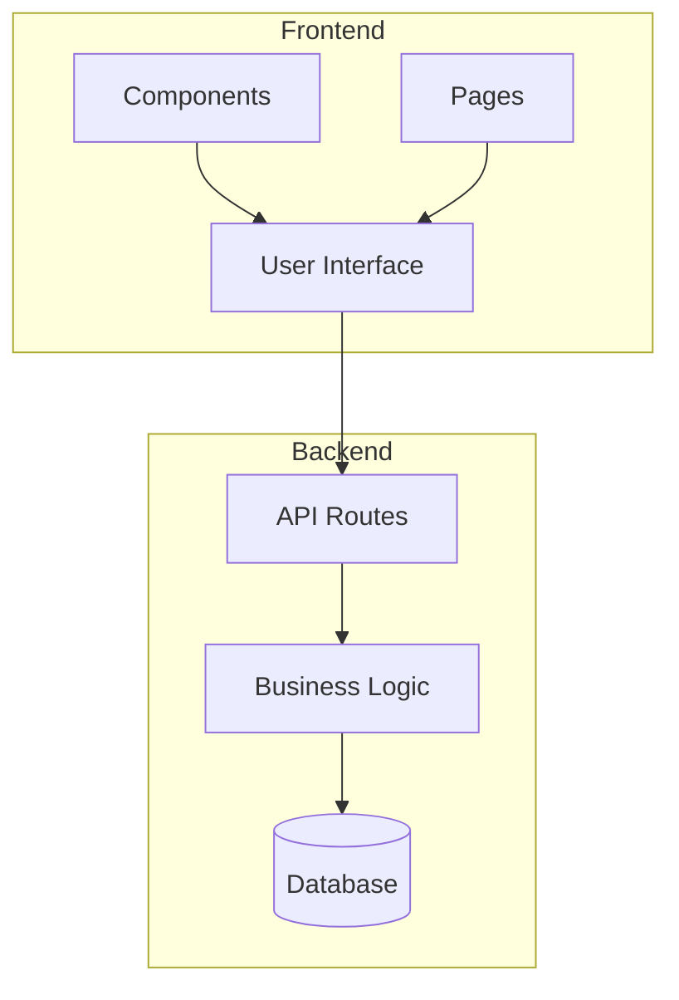
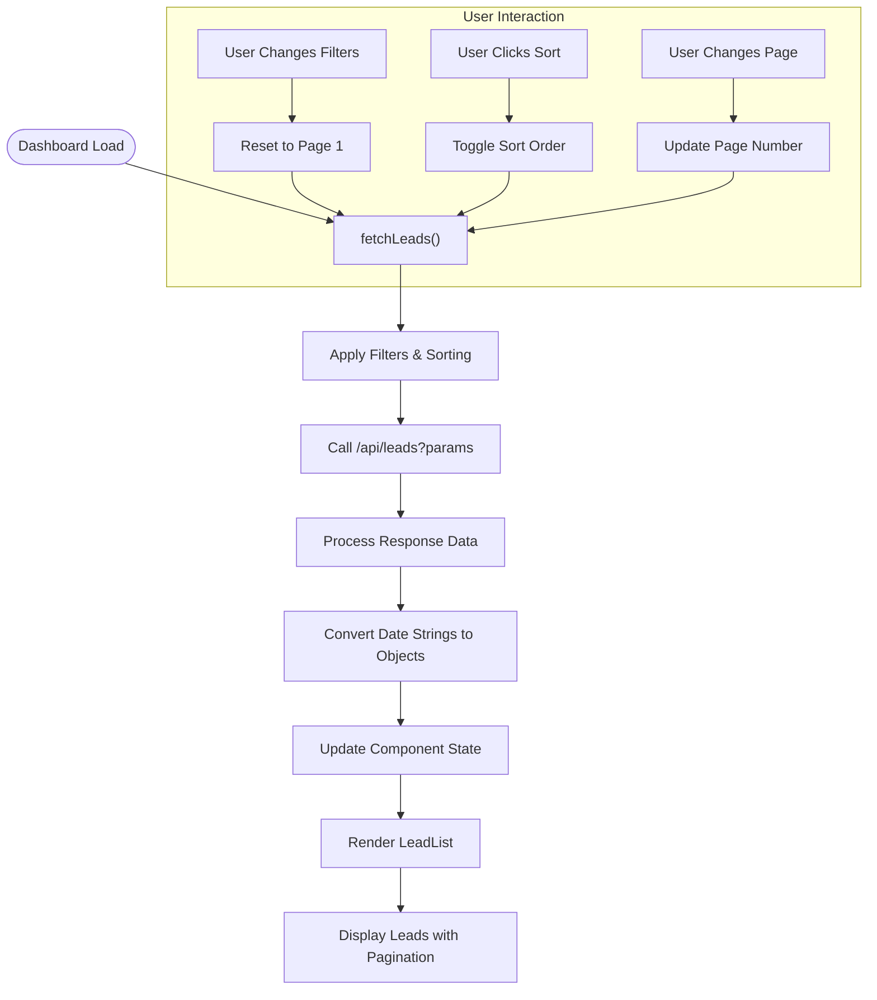
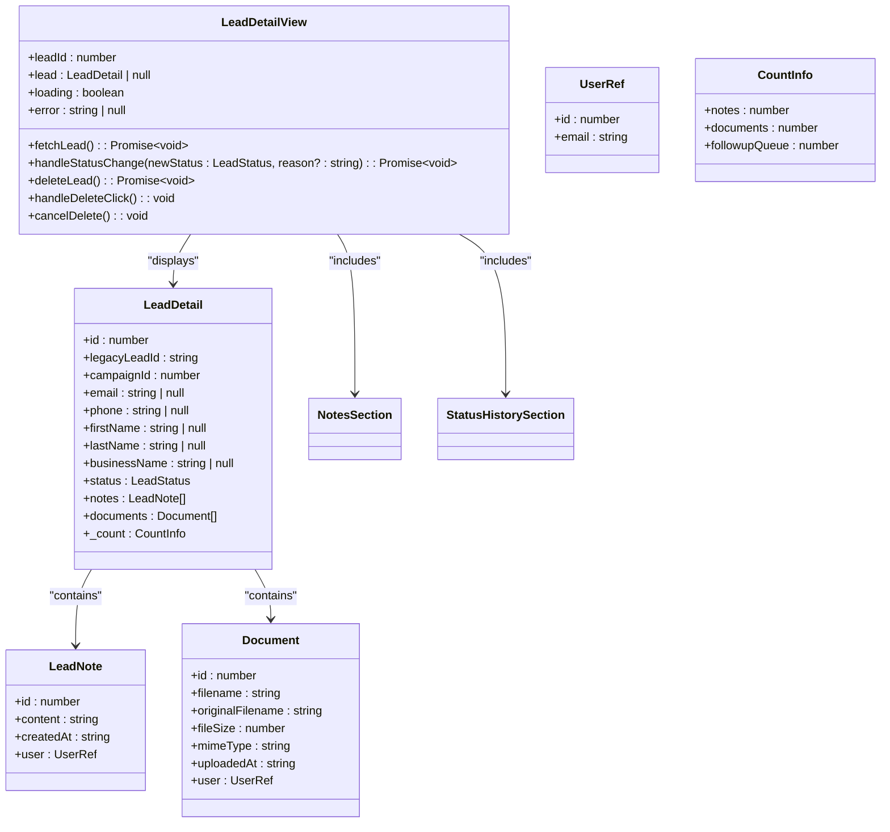
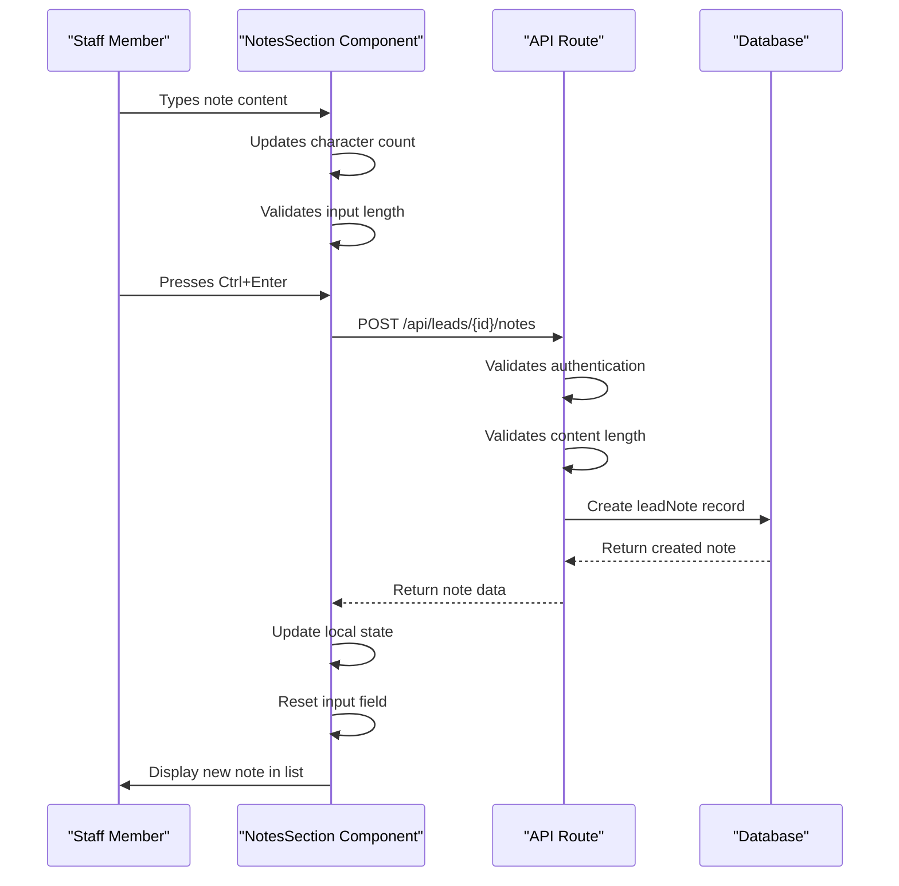
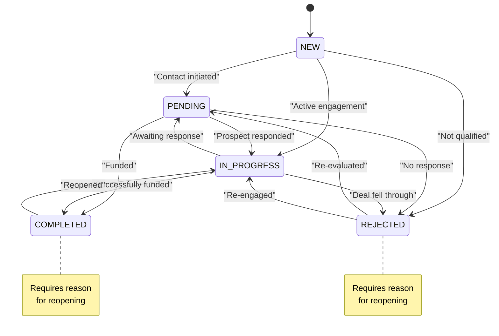

# Staff Lead Management Workflow

<cite>
**Referenced Files in This Document**   
- [LeadDashboard.tsx](file://src/components/dashboard/LeadDashboard.tsx)
- [LeadList.tsx](file://src/components/dashboard/LeadList.tsx)
- [LeadDetailView.tsx](file://src/components/dashboard/LeadDetailView.tsx)
- [LeadSearchFilters.tsx](file://src/components/dashboard/LeadSearchFilters.tsx)
- [NotesSection.tsx](file://src/components/dashboard/NotesSection.tsx)
- [StatusHistorySection.tsx](file://src/components/dashboard/StatusHistorySection.tsx)
- [page.tsx](file://src/app/dashboard/page.tsx)
- [page.tsx](file://src/app/dashboard/leads/[id]/page.tsx)
- [route.ts](file://src/app/api/leads/route.ts)
- [route.ts](file://src/app/api/leads/[id]/route.ts)
- [route.ts](file://src/app/api/leads/[id]/status/route.ts)
- [route.ts](file://src/app/api/leads/[id]/notes/route.ts)
- [LeadStatusService.ts](file://src/services/LeadStatusService.ts)
- [migration.sql](file://prisma/migrations/20250730060039_add_lead_status_history/migration.sql)
</cite>

## Table of Contents
1. [Introduction](#introduction)
2. [Project Structure](#project-structure)
3. [Core Components](#core-components)
4. [Architecture Overview](#architecture-overview)
5. [Detailed Component Analysis](#detailed-component-analysis)
6. [Dependency Analysis](#dependency-analysis)
7. [Performance Considerations](#performance-considerations)
8. [Troubleshooting Guide](#troubleshooting-guide)
9. [Conclusion](#conclusion)

## Introduction
The Staff Lead Management Workflow in the fund-track system enables authenticated staff members to efficiently manage merchant funding leads. This document provides a comprehensive overview of how staff access, view, search, filter, and update leads through the dashboard interface. The workflow includes detailed functionality for viewing lead details, tracking status history, managing documents, and collaborating through internal notes. The system implements robust data fetching patterns, real-time updates, and permission checks to ensure secure and efficient lead management. This documentation covers the complete workflow from initial dashboard access to detailed lead interaction and status updates.

## Project Structure
The project follows a Next.js App Router architecture with a clear separation of concerns between frontend components, API routes, and backend services. The lead management functionality is organized across several key directories: components for UI elements, app for page routes and API endpoints, and services for business logic. The dashboard interface is built using React components with client-side interactivity, while API routes handle server-side data operations. The Prisma ORM manages database interactions with a well-defined schema that includes leads, status history, notes, and documents. This structure enables a scalable and maintainable codebase for the lead management workflow.



**Diagram sources**
- [LeadDashboard.tsx](file://src/components/dashboard/LeadDashboard.tsx)
- [page.tsx](file://src/app/dashboard/page.tsx)
- [route.ts](file://src/app/api/leads/route.ts)

**Section sources**
- [LeadDashboard.tsx](file://src/components/dashboard/LeadDashboard.tsx)
- [page.tsx](file://src/app/dashboard/page.tsx)

## Core Components
The lead management workflow is built around several core components that provide the primary user interface and functionality. The LeadDashboard component serves as the main entry point, displaying a searchable and filterable list of leads. The LeadDetailView component provides comprehensive information about individual leads, including status history and communication records. The NotesSection component enables staff collaboration through internal notes, while the StatusHistorySection tracks all status changes with audit logging. These components work together to create a cohesive workflow for managing leads from initial contact through to completion or rejection.

**Section sources**
- [LeadDashboard.tsx](file://src/components/dashboard/LeadDashboard.tsx)
- [LeadDetailView.tsx](file://src/components/dashboard/LeadDetailView.tsx)
- [NotesSection.tsx](file://src/components/dashboard/NotesSection.tsx)
- [StatusHistorySection.tsx](file://src/components/dashboard/StatusHistorySection.tsx)

## Architecture Overview
The lead management system follows a layered architecture with clear separation between presentation, business logic, and data access layers. The frontend components handle user interaction and display, making API calls to retrieve and update data. The API routes serve as the interface between frontend and backend, handling authentication and routing requests to appropriate services. The LeadStatusService encapsulates the business logic for status transitions, validation, and audit logging. The Prisma ORM provides type-safe database access with a well-defined schema that ensures data integrity. This architecture enables efficient data flow and maintainable code organization.

```mermaid
graph TB
subgraph "Frontend"
Dashboard[LeadDashboard]
DetailView[LeadDetailView]
Notes[NotesSection]
StatusHistory[StatusHistorySection]
end
subgraph "API Layer"
LeadsAPI[/api/leads/*]
StatusAPI[/api/leads/[id]/status]
NotesAPI[/api/leads/[id]/notes]
end
subgraph "Service Layer"
LeadStatusService[LeadStatusService]
NotificationService[NotificationService]
end
subgraph "Data Layer"
Prisma[Prisma ORM]
Database[(PostgreSQL)]
end
Dashboard --> LeadsAPI
DetailView --> LeadsAPI
DetailView --> StatusAPI
Notes --> NotesAPI
StatusAPI --> LeadStatusService
LeadsAPI --> LeadStatusService
LeadStatusService --> Prisma
Prisma --> Database
LeadStatusService --> NotificationService
```

**Diagram sources**
- [LeadDashboard.tsx](file://src/components/dashboard/LeadDashboard.tsx)
- [LeadDetailView.tsx](file://src/components/dashboard/LeadDetailView.tsx)
- [route.ts](file://src/app/api/leads/[id]/status/route.ts)
- [LeadStatusService.ts](file://src/services/LeadStatusService.ts)

## Detailed Component Analysis

### Lead Dashboard and List Components
The LeadDashboard and LeadList components provide the primary interface for staff to view and manage leads. The dashboard includes search filters, sorting capabilities, and pagination to handle large datasets efficiently. The LeadList component renders leads in a tabular format with sortable columns and responsive design for different screen sizes. These components implement client-side state management to handle filters, sorting, and pagination without requiring full page reloads.



**Diagram sources**
- [LeadDashboard.tsx](file://src/components/dashboard/LeadDashboard.tsx)
- [LeadList.tsx](file://src/components/dashboard/LeadList.tsx)

**Section sources**
- [LeadDashboard.tsx](file://src/components/dashboard/LeadDashboard.tsx)
- [LeadList.tsx](file://src/components/dashboard/LeadList.tsx)

### Lead Detail View Component
The LeadDetailView component provides a comprehensive view of individual leads, including all relevant information and interaction history. This component handles authentication checks, data fetching, and error states while providing a clean interface for staff to access lead details. It integrates multiple subcomponents for notes, status history, and document management, creating a unified view of the lead's lifecycle.



**Diagram sources**
- [LeadDetailView.tsx](file://src/components/dashboard/LeadDetailView.tsx)

**Section sources**
- [LeadDetailView.tsx](file://src/components/dashboard/LeadDetailView.tsx)

### Notes Section Component
The NotesSection component enables staff to add and view internal communication history for leads. It implements character counting, input validation, and real-time feedback to ensure notes meet system requirements. The component supports keyboard shortcuts for efficiency and displays notes in chronological order with author and timestamp information. This collaborative feature allows teams to maintain a complete record of interactions and decisions related to each lead.



**Diagram sources**
- [NotesSection.tsx](file://src/components/dashboard/NotesSection.tsx)
- [route.ts](file://src/app/api/leads/[id]/notes/route.ts)

**Section sources**
- [NotesSection.tsx](file://src/components/dashboard/NotesSection.tsx)

### Status History and Transition System
The status management system tracks all changes to lead status with comprehensive audit logging. The StatusHistorySection component displays the current status, historical changes, and available transitions based on business rules. The LeadStatusService enforces valid status transitions according to predefined rules, ensuring data integrity and workflow compliance. This system prevents invalid state changes and requires justification for sensitive transitions.



**Diagram sources**
- [LeadStatusService.ts](file://src/services/LeadStatusService.ts)
- [StatusHistorySection.tsx](file://src/components/dashboard/StatusHistorySection.tsx)

**Section sources**
- [LeadStatusService.ts](file://src/services/LeadStatusService.ts)

## Dependency Analysis
The lead management components have well-defined dependencies that follow the principle of separation of concerns. The frontend components depend on API routes for data, which in turn depend on services for business logic. The LeadStatusService has dependencies on Prisma for database access and NotificationService for sending alerts. The component hierarchy shows a clear flow from high-level dashboard views to detailed lead information, with shared components for common functionality like notes and status history.

```mermaid
graph TD
LeadDashboard --> LeadList
LeadDashboard --> LeadSearchFilters
LeadDashboard --> Pagination
LeadDetailView --> NotesSection
LeadDetailView --> StatusHistorySection
LeadDetailView --> LeadDashboard
NotesSection --> RoleGuard
StatusHistorySection --> fetch
StatusHistorySection --> LeadStatusService
LeadStatusService --> prisma
LeadStatusService --> notificationService
LeadStatusService --> followUpScheduler
page.tsx --> LeadDashboard
page.tsx --> RoleGuard
[id]/page.tsx --> LeadDetailView
[id]/page.tsx --> RoleGuard
[id]/route.ts --> LeadStatusService
[id]/status/route.ts --> LeadStatusService
[id]/notes/route.ts --> prisma
```

**Diagram sources**
- [LeadDashboard.tsx](file://src/components/dashboard/LeadDashboard.tsx)
- [LeadDetailView.tsx](file://src/components/dashboard/LeadDetailView.tsx)
- [LeadStatusService.ts](file://src/services/LeadStatusService.ts)
- [route.ts](file://src/app/api/leads/[id]/status/route.ts)

**Section sources**
- [LeadDashboard.tsx](file://src/components/dashboard/LeadDashboard.tsx)
- [LeadDetailView.tsx](file://src/components/dashboard/LeadDetailView.tsx)
- [LeadStatusService.ts](file://src/services/LeadStatusService.ts)

## Performance Considerations
The lead management system implements several performance optimizations to ensure responsive user experience. The dashboard uses pagination to limit data retrieval and reduce initial load time. API routes include efficient database queries with appropriate indexing, particularly on the lead_status_history table. Client-side components implement memoization and efficient state updates to minimize re-renders. The system also uses Next.js dynamic rendering to optimize server-side processing. For large datasets, the filtering and sorting are handled server-side to leverage database optimization.

**Section sources**
- [LeadDashboard.tsx](file://src/components/dashboard/LeadDashboard.tsx)
- [route.ts](file://src/app/api/leads/route.ts)
- [migration.sql](file://prisma/migrations/20250730060039_add_lead_status_history/migration.sql)

## Troubleshooting Guide
Common issues in the lead management workflow typically relate to authentication, data loading, or permission errors. If leads fail to load, verify the API endpoint is accessible and the user has proper authentication. For status change errors, check that the transition is valid according to business rules and that required reasons are provided. Note submission failures may occur due to character limits or authentication issues. The system logs errors to the console and provides user-friendly error messages for common failure scenarios.

**Section sources**
- [LeadDashboard.tsx](file://src/components/dashboard/LeadDashboard.tsx)
- [LeadDetailView.tsx](file://src/components/dashboard/LeadDetailView.tsx)
- [route.ts](file://src/app/api/leads/[id]/notes/route.ts)
- [LeadStatusService.ts](file://src/services/LeadStatusService.ts)

## Conclusion
The Staff Lead Management Workflow in the fund-track system provides a comprehensive solution for managing merchant funding leads. The system combines an intuitive user interface with robust backend services to create an efficient workflow for staff members. Key features include searchable and filterable lead lists, detailed lead views with complete history, collaborative note-taking, and audited status changes. The architecture follows best practices with clear separation of concerns, enabling maintainability and scalability. The implementation includes performance optimizations and error handling to ensure a reliable user experience. This documentation provides a complete overview of the workflow, enabling staff to effectively utilize the system for lead management.