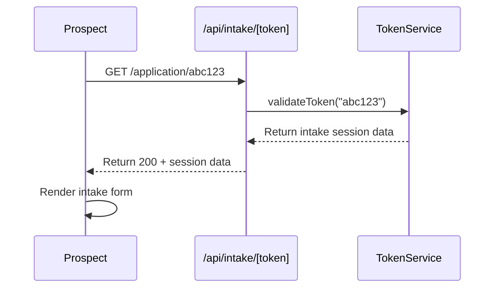
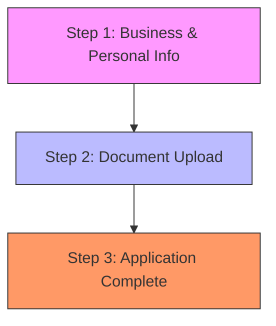
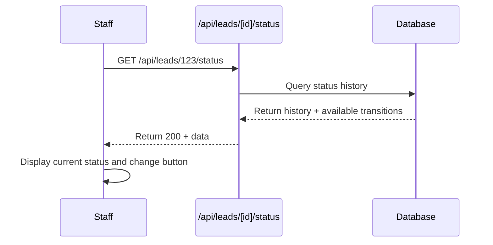
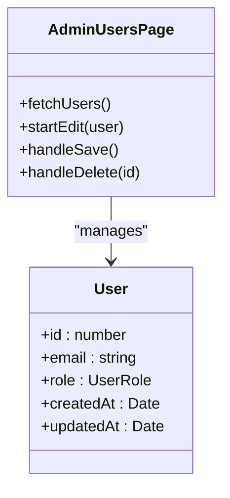
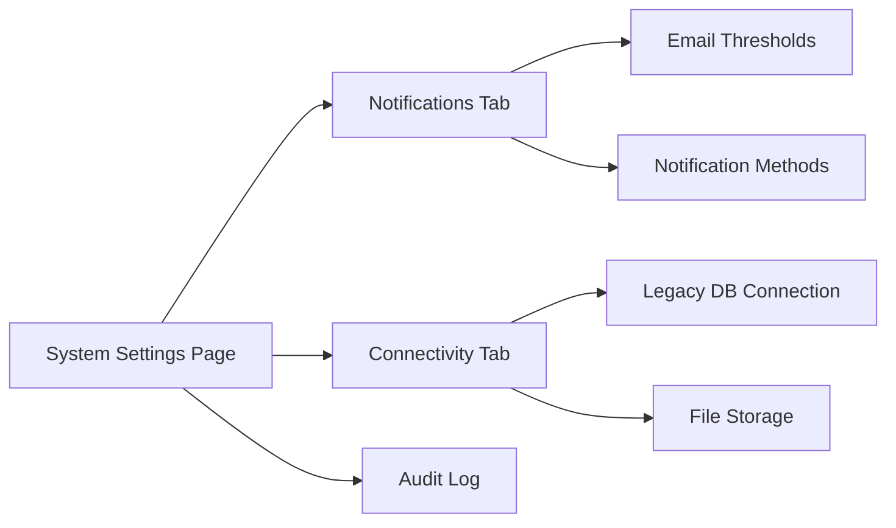
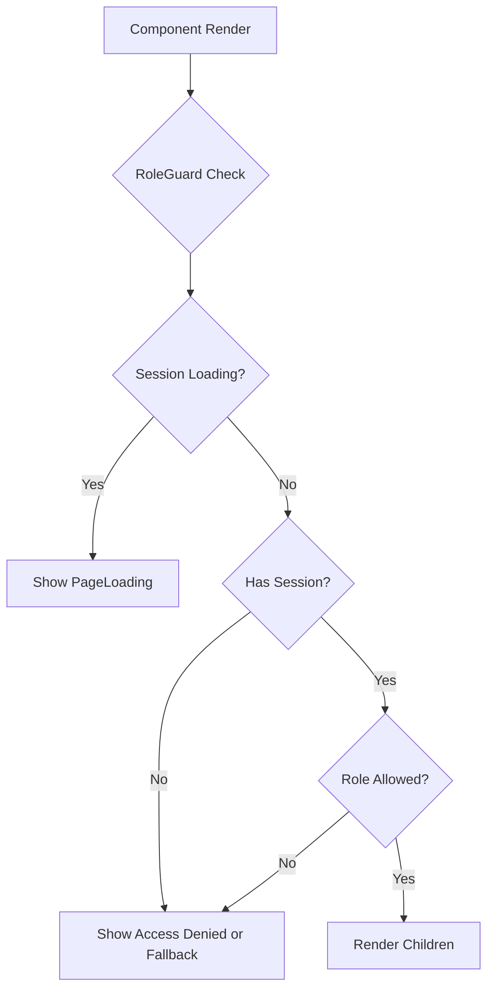

# User Roles and Workflows

<cite>
**Referenced Files in This Document**   
- [RoleGuard.tsx](file://src/components/auth/RoleGuard.tsx)
- [users/page.tsx](file://src/app/admin/users/page.tsx)
- [settings/page.tsx](file://src/app/admin/settings/page.tsx)
- [route.ts](file://src/app/api/intake/[token]/route.ts)
- [NotesSection.tsx](file://src/components/dashboard/NotesSection.tsx)
- [StatusHistorySection.tsx](file://src/components/dashboard/StatusHistorySection.tsx)
- [LeadDetailView.tsx](file://src/components/dashboard/LeadDetailView.tsx)
</cite>

## Table of Contents
1. [User Roles Overview](#user-roles-overview)
2. [Prospect Journey](#prospect-journey)
3. [Staff Workflows](#staff-workflows)
4. [Administrative Tasks](#administrative-tasks)
5. [Role-Based Access Control Implementation](#role-based-access-control-implementation)

## User Roles Overview

The fund-track system implements a role-based access control (RBAC) model with three primary roles: **ADMIN**, **USER**, and **prospects** (token-based access). Each role has distinct permissions and application entry points that govern their interactions with the system.

- **Prospects**: External users who access the system via secure tokens to complete their funding application through a multi-step intake process.
- **Staff (USER)**: Internal team members responsible for monitoring leads, updating statuses, adding notes, and managing documents.
- **Administrators (ADMIN)**: System managers with full access to configure settings, manage users, and monitor system operations.

These roles are defined in the Prisma schema (`@prisma/client`) and enforced throughout the application using the `RoleGuard` component.

**Section sources**
- [RoleGuard.tsx](file://src/components/auth/RoleGuard.tsx#L1-L75)

## Prospect Journey

Prospects enter the system through a token-based URL that grants temporary access to the intake workflow. The journey consists of three sequential steps designed to collect comprehensive business and financial information.

### Token-Based Access

Prospects receive a unique token via email or referral link, which serves as their secure entry point. The token is validated by the `TokenService` when accessing `/application/[token]`.



**Diagram sources**
- [route.ts](file://src/app/api/intake/[token]/route.ts#L1-L37)

### Multi-Step Intake Process

The intake process is divided into two main steps, visualized through a progress timeline in the lead dashboard:

1. **Business & Personal Info**: Collection of fundamental business details, owner information, and contact data.
2. **Document Upload**: Submission of required documentation (PDF, JPG, PNG, DOCX).
3. **Application Complete**: Final submission and confirmation.

The progress is visually represented in the Lead Detail View:



**Diagram sources**
- [LeadDetailView.tsx](file://src/components/dashboard/LeadDetailView.tsx#L798-L890)

Upon completion, the prospect's status transitions to "Complete" with a green indicator, and staff can monitor the progress through the dashboard.

**Section sources**
- [LeadDetailView.tsx](file://src/components/dashboard/LeadDetailView.tsx#L798-L890)

## Staff Workflows

Staff members (role: USER) access the system through the authenticated dashboard at `/dashboard`. Their primary responsibilities include lead monitoring, status management, note documentation, and file handling.

### Lead Monitoring and Status Updates

Staff can view all leads in the LeadList component and drill down into individual lead details. The StatusHistorySection provides both current status and historical changes.



**Diagram sources**
- [StatusHistorySection.tsx](file://src/components/dashboard/StatusHistorySection.tsx#L1-L330)

When changing a lead's status, staff must select from available transitions. Some transitions require a mandatory reason field to ensure auditability.

**Section sources**
- [StatusHistorySection.tsx](file://src/components/dashboard/StatusHistorySection.tsx#L1-L330)

### Note Management

Staff use the NotesSection component to document interactions and internal observations. Notes are stored with author and timestamp metadata.

```mermaid
flowchart TD
A[Open Notes Section] --> B{Enter note content}
B --> C[Character count validation]
C --> D{Press Ctrl+Enter or click Add}
D --> E[POST /api/leads/[id]/notes]
E --> F{Success?}
F --> |Yes| G[Update UI with new note]
F --> |No| H[Show error alert]
```

**Diagram sources**
- [NotesSection.tsx](file://src/components/dashboard/NotesSection.tsx#L1-L190)

Notes support basic formatting with a 5,000 character limit. The system provides visual feedback when approaching or exceeding this limit.

**Section sources**
- [NotesSection.tsx](file://src/components/dashboard/NotesSection.tsx#L1-L190)

## Administrative Tasks

Administrators (role: ADMIN) have elevated privileges accessible through the `/admin` route, protected by the `AdminOnly` wrapper component.

### User Management

The admin users page (`/admin/users`) enables CRUD operations for system users:

- **View**: List all users with role, creation, and update timestamps
- **Create**: Add new users with email, password, and role assignment
- **Edit**: Modify user email, role, or reset password
- **Delete**: Remove users with confirmation prompt



**Diagram sources**
- [users/page.tsx](file://src/app/admin/users/page.tsx#L1-L492)

**Section sources**
- [users/page.tsx](file://src/app/admin/users/page.tsx#L1-L492)

### Settings Configuration

Administrators can configure system-wide settings organized into categories:

- **Notifications**: Configure notification thresholds and channels
- **Connectivity**: Monitor and configure external service connections

The settings interface includes an audit log to track all configuration changes for compliance purposes.



**Diagram sources**
- [settings/page.tsx](file://src/app/admin/settings/page.tsx#L1-L264)

**Section sources**
- [settings/page.tsx](file://src/app/admin/settings/page.tsx#L1-L264)

## Role-Based Access Control Implementation

The system implements RBAC using NextAuth.js for authentication and a custom `RoleGuard` component for authorization.

### Authentication Flow

The system uses NextAuth.js to manage user sessions. Upon login, the session includes the user's role which is then used for access control decisions.

### RoleGuard Component

The `RoleGuard` component enforces role-based access at the component level:



**Diagram sources**
- [RoleGuard.tsx](file://src/components/auth/RoleGuard.tsx#L1-L75)

The component provides convenience wrappers:
- `AdminOnly`: Restricts access to ADMIN role only
- `AuthenticatedOnly`: Allows both ADMIN and USER roles

Access control is applied at multiple levels:
- **Page level**: Using `AdminOnly` for admin routes
- **Component level**: Using `RoleGuard` for specific UI elements (e.g., document upload, delete buttons)
- **API level**: Backend routes validate user roles before processing requests

**Section sources**
- [RoleGuard.tsx](file://src/components/auth/RoleGuard.tsx#L1-L75)