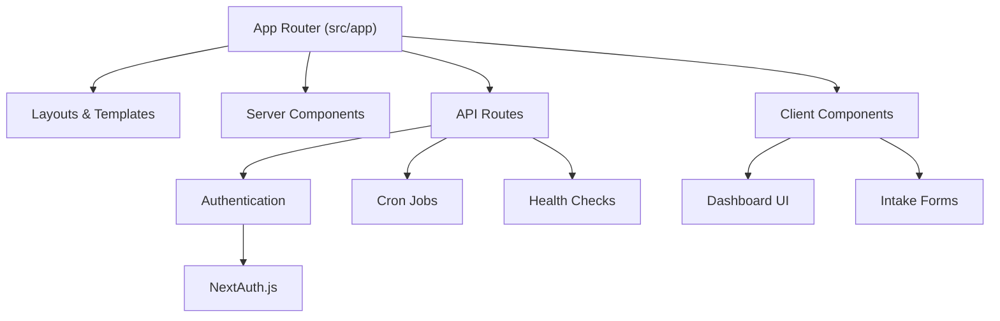
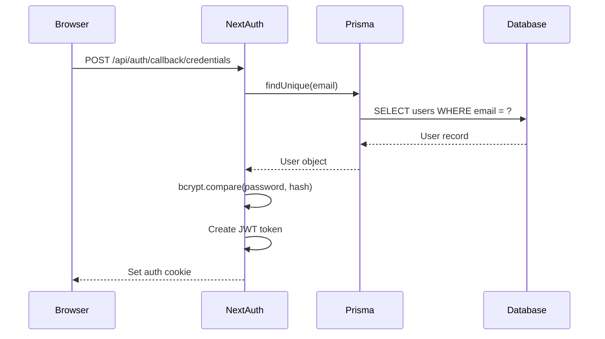
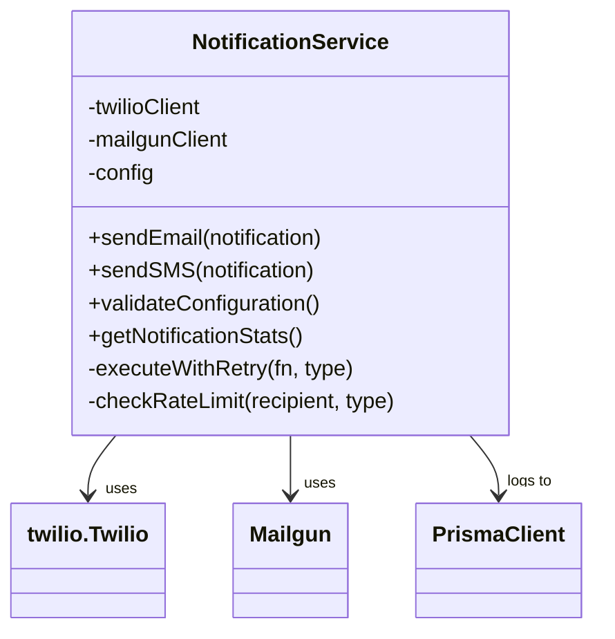

# Technology Stack

<cite>
**Referenced Files in This Document**   
- [package.json](file://package.json)
- [next.config.mjs](file://next.config.mjs)
- [tailwind.config.ts](file://tailwind.config.ts)
- [prisma/schema.prisma](file://prisma/schema.prisma)
- [src/lib/auth.ts](file://src/lib/auth.ts)
- [src/lib/legacy-db.ts](file://src/lib/legacy-db.ts)
- [src/lib/notifications.ts](file://src/lib/notifications.ts)
- [src/services/NotificationService.ts](file://src/services/NotificationService.ts)
- [src/lib/prisma.ts](file://src/lib/prisma.ts)
</cite>

## Table of Contents
1. [Next.js 14 with App Router](#nextjs-14-with-app-router)
2. [Prisma ORM for PostgreSQL](#prisma-orm-for-postgresql)
3. [NextAuth.js for Authentication](#nextauthjs-for-authentication)
4. [Tailwind CSS for Styling](#tailwind-css-for-styling)
5. [mssql for Legacy Database Connectivity](#mssql-for-legacy-database-connectivity)
6. [Twilio and Mailgun.js for Communication](#twilio-and-mailgunjs-for-communication)
7. [Backblaze B2 for Cloud Storage](#backblaze-b2-for-cloud-storage)
8. [Integration Patterns and Configuration](#integration-patterns-and-configuration)

## Next.js 14 with App Router

The fund-track application leverages **Next.js 14** with the **App Router** to deliver a full-stack React application. This architecture enables server-side rendering (SSR), static site generation (SSG), and API routes within a single framework, providing optimal performance and SEO capabilities.

The App Router, introduced in Next.js 13 and fully supported in version 14, organizes the application using a file-system-based routing mechanism under the `src/app` directory. This allows for nested layouts, parallel routes, and streaming server components. The application uses React Server Components by default, reducing client-side JavaScript bundle size and improving load performance.

Key features enabled in the configuration include:
- **Security Headers**: Strict-Transport-Security, X-Frame-Options, and Content-Security-Policy are enforced via the `headers()` function in `next.config.mjs`.
- **Production Optimization**: The `output: "standalone"` configuration in production reduces deployment size.
- **Environment Validation**: Custom environment variables are explicitly defined to prevent runtime errors.



**Diagram sources**
- [next.config.mjs](file://next.config.mjs#L1-L109)
- [src/app/page.tsx](file://src/app/page.tsx)

**Section sources**
- [next.config.mjs](file://next.config.mjs#L1-L109)
- [package.json](file://package.json#L1-L70)

## Prisma ORM for PostgreSQL

**Prisma ORM** serves as the primary database access layer for the fund-track application, connecting to a **PostgreSQL** database. It provides type-safe database operations, schema migrations, and a declarative data modeling syntax.

The Prisma schema (`prisma/schema.prisma`) defines a comprehensive data model including:
- **User**: System users with role-based access
- **Lead**: Core entity representing funding applicants
- **Document**: File uploads stored in Backblaze B2
- **NotificationLog**: Audit trail for communication
- **SystemSetting**: Configurable application parameters

Prisma Client is initialized with conditional logic to prevent database connections during build time, ensuring compatibility with serverless environments:

```typescript
const isBuildTime = process.env.SKIP_ENV_VALIDATION === 'true' ||
  !process.env.DATABASE_URL;

export const prisma = new PrismaClient({
  log: process.env.NODE_ENV === 'development' ? ['query'] : ['error'],
  datasources: isBuildTime ? undefined : { db: { url: process.env.DATABASE_URL } }
});
```

Migration management is handled through Prisma Migrate, with incremental SQL files in `prisma/migrations/`. The schema uses PostgreSQL-specific features like `@updatedAt`, `@default(now())`, and enum mappings.

```mermaid
erDiagram
USER ||--o{ LEAD : "manages"
USER ||--o{ LEAD_NOTE : "creates"
USER ||--o{ DOCUMENT : "uploads"
LEAD ||--o{ LEAD_NOTE : "has"
LEAD ||--o{ DOCUMENT : "has"
LEAD ||--o{ FOLLOWUP_QUEUE : "scheduled"
LEAD ||--o{ NOTIFICATION_LOG : "receives"
LEAD ||--o{ LEAD_STATUS_HISTORY : "tracks"
SYSTEM_SETTING ||--o{ USER : "updated_by"
USER {
Int id PK
String email UK
String passwordHash
UserRole role
}
LEAD {
Int id PK
BigInt legacyLeadId UK
String? email
String? phone
LeadStatus status
}
DOCUMENT {
Int id PK
String b2FileId
String b2BucketName
Int fileSize
}
NOTIFICATION_LOG {
Int id PK
NotificationType type
NotificationStatus status
String? externalId
}
```

**Diagram sources**
- [prisma/schema.prisma](file://prisma/schema.prisma#L1-L258)
- [src/lib/prisma.ts](file://src/lib/prisma.ts#L1-L61)

**Section sources**
- [prisma/schema.prisma](file://prisma/schema.prisma#L1-L258)
- [src/lib/prisma.ts](file://src/lib/prisma.ts#L1-L61)

## NextAuth.js for Authentication

Authentication is implemented using **NextAuth.js**, integrated with Prisma via the `@next-auth/prisma-adapter`. This provides a secure, extensible authentication system with JWT-based sessions.

The configuration (`src/lib/auth.ts`) uses **CredentialsProvider** for email/password login, with password hashing via **bcrypt**. User roles (ADMIN/USER) are stored in the database and propagated through JWT tokens using callback functions:

```typescript
callbacks: {
  async jwt({ token, user }) {
    if (user) {
      token.id = user.id;
      token.role = user.role;
    }
    return token;
  },
  async session({ session, token }) {
    session.user.id = token.id as string;
    session.user.role = token.role as UserRole;
  },
}
```

The adapter pattern ensures seamless integration between NextAuth.js and the Prisma-managed User model. Authentication state is protected using HTTP-only cookies and secure headers configured in `next.config.mjs`.



**Diagram sources**
- [src/lib/auth.ts](file://src/lib/auth.ts#L1-L71)
- [prisma/schema.prisma](file://prisma/schema.prisma#L1-L258)

**Section sources**
- [src/lib/auth.ts](file://src/lib/auth.ts#L1-L71)

## Tailwind CSS for Styling

The application uses **Tailwind CSS** for utility-first styling, enabling rapid UI development with consistent design tokens. The configuration (`tailwind.config.ts`) extends the default theme with:

- **Custom Colors**: Primary and secondary color palettes with 50-900 scales
- **Font Family**: Custom `Plus Jakarta Sans` font via CSS variable
- **Content Sources**: Scans `src/app`, `src/components`, and `src/pages` for class usage

The configuration ensures optimal performance by purging unused styles in production. The utility-first approach allows for responsive, accessible UIs with minimal custom CSS.

```typescript
theme: {
  extend: {
    colors: {
      primary: {
        50: '#eff6ff',
        100: '#dbeafe',
        // ... up to 900
      },
    },
    fontFamily: {
      sans: ['var(--font-plus-jakarta-sans)', 'sans-serif'],
    },
  },
}
```

**Section sources**
- [tailwind.config.ts](file://tailwind.config.ts#L1-L44)

## mssql for Legacy Database Connectivity

The application integrates with a legacy MS SQL Server database using the **mssql** package. This enables synchronization of lead data from the legacy system into the modern PostgreSQL database.

The `LegacyDatabase` class (`src/lib/legacy-db.ts`) provides a singleton pattern with connection pooling, retry logic, and environment-based configuration:

```typescript
export function getLegacyDatabase(): LegacyDatabase {
  if (!legacyDb) {
    const config: LegacyDbConfig = {
      server: process.env.LEGACY_DB_SERVER || '',
      database: process.env.LEGACY_DB_DATABASE || 'LeadData2',
      user: process.env.LEGACY_DB_USER || '',
      password: process.env.LEGACY_DB_PASSWORD || '',
      options: {
        encrypt: process.env.LEGACY_DB_ENCRYPT === 'true',
        trustServerCertificate: process.env.LEGACY_DB_TRUST_CERT === 'true',
      },
    };
    legacyDb = new LegacyDatabase(config);
  }
  return legacyDb;
}
```

Connection parameters are securely injected via environment variables, and the service includes comprehensive error handling and logging.

**Section sources**
- [src/lib/legacy-db.ts](file://src/lib/legacy-db.ts#L1-L158)

## Twilio and Mailgun.js for Communication

The application uses **Twilio** for SMS and **Mailgun.js** for email communication, managed through a unified `NotificationService` class.

The service (`src/services/NotificationService.ts`) provides:
- **Retry Logic**: Exponential backoff with configurable delays
- **Rate Limiting**: Prevents spam with per-recipient and per-lead limits
- **Logging**: Tracks all notifications in the `notification_log` table
- **Configuration Validation**: Checks environment variables at startup

Emails are sent via Mailgun's API using `form-data`, while SMS messages use Twilio's REST API. Both services support external ID tracking for audit purposes.



**Diagram sources**
- [src/services/NotificationService.ts](file://src/services/NotificationService.ts#L1-L472)
- [src/lib/notifications.ts](file://src/lib/notifications.ts#L1-L222)

**Section sources**
- [src/services/NotificationService.ts](file://src/services/NotificationService.ts#L1-L472)
- [src/lib/notifications.ts](file://src/lib/notifications.ts#L1-L222)

## Backblaze B2 for Cloud Storage

File uploads are stored in **Backblaze B2** cloud storage, with metadata tracked in PostgreSQL. While the direct integration code isn't visible in the provided files, the `Document` model includes B2-specific fields:

```prisma
model Document {
  id               Int
  b2FileId         String   @map("b2_file_id")
  b2BucketName     String   @map("b2_bucket_name")
  fileSize         Int      @map("file_size")
  mimeType         String   @map("mime_type")
}
```

The `types/backblaze-b2.d.ts` file confirms the use of the `backblaze-b2` npm package. A `FileUploadService` likely handles the upload process, generating signed URLs and storing B2 metadata.

The Content-Security-Policy in `next.config.mjs` includes `connect-src 'self' https://*.backblazeb2.com`, confirming the B2 API endpoint connectivity.

**Section sources**
- [prisma/schema.prisma](file://prisma/schema.prisma#L1-L258)
- [src/types/backblaze-b2.d.ts](file://src/types/backblaze-b2.d.ts)

## Integration Patterns and Configuration

The technologies are integrated through a well-defined pattern of service layers, configuration management, and environment separation:

1. **Configuration Management**: Environment variables control all external services (database URLs, API keys, etc.)
2. **Service Layer Pattern**: Business logic is encapsulated in services (`NotificationService`, `SystemSettingsService`)
3. **Error Handling**: Comprehensive logging with `winston` and structured error responses
4. **Health Checks**: API endpoints at `/api/health` monitor system status
5. **Security**: CSP headers, HSTS, and role-based access control

The stack was chosen for its:
- **Full-Stack Capabilities**: Next.js handles both frontend and backend
- **Type Safety**: TypeScript + Prisma provide end-to-end typing
- **Scalability**: Serverless-friendly architecture
- **Maintainability**: Well-documented, widely supported libraries

This combination enables rapid development of a secure, scalable funding application with legacy system integration and robust communication capabilities.

**Section sources**
- [package.json](file://package.json#L1-L70)
- [next.config.mjs](file://next.config.mjs#L1-L109)
- [src/lib/prisma.ts](file://src/lib/prisma.ts#L1-L61)